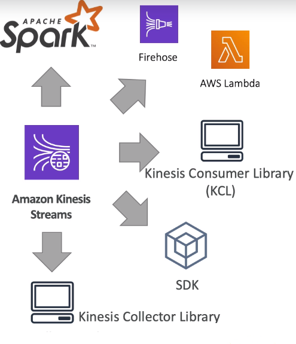
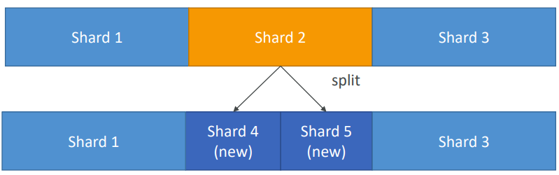

  * [Collection](#collection)
    * [Kinesis](#kinesis)
        * [Kinesis Streams](#kinesis-streams)
    * [AWS SQS](#aws-sqs)

# Collection

## Kinesis

• Kinesis Kafka’nın bir alternatifi olarak kullanılmaktadır.
• Real-time olarak yüksek oranda veriyi yakalamak için idealdir.
• Data generate edebilir ve bir çok veri kaynağından (1000 veya 100 binlerce), sürekli olarak kb ve mb mertebesinde küçük veriler gönderilebilir.
• Birden çok veri kaynağından, aynı anda data almaktan bahsediliyorsa, Kinesis en uygun yoldur.
• Uygulama logları, IoT veya clickstream verisi gibi BigData mimarileri için uygundur.
• Spark ve Nifi gibi streaming process için de kullanılabilir.
• Data by default 3 AZ’da senkronize edilir.

Kinesis Data Stream 3 ayrı management servis barındırmaktadır.

**Kinesis Streams:** Real-time olarak, low latency ile büyük çaplı verilerin alınması ve process edilmesini sağlar.

**Kinesis Analytics:** SQL kullanarak, veriyi real-time process ve analiz eder.

**Kinesis Firehose:** Delivery servis gibi çalışmaktadır ve adı yangın hortumundan esinlenmiştir. İstenilen bir yere data püskürtüyormuş gibi düşünebiliriz. Amazon Firehose ile kolayca veri yakalanabilir, transform edilebilir ve streaming veriyi S3, Redshift, ElasticSearch veya Splunk’a gönderebilir.

Near real-time çalışan bir servistir.

### Kinesis Streams

Consumer veriyi shard’lardan okur.

Veriyi by default 24 saat tutar ve bu süre en fazla 7 gün olabilir. Süre artışına paralel olarak maaliyet de artacaktır. Veriyi yeniden process etme yeteneği vardır. Veri bir kere işlendikten sonra silinemez. Aynı veri tekrar tekrar okunabilir. Data, retention periyoduna bağlı olarak silinecektir ve bu nedenle birden fazla uygulama aynı anda veriyi consume edebilir. Data bir kere Kinesis’e insert edildiği zaman, silinemez. **Immutability**, append only stream.

#### Kinesis Streams Shards

Bir stream bir çok farklı shard’dan oluşur. Shard başına ücretlendirme yapılır ve istenildiği kadar shard talep edilebilir. Shard sayısı zamanla geliştirilebilir. (Re-shard veya merge yapılabilir) Genel olarak kayıtlar global olarak değil, shard başına sıralanacaktır ve bu sıralama teslim alınma sürelerine göre olacaktır.

**Data Blob:** Veri en fazla 1 mb olabilir ve herhangi bir veri tipini temsil edebilir.

**Record Key:** Kayıtların shard’lar olarak gruplanmasını sağlar. Same key = Same shard
Olası hot partition sorununu önlemek için, distributed key kullanılmalıdır. Bu key ile Kinesis shard’lara erişilebiliyor ve bu sayede verileri gönderebiliyor.

**Sequence Number:** Veriler unique bir identifier ile shard’lara konulur.

**Limitleri:** Producer shard başına saniyede sadece 1 mb veya 1000 mesaj yazabilir. Bu limit aşılırsa, **ProvisionedThroughputException** hatası alınır.

İki tip consumer vardır.

**Consumer Classic:**
Bütün consumer’larda, 2mb/s shard başı okuma
Bütün consumer’larda, shard başına 5 API call

**Consumer Enhanced Fan-Out:**
Bütün consumer’larda, shard başına, enhanced consumer başına 2mb/s okuma

Push model olduğundan, API call gerekmiyor.

Data retention default 24 saat ve max 7 güne kadar arttırılabilir.

#### Kinesis Producers

**Kinesis SDK:** SDK (Software Development Kit) kod yazılmasını veya CLI kullanarak datayı direk Amazon Kinesis Stream’e gönderilmesini sağlar. Genel olarak, bir SDK bir uygulama içinde belirli bir modül oluşturmak için ihtiyaç duyulan her şeyden oluşur ve kütüphaneler, araçlar, örnek kod, ilgili belgeler ve çoğu zaman API’ler içerebilir.

**Kinesis Producer Library (KPL):** SDK oranla daha iyi kod yazılabilir ve ek yetenekleri sayesinde enhanced throughput alınmasını sağlar.

**Kinesis Agent:** Server üzerinde çalışır ve log dosyası alınmasını ve bunu Amazon Kinesis Stream’e atılmasını sağlar.

Kinesis Stream’e data göndermek için; Apache Spark, Nifi, Kafka connect gibi 3rd party uygulamalar da kullanılabilir.

##### Kinesis Producer SDK

API’lar bir kayıt (PutRecord) veya birden fazla kayıt (PutRecords) için kullanılabilir. PutRecords batch işlemler için kullanılır, daha az http request yapılmasını sağlar ve throughput arttırır. Producer SDK; Android veya IOS mobile cihazlar gibi çeşitli servisler için kullanılabilir. Düşük throughput, yüksek latency, simple API ve AWS Lambda gibi use case’lerde kullanılabilir.

ProvisionedThroughputExceeded hatası alınırsa, herhangi bir shard için TPS veya mb/s limiti aşılmış demektir. Hatanın önlenmesi için Hot Shard olmaması sağlanmalıdır. Örneğin, key olarak device_id ise ve datanın %90’ı aynı device_id’ye ait ise, bu durumda datanın %90’ı aynı partition’da olacaktır ve o partition’daki yoğunluk bu hatanın alınmasına neden olabilecektir.

Hot Shard olmamasına rağmen hata alınıyorsa, işlem tekrar denenebilir veya shard sayısı arttırılabilir.

##### Kinesis Producer Library

• Kullanımı kolaydır, C++ ve Java library'leri ile yapılandırılabilir. 
• Yüksek performans ihtiyacı olan uzun süreli kullanımlar için uygundur .
• Retry mekanizması yani işin tekrar çalıştırılabilme kabiliyeti bulunmaktadır.
• Synchronous ve asynchronous API olmak üzere iki tiptir. Daha yüksek performans isteniyorsa, asynchronous tercih edilebilir. 
• Kinesis Data Stream'e asynchronous olarak data gönderilmekten bahsediliyorsa, genellikle bunu yapmanın yolu KPL olacaktır.
• CloudWatch'a monitoring için metric gönderebilecek yeteneğe de sahiptir.
• KPL ile uygulama yazıldığında, direk olarak CloudWatch'dan monitor edilebilir.
• Throughput arttırmak ve maaliyet'i düşürmeye yarayacak olan batch işlemleri desteklemektedir.

Batch işlemler kendi içinde ikiye ayrılır.

**Collect:** Aynı PutRecords API call ile birden fazla shard'a yazılır.

**Aggregate:** Verimliliği ve latency'i arttırır. Bir kayıt içerisinde birden fazla kaydı tutabilir (Saniyede 1000 kaydın üzerine çıkabilir). Max 1mb/s olacak şekilde throughput arttırır.

> KPL compression desteklemektedir ancak bunun kullanıcı tarafından yapılması gerekmektedir.

KPL kayıtları, KCL ile ve özel yardımcı library'ler ile de-coded edilmelidir.

Kinesis Producer Library (KPL) Batching

KPL ile aggregation ve collection yapabiliriz.
Şekilde görünen 7 kayıt sadece 2 kayıt şeklinde gönderilebilir.

KPL ile kayıt geldikten sonra bir süre bekler ve max 1mb olacak şekilde tek bir kayıt oluşturur. Bekleme süresi **RecordMaxBufferedTime** parametresine göre belirlenir ve default 100ms'dir.
Bu süre bir miktar gecikme oluşturur ancak verimliliği ciddi oranda arttırmaktadır.

##### Kinesis Agent

Log dosyalarını monitor eder ve bunları Kinesis Data Stream'e gönderir.
Java-based bir agent'dır ve sadece linux-based server'larda kurulabilir.

###### Kinesis Consumer(s) – Classic

Kinesis Data Stream'den veri okumak için SDK veya CLI kullanabiliriz. KPL ile üretebiliriz ve KCL ile okuyabiliriz. Apache Spark consumer olarak Kinesis Data Stream'den okuma yapabilir. Kayıtlar consumerlar tarafından bir shard'dan toplanır. Her shard toplamda 2mb throughput'a sahiptir.

GetRecord en fazla 10mb veya 10000 kayıt data döndürebilir. Her shard 2mb throughput'a sahip olduğundan ve yukarıdaki senaryoda 3 consumer’da aynı shard’dan okuma yaptığından dolayı, bu gibi bir senaryo 5 saniye sürecektir.

Saniyede shard başına max 5 GetRecords API call yapılabilir. Bu durumda da 200ms latency olacaktır. 5 Consumer application aynı shard'ı kullanırsa, bütün consumerlar saniyede 1 poll yapabileceği ve 400Kb/s daha az bir verim alacağı anlamına gelir. Ne kadar consumer olursa, consumer başına sahip olunacak throughput daha az olur. Bir yerine 3 tane consumer'a sahip olursak, hepsi aynı 2mb/s limitini ve saniyede 5 GetRecords API call limitini kullanacaklardır.

**Örnek 1:** Klasik modda çalışan ve GetRecords() komutu ile aynı anda 1 tane shard'dan consume işi yapan 10 consumer uygulaması olsun. Her consumer uygulaması için ortalama latency‘si ne olacaktır?

Saniyede en fazla 5 GetRecords API call yapılabileceğinden, her consumer uygulaması için ortalama latency 2 saniye olacaktır.

**Örnek 2:** Enhanced fan out modda çalışan ve aynı anda 1 tane shard'dan consume işi yapan 10 consumer uygulaması olsun. Her uygulamaların, kayıtları consume ederken ortalama latency‘si ne olacaktır?

Enhanced fan out modda, ne kadar consumer olursa olsun, her consumer saniyede 2mb throughput'a sahip olur. Yani her consumer 2mb/s veri alır ve ortamala latency 70ms olur.

##### Kinesis Client Library

Java-based bir library'dir ama Golang, Python, Ruby, Node, .NET ile de kullanılabilir. KPL aggregation yapar ve KCL, KPL ile üretilen verilerin okunmasını sağlar.

KPL aggregation yapar. KCL de-aggregation yapar.

Tek bir grup içinde birden fazla consumer ile birden fazla shard paylaşabilir.

Checkpoint özelliği ile işlemin devam ettirilmesini sağlar. Bu sayede uygulamalardan birinde sorun olsa bile tekrar devam edebilir. KCL uygulamanın durumunu takip etmek için Amazon Kinesis Data Streams uygulamalarının **hepsi için ayrı DynamoDB tablosu kullanır.** DynamoDB ile etkileşimli, Kinesis Consuler Library (KCL) ile beraber kullanılabilecek checkpointing özelliği vardır. Bu sayede consumption ilerleyişi izlenebilir.

Stream edilen datanın hem process hem de raw hali saklanacağı zaman, veriyi yakalamak için Kinesis Stream ve analiz amaçlı işlemek için Spark Streaming kullanılabilir. Lambda fonksiyonu yardımı ile de, raw data S3 tarafında bulunan backed Firehose mesajları push edilebilir.

DynamoDB'nin bu vazifesi nedeni ile yeteri kadar WCU (Write Capacity Unit) veya RCU (Read Capacity Unit) olduğuna emin olunmalıdır veya On-Demand DynamoDB kullanılabilir. **Aksi halde KCL'de yavaşlamaya neden olacaktır.**

**Örnek:** KPL kullanarak, çeşitli producer'lardan ortamala 8mb/s ile 10 shard içeren Kinesis Stream'den veri alınınan bir yapı var ve yapı içerisinde bulunan kayıtlar KCL kullanarak consume ediliyor. CloudWatch metricleri ile verinin 2mb/s throughput'a sahip olduğunu ve uygulumada gecikme yaşandığı anlaşılıyor. Bu sorunun en muhtemel nedeni ne olabilir?

- [ ] Shard'ların biraz daha bölünmesi gerekmektedir.
- [ ] Hot partition durumu vardır.
- [ ] CloudWatch, aggregate için değil, ortalama throughput göstermektedir
- [x] DynamoDB tablosu ihtiyacı karşılayamamaktadır.

**Kinesis Connector Library:**
Eski (2016) Java library'dir ve connector EC2'de olmak zorundadır. Data; S3, DynamoDB, Redshift ve ElasticSearch'e yazılır.

Kinesis Firehose ve Lambda Kinesis Connector Library'nin kullanım alanlarının bir çoğunu almıştır.

**AWS Lambda,** Kinesis'den kayıt okuyabilir. Lambda consumer küçük bir library'e sahiptir ve KPL'den yapılacak de-aggregation için çok uygundur.

Lightweight ETL için de kullanılabilir. Programlaması yapıldığı sürece Amazon S3, DynamoDB, Redshift, ElasticSearch veya istenilen herhangi bir yere data gönderilebilir. Ayrıca notification oluşturmak ve real time mail göndermek için de kullanılabilir.

**Kinesis Enhanced Fan-Out:**
KCL 2.0 ve Lambda ile çalışır.
Bütün consumer'lar, shard başına 2mb/s throughput sağlar. 20 consumera sahipsek, shard başına saniyede 40mb throughput alırız. Data http/2 üzerinden consumerlara gönderilir ve ortalama 70 ms latency sağlar.

**Standart Consumer ve Enhanced Fan-Out Consumer Farkı:**

**Standart Consumer;**
• Az sayıda consumer uygulaması
• 200 ms latency ve düşük maaliyet

**Enhanced Fan-Out Consumer;**
• Aynı stream için birden fazla consumer uygulaması
• 70 ms latency ve daha yüksek maaliyet

https://aws.amazon.com/kinesis/data-streams/pricing/?nc1=h_ls

Default her Data Stream için enhanced fan-out kullanacak 5 consumer limiti vardir.

**Kinesis Scaling:** Shard Splitting olarak geçer.

Stream kapasitesinin arttırılması için kullanılır. (Her Shard için 1 mb/s data) Hot Shard'ın bölünmesi için de kullanılabilir.

**Çalışma şekli:** Eski shard kapanır ve eski shard data expire olana kadar kalır ve data expire olunca gider.

Sekild görünen Shard 2 Hot Shard olsun ve bunu Shard 4 ve Shard 5 olmak üzere 2'ye split edelim. Bu durumda Shard 2'de bulunan data expire olana kadar kalır ve data expire olunca Shard 4 ve Shard 5 olarak devam eder. Bu şekilde throughput artışı da sağlamış oluruz.

Bu işlemin tersi de yapılabilir yani 2 shard'ı tek bir shard ile merge edebiliriz ve bu şekilde maaliyet kazancı sağlamış oluruz.
Split operasyonunda olduğu gibi burada da, eski shardlar içerisindeki data expire olunca kapanacaktır.

Kinesis Auto Scaling Manual müdahale ile yapılmaktadır. UpdateShardCount API işlemi ile yapılır. Auto scaling işini AWS Lambda ile gerçekleştirebiliriz.

Re-sharding işi paralel olarak yapılamaz. Öncesinde kapasite planlaması yapılması gerekmektedir.
Aynı anda sadece 1 tane resharding işi yapılabilir ve bu işin süresi shard sayısına göre değişir. 
Örnek olarak 1000 shard için 30.000 saniye yaklaşık 8.3 saat zaman gerekir. 
2000 shard için bu sürenin iki katı olacaktır.

**Limitleri:**
• 24 saat içerisinde bir stream için bir kere scale işi çalışabilir.
• Bir stream için mevcut shard sayısının iki katından fazla scale up işi yapılamaz.
• Bir stream için mevcut shard sayısının yarısından fazla scale down işi yapılamaz.
•Bir stream için 500 shard’dan fazla scale up işi yapılamaz.
• Scale up işi account limitinden daha fazla olamaz.

**Kinesis Security**
• Authorization kısmı IAM policy tarafından yönetilir.
• In flight encryption https endpoint'ler ile yapılır.
• At rest encryption KMS ile yapılır.
• Client side encryption manual olarak implemente edilmelidir.
• VPC Endpoint, Kinesis'in VPC'ye erişmesi için kullanılabilir.

### Kinesis Data Firehose

Administration maaliyeti olmayan AWS tarafından fully managed bir servistir.
Kinesis Data Stream gibi real-time değildir.

**Near Real Time olarak data Kinesis Data Firehose'dan, sadece Redshift, Amazon S3, ElasticSearch ve Splunk'a gönderilebilir.**
Otomatik olacak scale olabilmektedir ve çok fazla sayıda veri formatını desteklemektedir.

S3 için JSON'dan, Parquest veya ORC'ye data conversion yapılabilir. AWS Lambda ile de, CSV'den JSON formatına data transformation yapılabilir.
Hedef Amazon S3 ise; gzip, zip ve snappy compression desteklenmektedir. Redshift ile sadece gzip data load edilebilir.

Sadece Firehose üzerinden giden veri için ücretlendirme yapılmaktadır.

Spark Streaming veya Kinesis Client Library, Kinesis Firehose'dan veri okuyamaz sadece Kinesis Data Stream'den veri okuyabilirler.

Diagram'da Kinesis Data Firehose'un yeri daha net görülmektedir. Data source olarak KPL, Kinesis Agent, Kinesis Data Stream (en sık kullanılandır), CloudWatch, IoT verileri gibi veri kaynakları olabilirken, data transformation için Lambda kullanılabilir. Lambda'nın buradaki görevi, datayı alarak transform etmesi ve sonrasında tekrar datayı Firehose'a göndermesidir. Transform olmuş data yukarıda bahsetildiği gibi sadece S3, Redshift, ElasticSearch veya Splunk'a gönderilir

S3 aynı zamanda herhangi bir transformation veya delivery failure durumunda da kullanılabilir.

Yukarıdaki mimaride; source datası, transformation hatası veya hedefe datayı ulaştıramama durumunda, data output bucket'ından ayrı bir diğer bucket'a gönderilecektir

**Firehose Buffer Sizing**
Firehose kayıtları bir buffer'da biriktirir.

Bu buffer zaman veya size tanımına göre flush olur. Örnek olarak buffer size 32 mb ise, bu değere gelince flush olacaktır veya buffer time 2 dakika ise bu zamana erişince flush olacaktır. Firehose otomatik olarak throughput'u arttırmak için, buffer size'ı arttırabilir.

Firehose için minimum buffer time 1 dakikadır.

#### Kinesis Data Streams vs Firehose

**Kinesis Data Streams**
• Custom code yazılması gerekmektedir.
• Real-time olarak çalışır. (Classic için yaklaşık 200ms latency ve enhanced fan-out için yaklaşık 70ms latency oluşur.)
• Scaling (shard splitting/merging) işi manage edilmelidir.
• Data 1 ile 7 gün arasında muhafaza edilir.
• Replay yeteneği ve multi consumer seçeneği vardır.
• AWS Lambda kullanılarak, Real-Time data insert edilebilir. *Örnek: ElasticSearch*

**Kinesis Firehose**
• Fully managed'dır.
• Data S3, Splunk, Redshift ve ElasticSearch'e gönderilir.
• Near Real-Time'dır.
• Otomatik scale olabilmektedir.
• Data storage özelliği yoktur.

## AWS SQS