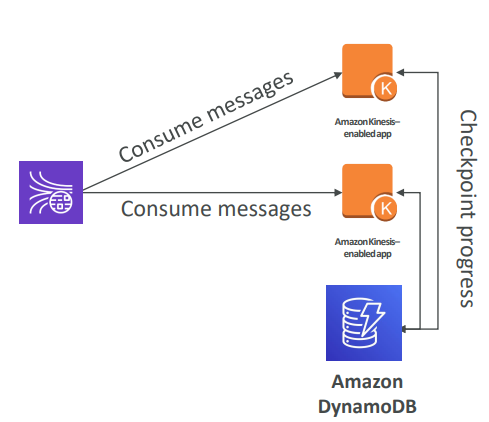
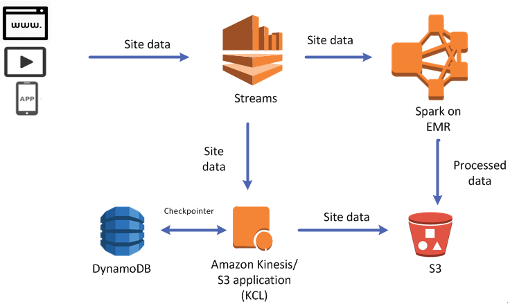
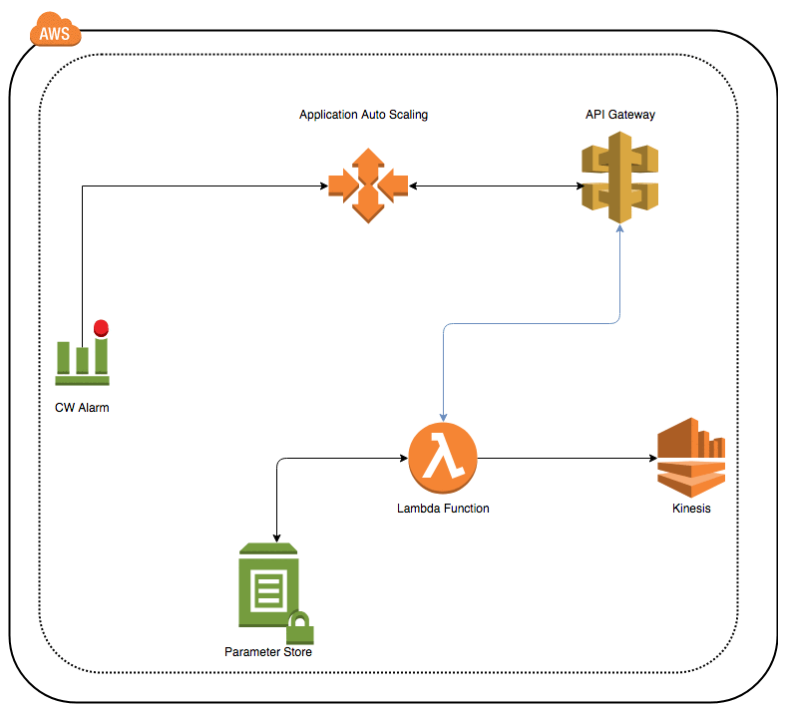
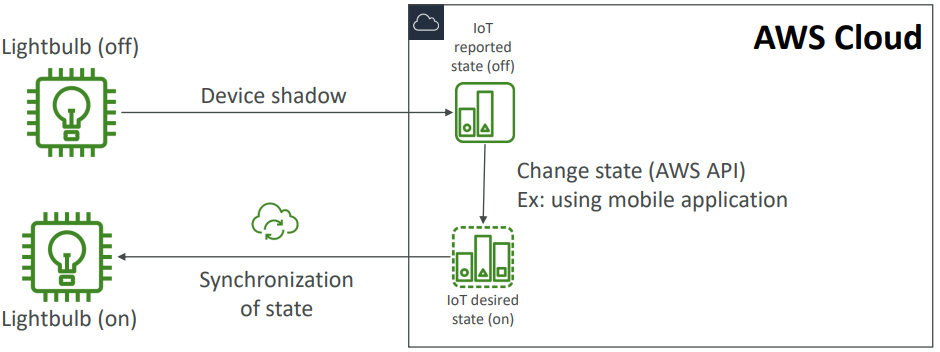
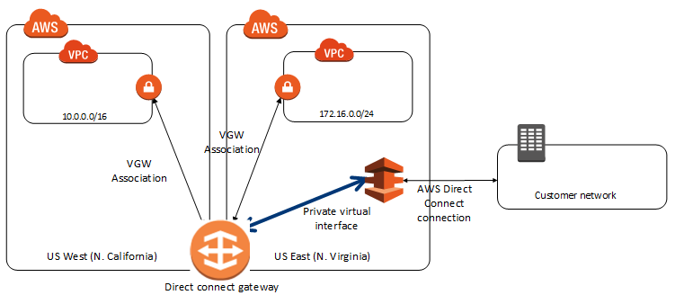
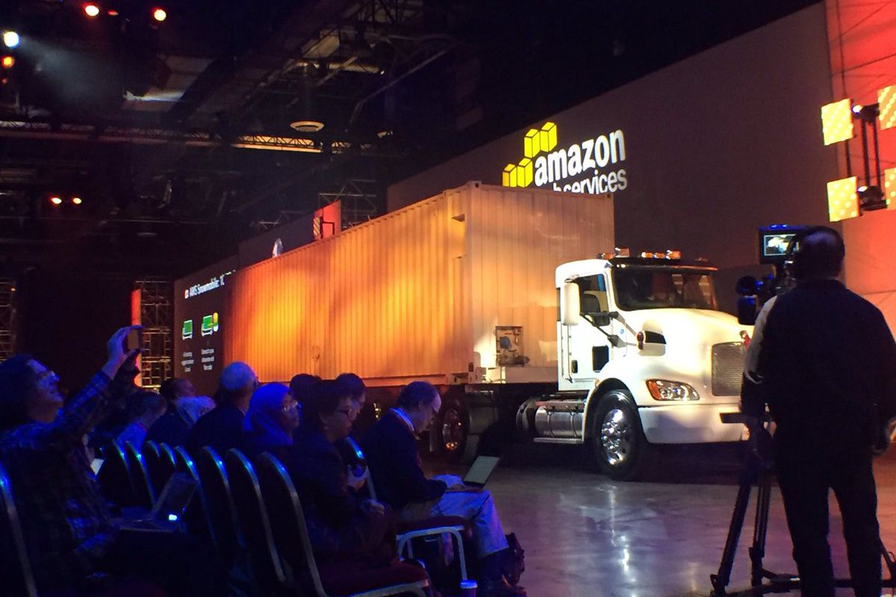
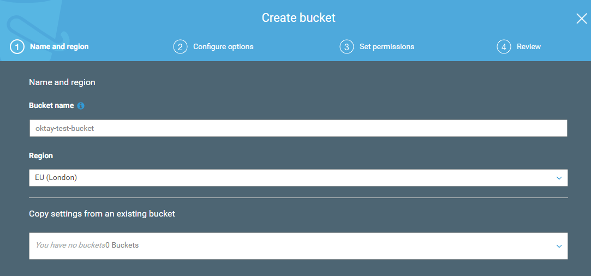
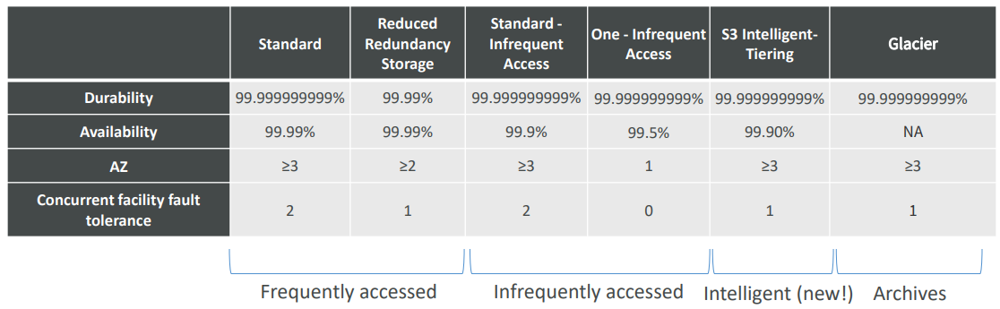

  * [Collection](#collection)
    * [Kinesis](#kinesis)
        * [Kinesis Streams](#kinesis-streams)
    * [AWS SQS](#aws-sqs)

# Collection

## Kinesis

• Kinesis Kafka’nın bir alternatifi olarak kullanılmaktadır.
• Real-time olarak yüksek oranda veriyi yakalamak için idealdir.
• Data generate edebilir ve bir çok veri kaynağından (1000 veya 100 binlerce), sürekli olarak kb ve mb mertebesinde küçük veriler gönderilebilir.
• Birden çok veri kaynağından, aynı anda data almaktan bahsediliyorsa, Kinesis en uygun yoldur.
• Uygulama logları, IoT veya clickstream verisi gibi BigData mimarileri için uygundur.
• Spark ve Nifi gibi streaming process için de kullanılabilir.
• Data by default 3 AZ’da senkronize edilir.

Kinesis Data Stream 3 ayrı management servis barındırmaktadır.

**Kinesis Streams:** Real-time olarak, low latency ile büyük çaplı verilerin alınması ve process edilmesini sağlar.

**Kinesis Analytics:** SQL kullanarak, veriyi real-time process ve analiz eder.

**Kinesis Firehose:** Delivery servis gibi çalışmaktadır ve adı yangın hortumundan esinlenmiştir. İstenilen bir yere data püskürtüyormuş gibi düşünebiliriz. Amazon Firehose ile kolayca veri yakalanabilir, transform edilebilir ve streaming veriyi S3, Redshift, ElasticSearch veya Splunk’a gönderebilir.

Near real-time çalışan bir servistir.

### Kinesis Streams

Consumer veriyi shard’lardan okur.

Veriyi by default 24 saat tutar ve bu süre en fazla 7 gün olabilir. Süre artışına paralel olarak maaliyet de artacaktır. Veriyi yeniden process etme yeteneği vardır. Veri bir kere işlendikten sonra silinemez. Aynı veri tekrar tekrar okunabilir. Data, retention periyoduna bağlı olarak silinecektir ve bu nedenle birden fazla uygulama aynı anda veriyi consume edebilir. Data bir kere Kinesis’e insert edildiği zaman, silinemez. **Immutability**, append only stream.

#### Kinesis Streams Shards

Bir stream bir çok farklı shard’dan oluşur. Shard başına ücretlendirme yapılır ve istenildiği kadar shard talep edilebilir. Shard sayısı zamanla geliştirilebilir. (Re-shard veya merge yapılabilir) Genel olarak kayıtlar global olarak değil, shard başına sıralanacaktır ve bu sıralama teslim alınma sürelerine göre olacaktır.

**Data Blob:** Veri en fazla 1 mb olabilir ve herhangi bir veri tipini temsil edebilir.

**Record Key:** Kayıtların shard’lar olarak gruplanmasını sağlar. Same key = Same shard
Olası hot partition sorununu önlemek için, distributed key kullanılmalıdır. Bu key ile Kinesis shard’lara erişilebiliyor ve bu sayede verileri gönderebiliyor.

**Sequence Number:** Veriler unique bir identifier ile shard’lara konulur.

**Limitleri:** Producer shard başına saniyede sadece 1 mb veya 1000 mesaj yazabilir. Bu limit aşılırsa, **ProvisionedThroughputException** hatası alınır.

İki tip consumer vardır.

**Consumer Classic:**
Bütün consumer’larda, 2mb/s shard başı okuma
Bütün consumer’larda, shard başına 5 API call

**Consumer Enhanced Fan-Out:**
Bütün consumer’larda, shard başına, enhanced consumer başına 2mb/s okuma

Push model olduğundan, API call gerekmiyor.

Data retention default 24 saat ve max 7 güne kadar arttırılabilir.

#### Kinesis Producers

**Kinesis SDK:** SDK (Software Development Kit) kod yazılmasını veya CLI kullanarak datayı direk Amazon Kinesis Stream’e gönderilmesini sağlar. Genel olarak, bir SDK bir uygulama içinde belirli bir modül oluşturmak için ihtiyaç duyulan her şeyden oluşur ve kütüphaneler, araçlar, örnek kod, ilgili belgeler ve çoğu zaman API’ler içerebilir.

**Kinesis Producer Library (KPL):** SDK oranla daha iyi kod yazılabilir ve ek yetenekleri sayesinde enhanced throughput alınmasını sağlar.

**Kinesis Agent:** Server üzerinde çalışır ve log dosyası alınmasını ve bunu Amazon Kinesis Stream’e atılmasını sağlar.

Kinesis Stream’e data göndermek için; Apache Spark, Nifi, Kafka connect gibi 3rd party uygulamalar da kullanılabilir.

##### Kinesis Producer SDK

API’lar bir kayıt (PutRecord) veya birden fazla kayıt (PutRecords) için kullanılabilir. PutRecords batch işlemler için kullanılır, daha az http request yapılmasını sağlar ve throughput arttırır. Producer SDK; Android veya IOS mobile cihazlar gibi çeşitli servisler için kullanılabilir. Düşük throughput, yüksek latency, simple API ve AWS Lambda gibi use case’lerde kullanılabilir.

ProvisionedThroughputExceeded hatası alınırsa, herhangi bir shard için TPS veya mb/s limiti aşılmış demektir. Hatanın önlenmesi için Hot Shard olmaması sağlanmalıdır. Örneğin, key olarak device_id ise ve datanın %90’ı aynı device_id’ye ait ise, bu durumda datanın %90’ı aynı partition’da olacaktır ve o partition’daki yoğunluk bu hatanın alınmasına neden olabilecektir.

Hot Shard olmamasına rağmen hata alınıyorsa, işlem tekrar denenebilir veya shard sayısı arttırılabilir.

##### Kinesis Producer Library

• Kullanımı kolaydır, C++ ve Java library'leri ile yapılandırılabilir. 
• Yüksek performans ihtiyacı olan uzun süreli kullanımlar için uygundur .
• Retry mekanizması yani işin tekrar çalıştırılabilme kabiliyeti bulunmaktadır.
• Synchronous ve asynchronous API olmak üzere iki tiptir. Daha yüksek performans isteniyorsa, asynchronous tercih edilebilir. 
• Kinesis Data Stream'e asynchronous olarak data gönderilmekten bahsediliyorsa, genellikle bunu yapmanın yolu KPL olacaktır.
• CloudWatch'a monitoring için metric gönderebilecek yeteneğe de sahiptir.
• KPL ile uygulama yazıldığında, direk olarak CloudWatch'dan monitor edilebilir.
• Throughput arttırmak ve maaliyet'i düşürmeye yarayacak olan batch işlemleri desteklemektedir.

Batch işlemler kendi içinde ikiye ayrılır.

**Collect:** Aynı PutRecords API call ile birden fazla shard'a yazılır.

**Aggregate:** Verimliliği ve latency'i arttırır. Bir kayıt içerisinde birden fazla kaydı tutabilir (Saniyede 1000 kaydın üzerine çıkabilir). Max 1mb/s olacak şekilde throughput arttırır.

> KPL compression desteklemektedir ancak bunun kullanıcı tarafından yapılması gerekmektedir.

KPL kayıtları, KCL ile ve özel yardımcı library'ler ile de-coded edilmelidir.

Kinesis Producer Library (KPL) Batching

KPL ile aggregation ve collection yapabiliriz.
Şekilde görünen 7 kayıt sadece 2 kayıt şeklinde gönderilebilir.

KPL ile kayıt geldikten sonra bir süre bekler ve max 1mb olacak şekilde tek bir kayıt oluşturur. Bekleme süresi **RecordMaxBufferedTime** parametresine göre belirlenir ve default 100ms'dir.
Bu süre bir miktar gecikme oluşturur ancak verimliliği ciddi oranda arttırmaktadır.

##### Kinesis Agent

Log dosyalarını monitor eder ve bunları Kinesis Data Stream'e gönderir.
Java-based bir agent'dır ve sadece linux-based server'larda kurulabilir.

###### Kinesis Consumer(s) – Classic

Kinesis Data Stream'den veri okumak için SDK veya CLI kullanabiliriz. KPL ile üretebiliriz ve KCL ile okuyabiliriz. Apache Spark consumer olarak Kinesis Data Stream'den okuma yapabilir. Kayıtlar consumerlar tarafından bir shard'dan toplanır. Her shard toplamda 2mb throughput'a sahiptir.

GetRecord en fazla 10mb veya 10000 kayıt data döndürebilir. Her shard 2mb throughput'a sahip olduğundan ve yukarıdaki senaryoda 3 consumer’da aynı shard’dan okuma yaptığından dolayı, bu gibi bir senaryo 5 saniye sürecektir.

Saniyede shard başına max 5 GetRecords API call yapılabilir. Bu durumda da 200ms latency olacaktır. 5 Consumer application aynı shard'ı kullanırsa, bütün consumerlar saniyede 1 poll yapabileceği ve 400Kb/s daha az bir verim alacağı anlamına gelir. Ne kadar consumer olursa, consumer başına sahip olunacak throughput daha az olur. Bir yerine 3 tane consumer'a sahip olursak, hepsi aynı 2mb/s limitini ve saniyede 5 GetRecords API call limitini kullanacaklardır.

**Örnek 1:** Klasik modda çalışan ve GetRecords() komutu ile aynı anda 1 tane shard'dan consume işi yapan 10 consumer uygulaması olsun. Her consumer uygulaması için ortalama latency‘si ne olacaktır?

Saniyede en fazla 5 GetRecords API call yapılabileceğinden, her consumer uygulaması için ortalama latency 2 saniye olacaktır.

**Örnek 2:** Enhanced fan out modda çalışan ve aynı anda 1 tane shard'dan consume işi yapan 10 consumer uygulaması olsun. Her uygulamaların, kayıtları consume ederken ortalama latency‘si ne olacaktır?

Enhanced fan out modda, ne kadar consumer olursa olsun, her consumer saniyede 2mb throughput'a sahip olur. Yani her consumer 2mb/s veri alır ve ortamala latency 70ms olur.

##### Kinesis Client Library

Java-based bir library'dir ama Golang, Python, Ruby, Node, .NET ile de kullanılabilir. KPL aggregation yapar ve KCL, KPL ile üretilen verilerin okunmasını sağlar.

KPL aggregation yapar. KCL de-aggregation yapar.

Tek bir grup içinde birden fazla consumer ile birden fazla shard paylaşabilir.

Checkpoint özelliği ile işlemin devam ettirilmesini sağlar. Bu sayede uygulamalardan birinde sorun olsa bile tekrar devam edebilir. KCL uygulamanın durumunu takip etmek için Amazon Kinesis Data Streams uygulamalarının **hepsi için ayrı DynamoDB tablosu kullanır.** DynamoDB ile etkileşimli, Kinesis Consuler Library (KCL) ile beraber kullanılabilecek checkpointing özelliği vardır. Bu sayede consumption ilerleyişi izlenebilir.

Stream edilen datanın hem process hem de raw hali saklanacağı zaman, veriyi yakalamak için Kinesis Stream ve analiz amaçlı işlemek için Spark Streaming kullanılabilir. Lambda fonksiyonu yardımı ile de, raw data S3 tarafında bulunan backed Firehose mesajları push edilebilir.

DynamoDB'nin bu vazifesi nedeni ile yeteri kadar WCU (Write Capacity Unit) veya RCU (Read Capacity Unit) olduğuna emin olunmalıdır veya On-Demand DynamoDB kullanılabilir. **Aksi halde KCL'de yavaşlamaya neden olacaktır.**

**Örnek:** KPL kullanarak, çeşitli producer'lardan ortamala 8mb/s ile 10 shard içeren Kinesis Stream'den veri alınınan bir yapı var ve yapı içerisinde bulunan kayıtlar KCL kullanarak consume ediliyor. CloudWatch metricleri ile verinin 2mb/s throughput'a sahip olduğunu ve uygulumada gecikme yaşandığı anlaşılıyor. Bu sorunun en muhtemel nedeni ne olabilir?

- [ ] Shard'ların biraz daha bölünmesi gerekmektedir.
- [ ] Hot partition durumu vardır.
- [ ] CloudWatch, aggregate için değil, ortalama throughput göstermektedir
- [x] DynamoDB tablosu ihtiyacı karşılayamamaktadır.

**Kinesis Connector Library:**
Eski (2016) Java library'dir ve connector EC2'de olmak zorundadır. Data; S3, DynamoDB, Redshift ve ElasticSearch'e yazılır.

Kinesis Firehose ve Lambda Kinesis Connector Library'nin kullanım alanlarının bir çoğunu almıştır.

**AWS Lambda,** Kinesis'den kayıt okuyabilir. Lambda consumer küçük bir library'e sahiptir ve KPL'den yapılacak de-aggregation için çok uygundur.

Lightweight ETL için de kullanılabilir. Programlaması yapıldığı sürece Amazon S3, DynamoDB, Redshift, ElasticSearch veya istenilen herhangi bir yere data gönderilebilir. Ayrıca notification oluşturmak ve real time mail göndermek için de kullanılabilir.

**Kinesis Enhanced Fan-Out:**
KCL 2.0 ve Lambda ile çalışır.
Bütün consumer'lar, shard başına 2mb/s throughput sağlar. 20 consumera sahipsek, shard başına saniyede 40mb throughput alırız. Data http/2 üzerinden consumerlara gönderilir ve ortalama 70 ms latency sağlar.

**Standart Consumer ve Enhanced Fan-Out Consumer Farkı:**

**Standart Consumer;**
• Az sayıda consumer uygulaması
• 200 ms latency ve düşük maaliyet

**Enhanced Fan-Out Consumer;**
• Aynı stream için birden fazla consumer uygulaması
• 70 ms latency ve daha yüksek maaliyet

https://aws.amazon.com/kinesis/data-streams/pricing/?nc1=h_ls

Default her Data Stream için enhanced fan-out kullanacak 5 consumer limiti vardir.

**Kinesis Scaling:** Shard Splitting olarak geçer.

Stream kapasitesinin arttırılması için kullanılır. (Her Shard için 1 mb/s data) Hot Shard'ın bölünmesi için de kullanılabilir.

**Çalışma şekli:** Eski shard kapanır ve eski shard data expire olana kadar kalır ve data expire olunca gider.

Sekild görünen Shard 2 Hot Shard olsun ve bunu Shard 4 ve Shard 5 olmak üzere 2'ye split edelim. Bu durumda Shard 2'de bulunan data expire olana kadar kalır ve data expire olunca Shard 4 ve Shard 5 olarak devam eder. Bu şekilde throughput artışı da sağlamış oluruz.

Bu işlemin tersi de yapılabilir yani 2 shard'ı tek bir shard ile merge edebiliriz ve bu şekilde maaliyet kazancı sağlamış oluruz.
Split operasyonunda olduğu gibi burada da, eski shardlar içerisindeki data expire olunca kapanacaktır.

Kinesis Auto Scaling Manual müdahale ile yapılmaktadır. UpdateShardCount API işlemi ile yapılır. Auto scaling işini AWS Lambda ile gerçekleştirebiliriz.

Re-sharding işi paralel olarak yapılamaz. Öncesinde kapasite planlaması yapılması gerekmektedir.
Aynı anda sadece 1 tane resharding işi yapılabilir ve bu işin süresi shard sayısına göre değişir. 
Örnek olarak 1000 shard için 30.000 saniye yaklaşık 8.3 saat zaman gerekir. 
2000 shard için bu sürenin iki katı olacaktır.

**Limitleri:**
• 24 saat içerisinde bir stream için bir kere scale işi çalışabilir.
• Bir stream için mevcut shard sayısının iki katından fazla scale up işi yapılamaz.
• Bir stream için mevcut shard sayısının yarısından fazla scale down işi yapılamaz.
•Bir stream için 500 shard’dan fazla scale up işi yapılamaz.
• Scale up işi account limitinden daha fazla olamaz.

**Kinesis Security**
• Authorization kısmı IAM policy tarafından yönetilir.
• In flight encryption https endpoint'ler ile yapılır.
• At rest encryption KMS ile yapılır.
• Client side encryption manual olarak implemente edilmelidir.
• VPC Endpoint, Kinesis'in VPC'ye erişmesi için kullanılabilir.

### Kinesis Data Firehose

Administration maaliyeti olmayan AWS tarafından fully managed bir servistir.
Kinesis Data Stream gibi real-time değildir.

**Near Real Time olarak data Kinesis Data Firehose'dan, sadece Redshift, Amazon S3, ElasticSearch ve Splunk'a gönderilebilir.**
Otomatik olacak scale olabilmektedir ve çok fazla sayıda veri formatını desteklemektedir.

S3 için JSON'dan, Parquest veya ORC'ye data conversion yapılabilir. AWS Lambda ile de, CSV'den JSON formatına data transformation yapılabilir.
Hedef Amazon S3 ise; gzip, zip ve snappy compression desteklenmektedir. Redshift ile sadece gzip data load edilebilir.

Sadece Firehose üzerinden giden veri için ücretlendirme yapılmaktadır.

Spark Streaming veya Kinesis Client Library, Kinesis Firehose'dan veri okuyamaz sadece Kinesis Data Stream'den veri okuyabilirler.

Diagram'da Kinesis Data Firehose'un yeri daha net görülmektedir. Data source olarak KPL, Kinesis Agent, Kinesis Data Stream (en sık kullanılandır), CloudWatch, IoT verileri gibi veri kaynakları olabilirken, data transformation için Lambda kullanılabilir. Lambda'nın buradaki görevi, datayı alarak transform etmesi ve sonrasında tekrar datayı Firehose'a göndermesidir. Transform olmuş data yukarıda bahsetildiği gibi sadece S3, Redshift, ElasticSearch veya Splunk'a gönderilir

S3 aynı zamanda herhangi bir transformation veya delivery failure durumunda da kullanılabilir.

Yukarıdaki mimaride; source datası, transformation hatası veya hedefe datayı ulaştıramama durumunda, data output bucket'ından ayrı bir diğer bucket'a gönderilecektir

**Firehose Buffer Sizing**
Firehose kayıtları bir buffer'da biriktirir.

Bu buffer zaman veya size tanımına göre flush olur. Örnek olarak buffer size 32 mb ise, bu değere gelince flush olacaktır veya buffer time 2 dakika ise bu zamana erişince flush olacaktır. Firehose otomatik olarak throughput'u arttırmak için, buffer size'ı arttırabilir.

Firehose için minimum buffer time 1 dakikadır.

#### Kinesis Data Streams vs Firehose

**Kinesis Data Streams**
• Custom code yazılması gerekmektedir.
• Real-time olarak çalışır. (Classic için yaklaşık 200ms latency ve enhanced fan-out için yaklaşık 70ms latency oluşur.)
• Scaling (shard splitting/merging) işi manage edilmelidir.
• Data 1 ile 7 gün arasında muhafaza edilir.
• Replay yeteneği ve multi consumer seçeneği vardır.
*  AWS Lambda kullanılarak, Real-Time data insert edilebilir. 
    * Örnek: ElasticSearch

**Kinesis Firehose**
• Fully managed'dır.
• Data S3, Splunk, Redshift ve ElasticSearch'e gönderilir.
• Near Real-Time'dır.
• Otomatik scale olabilmektedir.
• Data storage özelliği yoktur.

## AWS SQS

En eski AWS servislerinden biridir ve AWS tarafından fully managedır.

•	Saniyede 1 mesajdan, 10.000'e kadar çıkabilir.
•	Default olarak retention 4 gündür ve bu süre 14 güne kadar çıkabilir. 
•	Que'da olabilecek mesaj sayısı için sınır bulunmaktadır.
•	Publish ve receive için 10ms altında bir lateny sağlar.
•	Consumer sayısına göre  yatay olarak ölçeklenebilir.
•	Mesajlar en az bir kere teslim edilir ve duplicate mesaj da olabilir.
•	Best-effort ordering de, bozuk mesajlar olabilir.
•	Gönderilen mesajlarda mesaj başına 256kb sınır bulunmaktadır.

Consumerlar aynı anda 10 mesaja kadar alabilirler.
Bu mesajlar visibility timeout parametresi içerisinde process edilir. Mesajlar process edildikten sonra, message_id kullanılarak, bu mesajlar que'dan silinir.

SQS olduğu zaman, consumerlar poll messages işini yapacak, consumerlar bu mesajları process edeceklerdir ve bir daha process edilmemesi için ardından SQS que'dan sileceklerdir. 

Bu şekilde mesajlar farklı consumer uygulamaları tarafından process edilmemiş olacaklardır. Bu özellik SQS ve Kinesis arasındaki en büyük farklardan birisidir.

#### AWS SQS Fifo Queue

SQS ilk olarak standart queue ile çıktı ve şu anda Fifo Queue olarak da hizmet sağlamaktadır. Açılım First In First Out'dur ve bütün regionlarda bulunmamaktadır.
Queue adımının sonu .fifo ile bitmelidir. 

Daha düşük throughput sunmaktadır ve batching ile saniye 3000 ve batch olmayan işlemler için saniyede 300 throughput sağlamaktadır. 
Mesajlar sırayla işlenir ve sadece 1 kere gönderilir. Duplication ID kullanılarak 5 dakikalık aralıklarla veri tekilleştirme sağlanılabilir.

Mesajlar 1,2,3,4,5 sırası ile gönderilmiş ise, consumerlar tarafından yine aynı sırada okunacaklardır.

SQS ile 256 kb üzerinde mesaj gönderilmesi tavsiye edilmez ama ihtiyaç ısrarla bu yönde ise, bir java library'si olan SQS extended Client ile sağlanır.

Bunun için Amazon S3 kullanılır ve diyelimki 5 mb veya 10 mb mesaj göndermek isteyelim. Yukarıdaki gibi büyük mesajlar producer tarafından direk S3'e gönderilir ve bu mesajlar yine direk S3'den direk alınır.

Asynchronously olarak işlenen ödeme servisleri gibi decouple uygulamalar, voting uygulamaları gibi database'e yazılan buffer yazmaları, e-mail gönderimi gibi büyük mesaj load işlemleri gibi use case'ler için uygundur.

SQS CloudWatch üzerinden Auto Scale olarak entegre edilebilir.

#### SQS Limitleri

•	Consumerlar tarafından maksimum 120.000 in-flight mesaj process edilebilir.
•	Batch requestler en fazla 10 mesaj ve 256kb olabilir.
•	Mesaj formatı; XML, JSON veya formatı belirsiz text olabilir.
•	Standart que’da sınırsız TPS vardır.
•	FIFO queue saniyede en fazla 3000 mesaj destekler.
•	Max mesaj size'ı extended client kullanılmadığı taktirde 256 kb'dır.
•	Data retention 1 dakika ve 14 gün arasındadır.
•	Yapılan API request ve network kullanımı üzerinden ücretlendirilir.

#### SQS Security

* Https ile in-flight encryption sağlanır.
*	KMS ile server side encryption yapılabilir.
    *	CMK (Customer Master Key) kullanılabilir.
    *	SSE ile sadece mesajın body'si encrypt edilir. Message_ID, timestamp, attributes kısımları gibi metadata bölümü encrypt edilmez.
*	IAM policy SQS kullanımına izin vermelidir.
*	SQS queue access policy, IP üzerinden kontrol ve requestlerin geldiği süre boyunca kontrol yapılabilir.

#### Kinesis Data Stream vs SQS

Ne zaman SQS ve ne zaman Kinesis Data Stream kullanılmalıdır.

Kinesis Data Stream
•	Data birden fazla kez consume edilebilir.
•	Data retention period sonrasında silinir.
•	Kayıt sırası replay sırasında bile korunur.
•	Birden fazla uygulamanın aynı stream'i okuması için dizayn edilmiştir. (Pub/Sub)
•	Datayı process etmek ve sorgulamak için Spark veya MapReduce kullanılabilir.
•	DynamoDB ile etkileşimli, Kinesis Consuler Library (KCL) ile beraber kullanılabilecek checkpointing özelliği vardır. Bu sayede consumption ilerleyişi izlenebilir.
•	Shard kapasitesi, limite dayanmadan önce sağlanmalıdır.
•	Max 1 mb mesaj size'ı vardır.
	
SQS
•	Decouple yani ayrı uygulamalar için uygundur.
•	Que başına bir tane uygulama olabilir.
•	Consumption sonrası kayıtlar silinir.
•	Mesajlar standart için sıradan bağımsız işlenir ve FIFO'da sıra ile işlenir.
•	"Delay" message özelliği vardır.
•	Dinamik olarak scale olabilir.
•	Max 256 kb mesaj size'ı vardır.

Kinesis Data Stream | SQS
------------ | -------------
Data birden fazla kez consume edilebilir. | Data bir kez consume edilebilir.
Data retention period sonrasında silinir. | Data consumption sonrası silinir.
Kayıt sırası replay sırasında bile korunur. | Mesajlar standart için sıradan bağımsız işlenir ve FIFO'da sıra ile işlenir.
**Birden fazla uygulamanın aynı stream'i okuması için dizayn edilmiştir. (Pub/Sub)** | Decouple yani ayrı uygulamalar için uygundur ve que başına bir tane uygulama olabilir.
**Datayı process etmek ve sorgulamak için Spark veya MapReduce kullanılabilir.** | 
DynamoDB ile etkileşimli, Kinesis Consuler Library (KCL) ile beraber kullanılabilecek checkpointing özelliği vardır. Bu sayede consumption ilerleyişi izlenebilir.  | "Delay" message özelliği vardır.
Shard kapasitesi, limite dayanmadan önce sağlanmalıdır.  | Dinamik olarak scale olabilir.
**Max 1 mb mesaj size'ı vardır.**  | Max 256 kb mesaj size'ı vardır.

Kinesis Data Stream, Data Firehose, SQS standart ve Fifo arasındaki fark aiağıdaki tabloda daha açık görünmektedir.

**Use cases:**

Kinesis Data Stream:
*	Daha fazla BigData için uygundur.
*	Event data collection ve processing
*	Real-Time metric toplama ve raporlama
*	Mobil veri yakalamak
*	Real-Time data analizi
*	Oyun veri akışı
*	Karmaşık stream processing
*	"Internet of Things" verileri

SQS:
* Order processing
* Image processing
* Mesaj yüküne göre auto scaling gerektiren yapılar.
* Database insert veya visual processing için buffer ve batch mesalar yapıları
* Offloading requestleri

### IoT (Internet of Things)

IoT, internet of things yani nesnelerin interneti anlamına gelir. Burada yer alan nesne her şey olabilir. Bisiklet, araba, lamba yani kısasacı istenilen her şeydir.

Burada yer alan nesne konfigüre edilir ve data bu nesnelerden alınır.

Nesne, AWS'de bulunan IoT Cloud'a, thing registry ile register olacak ve thing registry bir device ID verecek.

IoT nesnesinin Cloud ortamı ile iletişim kurması için device gateway kullanmaktadır. Device gateway AWS tarafından manage edilen bir servistir. 

Hava sıcaklığının 30 derece olduğu zaman rapor eden bir IoT yapısı olmuş olsun. 
Böyle bir yapıda IoT Message Broker'a SNS topic gibi bir mesaj gönderecektir ve bu mesaj bir çok farklı yere gönderilecektir.
IoT Rules Engine yardımı ile bu mesajları Kinesis, SQS, Lambda gibi hedeflere gönderilecektir. **Sensörlerden veri toplamak için IoT Rules Engine kullanılabilir ve cihazdan alınan veriler DynamoDB'ye aktarılabilir.**

Böyle bir yapıyı IoT Device Shadow adında bir servis ile de entegre edebiliriz. Bu servis kelimenin tam anlamıyla bağlı nesne/cihaz'ın gölgesi gibi çalışacaktır.

Termostat internete bağlı olmasa bile, Device Shadow ile cihazın durumu değiştirilebilir. 

Örneğin, odanın sıcaklığı 25 derece olsun ve biz bunun 20 derece olmasını isteyelim. 
O an için termostatın internete bağlantısında bize bağlı olmayan bir sorun olsun ve biz mobil uygulamadan gönderdiğimiz Rest-API ile odanın sıcaklığını düşürmek isteyelim. 

Bu durumda bizim gönderdiğimiz API, Device shadow'a gidecek ve device shadow artık odanın sıcaklığının 20 derece olması gerektiğini bilecek. 
Asıl device'da yaşanan bağlantı sorunu ortadan kalktığı anda da, shadow device asıl device'a talebi iletecektir ve sıcaklığın düşürülmesi için süreç başlayacaktır.

Bir ampul için olabilecek basit mimarinin görseli de yukarıdaki gibi olacaktır.

Aşağıdaki linkte sadece 5 dakika olan bir tutorial izlenerek, bütün işleyişin nasıl olduğunu daha rahat anlaşılabilir.

https://us-west-1.console.aws.amazon.com/iot/home?region=us-west-1#/learnHub

#### IoT Device Gateway

AWS'e bağlanan IoT cihazları için entry point görevi görür. Cihazların AWS'e güvenli ve verimli şekilde iletişim kurmasından sorumludur.

MQTT, WebSocket ve http 1.1 protokollerini destekler. AWS tarafından fully managed olan bu servis 1 milyardan fazla cihazı desteklemek için otomatik scale olmaktadır.

Örnek olarak nesne connected bisikletlerden olsun. Bisiklet, AWS ortamında yer alan Device Gateway'e MQTT mesajları göndererek, veri akışının güvenli şekilde yapılmasını sağlar.

**Rules Engine**

Kurallar MQTT topiclerinde tanımlanmaktadır.
**Rules:** Tetiklenecek iş
**Action:** Yapılmak istenen iş, şeklinde işler.

Use cases:
* Bir cihazdan alınan verilerin DynamoDB'ye yazılması
* S3'e dosya kaydedilmesi
* Kullanıcı gruplarına notification mesajlarının atılması
* Data extract etmek için Lambda fonksiyonun çağırılması
* Amazon Kinesis kullanarak, çok sayıda cihazdan gelen mesajların işlenmesi
* Amazon ElasticSearch'e data gönderilmesi
* CloudWatch metriklerinin yakalanması ve CloudWatch alarmının oluşturulması
* MQTT mesajındaki verileri Amazon Machine Learning makinesine göndererek, ML modeline dayalı tahminlerde bulunmak

Rules kısmının, action olabilmesi için de IAM rollerine ihtiyaç duyulmaktadır.

### DMS – Database Migration Service

Source veri tabanı migration sırasında aynı şekilde kullanılmaya devam edilebilir.

Aynı tip veri tabanlarından (Oracle to Oracle) birbirlerine ve farklı tip veri tabanlarından (Microsoft SQL Server to Aurora) birbirlerine migration desteklenir.

CDC (Captures Database Changes) kullanarak, data replikasyonu sağlanır. Replication tasklarının yapılmabilmesi için, EC2 instance'ı oluşturulması gerekmektedir.

#### DMS Sources ve Target

**Sources**
On-Premise ve EC2 instance veri tabanları olabilir. 
Liste aşağıdaki gibidir;
*Oracle, MS SQL Server, MySQL, MariaDB, PostgreSQL, MongoDB, SAP, DB2*

Bunların dışında aşağıdaki Cloud veri tabanları da olabilir.
*Azure SQL Database, Amazon RDS (all including Aurora), Amazon S3*

**Targets**
On-Premise ve EC2 instance veri tabanları olabilir. 
Liste aşağıdaki gibidir;
*Oracle, MS SQL Server, MySQL, MariaDB, PostgreSQL, SAP*

Bunların dışında aşağıdaki Cloud veri tabanları da olabilir. 
*Amazon RDS, Amazon Redshift, Amazon DynamoDB, Amazon S3, ElasticSearch Service, Kinesis Data Streams, DocumentDB.*

Çalışma prensibi arka planda çalışan AWS Schema Coversion Tool (SCT) ile gerçekleşir. AWS SCT, AWS DMS endpoint ve task oluşturarak süreci işletir.

Database schema engine'i birinden bir diğerine convert olur. 

Örnek olarak, SQL Server veya Oracle gibi OLTP veri tabanları; MySQL, PostgreSQL, Aurora gibi veri tabanlarına convert edilir. Teradata veya Oracle gibi OLAP yapısına sahip olan veri tabanları Amazon Redshift gibi DWH ortamına migrate edilebilir.

### Direct Connect

On-Premise network ve VPC arasında dedike kurulu private bir bağlantıdır. Birden fazla 1 gb/s veya 10 gb/s bağlantı kurulabilir. Bu şekilde bir bağlantı için VPC'de virtual private network kurulmalıdır. 

**Use Cases:**
* Büyük data setler ile çalışmak için, bandwidth throughput arttırılması
* Real-Time veri kullanan uygulamalar için consistent network ihtiyacı
* On-Premise ve Cloud ortamlarının beraber kullanıldığı, hybrid mimariler için 
* Private connection ile daha gelişmiş güvenlik ihtiyacı için

IPv4 ve IPv6 desteği vardır.

**High-availability:** Failover için iki ayrı Data Center veya Site-to-Site VPN kullanılabilir.

Yukarıdaki diagramda görüldüğü gibi AWS Direct Connect endpoint ile hem Amazon Glacier veya S3 gibi public kaynaklara hem de private network'de olan EC2 instance'larına güvenli ve hızlı bağlantı kurulabilir.

Eğer direct connect bağlantısı aynı account'da bulunan farklı region'larda bulunan VPC'ler için isteniyorsa, Direct Connect Gateway kullanılmalıdır.

### Snowball

Tb veya Pb düzeyindeki verilerin, AWS içinde veya dışında taşımaya yardımcı olan fiziksek veri taşıma çözümüdür.

* Verilerin ağ üzerinden taşımaya alternatifidir ve daha hesaplı bir yöntemdir.
* 256 bit KMS encryption şifreleme ile güvenli bir taşıma sağlar.
* Taşıma takibi SNS veya text mesaj ile yapılır. 
* Data transfer işi başına ücretlendirilir.
* Büyük Cloud migration, DC taşınması ve disaster recovery durumlarında tercih edilebilir.
* **Bir veri taşıma network üzerinden 1 hafta veya daha uzun sürecek ise, snowball kullanmak hem daha hızlı hem de daha güvenli olacaktır.**

#### Snowball Process

* AWS console'dan snowball device talebi girilir.
* Snowball client server'lara yüklenir.
* Snowball ve server birbirlerine bağlanır ve snowball client ile veriler server'dan snowball'a aktarılır.
* Cihaz geri gönderilir ve veriler S3 bucket'a yüklenir.
* Snowball tamamen temizlenir.
* Süreç takibi SNS, text mesajları ve AWS console'dan yapılır.

#### Snowball Edge

Cihaza compute yeteneği ekler ve aynı zamanda storage (24 vcpu) ve compute (52v cpu & opsiyonel gpu) optimized'dır. 

* Hareket halinde de işlem yapılabilmesi için custom EC2 AMI desteği vardır.
* Lambda function desteği vardır.
* Data taşınırken datanın pre-process edilmesine olanak sağlar.
* Data migration, image karşılaştırma, IoT işleri ve machine learning için kullanımı uygundur.

#### AWS Snowmobile

Exabytes yani 100 pb veri transferi sağlar.

Her Snowmobile 100 pb kapasiteye sahiptir ve paralel kullanım sağlamaktadır. **Eğer taşınacak veri 10 pb fazla ise, Snowball yerine Snowmobile tercih edilmelidir.**

## Storage

### S3

Dosyaların yani objelerin bucketlara yani dizinlere konumlasını sağlar.

Bucketlar global olarak unique bir isme sahip olmaları gerekmektedir.
Bucketlar region seviyesinde tanımlanmaktadır ve isim standartları aşağıdaki gibi olmalıdır.
* Büyük karakter veya alt çizgi olmamalı. 
* 3 ila 63 karakter uzunluğunda olabilir.
* Adında ip olmamalıdır.	
* Adı küçük karakter veya rakam ile başlamamalıdır.

Objeler yani dosyalar bir key'e sahiptir. Buradan key full path'dir.
*<my_bucket>/my_file.txt*
*<my_bucket>/my_folder/another_folder/my_file.txt*

Bucketların içerisinde directory mantığı yoktur. Her ne kadar UI'da o şekilde görünse de, bu sadece görsel kolaylık için tasarlanmıştır.

Max size 5 tb'dır ve **eğer 5 gb'dan daha fazla upload yapılacak ise, "multi-part-upload" yapılmalıdır (must).** 100 mb üzeri data upload yapılacak ise de kullanılabilir ve yine avantajı görünecektir.

Metadata verileri, sistem veya kullanıcı metadata verileri olabilir. Tagler, security için kullanışlıdır. Versioning enable ise, Version ID bulunur.

#### AWS S3 - Consistency Model

Iki tür consistency vardir.

**Strong (Immediate) Consistency**
* Farkli client'larin, farkli veri kopyasini okuyarak, ayni bilginin dönmesi durumudur.
* Herhangi bir storage node'da, herhangi bir update olmasi durumunda, veri client için available olmadan önce, değişim bütün storage node'larda olması saglanir.
* Transactional database ve real time sistemler icin uygundur.
* Scalability and Availability icin iyi degildir.

**Eventually Consistency**
* Farklı veri kopyasini ayni zamanda okumak farklı sonuçlara neden olabilir.
* Blocking mekanizması yoktur, veri obje olarak update edilirse ve o an başka node'dan okuma yapılırsa, aynı data gelmeyecektir. Zamanla update diğer node'larda da yapılacaktir ve okumalar eventually consistent olacaktır.
* Eventually consistency; scalability, availability, data durability sağlar bu nedenle cost storage'i düşürür ve bunlar object storage icin required'dir.

**Yeni gelen objeler(http put), immediate veya diğer adı ile strong consistency** (Read(get)-after-write(put)) ile S3 yazılmaktadir.
**http put,** update veya add olabilir
**http get,** read işlemidir.

**Mevcut bir obje üzerinde, update(http put) veya delete islemi yapiliyorsa, bu işlem eventually consistency olacaktır.**

### S3 Storage Tiers
S3'de, birden fazla storage katmanı vardır.

* Amazon S3 Standard - General Purpose
* Amazon S3 Standard-Infrequent Access (IA)
* Amazon S3 One Zone-Infrequent Access
* Amazon S3 Reduced Redundancy Storage (deprecated)
* Amazon S3 Intelligent Tiering (new!)
* Amazon Glacier

#### S3 Standard – General Purpose

* Multiple AZ'da objeler için high durability yani çok yüksek dayanıklılık 11-9s (% 99.999999999)
    * S3'de 10 milyon obje saklanıyorsa, 10.000 yılda bir kez obje kaybı gerçekleşir.
* Yılda % 99.99 availability
* 2 eşzamanlı AZ arızasına karşı veri koruması sağlar. Veri üç AZ'da yazılmadan, available olmaz

**Use Cases,** Big Data analytics, mobile ve oyun uygulamaları gibi.

#### S3 Reduced Redundancy Storage (RRS) - Deprecated (Kullanımdan kaldırıldı)

* %99.99 objeler için durability sağlayacak şekilde tasarlanmıştır.
* Yılda % 99.99 availability
* 1 AZ arızasına karşı veri koruması sağlar. Veri iki AZ birden yazılmadan, available olmaz

**Use Cases,** Kritik olmayan ve yeniden üretilebilecek çok kritik olmayan veriler için uygundur.

#### S3 Standard – Infrequent Access (IA)
* Daha az erişilen ama ihtiyaç halinde hızla ulaşılabilecek veriler için uygundur.
* Multiple AZ'da objeler için high durability yani çok yüksek dayanıklılık 11-9s (% 99.999999999)
* Yılda % 99.9 availability
* Amazon S3 standart'a göre daha hesaplıdır.
* 2 eşzamanlı AZ arızasına karşı veri koruması sağlar. Veri üç AZ'da yazılmadan, available olmaz

**Use Cases,** Disaster recovery ve backup verileri için uygundur.

#### S3 One Zone - Infrequent Access (IA)

* S3 Standard Infrequent Access ile aynıdır ancak burada veri bir tek AZ'da tutulur.
* Bir AZ'da objeler için high durability yani çok yüksek dayanıklılık 11-9s (% 99.999999999). AZ zarar görürse, data da zarar görür.
* Yılda %99.5 Availability
* Low latency ve high throughput sağlar.
* At transit ve at rest encryption sağlar.
* Standart IA oranla %20 daha uzuzdur.

**Use Cases,** İkinci backup kopyasını saklanmasına veya yeniden üretilebilecek önemsiz veriler için kullanılabilir.

#### S3 Intelligent Tiering (new!)

* S3 standart gibi düşük latency ve yüksek throughput sağlar.
* Düşük bir monitoring ve auto-tiering ücretlendirmesi vardır.
* Değişen erişim modellerine bağlı olarak objeleri iki erişim katmanı yani tier arasında otomatik olarak taşır.
* Multiple AZ'da objeler için high durability yani çok yüksek dayanıklılık 11-9s (% 99.999999999)
* Bütün AZ etkileyen olası etkilere karşı fazladan koruma sağlar.
* Yılda % 99.9 availability

#### S3 Glacier

* Arşiveleme ve yedekleme için uygundur.
* Datalar uzun süreli saklanmaktadır.
* On-Premise tape storage'a alternatiftir.
* Yıllık ortalama % 99.999999999 durability
* Ortalama olarak gb başına 0.004$ depolama maaliyeti vardır. Veriyi geri çağırma bu maaliyetin dışındadır.
* Glacier'da bulunan her item "Archive" olarak adlandırılır ve bir archive en fazla 40 tb olabilir.
* Archive'lar Vault adında yapılarda tutulur.
* 3 çeşit veriyi geri çağrıma seçeneği vardır;
    * Expedited, 1-5 dk arasında veriye ulaşılabilir ve Gb başına 0.03$ ve request başına 0.01$ olacak şekilde ücretlendirilir.
    * Standart, 3-5 saat arasında veriye ulaşılabilir ve Gb başına 0.01$ ve 1000 request başına 0.05$ olacak şekilde ücretlendirilir.
    * Bulk, 5-12 saat arasında veriye ulaşılabilir ve Gb başına 0.0025$ ve request başına 0.025$ olacak şekilde ücretlendirilir.

#### S3 Lifecycle Rules

Objenin ne kadar süre belirli bir bucketda kalacaği, başka bir bucketa taşınacaği veya silineceği bilgisini tutar.
Bu şekilde tanımlanacak bir rule ile farklı tipte storage katmanlarına veri belirli sürelerde aktarılabilir ve maaliyet düşürülebilir.

**Örneğin:** General Purpose => Infrequent Access => Glacier

**Transition actions:** Bir objenin ne zaman başka bir storage class'a taşınacağını tanımlar. Örneğin, Data 7 ay General Purpose S3 storage sınıfında kaldıktan sonra Glacier'a alınması gibi.

**Expiration actions:** Belirlenen belli bir zamandan sonra objenin silinmesine yardımcı olur. Örneğin, Access loglar tanımlanan bellir bir zaman diliminden sonra silinebilir.

Glaciera data taşınması; backup, uzun süreli retention gibi ihtiyaçlar için kullanışlıdır.

Rule tanımlarken bir çok esnekliği sahip oluruz. Transition rule'da; mevcut versiyon mu yoksa bir önceki versiyonun mu taşınacağı expiration rule'da mevcut versiyon mu yoksa bir önceki versiyonun mu expire yani silineceği, ne zaman tamamen silineceği gibi bir çok tanım yapabiliriz.

### AWS S3 – Versioning