AWS Big Data / Data Analytics – Specialty
=========================================

Purpose
-------------
Preparation guide for AWS Certified Big Data / Data Analytic Speciality

- [AWS Big Data / Data Analytics – Specialty](#aws-big-data--data-analytics-%e2%80%93-specialty)
  - [Purpose](#purpose)
- [Collection](#collection)
  - [Kinesis](#kinesis)
    - [Kinesis Streams](#kinesis-streams)
      - [Kinesis Streams Shards](#kinesis-streams-shards)
    - [Kinesis Producers](#kinesis-producers)
      - [Kinesis Producer SDK](#kinesis-producer-sdk)
      - [Kinesis Producer Library](#kinesis-producer-library)
        - [Kinesis Producer Library (KPL) Batching](#kinesis-producer-library-kpl-batching)
        - [Kinesis Agent](#kinesis-agent)
    - [Kinesis Consumers](#kinesis-consumers)
      - [Kinesis Client Library](#kinesis-client-library)
      - [Kinesis Connector Library](#kinesis-connector-library)
    - [Enhanced Fan Out](#enhanced-fan-out)
    - [Kinesis Scaling](#kinesis-scaling)
    - [Kinesis Security](#kinesis-security)
    - [Kinesis Data Firehose](#kinesis-data-firehose)
      - [Kinesis Data-Streams vs Firehose](#kinesis-data-streams-vs-firehose)
  - [AWS SQS](#aws-sqs)
    - [SQS Fifo Queue](#sqs-fifo-queue)
      - [SQS Limitleri](#sqs-limitleri)
    - [SQS Security](#sqs-security)
    - [Kinesis vs SQS](#kinesis-vs-sqs)
        - [Kinesis Streams Data Stream](#kinesis-streams-data-stream)
        - [SQS](#sqs)
  - [IoT (Internet of Things)](#iot-internet-of-things)
    - [IoT Device Gateway](#iot-device-gateway)
  - [DMS – Database Migration Service](#dms-%e2%80%93-database-migration-service)
    - [DMS Sources ve Target](#dms-sources-ve-target)
  - [Direct Connect](#direct-connect)
  - [Snowball](#snowball)
    - [Snowball Process](#snowball-process)
    - [Snowball Edge](#snowball-edge)
    - [AWS Snowmobile](#aws-snowmobile)
  - [Storage](#storage)
    - [AWS S3](#aws-s3)
    - [AWS S3 - Consistency Model](#aws-s3---consistency-model)
    - [S3 Storage Tiers](#s3-storage-tiers)
      - [S3 Standard – General Purpose](#s3-standard-%e2%80%93-general-purpose)
      - [S3 Reduced Redundancy Storage (RRS) - Deprecated (Kullanımdan kaldırıldı)](#s3-reduced-redundancy-storage-rrs---deprecated-kullan%c4%b1mdan-kald%c4%b1r%c4%b1ld%c4%b1)
      - [S3 Standard – Infrequent Access (IA)](#s3-standard-%e2%80%93-infrequent-access-ia)
      - [S3 One Zone - Infrequent Access (IA)](#s3-one-zone---infrequent-access-ia)
      - [S3 Intelligent Tiering (new!)](#s3-intelligent-tiering-new)
      - [S3 Glacier](#s3-glacier)
    - [S3 Lifecycle Rules](#s3-lifecycle-rules)
    - [S3 Versioning](#s3-versioning)
    - [S3 Cross Region Replication](#s3-cross-region-replication)
    - [S3 – ETag (Entity Tag)](#s3-%e2%80%93-etag-entity-tag)
    - [S3 Performance](#s3-performance)
    - [S3 Encryption](#s3-encryption)
      - [Client Side Encryption](#client-side-encryption)
    - [S3 – Security](#s3-%e2%80%93-security)
    - [S3 Access Logs](#s3-access-logs)
      - [S3 Default Encryption vs Bucket Policies](#s3-default-encryption-vs-bucket-policies)
      - [Glacier Vault Policies & Vault Lock](#glacier-vault-policies--vault-lock)
    - [S3 CORS (Cross-Origin Resource Sharing)](#s3-cors-cross-origin-resource-sharing)
  - [DynamoDB](#dynamodb)
        - [DynamoDB Basics](#dynamodb-basics)
    - [DynamoDB – Primary Keys](#dynamodb-%e2%80%93-primary-keys)
      - [DynamoDB in Big Data](#dynamodb-in-big-data)
    - [DynamoDB RCU & WCU](#dynamodb-rcu--wcu)
      - [DynamoDB – Provisioned Throughput](#dynamodb-%e2%80%93-provisioned-throughput)
      - [DynamoDB – Write Capacity Units***](#dynamodb-%e2%80%93-write-capacity-units)
      - [Strongly Consistent Read vs Eventually Consistent Read](#strongly-consistent-read-vs-eventually-consistent-read)
      - [DynamoDB – Read Capacity Units***](#dynamodb-%e2%80%93-read-capacity-units)
      - [DynamoDB – Throttling](#dynamodb-%e2%80%93-throttling)
    - [DynamoDB Partitions](#dynamodb-partitions)
      - [DynamoDB – Writing Data](#dynamodb-%e2%80%93-writing-data)
      - [DynamoDB – Deleting Data](#dynamodb-%e2%80%93-deleting-data)
      - [DynamoDB – Batching Writes](#dynamodb-%e2%80%93-batching-writes)
      - [DynamoDB – Reading Data](#dynamodb-%e2%80%93-reading-data)
        - [DynamoDB – Query](#dynamodb-%e2%80%93-query)
    - [DynamoDB Indexes](#dynamodb-indexes)
      - [LSI (Local Secondary Index)](#lsi-local-secondary-index)
      - [GSI (Global Secondary Index)](#gsi-global-secondary-index)
    - [DynamoDB DAX](#dynamodb-dax)
    - [DynamoDB Streams](#dynamodb-streams)
      - [DynamoDB Streams Kinesis Adapter](#dynamodb-streams-kinesis-adapter)
      - [DynamoDB TTL (Time to Live)](#dynamodb-ttl-time-to-live)
    - [DynamoDB Security](#dynamodb-security)
        - [Global Tables](#global-tables)
  - [AWS ElastiCache](#aws-elasticache)
    - [Redis](#redis)
    - [Memcached](#memcached)
- [Processing](#processing)
  - [AWS Lambda](#aws-lambda)
    - [Lambda + Kinesis](#lambda--kinesis)
  - [AWS Glue](#aws-glue)
    - [Glue ve S3 Partition](#glue-ve-s3-partition)
    - [Glue ETL](#glue-etl)
  - [AWS EMR (Elastic MapReduce)](#aws-emr-elastic-mapreduce)
    - [EMR Cluster](#emr-cluster)
      - [EMR Kullanımı](#emr-kullan%c4%b1m%c4%b1)
    - [EMR / AWS Entegrasyonu](#emr--aws-entegrasyonu)
      - [EMR Storage](#emr-storage)
    - [Hive Metastore, Pig, HBase](#hive-metastore-pig-hbase)
      - [External Hive Metastore](#external-hive-metastore)
      - [EMR ve Pig](#emr-ve-pig)
      - [Hbase](#hbase)
    - [Presto](#presto)
    - [Zeppelin ve EMR Notebooks](#zeppelin-ve-emr-notebooks)
      - [Zeppelin](#zeppelin)
        - [Zeppelin + Spark](#zeppelin--spark)
        - [EMR Notebooks](#emr-notebooks)
    - [Hue, Splunk ve Flume](#hue-splunk-ve-flume)
      - [Hue](#hue)
      - [Splunk](#splunk)
      - [Flume](#flume)
    - [Diğer Servisler](#di%c4%9fer-servisler)
      - [MXNet](#mxnet)
      - [S3DistCP](#s3distcp)
    - [EMR Security](#emr-security)
      - [EMR: Instance Seçimi](#emr-instance-se%c3%a7imi)
        - [Master node](#master-node)
        - [Core & Task node](#core--task-node)
        - [Spot Instance](#spot-instance)
  - [Machine Learning](#machine-learning)
    - [Machine Learning 101](#machine-learning-101)
      - [Supervised Learning (Denetimli Öğrenme)](#supervised-learning-denetimli-%c3%96%c4%9frenme)
      - [Amazon ML'de Veri Tipleri](#amazon-mlde-veri-tipleri)
        - [Confusion Matrix](#confusion-matrix)
        - [Hyperparameters](#hyperparameters)
    - [Amazon Machine Learning](#amazon-machine-learning)
    - [Amazon SageMaker](#amazon-sagemaker)
    - [Deep Learning](#deep-learning)
      - [Deep Learning 101 ve AWS Best Practices](#deep-learning-101-ve-aws-best-practices)
  - [AWS Data Pipeline](#aws-data-pipeline)
- [Analysis](#analysis)
  - [Kinesis Analytics (Querying streams of data)](#kinesis-analytics-querying-streams-of-data)
  - [Elasticsearch](#elasticsearch)
    - [Kibana](#kibana)
    - [Amazon Elasticsearch Service](#amazon-elasticsearch-service)
      - [Notlar](#notlar)
    - [Amazon Athena](#amazon-athena)
      - [Athena + Glue](#athena--glue)
  - [Redshift](#redshift)
    - [Redshift Spectrum](#redshift-spectrum)
    - [Redshift Distribution Tipleri](#redshift-distribution-tipleri)
    - [Redshift Sort Keys](#redshift-sort-keys)
    - [Redshift Data Flows](#redshift-data-flows)
        - [Importing/Exporting data](#importingexporting-data)
    - [Diğer Servislerle Entegrasyonu](#di%c4%9fer-servislerle-entegrasyonu)
  - [Amazon RDS (Relational Database Service)](#amazon-rds-relational-database-service)
    - [Multi-AZ RDS](#multi-az-rds)
    - [DB Automated Backups](#db-automated-backups)
    - [Manual Backups](#manual-backups)
    - [RDS DB Security and Encryption](#rds-db-security-and-encryption)
    - [RDS Faturalama](#rds-faturalama)
    - [Read Replicas](#read-replicas)
    - [RDS Scaling](#rds-scaling)
      - [Sınav Sorularından Notlar](#s%c4%b1nav-sorular%c4%b1ndan-notlar)
    - [Amazon RDS CloudWatch Enhanced Monitoring](#amazon-rds-cloudwatch-enhanced-monitoring)
- [Visualization](#visualization)
  - [Amazon Quicksight](#amazon-quicksight)
    - [QuickSight Visual Types](#quicksight-visual-types)
      - [Alternatif Görselleştirme Araçları](#alternatif-g%c3%b6rselle%c5%9ftirme-ara%c3%a7lar%c4%b1)
- [Security](#security)
  - [Encryption 101](#encryption-101)
  - [AWS KMS (Key Management Service)](#aws-kms-key-management-service)
  - [Cloud HSM (Hardware Security Module)](#cloud-hsm-hardware-security-module)
  - [Security AWS Services](#security-aws-services)
    - [Security - Kinesis](#security---kinesis)
      - [Kinesis Data Streams](#kinesis-data-streams)
      - [Kinesis Data Firehose](#kinesis-data-firehose-1)
      - [Kinesis Data Analytics](#kinesis-data-analytics)
    - [Security - SQS](#security---sqs)
    - [Security – AWS IoT](#security-%e2%80%93-aws-iot)
    - [Security – DynamoDB](#security-%e2%80%93-dynamodb)
    - [Security - RDS](#security---rds)
    - [Security - Aurora](#security---aurora)
    - [Security - Lambda](#security---lambda)
    - [Security - Glue](#security---glue)
    - [Security - EMR***](#security---emr)
    - [Security – ElasticSearch Service](#security-%e2%80%93-elasticsearch-service)
    - [Security - Redshift ***](#security---redshift)
    - [Security - Athena](#security---athena)
    - [Security - Quicksight](#security---quicksight)
    - [AWS STS – Security Token Service](#aws-sts-%e2%80%93-security-token-service)
      - [Federation (Active Directory)](#federation-active-directory)
  - [STS ve Cross Account Access](#sts-ve-cross-account-access)
  - [Identity ve SAML Federation](#identity-ve-saml-federation)
    - [Identity Federation](#identity-federation)
    - [SAML Federation](#saml-federation)
      - [CLI based access](#cli-based-access)
      - [Console based access](#console-based-access)
      - [AWS Cognito - Public Application için Federated Identity Pools](#aws-cognito---public-application-i%c3%a7in-federated-identity-pools)
  - [Policies](#policies)
  - [AWS CloudTrail](#aws-cloudtrail)
  - [VPC Endpoints](#vpc-endpoints)
- [AWS Instance Types](#aws-instance-types)

# Collection

## Kinesis

* Kinesis Kafka’nın bir alternatifi olarak kullanılmaktadır.
* Real-time olarak yüksek oranda veriyi yakalamak için idealdir.
* Data generate edebilir ve bir çok veri kaynağından (1000 veya 100 binlerce), sürekli olarak kb ve mb mertebesinde küçük veriler gönderilebilir.
* Birden çok veri kaynağından, aynı anda data almaktan bahsediliyorsa, Kinesis en uygun yoldur.
* Uygulama logları, IoT veya clickstream verisi gibi BigData mimarileri için uygundur.
* Spark ve Nifi gibi streaming process için de kullanılabilir.
* Data by default 3 AZ’da senkronize edilir.

Kinesis Data Stream 3 ayrı management servis barındırmaktadır.

**Kinesis Streams:** Real-time olarak, low latency ile büyük çaplı verilerin alınması ve process edilmesini sağlar.

**Kinesis Analytics:** SQL kullanarak, veriyi real-time process ve analiz eder.

**Kinesis Firehose:** Delivery servis gibi çalışmaktadır ve adı yangın hortumundan esinlenmiştir. İstenilen bir yere data püskürtüyormuş gibi düşünebiliriz. Amazon Firehose ile kolayca veri yakalanabilir, transform edilebilir ve streaming veriyi S3, Redshift, ElasticSearch veya Splunk’a gönderebilir.

Near real-time çalışan bir servistir.


### Kinesis Streams

Consumer veriyi shard’lardan okur.

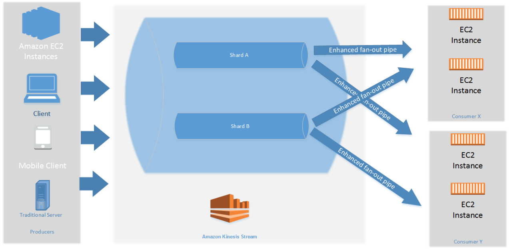

Veriyi by default 24 saat tutar ve bu süre en fazla 7 gün olabilir. Süre artışına paralel olarak maaliyet de artacaktır. Veriyi yeniden process etme yeteneği vardır. Veri bir kere işlendikten sonra silinemez. Aynı veri tekrar tekrar okunabilir. Data, retention periyoduna bağlı olarak silinecektir ve bu nedenle birden fazla uygulama aynı anda veriyi consume edebilir. Data bir kere Kinesis’e insert edildiği zaman, silinemez. **Immutability**, append only stream.

#### Kinesis Streams Shards

Bir stream bir çok farklı shard’dan oluşur. Shard başına ücretlendirme yapılır ve istenildiği kadar shard talep edilebilir. Shard sayısı zamanla geliştirilebilir. (Re-shard veya merge yapılabilir) Genel olarak kayıtlar global olarak değil, shard başına sıralanacaktır ve bu sıralama teslim alınma sürelerine göre olacaktır.

**Data Blob:** Veri en fazla 1 mb olabilir ve herhangi bir veri tipini temsil edebilir.

**Record Key:** Kayıtların shard’lar olarak gruplanmasını sağlar. Same key = Same shard
Olası hot partition sorununu önlemek için, distributed key kullanılmalıdır. Bu key ile Kinesis shard’lara erişilebiliyor ve bu sayede verileri gönderebiliyor.

**Sequence Number:** Veriler unique bir identifier ile shard’lara konulur.

**Limitleri:** Producer shard başına saniyede sadece 1 mb veya 1000 mesaj yazabilir. Bu limit aşılırsa, **ProvisionedThroughputException** hatası alınır.

İki tip consumer vardır.

**Consumer Classic:**
Bütün consumer’larda, 2mb/s shard başı okuma
Bütün consumer’larda, shard başına 5 API call

**Consumer Enhanced Fan-Out:**
Bütün consumer’larda, shard başına, enhanced consumer başına 2mb/s okuma

Push model olduğundan, API call gerekmiyor.

Data retention default 24 saat ve max 7 güne kadar arttırılabilir.

### Kinesis Producers

**Kinesis SDK:** SDK (Software Development Kit) kod yazılmasını veya CLI kullanarak datayı direk Amazon Kinesis Stream’e gönderilmesini sağlar. Genel olarak, bir SDK bir uygulama içinde belirli bir modül oluşturmak için ihtiyaç duyulan her şeyden oluşur ve kütüphaneler, araçlar, örnek kod, ilgili belgeler ve çoğu zaman API’ler içerebilir.

**Kinesis Producer Library (KPL):** SDK oranla daha iyi kod yazılabilir ve ek yetenekleri sayesinde enhanced throughput alınmasını sağlar.

**Kinesis Agent:** Server üzerinde çalışır ve log dosyası alınmasını ve bunu Amazon Kinesis Stream’e atılmasını sağlar.

Kinesis Stream’e data göndermek için; Apache Spark, Nifi, Kafka connect gibi 3rd party uygulamalar da kullanılabilir.

#### Kinesis Producer SDK

API’lar bir kayıt (PutRecord) veya birden fazla kayıt (PutRecords) için kullanılabilir. PutRecords batch işlemler için kullanılır, daha az http request yapılmasını sağlar ve throughput arttırır. Producer SDK; Android veya IOS mobile cihazlar gibi çeşitli servisler için kullanılabilir. 

Düşük throughput, yüksek latency, simple API ve AWS Lambda gibi use case’lerde kullanılabilir.

ProvisionedThroughputExceeded hatası alınırsa, herhangi bir shard için TPS veya mb/s limiti aşılmış demektir. Hatanın önlenmesi için Hot Shard olmaması sağlanmalıdır. Örneğin, key olarak device_id ise ve datanın %90’ı aynı device_id’ye ait ise, bu durumda datanın %90’ı aynı partition’da olacaktır ve o partition’daki yoğunluk bu hatanın alınmasına neden olabilecektir.

Hot Shard olmamasına rağmen hata alınıyorsa, işlem tekrar denenebilir veya shard sayısı arttırılabilir.

#### Kinesis Producer Library

* Kullanımı kolaydır, C++ ve Java library'leri ile yapılandırılabilir. 
* Yüksek performans ihtiyacı olan uzun süreli kullanımlar için uygundur .
* Retry mekanizması yani işin tekrar çalıştırılabilme kabiliyeti bulunmaktadır.
* Synchronous ve asynchronous API olmak üzere iki tiptir. Daha yüksek performans isteniyorsa, asynchronous tercih edilebilir. 
* Kinesis Data Stream'e asynchronous olarak data gönderilmekten bahsediliyorsa, genellikle bunu yapmanın yolu KPL olacaktır.
* CloudWatch'a monitoring için metric gönderebilecek yeteneğe de sahiptir.
* KPL ile uygulama yazıldığında, direk olarak CloudWatch'dan monitor edilebilir.
* Throughput arttırmak ve maaliyet'i düşürmeye yarayacak olan batch işlemleri desteklemektedir.

Batch işlemler kendi içinde ikiye ayrılır.

**Collect:** Aynı PutRecords API call ile birden fazla shard'a yazılır.

**Aggregate:** Verimliliği ve latency'i arttırır. Bir kayıt içerisinde birden fazla kaydı tutabilir (Saniyede 1000 kaydın üzerine çıkabilir). Max 1mb/s olacak şekilde throughput arttırır.

> KPL compression desteklemektedir ancak bunun kullanıcı tarafından yapılması gerekmektedir.

KPL kayıtları, KCL ile ve özel yardımcı library'ler ile de-coded edilmelidir.

##### Kinesis Producer Library (KPL) Batching


KPL ile aggregation ve collection yapabiliriz.
Şekilde görünen 7 kayıt sadece 2 kayıt şeklinde gönderilebilir.

KPL ile kayıt geldikten sonra bir süre bekler ve max 1mb olacak şekilde tek bir kayıt oluşturur. Bekleme süresi **RecordMaxBufferedTime** parametresine göre belirlenir ve default 100ms'dir.
Bu süre bir miktar gecikme oluşturur ancak verimliliği ciddi oranda arttırmaktadır.

##### Kinesis Agent

Log dosyalarını monitor eder ve bunları Kinesis Data Stream'e gönderir.
Java-based bir agent'dır ve sadece linux-based server'larda kurulabilir.

### Kinesis Consumers


Kinesis Data Stream'den veri okumak için SDK veya CLI kullanabiliriz. KPL ile üretebiliriz ve KCL ile okuyabiliriz. Apache Spark consumer olarak Kinesis Data Stream'den okuma yapabilir. Kayıtlar consumerlar tarafından bir shard'dan toplanır. Her shard toplamda 2mb throughput'a sahiptir.


GetRecord en fazla 10mb veya 10000 kayıt data döndürebilir. Her shard 2mb throughput'a sahip olduğundan ve yukarıdaki senaryoda 3 consumer’da aynı shard’dan okuma yaptığından dolayı, bu gibi bir senaryo 5 saniye sürecektir.

Saniyede shard başına max 5 GetRecords API call yapılabilir. Bu durumda da 200ms latency olacaktır. 5 Consumer application aynı shard'ı kullanırsa, bütün consumerlar saniyede 1 poll yapabileceği ve 400Kb/s daha az bir verim alacağı anlamına gelir. Ne kadar consumer olursa, consumer başına sahip olunacak throughput daha az olur. Bir yerine 3 tane consumer'a sahip olursak, hepsi aynı 2mb/s limitini ve saniyede 5 GetRecords API call limitini kullanacaklardır.

**Örnek 1:** Klasik modda çalışan ve GetRecords() komutu ile aynı anda 1 tane shard'dan consume işi yapan 10 consumer uygulaması olsun. Her consumer uygulaması için ortalama latency‘si ne olacaktır?

Saniyede en fazla 5 GetRecords API call yapılabileceğinden, her consumer uygulaması için ortalama latency 2 saniye olacaktır.

**Örnek 2:** Enhanced fan out modda çalışan ve aynı anda 1 tane shard'dan consume işi yapan 10 consumer uygulaması olsun. Her uygulamaların, kayıtları consume ederken ortalama latency‘si ne olacaktır?

Enhanced fan out modda, ne kadar consumer olursa olsun, her consumer saniyede 2mb throughput'a sahip olur. Yani her consumer 2mb/s veri alır ve ortamala latency 70ms olur.

#### Kinesis Client Library

Java-based bir library'dir ama Golang, Python, Ruby, Node, .NET ile de kullanılabilir. KPL aggregation yapar ve KCL, KPL ile üretilen verilerin okunmasını sağlar.

KPL aggregation yapar. KCL de-aggregation yapar.


Tek bir grup içinde birden fazla consumer ile birden fazla shard paylaşabilir.

Checkpoint özelliği ile işlemin devam ettirilmesini sağlar. Bu sayede uygulamalardan birinde sorun olsa bile tekrar devam edebilir. KCL uygulamanın durumunu takip etmek için Amazon Kinesis Data Streams uygulamalarının **hepsi için ayrı DynamoDB tablosu kullanır.** DynamoDB ile etkileşimli, Kinesis Consuler Library (KCL) ile beraber kullanılabilecek checkpointing özelliği vardır. Bu sayede consumption ilerleyişi izlenebilir.


Stream edilen datanın hem process hem de raw hali saklanacağı zaman, veriyi yakalamak için Kinesis Stream ve analiz amaçlı işlemek için Spark Streaming kullanılabilir. Lambda fonksiyonu yardımı ile de, raw data S3 tarafında bulunan backed Firehose mesajları push edilebilir.

DynamoDB'nin bu vazifesi nedeni ile yeteri kadar WCU (Write Capacity Unit) veya RCU (Read Capacity Unit) olduğuna emin olunmalıdır veya On-Demand DynamoDB kullanılabilir. **Aksi halde KCL'de yavaşlamaya neden olacaktır.**

**Örnek:** KPL kullanarak, çeşitli producer'lardan ortamala 8mb/s ile 10 shard içeren Kinesis Stream'den veri alınınan bir yapı var ve yapı içerisinde bulunan kayıtlar KCL kullanarak consume ediliyor. CloudWatch metricleri ile verinin 2mb/s throughput'a sahip olduğunu ve uygulumada gecikme yaşandığı anlaşılıyor. Bu sorunun en muhtemel nedeni ne olabilir?

- [ ] Shard'ların biraz daha bölünmesi gerekmektedir.
- [ ] Hot partition durumu vardır.
- [ ] CloudWatch, aggregate için değil, ortalama throughput göstermektedir
- [x] DynamoDB tablosu ihtiyacı karşılayamamaktadır.

#### Kinesis Connector Library

Eski (2016) Java library'dir ve connector EC2'de olmak zorundadır. Data; S3, DynamoDB, Redshift ve ElasticSearch'e yazılır.

Kinesis Firehose ve Lambda Kinesis Connector Library'nin kullanım alanlarının bir çoğunu almıştır.

**AWS Lambda,** Kinesis'den kayıt okuyabilir. Lambda consumer küçük bir library'e sahiptir ve KPL'den yapılacak de-aggregation için çok uygundur.

Lightweight ETL için de kullanılabilir. Programlaması yapıldığı sürece Amazon S3, DynamoDB, Redshift, ElasticSearch veya istenilen herhangi bir yere data gönderilebilir. Ayrıca notification oluşturmak ve real time mail göndermek için de kullanılabilir.

### Enhanced Fan Out

KCL 2.0 ve Lambda ile çalışır.
Bütün consumer'lar, shard başına 2mb/s throughput sağlar. 20 consumera sahipsek, shard başına saniyede 40mb throughput alırız. Data http/2 üzerinden consumerlara gönderilir ve ortalama 70 ms latency sağlar.

**Standart Consumer ve Enhanced Fan-Out Consumer Farkı:**

**Standart Consumer;**
* Az sayıda consumer uygulaması
* 200 ms latency ve düşük maaliyet

**Enhanced Fan-Out Consumer;**
* Aynı stream için birden fazla consumer uygulaması
* 70 ms latency ve daha yüksek maaliyet

https://aws.amazon.com/kinesis/data-streams/pricing/?nc1=h_ls

Default her Data Stream için enhanced fan-out kullanacak 5 consumer limiti vardir.

### Kinesis Scaling

Shard Splitting olarak geçer.

Stream kapasitesinin arttırılması için kullanılır. (Her Shard için 1 mb/s data) Hot Shard'ın bölünmesi için de kullanılabilir.

**Çalışma şekli:** Eski shard kapanır ve eski shard data expire olana kadar kalır ve data expire olunca gider.


Sekild görünen Shard 2 Hot Shard olsun ve bunu Shard 4 ve Shard 5 olmak üzere 2'ye split edelim. Bu durumda Shard 2'de bulunan data expire olana kadar kalır ve data expire olunca Shard 4 ve Shard 5 olarak devam eder. Bu şekilde throughput artışı da sağlamış oluruz.

Bu işlemin tersi de yapılabilir yani 2 shard'ı tek bir shard ile merge edebiliriz ve bu şekilde maaliyet kazancı sağlamış oluruz.
Split operasyonunda olduğu gibi burada da, eski shardlar içerisindeki data expire olunca kapanacaktır.

Kinesis Auto Scaling Manual müdahale ile yapılmaktadır. UpdateShardCount API işlemi ile yapılır. Auto scaling işini AWS Lambda ile gerçekleştirebiliriz.


Re-sharding işi paralel olarak yapılamaz. Öncesinde kapasite planlaması yapılması gerekmektedir.
Aynı anda sadece 1 tane resharding işi yapılabilir ve bu işin süresi shard sayısına göre değişir. 
Örnek olarak 1000 shard için 30.000 saniye yaklaşık 8.3 saat zaman gerekir. 
2000 shard için bu sürenin iki katı olacaktır.

**Limitleri:**

* 24 saat içerisinde bir stream için bir kere scale işi çalışabilir.
* Bir stream için mevcut shard sayısının iki katından fazla scale up işi yapılamaz.
* Bir stream için mevcut shard sayısının yarısından fazla scale down işi yapılamaz.
* Bir stream için 500 shard’dan fazla scale up işi yapılamaz.
* Scale up işi account limitinden daha fazla olamaz.

### Kinesis Security

* Authorization kısmı IAM policy tarafından yönetilir.
* In flight encryption https endpoint'ler ile yapılır.
* At rest encryption KMS ile yapılır.
* Client side encryption manual olarak implemente edilmelidir.
* VPC Endpoint, Kinesis'in VPC'ye erişmesi için kullanılabilir.

### Kinesis Data Firehose

Administration maaliyeti olmayan AWS tarafından fully managed bir servistir.
Kinesis Data Stream gibi real-time değildir.

**Near Real Time olarak data Kinesis Data Firehose'dan, sadece Redshift, Amazon S3, ElasticSearch ve Splunk'a gönderilebilir.**
Otomatik olacak scale olabilmektedir ve çok fazla sayıda veri formatını desteklemektedir.

S3 için JSON'dan, Parquest veya ORC'ye data conversion yapılabilir. AWS Lambda ile de, CSV'den JSON formatına data transformation yapılabilir.
Hedef Amazon S3 ise; gzip, zip ve snappy compression desteklenmektedir. Redshift ile sadece gzip data load edilebilir.

Sadece Firehose üzerinden giden veri için ücretlendirme yapılmaktadır.

Spark Streaming veya Kinesis Client Library, Kinesis Firehose'dan veri okuyamaz sadece Kinesis Data Stream'den veri okuyabilirler.

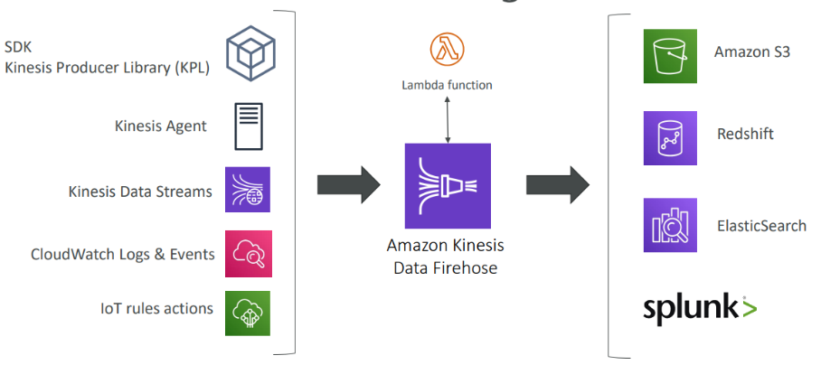

Diagram'da Kinesis Data Firehose'un yeri daha net görülmektedir. Data source olarak KPL, Kinesis Agent, Kinesis Data Stream (en sık kullanılandır), CloudWatch, IoT verileri gibi veri kaynakları olabilirken, data transformation için Lambda kullanılabilir. Lambda'nın buradaki görevi, datayı alarak transform etmesi ve sonrasında tekrar datayı Firehose'a göndermesidir. Transform olmuş data yukarıda bahsetildiği gibi sadece S3, Redshift, ElasticSearch veya Splunk'a gönderilir

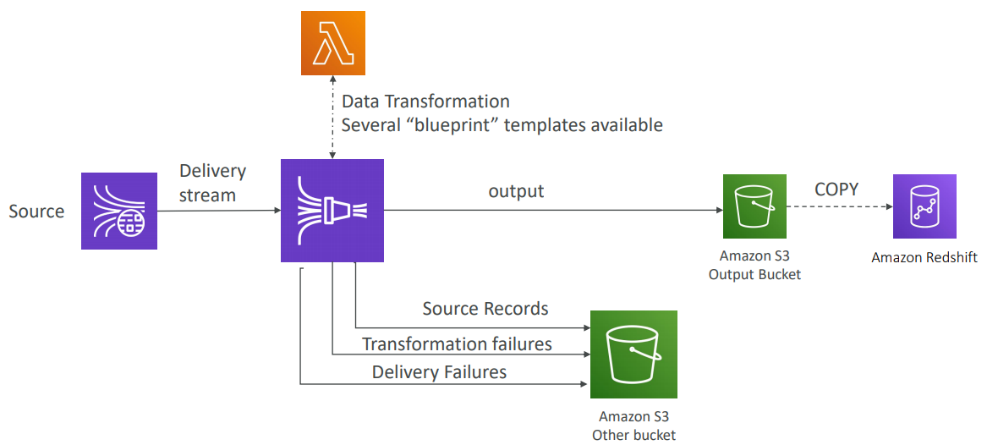

S3 aynı zamanda herhangi bir transformation veya delivery failure durumunda da kullanılabilir.

Yukarıdaki mimaride; source datası, transformation hatası veya hedefe datayı ulaştıramama durumunda, data output bucket'ından ayrı bir diğer bucket'a gönderilecektir

**Firehose Buffer Sizing**
Firehose kayıtları bir buffer'da biriktirir.

Bu buffer zaman veya size tanımına göre flush olur. Örnek olarak buffer size 32 mb ise, bu değere gelince flush olacaktır veya buffer time 2 dakika ise bu zamana erişince flush olacaktır. Firehose otomatik olarak throughput'u arttırmak için, buffer size'ı arttırabilir.

Firehose için minimum buffer time 1 dakikadır.

#### Kinesis Data-Streams vs Firehose

**Kinesis Data Streams:**

* Custom code yazılması gerekmektedir.
* Real-time olarak çalışır. (Classic için yaklaşık 200ms latency ve enhanced fan-out için yaklaşık 70ms latency oluşur.)
* Scaling (shard splitting/merging) işi manage edilmelidir.
* Data 1 ile 7 gün arasında muhafaza edilir.
* Replay yeteneği ve multi consumer seçeneği vardır.
* AWS Lambda kullanılarak, Real-Time data insert edilebilir. 
    * Örnek: ElasticSearch

**Kinesis Firehose:**

* Fully managed'dır.
* Data S3, Splunk, Redshift ve ElasticSearch'e gönderilir.
* Near Real-Time'dır.
* Otomatik scale olabilmektedir.
* Data storage özelliği yoktur.

## AWS SQS

En eski AWS servislerinden biridir ve AWS tarafından fully managedır.

* Saniyede 1 mesajdan, 10.000'e kadar çıkabilir.
* Default olarak retention 4 gündür ve bu süre 14 güne kadar çıkabilir.
* Que'da olabilecek mesaj sayısı için sınır bulunmaktadır.
* Publish ve receive için 10ms altında bir lateny sağlar.
* Consumer sayısına göre  yatay olarak ölçeklenebilir.
* Mesajlar en az bir kere teslim edilir ve duplicate mesaj da olabilir.
* Best-effort ordering de, bozuk mesajlar olabilir.
* Gönderilen mesajlarda mesaj başına 256kb sınır bulunmaktadır.

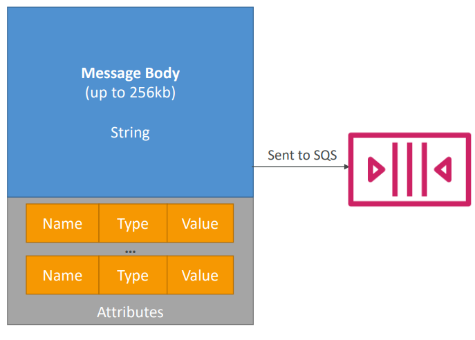

Consumerlar aynı anda 10 mesaja kadar alabilirler.
Bu mesajlar visibility timeout parametresi içerisinde process edilir. Mesajlar process edildikten sonra, message_id kullanılarak, bu mesajlar que'dan silinir.

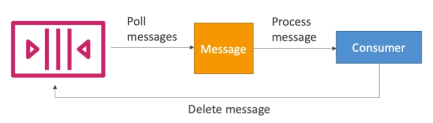

SQS olduğu zaman, consumerlar poll messages işini yapacak, consumerlar bu mesajları process edeceklerdir ve bir daha process edilmemesi için ardından SQS que'dan sileceklerdir.

Bu şekilde mesajlar farklı consumer uygulamaları tarafından process edilmemiş olacaklardır. Bu özellik SQS ve Kinesis arasındaki en büyük farklardan birisidir.

### SQS Fifo Queue

SQS ilk olarak standart queue ile çıktı ve şu anda Fifo Queue olarak da hizmet sağlamaktadır. Açılım First In First Out'dur ve bütün regionlarda bulunmamaktadır.
Queue adımının sonu .fifo ile bitmelidir.

Daha düşük throughput sunmaktadır ve batching ile saniye 3000 ve batch olmayan işlemler için saniyede 300 throughput sağlamaktadır.
Mesajlar sırayla işlenir ve sadece 1 kere gönderilir. Duplication ID kullanılarak 5 dakikalık aralıklarla veri tekilleştirme sağlanılabilir.

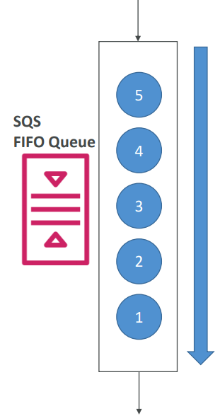

Mesajlar 1,2,3,4,5 sırası ile gönderilmiş ise, consumerlar tarafından yine aynı sırada okunacaklardır.

SQS ile 256 kb üzerinde mesaj gönderilmesi tavsiye edilmez ama ihtiyaç ısrarla bu yönde ise, bir java library'si olan SQS extended Client ile sağlanır.


Bunun için Amazon S3 kullanılır ve diyelimki 5 mb veya 10 mb mesaj göndermek isteyelim. Yukarıdaki gibi büyük mesajlar producer tarafından direk S3'e gönderilir ve bu mesajlar yine direk S3'den direk alınır.

Asynchronously olarak işlenen ödeme servisleri gibi decouple uygulamalar, voting uygulamaları gibi database'e yazılan buffer yazmaları, e-mail gönderimi gibi büyük mesaj load işlemleri gibi use case'ler için uygundur.

SQS CloudWatch üzerinden Auto Scale olarak entegre edilebilir.

#### SQS Limitleri

* Consumerlar tarafından maksimum 120.000 in-flight mesaj process edilebilir.
* Batch requestler en fazla 10 mesaj ve 256kb olabilir.
* Mesaj formatı; XML, JSON veya formatı belirsiz text olabilir.
* Standart que’da sınırsız TPS vardır.
* FIFO queue saniyede en fazla 3000 mesaj destekler.
* Max mesaj size'ı extended client kullanılmadığı taktirde 256 kb'dır.
* Data retention 1 dakika ve 14 gün arasındadır.
* Yapılan API request ve network kullanımı üzerinden ücretlendirilir.

### SQS Security

* Https ile in-flight encryption sağlanır.
* KMS ile server side encryption yapılabilir.
    * CMK (Customer Master Key) kullanılabilir.
    * SSE ile sadece mesajın body'si encrypt edilir. Message_ID, timestamp, attributes kısımları gibi metadata bölümü encrypt edilmez.
* IAM policy SQS kullanımına izin vermelidir.
* SQS queue access policy, IP üzerinden kontrol ve requestlerin geldiği süre boyunca kontrol yapılabilir.

### Kinesis vs SQS

Ne zaman SQS ve ne zaman Kinesis Data Stream kullanılmalıdır.

##### Kinesis Streams Data Stream

* Data birden fazla kez consume edilebilir.
* Data retention period sonrasında silinir.
* Kayıt sırası replay sırasında bile korunur.
* Birden fazla uygulamanın aynı stream'i okuması için dizayn edilmiştir. (Pub/Sub)
* Datayı process etmek ve sorgulamak için Spark veya MapReduce kullanılabilir.
* DynamoDB ile etkileşimli, Kinesis Consuler Library (KCL) ile beraber kullanılabilecek checkpointing özelliği vardır. Bu sayede consumption ilerleyişi izlenebilir.
* Shard kapasitesi, limite dayanmadan önce sağlanmalıdır.
* Max 1 mb mesaj size'ı vardır.

##### SQS

* Decouple yani ayrı uygulamalar için uygundur.
* Que başına bir tane uygulama olabilir.
* Consumption sonrası kayıtlar silinir.
* Mesajlar standart için sıradan bağımsız işlenir ve FIFO'da sıra ile işlenir.
* "Delay" message özelliği vardır.
* Dinamik olarak scale olabilir.
* Max 256 kb mesaj size'ı vardır.

Kinesis Data Stream | SQS
------------ | -------------
Data birden fazla kez consume edilebilir. | Data bir kez consume edilebilir.
Data retention period sonrasında silinir. | Data consumption sonrası silinir.
Kayıt sırası replay sırasında bile korunur. | Mesajlar standart için sıradan bağımsız işlenir ve FIFO'da sıra ile işlenir.
**Birden fazla uygulamanın aynı stream'i okuması için dizayn edilmiştir. (Pub/Sub)** | Decouple yani ayrı uygulamalar için uygundur ve que başına bir tane uygulama olabilir.
**Datayı process etmek ve sorgulamak için Spark veya MapReduce kullanılabilir.** |
DynamoDB ile etkileşimli, Kinesis Consuler Library (KCL) ile beraber kullanılabilecek checkpointing özelliği vardır. Bu sayede consumption ilerleyişi izlenebilir.  | "Delay" message özelliği vardır.
Shard kapasitesi, limite dayanmadan önce sağlanmalıdır.  | Dinamik olarak scale olabilir.
**Max 1 mb mesaj size'ı vardır.**  | Max 256 kb mesaj size'ı vardır.

Kinesis Data Stream, Data Firehose, SQS standart ve Fifo arasındaki fark aiağıdaki tabloda daha açık görünmektedir.


**Use cases:**

Kinesis Data Stream:

* Daha fazla BigData için uygundur.
* Event data collection ve processing
* Real-Time metric toplama ve raporlama
* Mobil veri yakalamak
* Real-Time data analizi
* Oyun veri akışı
* Karmaşık stream processing
* "Internet of Things" verileri

SQS:

* Order processing
* Image processing
* Mesaj yüküne göre auto scaling gerektiren yapılar.
* Database insert veya visual processing için buffer ve batch mesalar yapıları
* Offloading requestleri

## IoT (Internet of Things)


IoT, internet of things yani nesnelerin interneti anlamına gelir. Burada yer alan nesne her şey olabilir. Bisiklet, araba, lamba yani kısasacı istenilen her şeydir.


Burada yer alan nesne konfigüre edilir ve data bu nesnelerden alınır.

Nesne, AWS'de bulunan IoT Cloud'a, thing registry ile register olacak ve thing registry bir device ID verecek.

IoT nesnesinin Cloud ortamı ile iletişim kurması için device gateway kullanmaktadır. Device gateway AWS tarafından manage edilen bir servistir. 

Hava sıcaklığının 30 derece olduğu zaman rapor eden bir IoT yapısı olmuş olsun. 
Böyle bir yapıda IoT Message Broker'a SNS topic gibi bir mesaj gönderecektir ve bu mesaj bir çok farklı yere gönderilecektir.
IoT Rules Engine yardımı ile bu mesajları Kinesis, SQS, Lambda gibi hedeflere gönderilecektir. **Sensörlerden veri toplamak için IoT Rules Engine kullanılabilir ve cihazdan alınan veriler DynamoDB'ye aktarılabilir.**

Böyle bir yapıyı IoT Device Shadow adında bir servis ile de entegre edebiliriz. Bu servis kelimenin tam anlamıyla bağlı nesne/cihaz'ın gölgesi gibi çalışacaktır.

Termostat internete bağlı olmasa bile, Device Shadow ile cihazın durumu değiştirilebilir.

Örneğin, odanın sıcaklığı 25 derece olsun ve biz bunun 20 derece olmasını isteyelim.

T anı için termostatın internete bağlantısında bize bağlı olmayan bir sorun olsun ve biz mobil uygulamadan gönderdiğimiz Rest-API ile odanın sıcaklığını düşürmek isteyelim.

Bu durumda bizim gönderdiğimiz API, Device shadow'a gidecek ve device shadow artık odanın sıcaklığının 20 derece olması gerektiğini bilecek.
Asıl device'da yaşanan bağlantı sorunu ortadan kalktığı anda da, shadow device asıl device'a talebi iletecektir ve sıcaklığın düşürülmesi için süreç başlayacaktır.


Bir ampul için olabilecek basit mimarinin görseli de yukarıdaki gibi olacaktır.

Aşağıdaki linkte sadece 5 dakika olan bir tutorial izlenerek, bütün işleyişin nasıl olduğunu daha rahat anlaşılabilir.

https://us-west-1.console.aws.amazon.com/iot/home?region=us-west-1#/learnHub

### IoT Device Gateway

AWS'e bağlanan IoT cihazları için entry point görevi görür. Cihazların AWS'e güvenli ve verimli şekilde iletişim kurmasından sorumludur.

MQTT, WebSocket ve http 1.1 protokollerini destekler. AWS tarafından fully managed olan bu servis 1 milyardan fazla cihazı desteklemek için otomatik scale olmaktadır.

Örnek olarak nesne connected bisikletlerden olsun. Bisiklet, AWS ortamında yer alan Device Gateway'e MQTT mesajları göndererek, veri akışının güvenli şekilde yapılmasını sağlar.

**Rules Engine**
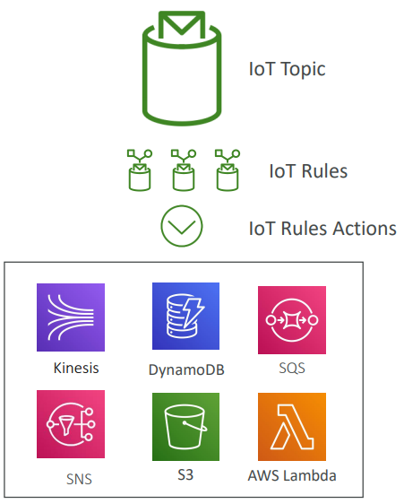

Kurallar MQTT topiclerinde tanımlanmaktadır.
**Rules:** Tetiklenecek iş
**Action:** Yapılmak istenen iş, şeklinde işler.

**Use cases:**

* Bir cihazdan alınan verilerin DynamoDB'ye yazılması
* S3'e dosya kaydedilmesi
* Kullanıcı gruplarına notification mesajlarının atılması
* Data extract etmek için Lambda fonksiyonun çağırılması
* Amazon Kinesis kullanarak, çok sayıda cihazdan gelen mesajların işlenmesi
* Amazon ElasticSearch'e data gönderilmesi
* CloudWatch metriklerinin yakalanması ve CloudWatch alarmının oluşturulması
* MQTT mesajındaki verileri Amazon Machine Learning makinesine göndererek, ML modeline dayalı tahminlerde bulunmak

Rules kısmının, action olabilmesi için de IAM rollerine ihtiyaç duyulmaktadır.

## DMS – Database Migration Service

Source veri tabanı migration sırasında aynı şekilde kullanılmaya devam edilebilir.

Aynı tip veri tabanlarından (Oracle to Oracle) birbirlerine ve farklı tip veri tabanlarından (Microsoft SQL Server to Aurora) birbirlerine migration desteklenir.

CDC (Captures Database Changes) kullanarak, data replikasyonu sağlanır. Replication tasklarının yapılmabilmesi için, EC2 instance'ı oluşturulması gerekmektedir.

### DMS Sources ve Target

**Sources**
On-Premise ve EC2 instance veri tabanları olabilir. 
Liste aşağıdaki gibidir;
*Oracle, MS SQL Server, MySQL, MariaDB, PostgreSQL, MongoDB, SAP, DB2*

Bunların dışında aşağıdaki Cloud veri tabanları da olabilir.
*Azure SQL Database, Amazon RDS (all including Aurora), Amazon S3*

**Targets**
On-Premise ve EC2 instance veri tabanları olabilir. 
Liste aşağıdaki gibidir;
*Oracle, MS SQL Server, MySQL, MariaDB, PostgreSQL, SAP*

Bunların dışında aşağıdaki Cloud veri tabanları da olabilir. 
*Amazon RDS, Amazon Redshift, Amazon DynamoDB, Amazon S3, ElasticSearch Service, Kinesis Data Streams, DocumentDB.*

Çalışma prensibi arka planda çalışan AWS Schema Coversion Tool (SCT) ile gerçekleşir. AWS SCT, AWS DMS endpoint ve task oluşturarak süreci işletir.

Database schema engine'i birinden bir diğerine convert olur. 

Örnek olarak, SQL Server veya Oracle gibi OLTP veri tabanları; MySQL, PostgreSQL, Aurora gibi veri tabanlarına convert edilir. Teradata veya Oracle gibi OLAP yapısına sahip olan veri tabanları Amazon Redshift gibi DWH ortamına migrate edilebilir.

## Direct Connect

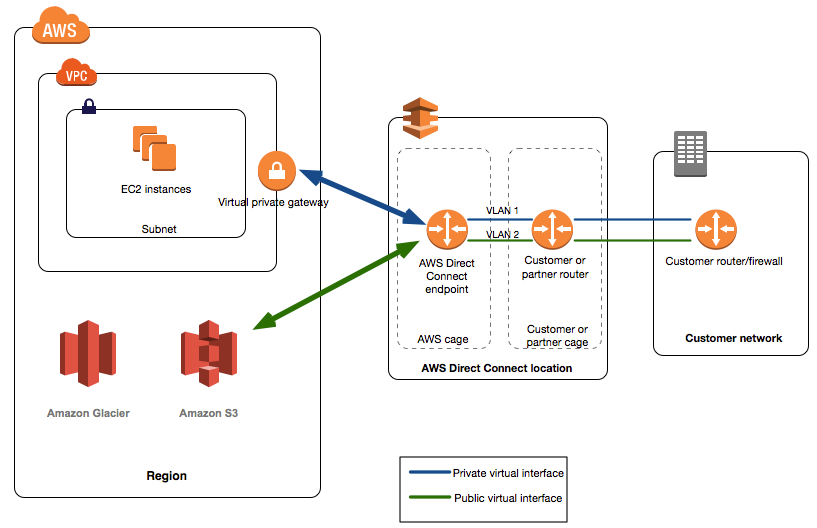

On-Premise network ve VPC arasında dedike kurulu private bir bağlantıdır. Birden fazla 1 gb/s veya 10 gb/s bağlantı kurulabilir. Bu şekilde bir bağlantı için VPC'de virtual private network kurulmalıdır. 

**Use Cases:**

* Büyük data setler ile çalışmak için, bandwidth throughput arttırılması
* Real-Time veri kullanan uygulamalar için consistent network ihtiyacı
* On-Premise ve Cloud ortamlarının beraber kullanıldığı, hybrid mimariler için
* Private connection ile daha gelişmiş güvenlik ihtiyacı için

IPv4 ve IPv6 desteği vardır.

**High-availability:** Failover için iki ayrı Data Center veya Site-to-Site VPN kullanılabilir.

Yukarıdaki diagramda görüldüğü gibi AWS Direct Connect endpoint ile hem Amazon Glacier veya S3 gibi public kaynaklara hem de private network'de olan EC2 instance'larına güvenli ve hızlı bağlantı kurulabilir.


Eğer direct connect bağlantısı aynı account'da bulunan farklı region'larda bulunan VPC'ler için isteniyorsa, Direct Connect Gateway kullanılmalıdır.

## Snowball

Tb veya Pb düzeyindeki verilerin, AWS içinde veya dışında taşımaya yardımcı olan fiziksek veri taşıma çözümüdür.

* Verilerin ağ üzerinden taşımaya alternatifidir ve daha hesaplı bir yöntemdir.
* 256 bit KMS encryption şifreleme ile güvenli bir taşıma sağlar.
* Taşıma takibi SNS veya text mesaj ile yapılır. 
* Data transfer işi başına ücretlendirilir.
* Büyük Cloud migration, DC taşınması ve disaster recovery durumlarında tercih edilebilir.
* **Bir veri taşıma network üzerinden 1 hafta veya daha uzun sürecek ise, snowball kullanmak hem daha hızlı hem de daha güvenli olacaktır.**

### Snowball Process


* AWS console'dan snowball device talebi girilir.
* Snowball client server'lara yüklenir.
* Snowball ve server birbirlerine bağlanır ve snowball client ile veriler server'dan snowball'a aktarılır.
* Cihaz geri gönderilir ve veriler S3 bucket'a yüklenir.
* Snowball tamamen temizlenir.
* Süreç takibi SNS, text mesajları ve AWS console'dan yapılır.

### Snowball Edge

Cihaza compute yeteneği ekler ve aynı zamanda storage (24 vcpu) ve compute (52v cpu & opsiyonel gpu) optimized'dır. 

* Hareket halinde de işlem yapılabilmesi için custom EC2 AMI desteği vardır.
* Lambda function desteği vardır.
* Data taşınırken datanın pre-process edilmesine olanak sağlar.
* Data migration, image karşılaştırma, IoT işleri ve machine learning için kullanımı uygundur.

### AWS Snowmobile


Exabytes yani 100 pb veri transferi sağlar.

Her Snowmobile 100 pb kapasiteye sahiptir ve paralel kullanım sağlamaktadır. **Eğer taşınacak veri 10 pb fazla ise, Snowball yerine Snowmobile tercih edilmelidir.**

## Storage

### AWS S3

Dosyaların yani objelerin bucketlara yani dizinlere konumlasını sağlar.


Bucketlar global olarak unique bir isme sahip olmaları gerekmektedir.
Bucketlar region seviyesinde tanımlanmaktadır ve isim standartları aşağıdaki gibi olmalıdır.

* Büyük karakter veya alt çizgi olmamalıdır.
* 3 ila 63 karakter uzunluğunda olabilir.
* Adında ip olmamalıdır.
* Adı küçük karakter veya rakam ile başlamamalıdır.

Objeler yani dosyalar bir key'e sahiptir. Buradan key full path'dir.
*<my_bucket>/my_file.txt*
*<my_bucket>/my_folder/another_folder/my_file.txt*

Bucketların içerisinde directory mantığı yoktur. Her ne kadar UI'da o şekilde görünse de, bu sadece görsel kolaylık için tasarlanmıştır.

Max size 5 tb'dır ve **eğer 5 gb'dan daha fazla upload yapılacak ise, "multi-part-upload" yapılmalıdır (must).** 100 mb üzeri data upload yapılacak ise de kullanılabilir ve yine avantajı görünecektir.

Metadata verileri, sistem veya kullanıcı metadata verileri olabilir. Tagler, security için kullanışlıdır. Versioning enable ise, Version ID bulunur.

### AWS S3 - Consistency Model

Iki tür consistency vardir.

**Strong (Immediate) Consistency**
* Farkli client'larin, farkli veri kopyasini okuyarak, ayni bilginin dönmesi durumudur.
* Herhangi bir storage node'da, herhangi bir update olmasi durumunda, veri client için available olmadan önce, değişim bütün storage node'larda olması saglanir.
* Transactional database ve real time sistemler icin uygundur.
* Scalability and Availability icin iyi degildir.

**Eventually Consistency**
* Farklı veri kopyasini ayni zamanda okumak farklı sonuçlara neden olabilir.
* Blocking mekanizması yoktur, veri obje olarak update edilirse ve o an başka node'dan okuma yapılırsa, aynı data gelmeyecektir. Zamanla update diğer node'larda da yapılacaktir ve okumalar eventually consistent olacaktır.
* Eventually consistency; scalability, availability, data durability sağlar bu nedenle cost storage'i düşürür ve bunlar object storage icin required'dir.

**Yeni gelen objeler(http put), immediate veya diğer adı ile strong consistency** (Read(get)-after-write(put)) ile S3 yazılmaktadir.
**http put,** update veya add olabilir
**http get,** read işlemidir.

**Mevcut bir obje üzerinde, update(http put) veya delete islemi yapiliyorsa, bu işlem eventually consistency olacaktır.**

### S3 Storage Tiers

S3'de, birden fazla storage katmanı vardır.

* Amazon S3 Standard - General Purpose
* Amazon S3 Standard-Infrequent Access (IA)
* Amazon S3 One Zone-Infrequent Access
* Amazon S3 Reduced Redundancy Storage (deprecated)
* Amazon S3 Intelligent Tiering (new!)
* Amazon Glacier

#### S3 Standard – General Purpose

* Multiple AZ'da objeler için high durability yani çok yüksek dayanıklılık 11-9s (% 99.999999999)
    * S3'de 10 milyon obje saklanıyorsa, 10.000 yılda bir kez obje kaybı gerçekleşir.
* Yılda % 99.99 availability
* 2 eşzamanlı AZ arızasına karşı veri koruması sağlar. Veri üç AZ'da yazılmadan, available olmaz

**Use Cases,** Big Data analytics, mobile ve oyun uygulamaları gibi.

#### S3 Reduced Redundancy Storage (RRS) - Deprecated (Kullanımdan kaldırıldı)

* %99.99 objeler için durability sağlayacak şekilde tasarlanmıştır.
* Yılda % 99.99 availability
* 1 AZ arızasına karşı veri koruması sağlar. Veri iki AZ birden yazılmadan, available olmaz

**Use Cases,** Kritik olmayan ve yeniden üretilebilecek çok kritik olmayan veriler için uygundur.

#### S3 Standard – Infrequent Access (IA)
* Daha az erişilen ama ihtiyaç halinde hızla ulaşılabilecek veriler için uygundur.
* Multiple AZ'da objeler için high durability yani çok yüksek dayanıklılık 11-9s (% 99.999999999)
* Yılda % 99.9 availability
* Amazon S3 standart'a göre daha hesaplıdır.
* 2 eşzamanlı AZ arızasına karşı veri koruması sağlar. Veri üç AZ'da yazılmadan, available olmaz

**Use Cases,** Disaster recovery ve backup verileri için uygundur.

#### S3 One Zone - Infrequent Access (IA)

* S3 Standard Infrequent Access ile aynıdır ancak burada veri bir tek AZ'da tutulur.
* Bir AZ'da objeler için high durability yani çok yüksek dayanıklılık 11-9s (% 99.999999999). AZ zarar görürse, data da zarar görür.
* Yılda %99.5 Availability
* Low latency ve high throughput sağlar.
* At transit ve at rest encryption sağlar.
* Standart IA oranla %20 daha uzuzdur.

**Use Cases,** İkinci backup kopyasını saklanmasına veya yeniden üretilebilecek önemsiz veriler için kullanılabilir.

#### S3 Intelligent Tiering (new!)

* S3 standart gibi düşük latency ve yüksek throughput sağlar.
* Düşük bir monitoring ve auto-tiering ücretlendirmesi vardır.
* Değişen erişim modellerine bağlı olarak objeleri iki erişim katmanı yani tier arasında otomatik olarak taşır.
* Multiple AZ'da objeler için high durability yani çok yüksek dayanıklılık 11-9s (% 99.999999999)
* Bütün AZ etkileyen olası etkilere karşı fazladan koruma sağlar.
* Yılda % 99.9 availability

#### S3 Glacier

* Arşiveleme ve yedekleme için uygundur.
* Datalar uzun süreli saklanmaktadır.
* On-Premise tape storage'a alternatiftir.
* Yıllık ortalama % 99.999999999 durability
* Ortalama olarak gb başına 0.004$ depolama maaliyeti vardır. Veriyi geri çağırma bu maaliyetin dışındadır.
* Glacier'da bulunan her item "Archive" olarak adlandırılır ve bir archive en fazla 40 tb olabilir.
* Archive'lar Vault adında yapılarda tutulur.
* 3 çeşit veriyi geri çağrıma seçeneği vardır;
    * Expedited, 1-5 dk arasında veriye ulaşılabilir ve Gb başına 0.03 dolar ve request başına 0.01 dolar olacak şekilde ücretlendirilir.
    * Standart, 3-5 saat arasında veriye ulaşılabilir ve Gb başına 0.01 dolar ve 1000 request başına 0.05 dolar olacak şekilde ücretlendirilir.
    * Bulk, 5-12 saat arasında veriye ulaşılabilir ve Gb başına 0.0025$ ve request başına 0.025 dolar olacak şekilde ücretlendirilir.


### S3 Lifecycle Rules

Objenin ne kadar süre belirli bir bucketda kalacaği, başka bir bucketa taşınacaği veya silineceği bilgisini tutar.
Bu şekilde tanımlanacak bir rule ile farklı tipte storage katmanlarına veri belirli sürelerde aktarılabilir ve maaliyet düşürülebilir.

**Örneğin:** General Purpose => Infrequent Access => Glacier

**Transition actions:** Bir objenin ne zaman başka bir storage class'a taşınacağını tanımlar. Örneğin, Data 7 ay General Purpose S3 storage sınıfında kaldıktan sonra Glacier'a alınması gibi.

**Expiration actions:** Belirlenen belli bir zamandan sonra objenin silinmesine yardımcı olur. Örneğin, Access loglar tanımlanan bellir bir zaman diliminden sonra silinebilir.

Glaciera data taşınması; backup, uzun süreli retention gibi ihtiyaçlar için kullanışlıdır.

Rule tanımlarken bir çok esnekliği sahip oluruz. Transition rule'da; mevcut versiyon mu yoksa bir önceki versiyonun mu taşınacağı expiration rule'da mevcut versiyon mu yoksa bir önceki versiyonun mu expire yani silineceği, ne zaman tamamen silineceği gibi bir çok tanım yapabiliriz.

### S3 Versioning

S3'de bulunan objeler üzerinde versioning yapılabilir ve bir objenin birden fazla versiyonu aynı anda tutulabilir.

Bu işlem bucket level'da konfigure edilir. Obje için kullanılan bir key vardır ve bu key version: 1, 2, 3 olarak incremental olarak artış gösterir.

İstenmeden yapılan silmeler ve roll back gerektiren işler için tasarlanmıştır.
Bucket versioning enable edildikten sonra, suspend duruma alinabilir ama disable edilemez.

Feature bütün bucket içindir ve obje seviyesinde yapilamaz.
Bucket versioning enable edildikten sonra, yeni gelecek objeler ve update olan objeler korunacaktir.

Update anlamı; objeler üzerinde uygulanacak http(put, post, copy ve delete) işlemleridir.

By default, http get komutu en son versiyonu getirecektir.

Versioning enable edilmeden önce bucket'a aktarılan objelerin version ID, null olarak görünür.

Versioning enable olduktan sonra suspend edilirse, mevcut objeler versiyonu "as is" yani olduğu gibi kalir.

* Bu objeler bundan sonra update edilemez ve yeni gelenlerin versiyon ID'si de null olacaktir.
* Yeni gelenlerin ID'si null olduğundan, bu objelerin yeni versiyonlari bir öncekini ezecektir ama enable halindeyken gelen objeler etkilenmeyecektir.

### S3 Cross Region Replication

Hem source'da hem de destination'da versioning enable edilmesi gerekmektedir.

* Bucketlar farklı AWS regionlarında olmalıdır.
* Farklı account'lara ait bucket'lar olabilir.
* Asynchronous olarak kopyalama yapılır.
* S3'e gereli IAM yetkilerinin verilmesi gerekmektedir.

**Use cases:** Başka bir region'da bulunan bir uygulama var ise bu uygulamanın düşük latency ile dataya erişimi sağlanabilir, accountlar arası replication yapılma istenirse kullanılabilir.

### S3 – ETag (Entity Tag)

Bir dosyanın zaten S3'e upload edildiğini nasıl teyit ederiz?

İsim ile kontrol etmek işe yarayabilir ama dosyanın aynı dosya olduğundan emin olamayabiliriz. Bu gibi bir durum için AWS ETag kullanılabilir.

S3'de bulunan her objenin kendine ait bir ETag'i vardır.

5 gb ve daha düşük dosyalar için MD5 hash ile bu kontrol yapılırken multi-part upload için algoritma daha karmaşıktır ve şu an için bunun bilinmesine gerek yoktur.

ETag kullanarak dosyanın doğruluğundan emin olabiliriz.

### S3 Performance

S3'de 100 TPS (transaction per second) ulaşıldığı zaman, S3 performansı düşebilir.

S3'e her obje upload edildiği zaman, bu objeler S3 partition'a gideceklerdir. Ve en iyi performansı alabilmek için objelerin olabildiği kadar çok partition'a dağılması gerekmektedir.

Bunun için de, perfomansı optimize etmek için, bucket'da tanımlanacak key adlarının önüne random karakter tanımlanması önerilir.

**Örnek:**
*<my_bucket>/5r4d_my_folder/my_file1.txt*
*<my_bucket>/a91e_my_folder/my_file1.txt*

Yukarıdaki örneklerde 5r4d ve a91e random karakterler objelerin farklı partitionlara dağılmasını sağlayacaklardır.

Prefix key olarak tarih kullanılması kesinlikle tavsiye edilmez. Tarih birden fazla kez kullanılabilir ve bu da benzerlik oluşuracağından, performans kaybına neden olabilir.

<my_bucket>/11_08_2019_my_folder/my_file1.txt
<my_bucket>/11_08_2019_my_folder/my_file2.txt

5gb ve daha büyük objeler için multi-part-upload yapılmalıdır.

* Put işlemlerini paralel olarak yapılmasını sağlar.
* Network bandwidth max çıkarır.
* Hata alabilecek ve yeniden denenmesi gereken upload işlemleri için tekrar süresini kısaltır.

CloudFront kullanarak, S3 objelerin cache alınması ve farklı regionlardan yapılacak okuma taleplerinin hızlanması sağlanabilir.

Edge location kullanarak, S3 transfer acceleration yapılabilir. 
Kodda değişiklik yapılmasına gerek olmadan, sadece endpoint değişikliği ile bu iyileştirme yapılabilir.

SSE-KMS encryption kullanılıyor ise, bu kullanım için sınırlı olabilir.
Örneğin, belirli bir account için KMS servisinin çağırılmasında saniyede 1000 download veya upload limiti olabilir.

Amazon S3 Transfer Acceleration: Client ve S3 bucket arasında uzun mesafede hızlı, kolay ve güvenli biçimde dosya aktarımı sağlar. Transfer acceleration özelliği, Amazon CloudFront'un global distribute edge lokasyonlarını kullanır.

### S3 Encryption

S3'de bulunan objeler için 4 farklı encryption bulunmaktadır.

**SSE-S3:** S3 managed encryption key ile AWS tarafından yönetilen server side encryption metodudur.
**SSE-KMS:** AWS KMS key kullanılarak uygulanan server side encryption metodudur.
**SSE-C:** Client tarafından sağlanan key ile server side encryption metodudur.

**SSE-S3:**

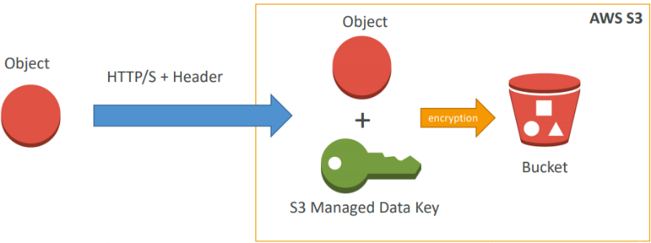

AES-256 bit encryption. Header ile kullanmak mecburidir.
“x-amz-server-side-encryption": "AES256"

**SSE-KMS:**

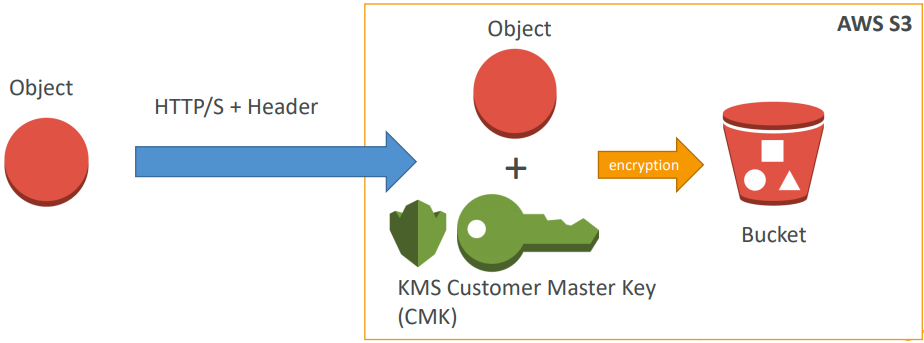

Avantajları: Kullanıcı konrolü ve audit trail header ile kullanmak mecburidir.
x-amz-server-side-encryption": ”aws:kms"
Customer master key kullanarak encryption yapar.

Default CMK key kullanılabilir veya ayrıca oluşturulan CMK key kullanılabilir.

Bu servis ücretlidir. 

**SSE-C:**


Client tarafından sağlanan key ile server side encryption
Amazon S3 encryption key'i muhafaza etmez. Key müşteri tarafından yönetilir, key kaybedilirse, veriye erişim imkansız olur.
* Https kullanılması mecburidir
* Yapılan her http requesti için encryption key http header'ında verilmelidir.

#### Client Side Encryption


Data S3'e gönderilmeden önce müşteri tarafından şifrelenmelidir ve S3'den alınırken, veriler müşteri tarafından decrypt edilmelidir.
Encryption key ve bu cycle tamamen müşteri tarafından yönetilir.

**Encryption in transit (SSL):**

İstenilen endpoint kullanılabilir ama https kullanılması tavsiye edilir.
SSE-C için https mecburidir. Encryption in fligt SSL/TLS olarak da tanımlanabilir.

### S3 – Security

### S3 Access Logs

Audit için kullanılınır.
S3 bucketlara olan bütün erişimlerin loglanmasını sağlar. Başka bir accountdan yapılan bütün başarılı ve başarısız taleplerin loglanması sağlanır.

Buradan alınan data, Kinesis Analytics toollar veya Amazon Athena ile analiz edilebilir.

**User based**
**IAM policies:** Belirli bir kullanıcı için izin verilecek API call'ları belirlenmesini sağlar.

**Resource Based**
**Bucket Policies:** S3 console'dan, bucket seviyesinde tanımlanacak kurallardır. Cross account erişimleri bu policyler ile sağlanır.

**S3 Bucket Policies**
JSON based policies

**Resources:** bucket veya obje adı
**Actions:** izin verilecek veya reddedilecek API kümesi
**Effect:** Allow/Deny
**Principal:** Kuralın uygulanacağı hesap veya kullanıcı adı

**S3 bucket policy:** Bucket'a public erişim verilmesi, upload sırasında objelerin encrypt edilmesine zorlanması, başka bir account'a ait kullanıcıya yetki verme gibi işlemler için kullanılır.

#### S3 Default Encryption vs Bucket Policies


Default encryption aktif hale getirmenin eski yolu bucket policy idi ve belirli bir header'a sahip olmayan bütün http komutlarının reddedilmesini temel alırdı.

Yeni yöntem ise, S3 için default encryption kullanılmasıdır.

Bucket policyler, default encryption önce değerlendirilir yani sıralamada önceliği vardır.

**Networking:** VPC endpoint desteği vardır.

**Logging ve Audit:** S3 access logları başka bir S3 bucket içerisinde tutulur.

**User Security:**

* **MFA:** (Multi Factor Authentication), objelerin silinmesi için ek güvenlik olarak kullanılabilir.
* **Signed URLs:** URL'ler sadece belirli süre aktif olarak kalmaktadır.

#### Glacier Vault Policies & Vault Lock

Vault bir archive collection'dır. Her vault bir tane vault access policy ve bir tane vault lock policy sahiptir.

* Vault policyler JSON dosyasına yazılır.
* Vault access policy, bucket policy benzerdir. (restrict user/account permission)
* Vault lock policy, yasal düzenleme ve uyumluluk gereksinimleri için uygulanan bir politikadır.
    * Policy değiştirilemez, immutable'dır. Bu neden ile lock olarak adlandırılır.
    * **Örnek 1:** 1 yaşından küçük ise, arşiv silmeyi yasakla
    * **Örnek 2:** Worm politikası uygulansın. (Bir kere yazılsın ama bir çok kez okunsun)

**Not:** *** Gzip, 1 GB'den daha büyük dosyalar için uygun bir sıkıştırma yöntemi değildir. 1gb büyük dosyalar için bzip2 gibi splitting desteği olan compression ile veya Snappy gibi daha yüksek sıkıştırma oranına sahip tekniklerle yapılmalıdır.

### S3 CORS (Cross-Origin Resource Sharing)

Client web application'ın başka bir domain'den resource request etmesidir.

Eğer başka bir websitesinden data talep edilecek ise, CORS enable edilmelidir.
Cross Origin Resource Sharing, dosya paylaşımın sınırlanmasını sağlar ve böylece maaliyetin düşürülmesine de faydası olur.

## DynamoDB

AWS tarafından fully managed olan ve 3 ayrı AZ'da high available olarak hizmet veren NoSQL bir veri tabanıdır.

* Büyük iş yüklerini ölçekleyebilen distribute veri tabanıdır.
* Saniyede milyonlarca request'i karşılayabilir, trilyonlarca satır ve yüzlerce tb veri saklayabilir.
* Hızlı ve tutarlı performans gösterir. 
* IAM ile entegre çalışarak, güvenli bir ortam sağlar.
* DynamoDB Streams ile event odaklı programlama sağlar.
* Düşük maaliyetli ve auto scaling yeteneği vardır.

##### DynamoDB Basics

DynamoDB tablolardan yapılır. Bütün tablolar kendi primary key'lerine sahiptir ve tablo oluşturma sırasında bunu tanımlamak mecburidir.

* Her tabloda sınırsız sayıda item yani satır olabilir.
* Her item attributes'a sahiptir. Attributes'lar zamanla da eklenebilir boşta bırakılabilir.
* Item'ın max size'ı 400 kb'dır.

**Desteklenen veri tipleri:**
* **Scalar Types:** String, Number, Binary, Boolean, Null
* **Document Types:** List, Map
* **Set Types:** String Set, Number Set, Binary Set

### DynamoDB – Primary Keys

**Opsiyon 1:** Partition key only (Hash)

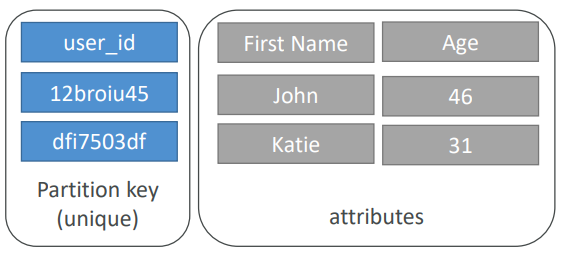

* Partition key her item için unique olmalıdır.
* Partition key datanın distribute olması için farklı olmalıdır.

**Örneğin,** users tablosu için user_id

**Opsiyon 2:** Partition key + Sort key

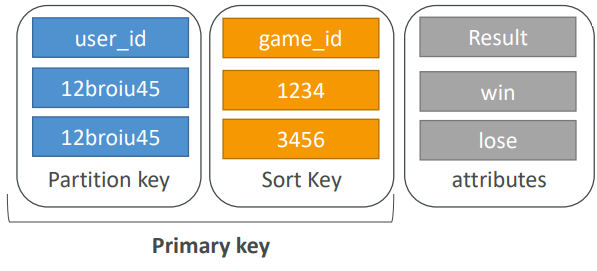

Opsiyon unique olmalıdır.
Data partition key'e göre gruplandırılır.
**Sort key == range key**
**Örneğin** users - games table
* partition key için user_id ve sort key için game_id

Filmlerin olduğu bir veri tabanımız olsa, data distribution'ın en fazla olabilmesi için partition key'ler, movie_id, producer_name, leader_actor_name, movie_language gibi keyler olabilir.

Bunların arasında movie_id'nin cardinality'si bir hayli yüksek olduğundan doğru bir seçim olabilir. 

Movie_language çok doğru bir tercih olmaz zira en fazla film dili ingilizce olacaktır.

**Örnek:***** AutoScale olabilen bir DynamoDB her gün belli saatlerde scale up olduğunu ve buna rağmen müşterilerden bir tanesi uygulamanın database kaynaklı belli süre çok yavaş çalıştığını rapor etmiş olsun.

Tablonun PK kolonu company ID üzerinde olmuş olsun. Bu gibi bir durumda 

**Sorun ve çözüm;**
Belli bir müşteri bu problemi yaşadığından ve PK kolonun company ID olması nedeni ile sorunun hot key sorunu olduğunu söyleyebiliriz.

Bu gibi bir durumda Data Pipeline ile data başka bir DynamoDB tablosuna başka bir PK ile migrate edilebilir ve bu şekilde datanın eşit olarak distribute edilmesi sağlanabilr.

#### DynamoDB in Big Data

En fazla kullanılan alanlar aşağıdaki gibidir;

* Mobil uygulamalar
* Oyunlar
* Digital reklam sunumu
* Canlı oylama
* Canlı etkinlikler için kitle etkileşimi
* Sensor trafiği
* Log ingestion
* Web-based içerikler için erişim kontrolü
* Amazon S3 objeleri için metadata storage alanı
* E-ticaret alışveriş
* Web session yönetimi

Aşağıdaki alanlar için uygun değildir.
* Tekrar yazılma gereksinini olan uygulamalar.
    * Bunlar RDS için daha uygundur.
* Join ve kompleks transactionlar
* BLOB yani binary large objeler.
    * Bu tip objelerin store edilmesi için S3 için daha uygundur ama metadata yönetimi DynamoDB'ye verilebilir.
* Düşük I/O oranına sahip büyük veriler. S3 için uygundur

### DynamoDB RCU & WCU

#### DynamoDB – Provisioned Throughput

Tablo read ve write capacity unit'sa sahip olmalıdır.
* **Read Capacity Units (RCU):** okuma için throughput
* **Write Capacity Units (WCU):** yazma için throughput
* Throughput talebini karşılamak için auto-scaling opsiyonu kullanılabilir.
* Throughput geçici olarak **burst credit** özelliği ile de aşılabilir.
    * Burst credit boş ise, **ProvisionedThroughputException** hatası alınacaktır ve bu durumda exponential backoff denenebilir.

**Burst Capacity:** DynamoDB burst capacity sağlayarak, partition başına throughput veriminde esneklik sağlar.

Bir partition throughput tam olarak kullanılmadığında, DynamoDB kullanılmayan kapasitenin bir kısmını daha sonraki ani artışlarla başa çıkmak için saklı tutar. DynamoDB ayrılan bu burst capacity'i background maintenance ve diğer işler için de otomatik kullanabilir.

#### DynamoDB – Write Capacity Units***

Bir write capacity, saniyede 1 kb boyutunca bir öğe için yazmayı temsil eder. Item 1kb'dan büyük ise, daha fazla capacity gerekir.

**Örnek 1:** Saniyede her biri 2 kb olan 10 obje yazmış olalım. 2x10 = 20 WCU gerekli olacaktır.
**Örnek 2:** Saniyede her biri 4.5 kb olan 6 obje yazmış olalım. 6x5 = 30 WCU gerekli olacaktır. Her obje tek başına 5 WCU ihtiyaç duyacaktır.
**Örnek 3:** Dakikada her biri 2 kb olan 120 obje yazmış olalım. 120/60x2 = 4 WCU gerekli olacaktır.

#### Strongly Consistent Read vs Eventually Consistent Read

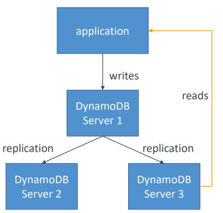

Yukarıdaki diagramda yer alan application okumayı DynamoDB Server 1'den de yapabilir, 3'den de yapabilir. Data 1'e yazılmış olsun ve henüz replikasyon tamamlanmamış olsun.

Bu durumda Eventually Consistent Read yapılıyor ise, 1'den yapılacak okuma ve 3'den yapılacak okumanın sonuçları farklı olacaktır.

**Eventually Consistent Read:** Eğer yazma işleminden hemen sonra okuma yapılacak ise, replikasyondan dolayı beklenmeyen bir cevap alabiliriz.

**Strong Consistent Read:** Eğer yazma işleminden hemen sonra okuma yaparsak, doğru sonucu görürüz.

By default, DynamoDB Eventually Consistent Reads kullanır ancak GetItem, Query & Scan, True olarak ayarlanırsa, Consistent Read sağlanır.

#### DynamoDB – Read Capacity Units***

Bir Read Capacity, saniyede 4 kb boyunda bir strongly consistency ve saniyede 8 kb boyunda bir eventually consistency temsil eder.

Eğer item 4 kb büyük ise, daha fazla RCU gerekecektir.

**Örnek 1:** Saniyede her biri 4 kb olan 10 strongly consistent read için, 10x4 kb/4 kb= 10 RCU ihtiyaç olacaktır.
**Örnek 2:** Saniyede her biri 12 kb olan 16 eventually consistent read için, (16/2)x(12/4) = 24 RCU gerekecektir.
**Örnek 3:** Saniyede her biri 6 kb olan 10 strongly consistent read için, 10x8 kb/4 = 20 RCU gerekecektir.

#### DynamoDB – Throttling

Eğer RCU veya WCU aşarsak, ProvisionedThroughputExceededExceptions hatası alınır.

**Sebep:**
Hot keys yani partitionlardır. Belli bir partition key çok fazla okuma alıyordur. Çok büyük bir item olabilir. RCU ve WCU itemların size'ına bağlıdır.

**Çözüm:**
Partition key mümkün olduğu kadar distribute edilmelidir. Eğer RCU sorunu ise, DynamoDB Accelerator kullanılabilir. (DAX)

### DynamoDB Partitions

DynamoDB'de tablo oluşturulduğu zaman her tablo 1 tane partition ile başlar ve partitionların belli sınırları vardır. Partitionlar en fazla 3000 RCU ve 1000 WCU barındırabilir ve en fazla 10 gb büyüklüğüne ulaşabilir.


Yukarıda görünen örnek tabloda 3 tane partition var ve elimizde user_id adında bir tane item bulunsun.
Bu user_id=1 partition 1'e gitmiş olsun ve ardı sıra gelenlerde aşağıdaki gibi dağılmış olsun.

Peki kaç tane partition'a ihtiyacımız olduğunu nasıl bileceğiz? 
Partition sayısını hesaplayabilmemiz için aşağıdaki gibi bir denklemden faydalanırız.

**By capacity:** (Total RCU/3000) + (Total WCU/1000)
**By size:** Total Size / 10 gb
**Total partitions:** Ceiling(Max(Capacity, Size))

**Örneğin:** Yukarıdaki tabloda 6000 RCU ve 2400 WCU olsun. RCU ve WCU eşit şekilde dağıldığını varsayarsak, her partition 2000 RCU ve 800 WCU alacak.

#### DynamoDB – Writing Data

**PutItem:** DynamoDB'ye data yazılmasıdır. Yeni bir data oluşturulmasi veya mevcut datanin full olarak replace edilmesi bu gruba girer ve her iki işlem de WCU harcar.

**UpdateItem:** Varolan mevcut datanın update edilmesidir. Attributesların kısmi olarak güncellenmesidir.

**Conditional Writes:**

* Yazma talebini ancak mevcut koşullar sağlandığında kabul et, aksi hale reddet
* Itemlara eş zamanlı olarak erişimin sağlanmasıdır
* Performans etkisinin olmamasıdır.

**Not*****: S3 ucuz bir storage olsa dahi küçük dosyaların S3'e put operasyonu ile koyulması, DynamoDB insert'e kıyaslandığı taktirde daha pahalıdır.

Her biri 2kb olan saate 1 milyon dosya üreten bir uygulama için hesaplarsak,

**Total Storage:** 2KB x 1M/hour = 2GB/hour x 24 x 30 = 1440 GB = 1.4TB
**DynamoDB:** 1M/hour = 277 Writes per Second x 2KB = 554 WCU = ~623 dolar (with Storage)
**S3:** 1M/hour x 24 x 30 = 720 Million PUT request = ~3633.12 dolar (with Storage)

#### DynamoDB – Deleting Data

**DeleteItem:** Bellir bir satırı silme işlemidir. Condition kullanılarak silme işini yapabilir.
**DeleteTable:** Bütün tabloyu ve tabloya ait bütün itemları siler. DeleteItem'dan çok daha hızlı çalışır.

#### DynamoDB – Batching Writes

**BatchWriteItem:**

* Bir işlemde 25 PutItem veya 25 DeleteItem yapılabilir.
* 16 mb kadar veri yazılabilir.
* Her item için 400 kb kadar veri yazılabilir.

Batch olarak yapılan işlemler, API çağrı sayısını azaltarak daha az latency yaşanmasını sağlar.

Yapılacak işlemler paralel yapılarak, daha fazla verim alınmasi sağlanır.

Bir batch işleminin bir kısmının fail olmasi mümkündür ve bu gibi bir durumda, exponential back-off algoritmasi kullanarak fail olan itemlar için işlem tekrar denenebilir.

#### DynamoDB – Reading Data

**GetItem:**

* Primary key baz alınarak okuma yapılır.
* Primary key = hash veya hash-range olabilir. Yani partition key de olabilir, partition key + sort key'de (hash+range) olabilir.
* By default olarak eventually consistent read yapılır.
* İstenirse strongly consistent read kullanılabilir ama bu durumda daha fazla RCU ihtiyaci olur ve süreç daha uzun olabilir.
* ProjectionExpression sadece belirli attributeslari içerecek şekilde belirtilebilir.

**BatchGetItem:**

* 100 itema kadar destekler.
* 16 Mb dataya kadar kullanılabilir.
* Itemlar paralel çagrılarak daha fazla verim alınmasi sağlanır.

##### DynamoDB – Query

Sorgu aşağıdakilere göre itemlari döndürür.

* PartitionKey değeri
* SortKey değeri (=, <, <=, >, >=, Between, Begin) - Opsiyoneldir.
* FilterExpression, bir nevi client side filtering'dir.

**Returns:**

* Limit olarak tanımlanan item sayısına kadar veya 1 mb dataya kadar veri sorgulanabilir.

Gelen sonuca pagination yani sayfalandırma yapma yeteneği vardır.

**DynamoDB – Scan**

* Bütün tablonun taranması ve istenmeyen verinin filtrelenmesidir.
* 1 mb'a kadar veri döndürebilir ve okuma işine devam etmek icin pagination özelliğini kullanır.
* Çok fazla RCU tüketir.
* Limit kullanarak, sonuç kümesinin daha küçük olması sağlanır.
* Daha yüksek performans için paralel scan kullanılabilir.
    * Birden fazla instance, aynı anda birden fazla partition üzerinde okuma yapabilir.
    * Throughput ve RCU tüketimi artar.
    * Paralel taramaların etkisini, Scan için oldugu gibi sınırlandırılabilir.
    * ProjectionExpression + FilterExpression kullanılabilir. (RCU'da değişim olmaz)

### DynamoDB Indexes

#### LSI (Local Secondary Index)


* Tablolar için alternatif range key'dir. Local'den hash key'e
* Her tablo için en fazla 5 tane oluşturulabilir.
* Sort key tam olarak 1 tane scalar attribute'dan oluşur.
* Seçilen attribute scalar string, number veya binary olmalıdır.
* LSI, tablonun oluşturulma zamanı tanımlanmalıdır, sonradan eklenemez..
* Tanımlanan LSI'de (Local Secondary Index) WCU tüketilmesine neden olabilir.
    * Tabloya bir item eklenirse, update olursa veya silinirse; LSI güncellenir ve bu işlem sırasında da, WCU tüketilir

#### GSI (Global Secondary Index)

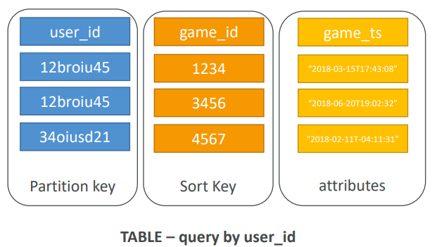

* Non-key attribute barındıran sorguların hızlandırılması için kullanılır.
* GSI = partition key + opsiyonel sort key
* Yeni bir index'e, tablodaki attributesları yansıtabiliriz.
    * Asıl tablonun partition key ve sort key her zaman yansıtılır. (KEYS_ONLY)
    * Projeye ekstra attributeslar yansıtılabilir. (INCLUDE)
    * Ana tablodaki bütün attributeslar yansıtılabilir. (ALL)
* Index için ayrıca RCU/WCU belirtilmelidir.
* Sonradan GSI eklenebilir ve modify edilebilir.

**Yeteri kadar WCU olmasına rağmen, DynamoDB yazma işlerinde darboğaz yaşanıyorsa;**

CloudWatch istatistikleri; consume edilen ve provision (sağlanan) throughput istatistikerini göstererek sorunu anlamamızda yardımcı olabilir.

CloudWatch dışında, tabloda tanımlanan LSI'de (Local Secondary Index) WCU tüketilmesine neden olabilir.

Tabloya bir item eklenirse, update olursa veya silinirse; LSI güncellenir ve bu işlem sırasında da, WCU tüketilir.

**Tabloya yeni veri yazıldığından toplam maaliyet; tabloya yazılarak harcanan maaliyet + LSI güncellenmesi için gereken WCU toplamıdır.**

LSI aksine, GSI (Global Secondary Index) birincil tablo kapasitesini etkilememektedir.

### DynamoDB DAX


DAX, DynamoDB Accelerator kısaltmasıdır.

DynamoDB için kullanılan bir cache mekanizması olarak düşünebiliriz. 

Yazma işlemi DAX'dan, DynamoDB'ye doğru yapılır. DAX'dan yapılan sorgulamalar micro saniye seviyesinde sonuçlanır.

Tablolardan yapılacak olan yüksek sayıda okumanın önüne geçeceğinden, Hot Key sorununun da önüne geçer.

* By default, cache için 5 dakika TTL (Time-to-Live) süresi vardır.
* Bir cluster'da 10 node'a kadar kullanılabilir.
* Multi AZ olarak çalışır ve production için en az üç node tavsiye edilir.
* KMS ile encryption at rest, VPC güvenlik katmanları, IAM, CloudTrail gibi yazılımlar ile güvenliği sağlanabilir.

### DynamoDB Streams


DynamoDB'de yapılan create, update ve delete gibi işlemler DynamoDB Stream'de sona erebilir.

Bu stream AWS Lambda tarafından okunabilir ve sonrasında;

* Yeni kullanıcılara hoş geldin maili gibi, real-time değişimlere tetikleme işleri,
* Tablo/view oluşturma gibi işlemler,
* ElasticSearch insert işlemi gibi işlemler yapabiliriz.
* Stream kullanarak Cross Region Replication yapılabilir.
* Stream 24 saat data retention süresine sahiptir.
* Batch size, 6 mb ve 1000 satıra kadar konfigüre edilebilir

#### DynamoDB Streams Kinesis Adapter

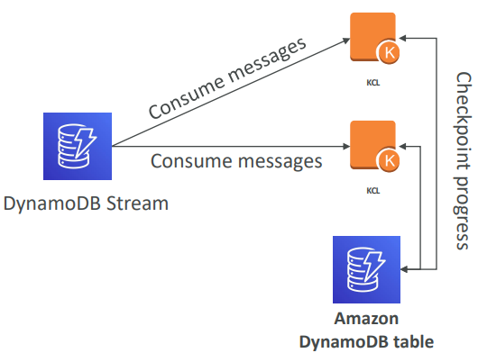

DynamoDB Stream'den doğrudan yararlanmak için KCL library kullanılmalıdır ve bunun için sadece library'e "Kinesis Adapter" eklenmelidir.

Arayüz ve programlama Kinesis Stream ile birebir aynıdır. Bu yöntem AWS Lambda'nın bir alternatifi olarak düşünülebilir.

#### DynamoDB TTL (Time to Live)

**TTL:** Bir item'ın expire süresi dolduktan sonra otomatik olarak silinmesidir.

* Silme işlemi WCU veya RCU tüketmediğinden, TTL için extra bir maaliyet yoktur.
* DynamoDB tarafından arkaplanda çalışan bir işlemdir.
* Storage ve tablo size'ının çok büyümesini engellemek için yardımcı olur.
* TTL satır seviyesinde çalışır. Bir TTL kolonu tanımlanarak, bu kolona tarih eklenir.
* TTL ile silinen itemlar indexlerden de yani GSI/LSI'de de silinirler.
* DynamoDB Streams, expired olmuş nesnelerin (itemların) kurtarılmasına yardımcı olabilir.

### DynamoDB Security

* VPC endpoints, internet olmadan DynamoDB'ye erişebilir.
* Erişim IAM tarafından kontrol edilir.
* KMS ile encryption at rest yani yerinde encryption yapılır.
* SSL/TLS kullanarak encryption in transit yapılabilir.

**Backup ve Restore**
* RDS ile point in time restore yapılabilir.
* Performansa olumsuz bir etkisi yoktur.

##### Global Tables
* Multi region, fully replicated, high performance

Amazon Database Migration Service (DMS) kullanılarak; MongoDB, Oracle, MySQL, S3 gibi kaynaklardan, DynamoDB'ye migration yapılabilir.

Development ortamı kullanım amacı ile, local bilgisayarlardan, local DynamoDB'ye erişim mümkündür.

## AWS ElastiCache

ElastiCache kendi içerisinde Redis ve Memcached olmak üzere iki ayrı çözüm sunar.
Cache'ler yüksek performansi düşük latency sağlayan in-memory veri tabanlarıdır.

* Okuma işleminin çok fazla olduğu veri tabanlarına gelen okuma talep yükünü azaltır.
* Uygulamanın stateless olmasını sağlar.
* Sharding kullanarak, yazma işlerinin scale olmasını sağlar.
* Read replica ile, okuma işlerinin scale olmasını sağlar.
* Multi AZ'da çalışabilmesi, failover durumlarına karşı korur.
* İşletim sistemi bakımı, patch, optimizasyon, kurulum, yapılandırma, monitoring, recovery ve backup işlerini AWS tarafından yapılır.

### Redis

Redis in-memory olarak çalışan bir key-value store database'dir.
* Ms seviyesinin altında latency sağlayarak super low latency sınıfındadır.
* Persistence özelliği sayesinde sunucu reboot olsa dahi cache içeriğini korur.
* User session, oyunlar için leaderboard, distributed durum, RDS gibi database'lerin yükünü azaltmak için, mesajlaşma için  PUB/SUB kabiliyeti gibi ihtiyaçlar için çok uygundur.
* Failover durumunda, Cache datanın kaybolmaması için, disaster recover ortamı için Multi AZ kullanılmalıdır.
* Read Replica desteği vardır.

### Memcached

Memcached bir in-memory object store'dur. Cache reboot sırasında kaybolur.
Memory'den objelerin hızlı sorulanabilmesi, sık sorgulanan objeler için kullanılması tavsiye edilir.

Genel olarak Redis, Memcached'den daha yetenekli olduğundan, piyasada da daha fazla kullanılmaktadır.

Düşük latency ihtiyacı olan sistemler, modellerinde cache okuma yapıları kullanmaktadırlar ve bu gibi yapılarda Redis, Memcached'den çok daha fazla tercih edilmektedir.

# Processing

## AWS Lambda

Kod parçacıklarının Cloud ortamında server olmadan ve scale olabilme özelliği olan processing teknolojisidir.

Lambda kullanıldığında sunucuya patch geçilmesi, monitoring, hardware arızası gibi server management işlerine gerek kalmamaktadır.

Lambda genel olarak real-time data processing, real-time stream processing, ETL, cron replacement, AWS eventlerin process edilmesinde kullanılır.

Node.js, Python, Java, C#, Go, Poweshell, Ruby desketlenen dillerdir.


Yukarıda yer alan servisler Lambda trigger'lardır.

### Lambda + Kinesis

Lambda kodu batch stream kayıtları ile birlikte bir event alır.

* Trigger ayarlanırken, 10000 kayıda kadar olan bir batch boyutu belirlenebilir.
* Çok büyük batch size işleri timeout'a neden olabilir.
* Batch işlemleri aynı zamanda Lambda'nın payload limiti olan 6 mb'a bölünebilir.

Lambda batch işini başarılı tamamlayana kadar veya data expire olana kadar denemeye devam eder.

* Eğer hatalara doğru şekilde müdahale edilmeze, bu shard işlemini durdurabilir.
* Processing tamamen hatalarla karşılanmadığından emin olmak için daha fazla shard kullanılabilir.
    * Lambda shard verilerini senkronize olarak işler.

**Ücretlendirilmesi:**
Lambda kullanıldığı kadar ödenen bir servistir.
Ayda 1M request, saniyede 400K gb compute zamanı ücretsizdir.

* 1 milyon request için 0.20 dolar
* Her 1 gb/sn için .00001667 dolar ile ücretlendirilir.

High availability, unlimited scalability ve yüksek performans sunar.
Timeout max 900 saniyedir.

Lamda'nın datayı process edebilmesi için gerekli IAM policy'e sahip olmasının dışında, onu tetikleyen servis ile de aynı account'da olması gerekmektedir.

Lambda-Kinesis stream yapısı kurulmuş olsun. Lambda, kayıtları kontrol edecek ve kendi fonksiyonu ile processing işini başlatacaktır.
Bu şekilde kurulan bir yapıda, Lambda Kinesis Stream'i poll ederek yeni aktivite olup olmadığını sorgulayabilir.

## AWS Glue

Ana kullanımı, S3'de bulunan Data Lake için merkezi bir metadata repository'si olarak kullanılmasıdır.

Tablo ve schema tanımını anlayabilir ve bu tanımları Athena, Redshift veya EMR gibi analiz araçlarının kullanabilmesi için publish edebilir ve data üzerinde custom ETL işleri koşturabilir.

AWS Glue Crawler, Glue'nun componentlerinden birisidir. Temel olarak S3'de bulunan verileri tarar ve glue crawler datanın yapısına bağlı olarak otomatik olarak bir schema yapısı çıkarır.

Crawler schedule da edilebilir yeni bir data geleceği zaman tetiklenir ve akışı başlatır.

Glue crawler S3'de bulunan data üzerinde tarama işini yaparken, glue data catalogue populate eder. Oluşan bu data catalogue, bütün diğer toollar için merkezi metadata repository'si olarak çalışır.

Glue Data Catalog altında yer alan metadatanın her zaman up-to-date ve sync olabilmesi için crawler'ın schedule edilmesi ve periyodik olarak çalıştırılması en basit ve doğru yoldur.

Datanın kendisi S3'de tutulur ve glue data catalog sadece diğer servislere bu datayı nasıl yorumlayacağını ve yapısı hakkında bilgi verir.

Data bir kere kataloglandıktan sonra, Athena veya EMR gibi toollar için analiz için hazır olacaktır.

### Glue ve S3 Partition

Glue crawler S3'de data nasıl organize edilmiş ise extract işini o şekilde yapar.

S3'de bulunan datanın sorgulanmasını sağlamaktadır. Bir cihazın her saat sensor data göndermesi bu gibi bir yapıya örnek olabilir.

Eğer öncelik olarak time range bir sorgulama yapılacak ise, data yyyy/mm/dd/device şeklinde bucketlarda tutulmalıdır.
Eger öncelik olarak device bazlı bir sorgulama yapılacak ise, data device/yyyy/mm/dd şeklinde bucketlarda tutulmalıdır.


Glue aynı zamanda Hive ile entegre çalışabilmektedir. Glue data catalog'u, hive için metadata store olarak veya hive metastore, glue'ya import edilebilir.

Glue data catalog, EMR'da hive'a metadata bilgisi sağlayabilir.

### Glue ETL

* Serverless çalışır ve otomatik kod generate edebilir.
* Scala veya Python dil desteği bulunmaktadır.
* Server-side(at rest) veya SSL(in-transit) encryption sağlamaktadır.
* Event odaklı çalışabilmektedir.
* Temel Spark işlerinin performansını arttırmak için ek "DPUs" (data processing unit) kullanılabilir.
* Hatalar CloudWatch'a raporlanır ve bu hatalar ile ilgili bilgilendirme alınmak istenirse, SNS (Simple Notification Service) entegre edilebilir.

**Glue Ücretlendirilmesi:**

Crawler ve ETL işleri için dakika üzerinden ücretlendirilir.
Glue Data Catalog için depolanan ve erişilen ilk 1 milyon obje ücretsizdir.
Geliştirilen ETL kodu için development endpoint dakika üzerinden ücretlendirilir.

**Önerilmeyen Kullanım Alanları:**
Glue batch odaklı ve minimun 5 dakika intervala sahip olduğundan, streaming data için uygun değildir.

Multiple ETL engine için önerilmez. Kinesis kullanmak bu gibi bir durumda daha iyi bir fikirdir. Verileri S3 veya Redshift'de tutarak, ardından transformasyona devam etmek için Glue kullanılabilir.

Glue, DynamoDB gibi NoSQL database desteği bulunmamaktadır.

AWS Glue ile process edilecek olan EC2'de çalışan bir MySQL veri tabanından data load edilmek isteniyor. Böyle bir yapıda instance VPC içerisinde yer alması gerekmektedir.

## AWS EMR (Elastic MapReduce)

EC2 instance'ları üzerinde yönetilen hadoop framework'dür. Spark, HBase, Presto, Flink, Hive ve daha fazlasını bünyesinde içerir.
EMR Notebooks adında bir feature desteği vardır. EMR Notebooks, EMR clusterındaki verileri küçük bir web browser'dan python kullanarak sorgulamaya olanak sağlayan bir özelliktir.

EMR AWS servisleri ile çeşitli entegrasyon noktaları vardır ve EMR, hadoop clusterının bütün gücünü sağlamaktadır.

### EMR Cluster

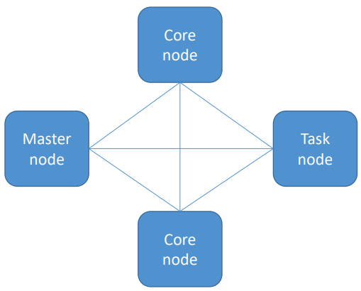

**Master node,** cluster'ı yönetmek ile sorumludur ve single çalışan EC2 instance'dır.

**Core node,** HDFS datasını tutar ve taskları çalıştırır. Scaled up ve down yapılabilir ancak bu işlemlerde HDFS'in datayı kopyalı olarak tuttuğundan, bazı riskler bulunmaktadır.

**Task node,** Task'lar bu node'larda çalışır ama core node gibi data saklamaz. Compute node olarak çalışırlar ve cluster'dan çıkarıldığında risk teşkil etmez. Spor instance'ları kullanılabilir.

#### EMR Kullanımı

Geçici ve uzun süreli cluster'lar kullanılabilir.

* Geçici kapasite için spot instance mantıklı bir tercih olabilir.
* Uzun süreli çalışacak cluster'lar için, reserved instance kullanılabilir.

İşlerin çalıştırmak için, master node'a bağlanılmalıdır.
Sıralı adımlar console'dan gönderilebilir.

### EMR / AWS Entegrasyonu

Clusterda bulunan node'ları oluşturan instance'lar için EC2 instance kullanılır.

* Farklı tip EC2 seçilebiliyor olması esneklik sağlar.
* VPC, instance'ların başlatıldığı virtual network'ü yapılandırmak için kullanılır ve güvenli bir network sağlar.
* S3 input ve output datayı saklar.
* CloudWatch, cluster'ın monitor edilmesi ve alarm konfigüre edilmesi için kullanılır.
* Yetkileri kontrol ve konfigüre etmek için IAM kullanılır.
* Servisler tarafından yapılan request'leri audit işini yapmak yani denetlemek için CloudTrail kullanılır.
* AWS Data Pipeline cluster'ın schedule edilmesi ve başlatılması için kullanılır.

#### EMR Storage

HDFS, hadoop için distributed scalable file system'dir.

**EMRFS (EMR File System):** HDFS gibi görünür ancak veriyi S3 üzerinde tutar.

* EMRFS Consistent View: S3 consistency'e opsiyonel olarak kullanılabilir.
* Consistency'i takip etmek için DynamoDB kullanılabilir.

*****S3 kullanıldığı zaman consistency sorunu yaşanabilir!**

Cluster'da bir çok instance varsa ve aynı anda S3'e veri yazmaya ve okumaya çalışırlarsa ve bir node başka bir node'un verilere erişmeye çalıştığı yere yazma işi yapmaya çalışırsa;

HDFS'de bu durum çok kritik değil çünkü veriler store edildiği node'da process ediliyor. Fakat S3'de bir tutarsızlık meydana geliyor.

EMRFS Consistent View burada devreye giriyor. EMR 3.2.1 veya daha üst bir sürüm kullanılırsa ve consistent view enable olan bir cluster oluşturulursa, EMR object metadatasını store etmek ve S3 consistency takip etmek için DynamoDB database'i kullanacaktır.

Local file system, temporary data için uygundur.
HDFS için EBS (Elastic Block Storage)

Çalışan bir cluster'a EBS volume attach edilemez. Çalışır halde olan cluster'a sadece EMS volume eklenebilir.

EMR saatlik olarak ücretlendirilir ve bu ücretin üzerinde kullanılan EC2 instance'ların kullanımı eklenir.

* Core node fail olursa, yeni bir node provision edilir.
* On the fly Task node eklenip/çıkarılabilir.
* Çalışan bir cluster'ın core node'ları resize edilebilir.

### Hive Metastore, Pig, HBase

#### External Hive Metastore


By default, master node'da bulunan MySQL veri tabanında bulunur.

**External metastore, esneklik ve entegrasyon sağlar. Metastore AWS Glue Data Catalog veya Amazon RDS'de saklanarak, alternatif store çözümleri oluşturulabilir.**

AWS Glue Data Catalog'da saklandığını varsayalım, bu durumda hem unstructure veriler için merkezi bir metastore vazifesi görecek hem de doğrudan EMR'ın erişebileceği bir metastore olacaktır ve böylece AWS ortamları için Metadata verileri sadece 1 noktada olmuş olacak.

EMR ile hive kullanmak, tablo partitionlarını S3'den otomatik olarak load edilmesine olanarak sağlar.
S3'de veriler farklı sub dizinlerde tutulabilir. Bunlar tablo partitionlarından translate edilecek ve bu işlem EMR ile otomatik yapılabilir.

Sadece alter table recovery partitions komutu yazılmalıdır. Bu tabloları paylaşımlı bir metadata store olmadan bir çok cluster'a aynı anda aktarılabilir.

Tablolara ve S3'e veri yazıldığında, EMR'da yüklü olan hive sürümü, temporary dosya kullanmadan S3'e yazar böylece EMR'daki hive extensionlarını kullanarak, S3'de yer alan scriptleri direk olarak kullanabilir.  

EMR hive aynı zamanda DynamoDB ile de entegredir. Hive kullanarak, DynamoDB datası üzerinden de process işlemi yapılabilir. Bunun için DynamoDB tablosuna göre external hive tablosu tanımlanmalıdır ve ardından DynamoDB'de bulunan verileri analiz etmek ve sonuçları DynamoDB'ye geri yüklemek için hive kullanılabilir veya S3'e arşivlenebilir.

Bu işlem datanın DynamoDB'den, EMRFS veya HDFS'e kopyalanmasını ve bunun tam tersininde yapılmasına olanak sağlar. Ve ayrıca EMR'da Hive kullanılarak, DynamoDB tabloları arasında join işlemleri yapılmasını da sağlar.

#### EMR ve Pig

Amazon EMR'da, Pig preinstalled olarak gelir.
Pig ile mapper ve reducer yapılmasını gerek yoktur. Map ve reduce adımlarını tanımlamak için SQL benzeri bir script dili olan Pig Latin'inin kullanılmasını sağlar.

UDF yani user-defined function ile son derece geniş bir kullanım sunar.

High level scripting kullanılmasını sağlar. Eskisi kadar kullanılmasada bilinmesinde fayda vardır.

Pig, Hive gibi AWS entegrasonunun birden fazla yolu bulunmaktadır.
Pig sadece HDFS ile sınırlı değildir. S3'de EMRFS ile sorgulama yapılabilir ve hive gibi external olarak doğrudan Amazon S3'de bulunan jar dosyalarını ve scriptleri load etme yeteneğine sahiptir.

Pig, Amazon EMR ile kullanıldığında, multiple filesystem'e erişmeyi mümkün kılmaktadır.
JDBC ile erişimi desteklemez.

#### Hbase

Preinstalled olarak gelir.

NoSQL, ilişkisel olmayan veri tabanıdır ve petabyte mertebesinde veri ile çalışabilmektedir.

Google BigTable'dan esinlenerek tasarlanmıştır ve hive entegrasyonu bulunmaktadır.

DynamoDB'ye benzerdir ancak her ikisinin de birbirinden üstün olduğu noktalar vardır.

AWS servisleri ile entegre bir mimari tasarlanacak, fully managed bir NoSQL veri tabanı ihtiyacı varsa, Glue entegrasyonu gerekiyorsa ve otomatik scale olması olması isteniyor ise DynamoDB tercih edilebilir.

Her an tutarlı okuma ve yazma ihtiyacı var ise, yüksek write ve update throughput olan bir sistem gereksinimi varsa veya hadoop ile daha entegre bir NoSQL veri tabanı ihtiyacı var ise, HBase tercih edilebilir.
HBase için EMRFS ile S3'de veri tutulabilir ve S3'de backup tutulabilir.

### Presto

Preinstalled olarak gelir.

**HDFS ve S3 dahil olmak üzere, bir çok farklı big data veri tabanına ve data store'a aynı anda bağlanabilir ve bunlar arasında sorgulama yapabilir ve ayrıca doğrudan MySQL, Redshift ve Hive ile etkileşime girmesi için connector sağlar.**

Petabyte mertebesinde interaktif sorgular çalıştırabilir, desteklediği dil SQL benzeri bir dildir.

Daha çok OLAP sistemler için tasarlanmıştır ve analitik sorgular ve DWH tipte sorgular için uygundur.
Facebook tarafından geliştirilmiş ve halen Facebook tarafından kısmen maintain yapılmaktadır.

Amazon Athena'nın arka planda kullandığı yapı Presto'dur. Athena sadece serverless Presto'dur. JDBC, command-line ve Tableau arayüzü sunar.

HDFS, S3, Cassandra, MongoDB, HBase, SQL veri tabanları, Redshift, Teradata gibi sistemler Presto ile beraber çalışabilir ve bunların hem relational hem de unrelational veri tabanları olabileceği gibi bir SQL arayüzü gibi kullanılabilir.

EMR ile processing memory'de yapılır ayrıca stage'ler arasındaki network üzerinden pipelinelar yapılır ve bu şekilde gereksiz I/O engellenir ve aynı zamanda bu daha hızlı olmasını sağlar.

Bu hız OLTP veya batch processing için yeterli değildir. Presto sadece ekosistemde farklı veri tabanlarında depolanacak datasetler üzerinden anlam çıkarmaya yardımcı olan, OLAP tarzı sorguları çalıştırmamızı sağlayan etkileşimli bir sorgu aracıdır.

### Zeppelin ve EMR Notebooks

#### Zeppelin

iPython notebook, küçük Python kodları yazmaya olanak sağlayan ve bunun çalışmasını görmemizi sağlayan bir web browser uygulamasıdır.

Zeppelin, ipython notebook benzeri bir uygulamadır. iPython tek bir bilgisayar mantığında çalışırken, Zeppelin daha çok cluster mantığında çalışmaktadır.

Python kodları ve scriptleri verilere göre etkileşimli olarak çalışmasına olanak verir ve notları cluster'da bulunan diğer kişilerle paylaşılmasına olanak sağlar.

Spark, Python, JDBC, HBase, Elasticsearch ve daha fazlası ile entegre çalışabilir.

##### Zeppelin + Spark

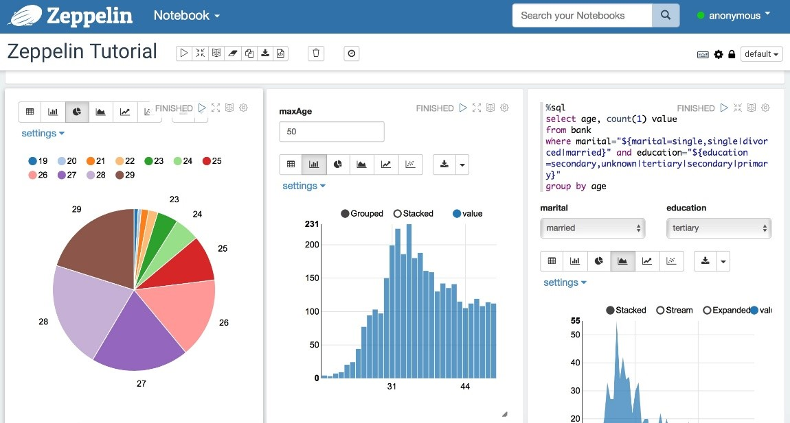

Spark shell'de olduğu gibi, interaktif olarak spark kodlarının yazılmasını sağlar ve bu da development sürecini hızlandırır.

SparkSQL ile SQL tipinde sorguları çalıştırabilir ve bu sorgu sonuçları tablo ve grafiklerde görsel bir sonuç sunabilir. Bu şekilde Spark'ı daha fazla bir data scientist aracı olarak kullanılması sağlanır.

##### EMR Notebooks


Zeppelin ile benzer bir uygulamadır ama daha fazla AWS entegrasyonu sunar.

* S3'de backup'ı bulunan notebook gibidir.
* VPC içerisinde tutulur ve sadece AWS console'dan erişim mümkün olabilir.
* EMR müşterileri için ek bir ödeme alınmaz.
* Belirlenen idle timeout süresi aşılırsa, EMR Notebook durmaktadır.
* Versiyon kontrolü yapmak amacı ile repository ile entegre çalışmaktadır.
* Kerberos enable olan bir EMR clusterına, kişisel notebook attach edilemez.

### Hue, Splunk ve Flume

#### Hue

Hadoop user experineces.

EMR ve hadoop cluster'ında, uygulamalar için grafiksel ön yüzdür.
IAM engegrasyonu sunmaktadır ve böylece Hue kullanıcılarının neye erişebileceklerini IAM rolleri ile sınırlayabiliriz.

HDFS veya EMRFS ve S3 arasında veri taramasına ve taşımasına olanacak sağlar.

#### Splunk


Genel bir tanım ile, sunucu verilerine erişebilir, kullanabilir ve bu verilerin herkes tarafından kullanılmasını sağlar.

Operasyonel bir yazılım olarak kullanılır ve EMR hadoop cluster'ını kullanarak, EMR ve S3 verisi üzerinde görsel bir anlam çıkarır.

Splunk aynı zamanda log analizi ve bu logların yorumlanması konusunda da yardımcı olur. 

Örnek verecek olursak, 100 node olan bir cluster'da bütün logları incelemek ve bir sorunu analiz etmek oldukça zordur. Splunk yardımı ile bu logları tek bir merkezde toplanarak, Splunk query adı verilen bir arama metodu ile bunlar üzerinden analiz yapılabilir.

#### Flume

Sqoop gibi veri transferi konusunda kullanılır ancak Flume log verilerinde çok başarılıdır ve cluster içerisinde bu tip veriler üzerinde stream işletebilir ve aggregation yapabilir.

### Diğer Servisler

#### MXNet

Deep learning uygulamalar tasarlamak için kullanılan bir framework'dür ve kolayca EMR cluster'da distribute olabilir.

#### S3DistCP

HDFS ve S3 arasında çok büyük verilerin kopyalanmasını sağlar. Bu işi yaparken arka planlda MapReduce işi çalıştırır ve fazla sayıda objenin parallel kopyalanmasına olanacak sağlar.

Bu işlemi farklı bucket, cluster ve account'lar arasında da yapabilmektedir.

* **Ganglia,** Monitoring
* **Mahout**, Machine Learning (recommendation engine/collaborative filtering yeteneğine sahiptir.)
* **Accumulo,** NoSQL veri tabanı
* **Hcatalog,** Hive metastore için tablo ve storage management
* **Kinesis Connector,** Scriptler ile Kinesis stream arasında direk erişim sağlar.
* **Tachyon,** Spark için hızlandırıcıdır.
* **Derby,** Java tabanlı open-source relational veri tabanıdır.
* **Ranger,** Rol bazlı yetkilendirme ve loglama yapabilen data security manager'dır.

Kısacası Cloudera, Hortonworks ve AWS yazılımlarının hemen hemen hepsinin kullanılmasına olanak vardır.

### EMR Security

IAM policy, Kerberos, SSH ve IAM rolleri security kısmında kullanılmaktadır.

#### EMR: Instance Seçimi

##### Master node

* 50 node üzerinde bir cluster olacak ise, m4.large daha düşük node'a sahip cluster için m4.xlarge

##### Core & Task node

* Genel kullanım için m4.large kullanılabilir.
* Cluster web crawler gibi external dependencies'e sahipse, t2.medium
* Yüksek performans için m4.xlarge
* Yüksek compute gereksinimi için, yüksek CPU instancelar
* Database, memory caching uygulamalar için, yüksek memory instancelar
* ML ve NLP gibi Network/CPU gereksinimi için, cluster computer instance'lar

##### Spot Instance

* Task nodelar için tercih edilebilir. Kritik olmayan, test amaçlı işler koşturulacak ise uygun olabilir. Production ortam için kesinlikle önerilmez.

EMR cluster terminate edilirse, EMR'a ait olan volume'larda silinecektir.

Amazon; EMR cluster'larında, **Master ve Core node olarak reserved veya on-demand instance** tavsiye etmektedir. Performansı arttırmek ve maaliyeti düşürmek için **Task node olarak da Spot instance** tavsiye etmektedir.

## Machine Learning

### Machine Learning 101

Machine Learning sistemleri, genel olarak bir item'ın yani öğenin bilinmeyen bir özelliğini tahmin eder.

**Örnek:**

* Bir evin ne kadara satılabileceği?
* Bir resmin ne resmi olduğu?
* Bir biyopsu sonucunun iyi mi yoksa kötü huylu mu olduğu?
* Yapılmış olan finansal işlemin gerçek mi yoksa sahte mi olduğu?
* Kredi kartı veya banka kartı kullanımı normalin dışından olursa, bu kullanım geçmişe dair kıyaslanır ve yorumlanır.

Kısacası, geçmişteki verilere bakarak bunları yorumlar ve bu yorum sonucunda da bir tahminde bulur.

#### Supervised Learning (Denetimli Öğrenme)

Supervised Learning bir nevi öğretilmiş ML olarak geçer.

Tahmin etmek istediğimiz özellik label olarak adlandırılmıştır.
Bizim data setimiz, verilerin diğer nitelikleriyle birlikte, doğruluğu kesinleşmiş bazı label'larda içerir.

Yukarıdaki örneklerden birini uyarlayacak olursak; evin satış fiyatı, oda sayısı, metrekare gibi özellikleri biliniyor olsun.

Bu bilgiler ışığında bilinmeyen labelların mesela evin ne kadar satılacağı veya satılması gerektiğine dair elde bulunan bilgilere dayanarak tahminde bulunur.

Temel olarak tarihsel bilgilere dayanan bir model geliştirmek ve bu modeli kullanarak cevabı bilmediğimiz yeni veriler hakkında öngörülerde bulunmaktır.

Peki bu Supervised Learning modelininin ne kadar iyi olduğunu nasıl test edebiliriz.

Bunun yollarından birisi Train/Set adında bir şey kullanmaktır.


Train verileri geçmiş verilerden alınır ve bu rastgele iki sete ayrılır. Bu setlerden birisine training set denir ve bu genellikle datanın bulk halidir.

Diğer kısım ise test verisi olarak adlandırılır.

Test verisi bir kenara bıraklır ve böylece model geliştirilirken bu test verisi kullanılmaz.

Model oluştuktan sonra, modeli test verisinde bilinen labelları yani kesin bilgileri ne kadar iyi tahmin ettiği değerlendirilir.

Kısacası modeli bir veri üzerinde train ediliyor ve daha önce yorumlamadığı gerçek veriler üzerinde test yapılıyor.

Model test verilerini doğru bir şekilde tahmin edebiliyorsa, modelin bilinmeyen verileri öngörmede ne kadar başarılı olduğu ölçülebilir.

Geçmişte satılan evlerin fiyatlarını, oda sayılarını, metrekare fiyatlarını, inşa edildiği yılı, yeri gibi bilgileri biliyoruz.

Bu evler toplamda 1000 ayrı lokasyonda olsun ve bu evlerden 800 lokasyonu modeli geliştirmek için kullanıyoruz ve kalan 200 lokasyonda test verisi olarak kalıyor.

Model oluştukan sonra diğer 200 lokasyon için tahminde bulunmasını sağlıyoruz ve bunun gerçek veriler ile ne kadar yakın olduğuna bakarak, modelin ne oranda sağlıklı tahimde bulunduğunu çıkarabiliyoruz.

Mahout, recommendation engine/collaborative filtering yeteneğine sahiptir.
300 item üzerinde recommendation engine çalıştırılacak ise, çözüm Mahout veya Spark MLib'dir. 

Bu gibi bir çözümde Amazon Machine Learnning iyi bir çözüm değildir çünkü Amazon ML 100 kategorik recommendation ile sınırlıdır.

#### Amazon ML'de Veri Tipleri

Sadece belli bir kaç model desteği vardır ve onlar da aşağıdaki gibidir.

**Regression (Bağlanım),** regression ile, geçmiş verilere bakarak bazı sayısal değerler tahmin etmeye çalışıyoruz.
Örnek, evin fiyatı ne olacak?

**Multiclass Classification,** bir görüntüyü sınıflandırma modeli bu sınıfa girer. 
Örnek, bu resim ne resmidir?

**Binary Classification,** iki sınıftan birini tahmin etmeye çalışılan ML modeline örnektir.
Örnek, Biyopsi kötü huylu mu veya Bu finansal işlem sahte mi?

**Clustering,** Benzer örnekleri sınıflandırır. Örnek en uygun döküman. (Unsupervised)

**Association rule learning (Ortaklık kuralı),** Eğer hamburger ekmeği alırsanız, hamburger satın alabilirsiniz. (Unsupervised)

**Ranking,** Arama sonucu sıralaması

##### Confusion Matrix


Multiclass classification doğruluğunu görselleştirmenin bir yoludur.

Görüntünün içinde ne olduğunu tahmin edebilecek bir model olmuş olsun ve farklı durumlarda ne denli doğru olduğunu görselleştiren bir çözüm sunsun.

Örnek olarak yukarıdaki confusion matrisinde test veri setinde bir çok imge var ve asıl label, o veri setinde her görüntünün gerçek label'ını ve ML modelinin önceden ne olduğunu bilmediğini söylediği tahmin label'ı biliyoruz.

Bu örnekte bir köpeğin, köpek içerdiğini doğru olarak tahmin etti.

Bir kedi içerdiğini bildiğimiz bir imge için sadece %62 oranında kedi olduğunu bildi ve %38 oranında balık olduğunu düşündü.

Bütün balık resimleri de, balık olduğu bilindi.

Confusion matris, multiclass classification ML modelinin ne kadar iyi olduğunu anlamanın hızlı bir yoludur.
Mükemmel model çapraz koyu mavi çizgi veren matrisdir.

##### Hyperparameters

ML dünyasında başka bir şey hyperparameters yani hiper parametreledir.

Bir modelin başarısı verininin ne kadar temiz olduğu ve ne kadar iyi hazırlanmış oldugu gibi durumlara bağlıdır.
Buna ek olarak ayrıca ML modellerinin ne kadar iyi ayarlanmasına da bağlıdır ve buna hyperparameters tuning denir.

Amazon ML'de aşağıdaki parametreler bulunmaktadır.

* Learning rate, bir yinelemeden diğerine ne kadar hızlı hareket ettiğidir. 
* Model size
* Number of passes, olası veya iyi bir cevabı yakınsamaya çalışırken geçme sayısıdır.
* Data shuffling, verilerin karıştırıp karştırılmamasıdır.
* Regularization, Verileri girdikçe ortak değer kümesine ölçeklendirmektir.

### Amazon Machine Learning

Amazon ML, model oluşturmayı kolaylaştırmak için kod yazmaya gerek olmadan görselleştirme araçları sunar.

* S3, Redshift veya RDS'de bulunan training verilerini gösterir.
* Batch veya low-latency API ile tahminde bulunabilecek bir model oluşturur.
* Oluşturulan model, test edilebilir ve değerlendirilebilir.
* Amazon tarafından fully managed bir servistir.
* Piyasada ilk başlarda kullanım oranı daha fazla olsa da, şu an biraz modası gemiş durumdadır.

Şüpheli finans kareketleri, ürün talebini tahmin etmek, bir kullanıcının ilgileneceği öğeleri ve kullanıcı hareketini tahmin etmek, bir tweet'in ilgi çekici olup olmadığı gibi sosyal medyayı sınıflandırmak gibi durumlar için uygundur.

Kullanıldığı kadar ödenen bir sevistir.

Yapılan hesaplama zamanına, tahmin sayısına, modelin kullandığı memory'e, training için hesaplama saatine göre faturalandırılır.

Downtime bulunmamaktadır.

100 gb'a kadar training datası tutulabilir ve bu support'a açılacak bir çağrı ile arttırılabilir.

Eş zamanlı 5 iş çalıştırılabilir ve bu da support ile iletişime geçilerek arttırılabilir.

Terabyte mertebeside verinin scale edilmesi tavsiye edilen bir şey değildir bu gibi bir ihtiyaç için Spark çalıştırmak daha iyi bir alternatif olacaktır.

Lojistik regresyon veya lineer regresyon Amazon ML için uygun değildir. Dolayısıyla sıra tahmini, denetimsiz kümeleme veya derin öğrenme Amazon'un ML servisinde yapılamaycak modellerin örnekleridir.

EMR/Spark bir alternatif olabilir.

Nisan 2019'dan itibaren Amazon artık yeni hesapların ML servisini kullanmasına izin vermiyor ve kullanıcıları SageMaker ve diğer ML hizmetlerine yönlendiriyorlar.

### Amazon SageMaker

Scalable, Amazon tarafından fully-managed bir ML servisidir.

SageMaker, Amazon Web servislerinin bir bileşenidir. Cloud'da bulunan büyük ölçekli modeller üzerinde çalışabilir ve ardından bu modelden notebook oluşturulmasını sağlar.

ML sisteminin ciddi anlamda hesaplama performansı gücü elde etmenin kolay yoludur.

Amazon ML servisinden daha iyi ölçeklenen, kullanımı kolay olmasa da daha fazla esneklik ve daha gelişmiş modern algoritma sunar.

SageMaker kullanmak için Python kodunu, Jupiter notebook'a yazılması gerekmektedir.

İşin kod kısmı kullanıcı tarafında olurken, arka planda çalışan kaynak sağlama ve genişleme Amazon tarafından sağlanmaktadır.

Build, train ve deploy adında 3  tane modül içermektedir. Build, veriler ile çalışmak için bir ortam sağlar.

Bu ortamlar Jupiter notebook'ları çalıştıran instance'larla çalışılacak ortamdır. Python kodunun yazılacağı bu notebook'lar deep learning için CUDA ve CUDNN driver'ları gibi cluster'da bulunan bilgisayarların GPU kullanımı sağlayacak sürücülerdir.

Ayrıca python için tensorflow, Apache MX net, pi torch gibi paketleri içeren Anaconda paketlerini içerir.

Bu paketler sayesinde sadece ML için değil aynı zamanda deep learning için de kullanılabilen güçlü bir araç halini almaktadır ve bu sayede hassasiyet için optimize edilmiş yüksek performanslı ölçeklenebilir ML algoritması sağlar.

Günümüzde akademik literatürdeki en yeni ve en iyi performas gösteren reinforcement learning algoritmalarından da bazılarını içermektedir.

Geniş kapsamda destek sunan SageMaker local olarak test edebilir ve prototip edilebilir.

Bir docker container lokale indirilebilir ve SageMaker için modül geliştirmek için bu container ile çalışabilir ve online olmadan SageMaker Python sdk ile test edilebilir.

Model bir kere oluştukan sonra, training aşamasına geçilir ve böylece train modülü tek tıklamayla modelin train edilmesine izin verir.

SageMaker search adında, binlerce Amazon SageMaker model traininglerden en uygun modeli bulmaya ve bunu kullanmaya olanak sağlar.

Bir kaç farklı hyperparameters ile bir kaç farklı veri setini kullanarak model bir kaç farklı şekilde train edilebilir.
Bu nedenle training birden fazla kez yapılabilir.

Sonunda çalışılmak istenen train modeli deploy edildikten sonra onu Cloud ortamında distribute edilecek ve bunu kullanarak tahminde bulunulacaktır.

Bu nedenle deploy modülü, tahminleri bir şekilde ve düşük gecikme ile yapacak modeli barındıracak ve test edilmesi için yönetilen bir ortam sağlamış olacaktır.

Büyük veya küçük batch verilerinin tahmin edilmesini sağlayan bir batch transform modülü vardır.

Bu yapının tamamı Amazon tarafından yönetiliyor ve CloudWatch'da monitor ediliyor.

SageMaker, sonuç pipelinelar deploy etmemizi sağlar. Böylece raw datalar ile, real-time ve batch isteklerini, pre-processing tahmin işleri yapılabilir.

Farklı türde olan özellikleri ve esneklği, Amazon ML servisini rafa kaldırdan sebeplerdir.

Yapılacak olan iş için ML servisine göre daha fazla efor gerektiriyor ancak istenilen model biliniyorsa, çok ciddi oranda fark ortaya çıkmaktadır.

Bütün tensorflow ve MX net özelliklerine sahiptir ve GPU desteği ile deep learning daha da hızlı olmaktadır. Bunun sayesinde çok büyük veri kümeleri üzerinde tahminlerde bulunabilir ve çok gelişmiş AI sistemlerinde kullanılmasına olanacak sağlamaktadır.

SageMaker, python konusunda uzmanlık gerektirir ve SageMaker adımlarını kullanmak için ne yaptığını bilmek gerekmektedir.

Kodlar ML storage volume'larda tutulmaktadır, isteğe başlı at rest encryption yapılabilir ve security grupları tatafından kontol edilir.

* API ve konsol erişimi SSL ile yapılmaktadır. 
* Veriler için encrypted S3 bucket kullanılır.
* Yetki kontrolleri için IAM rollleri kullanılmaktadır.
* SageMaker notebook, training jobs, endpointler için KMS entegrasyonu bulunmaktadır.
* Amazon SageMaker, CloudWatch ve CloudTrail ile entegre olabilir.

Temel olarak; çok güçlü bir ML framework'dür, fully-managed bir hizmettir, deep learning ve çok büyük veri kümeleri için uygundur ve 100 gb sınırı bu hizmette bulunmamaktadır.

**SageMaker Neo:** ML modelini bir kere train ederek, Cloud’da herhangi bir yerde çalıştırılmasına olanak verir.

### Deep Learning

#### Deep Learning 101 ve AWS Best Practices

Deep learning farklı alanlardaki ihtiyaçlara göre uygulanabilmektedir. 
Örnek olarak, temel sinir ağı yani nöral ağ türlerini ve deep learning arasındaki bağlantıyı örnek verebiliriz.

Artificial Intelligence yani yapay zekanın bütün alanı, kendi beyinlerimizin milyonlarca yıllık evrim boyunca nasıl çalıştığını anlamaya dayanmaktadır.

AI çıkış amacı, beynin çalışma şeklini tersine çevirirsek, belki de düşünen makinelerin nasıl yapıldığına dair bazı bilgiler edinmektdir.

Beyninizin içinde, özellikle tüm düşüncelerinizin gerçekleştiği beyin korteksinizde, bir sürü nöron bulunmaktadır.

Bunlar birbirlerinden ayrı sinir hücreleridir ve birbirlerine aksonlar ve dendritler vasıtasıyla bağlanırlar.

Bireysel bir nöron, yeterli düzeyde nöron tarafından aktive edildiğinde bağlı olduğu nöronların tümüne bir sinyal göndermektedir.

İçirisinde bir sürü giriş sinyali olan bir nöron olduğunu düşünelim; eğer bu giriş sinyalleri yeterli eşiğe ulaşırsa, sırayla bağlı olduğu nöronlara bir dizi sinyal gönderir.

Bu nöronların birbirlerine bağlanması bir çok farklı yolla olabilirken, her bir bağlantının da kendine ait bağlantı kümesi olduğundan, ağın tamamı son derece karmaşık bir hal alıyor. Ve bu karmaşık bağlantı, evrenin kendi içerisindeki bağlantıya çok benzer bir görüntü ortaya koyuyor.


Kim bilir belki de karmaşık bağlantıları grafiklere döken matematiksel bir dal olan cebirsel topoloji ve AI ile ilerleyen yıllarda, beyin-uzay ağı arasındaki bu benzerliği yorumlayabilir ve çok daha farklı konular konuşuruz.

Çok basit bir modele sahip olabilirsiniz ama bu modelin bağlantı haritasını birleştirdiğimiz zaman çok karmaşık davranışlar yaratılabilir.

Bir insan beyninde milyarlarca nöron bulunmaktadır. Bu rakam deep learning ve AI ile halen sadece hayal edilebilebilecek bir ölçek ama aynı zamanda bireysel olarak çok basit davranan bir sürü bağlantıya sahip bir grup nörona sahip olduğumuz ile aynı temel kavram.

**Örneğin,** gözümüzün gördüğü alanların, farklı nöronların kortikal sütunları tarafından paralel olarak işleniyor olabilir.

Bu sütunların her biri yaklaşık 100 nörondan oluşan mini sütunlardan yapılmıştır. Mini sütunlar daha büyük hiper sütunlar halinde düzenlenir ve korteksinizde bu 100 sütundan yaklaşık 100 milyon vardır. Böylece yine çok hızlı bir şekilde eklerler.

Farklı şekillerde birbirine bağlanmış nöron katmanları ve her bir nöron arasındaki bağlantı, sinir ağınızın temelini oluşturan şeydir. Sinir ağları aynı anda paralel olarak çalışma eğilimindedir ve bireysel nöronlar, belli bir birim üzerinde modellecek kadar da basittirler.

AI ile beyin çalışma prensibini uyarlarsak, GPU teknolojisi, bir çok nöronun işleyişinin paralel olmasına olanak sağlar ve bir cluster içerisinde çok sayıda farklı cluster'lar olmasına olanak sağlar.
Yani bu sonsuz derece ölçeklenebilir.

Bu şekilde sinir ağlarını geliştirmeyi kodlama açısında kolay hale getirmek için bazı deep learning ortamları bulunmaktadır.

Bunlardan birisi Google tarafından geliştirilen tensorflow ve bir diğeri Apache MX Net'dir.
Her ikisi de cluster boyunca paralelleştirilebilen deep learning ağları geliştirmek için kullanılabilir.

ML modelleme kendi kendine sürüş becerisi olan araba teknolojisinde de kullanılmaktadır.

**Örneğin,** arabanın kamerası yolda yakaladığı görüntüleri yakalayabilir bunları yorumlayabilir ve bunun sonucuna bağlı olarak da sürüş davranışı geliştirebilir.

EMR Apache MXNet ve GPU instance tiplerini desteklemektedir. MXNet kullanıldığı sürece tensorflow'da kullanılabilir.
Deep learning için tavsiye edilen instace tipleri,

* P3: 8 Tesla V100 GPU’s
* P2: 16 K80 GPU’s
* G3: 4 M60 GPU’s

## AWS Data Pipeline


Temel olarak taskları schedule etmek ve bigdata mimarisini process etmeye yarar.

EC2'de bulunan log dosyalarımız olduğunu düşünelim ve biz bunları S3'e göndererek, EMR ile analiz etmek isteyelim.

Data Pipeline günlük veya istenilen herhangi bir frekansta task schedule edebilir ve bu frekansta bu dosyaları EC2'den, S3'e kopyalamak isteyebiliriz.

Bu bir nevi hadoop'da kullanılan Oozie'ye benzer. Temelde farklı programlara dayanan farklı işlemleri yürütebileceğimiz planlama ortamıdır.

Verilen örnek son derece basit bir örnektir ve bu planlama ortamını çok daha karmaşık ve planlaması güç mimariler için de kullanabiliriz.

* Hedef; S3, RDS, DynamoDB, Redshift ve EMR olabilir.
* Task dependencies yönetilebilir.
* Oluşan arızaları yeniden dener ve bunları raporlar.
* Cross-region pipeline desteği bulunmaktadır.
* Önkoşul kontrolü yapabilmektedir ve bu sayede process süreci başlamadan akışın doğruluğundan emin olabiliriz.
* Data source olarak on-premise'de bulunan data da kullanılabilmektedir.
* Highly available'dır.
* EMR, Hive, Copy, SQL sorguları yazabilme, command line script yapılabilecek aktivitelerdir.

# Analysis

## Kinesis Analytics (Querying streams of data)

Spark streaming'e benzer olan ve stream datayı sorgulamak için kullanılan başka bir sistemdir ve sadece AWS Kinesis spesifiktir.

Aynı Spark Streming'de olduğu gibi verileri toplayabileceğimiz ve analiz edebileceğimiz zaman aralıkları belirleyebiliriz.

**Streaming data üzerinde kompleks SQL kullanarak analiz yapılmaktan bahsediliyorsa, Kinesis bunun için en uygun çözümdür.**


Kinesis Analytics 3 ana bölümü vardır.

Bunlardan birisi soruce veya input data olarak geçer ve bu aktarılacak verinin yani stream edilecek verinin nereden geldiği bilgisidir.

Source’da, Kinesis Data Streams veya Kinesis Data Firehose olabilir.

İsteğe bağlı olarak uygulama içindeki input data akışını zenginleştirmek için bir referans veri kaynağı yapılandırılabilir.

Bu yapılmak istenirse, referans obje S3 içerisindeki bir bucket'da tutulmalıdır. Bu gibi bir yapıda, Kinesis Data Analytics S3 objesini okuyacak ve uygulama tablosu oluşturacaktır.

İstenilen data process edildikten sonra output, Kinesis Data Stream veya başka bir Kinesis Data Firehose'a gönderilebilir ve oradan da, S3 veya Redshift'e gönderilebilir.

Bu mimariye Lambda'da dahil olabilir.

Süreç içerisinde herhangi bir hata olursa, bu hatalar da bütün uygulamalar için Error Stream'e gönderilecektir.

Eğer uygulama belli bir datayı process ederken veri tipi uyuşmaması gibi bir hata alırsa, bu hata Error Stream'e yazılacaktır.

**Kullanım Alanları:** Streaming extract veya ETL süreçleri; örnek olarak Kinesis Data Stream'den sürekli IoT sensörlerini okuyan bir uygulama olsun ve bu uygulama sensör tipine göre datayı organize etsin, ardından çift kayıtları temizlesin, bu kayıtları belli bir schema yapısına göre düzenlesin ve S3'de muhafaza edilecek şekilde datayı gönderecek olsun.

Sürekli olarak metric üretimi ihtiyacı olan bir yapı da örnek verilebilir. Örnek, online oyun lider sıralaması

Kullanımı ucuz olmamakla beraber sadece kullanılan kaynaklar için ödeme yapılır.
Serverless'dır ve otomatik olarak scale olabilir.

Güvenlik amacı ile source ve destination'a erişmek için IAM permission'lar kullanılmalıdır.
Schema discovery özelliği bulunmaktadır.

Kinesis Data Analytics, Kinesis Processing Units (KPU) şeklinde kapasite arar. Tek bir KPU 4 gb karşılık gelir. Uygulama için default KPU limit 8'dir yani 32 gb'dır.

## Elasticsearch

Petabyte mertebesinde ölçeklendirme, analiz yapabilme ve raporlama yapmamıza yardımcı olur.

İlk çıkış amacı search engine olsa da, artık sadece search engine olarak kullanılmamaktadır.

Öncelik olarak analiz ve raporlama için kullanılmaktadır.
Elasticsearch temelde bir arama motorudur ve Elastic Stack'in bir bileşenidir.

JSON tipinde bir index göndererek, bir dökümanı indexleyebiliriz.
Sonra bir başka JSON request'i göndererek, döküman içerisindeki belli bir keyword'ü içeren içeriklere ulaşabiliriz.

Elasticsearch ölçeklenebilir ve çok hızlı şekilde çalışan bir arama motorudur. Aslında Lucine adında open-source bir çözüm üzerine inşa edilmiştir ve temel olarak bir cluster'daki bir çok node'da yatay olarak distribute olan Lucine'ın sadece scale olabilen bir sürümüdür.

Ancak bir analiz ve visualization aracı olması için daha fazla yazılım içerecek şekilde genişletildi.

Elastic stack bir diğer parçası da Kibana'dır. Elasticsearch'de tutulan verileri sorgulamak, analiz etmek ve bunları görselleştirmek için kullanılan bir araçtır.
**Kibana ile küçük ölçekli Google Analytics dashboard oluşturulabilir.**

Aynı zamanda bir data pipeline'dır ve bunun için verilerin Elasticsearch'e gönderilmesi gerekmektedir. Kinesis ve Kafka bunun için kullanılabilir.

Elastic Stack, Beats adında daha büyük bir paketin parçası olan ve temel olarak Elasticsearch cluster farklı kaynaklardan gelen verileri import etmemize olanak tanıyan bir framework olan LogStash adı verilen kendi yazılımı vardır.

### Kibana


Yukarıda Kibana dashboard örneği görünmektedir.

LogStash ile log datasını kolayca import edebilir, Kibana ile datayı görselleştirebilir, data üzerinde curl veya benzeri komutu kullanmadan data set üzerinde belirli request'leri görebilir ve bunları UI ekranında analiz edebiliriz.

Amazon Elasticsearch data import etmek için; Kinesis+Logstash ikilisi veya Elasticsearch API ile yapılabilir.

Google analytics için çok büyük veriler üzerinde çalışılıyor ve bunlar görselleştirmek isteniyorsa, Kibana + Elasticsearch güzel bir alternatif olabilir.

Elasticsearch full-text search için gerçekten çok güçlüdür. Wikipedia gibi search engine tasarlanacak ise, Elasticsearch bunun için son derece uygundur.

Ayrıca log analytics, application monitoring, security analytics ve clickstream analytics için de son derece uygundur.

Yapılan bir çalışmada; Elasticsearch, web index'i belli bir noktada bulunan 4 milyar belgeyi, saatte 146 milyon dökümanı indeksleyecek şekilde bir önceki teknolojiden 14 kat hızlı şekilde tamamladı.  
Bu işin maaliyeti 37 dolardı.

Adobe, Amazon'un Elasticsearch servisini kullanıyor ve develop platformu için büyük miktarda log verisini görselleştiriyorlar ve peak zamanda saniyede 200.000 üzerinde API call alıyorlar.

Expedia'da bu servisi kullanan müşterilerden bir tanesidir. Expedia bu servisi application monitoring, root cause analizi ve fiyat optimizasyonu için kullanıyorlar. 
Bu servis ile, Docker log dosyalarını izliyorlar ve bunun üzerinde güvenlik analizi yapıyorlar.

**Çalışma Prensibi:**


Bir belge kolesiyonu olan bir index, shard'lara bölünür.

Her doküman, belli bir shard'a hashed edilir yani karıştırılır ve her shard bir cluster içinde farklı bir node'da bulunabilir. Shardlar, Elasticsearch'de bir Lucine indeksidir. Yani kısacası shard'lar kendilerinin küçük bir arama motorudur.

İki tane primary ve iki tane replica shardımız olsun. Yazma requestleri primary olanlara gelecektir ve daha sonra tanımlanan replikalara yönlendirileceklerdir.

Okuma requestleri hep primary hem de replikalara yönlendirilebilr böylece okuma throughputlarının artması sağlanabilir.

### Amazon Elasticsearch Service

Serverless değildir yani servis için kaç tane server kullanılacağına aynı EMR'da olduğu gibi karar verilmedir. Ancak AWS tarafından fully-managed'dır.

Otomatik değildir ama kesinti olmadan scale up veya down yapılabilir.

Ne kadar kullanılırsa o kadar ödenen bir servistir. Bu ödemenin içerisinde instance saatleri, storage ve yapılan data transferleri bulunmaktadır.

Instance idle duruyor olsa bile faturalandırma devam eder bu nedenle kullanılmayan instance kapalı durumda olmalıdır.

Amazon VPC ile üst düzey network izolasyonu sunmaktadır bu sayede in-transit veya at-rest data encryption yapılabilmektedir. Amazon Cognito ile authentication ve IAM policies ile de erişim kontrolü sağlanabilir.

S3 bucket'dan veri almak için Kinesis ve Elasticsearch arasında aracı olarak Lambda kullanılabilir.
Kinesis Data Streams, DynamoDB Streams, CloudWatch, CloudTrail, Zone awarness'da entegre çalışabileceği diğer servislerdir.

Amazon Elasticsearch kullanılacağı zaman belirlenmesi gereken bazı seçimler vardır.

Kaç tane master node olacağı ve bunların tipleri, domain, S3'e alınacak otomatik snapshot ve availability arttırmak için zone awarness.

Amazon ES, resource-based, identity-based ve IP-based policy desteklemektedir.

Güvenlik katmanı; Request signing (zorunlu), public yapmak yerine VPC içerisinde koyarak daha güvenli hale getirmek ve Cognito entegre ederek de güçlendirilebilir.

Cluster'ın VPC içerisinde olup olmayacağı başta karar verilmeldir. Sonradan değiştirilebilecek bir konfgigürasyon değildir.

Cognito öncelik olarak Kibana ile konuşma bağlamında faydalıdır.

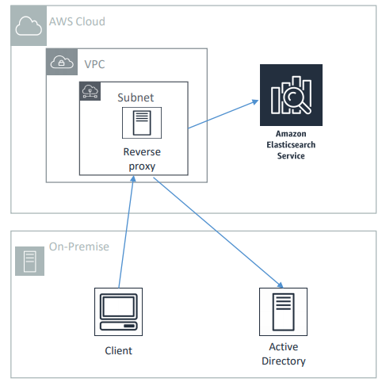

Kibana'ya web interface'den erişilebilir ve böylece cluster içerisine girip http bağlantısı açılabilir.

Bununla baş etmenin en kolay yolu Cognito kullanmaktır. Cognito ile saml 2.0 kullanarak, Microsoft Active Directory gibi bir identitiy provider aracılığı ile veya Google, Facebook veya Amazon gibi sosyal kimlik sağlayacıları ile Kibana'ya login olma imkanı sunar.

Bu şekilde, Congnito hesapları kullanarak giriş yapmalarına ve VPC arkasında olsa bile Kibana'ya erişim mümkün hale gelir.

VPC'ye dışarıdan erişmek kolay değildir.
Çözüm önerilerinden birisi reverse proxy server kullanmaktır.

Nginx, EC2 sunucusunda çalışabilen, request'i VPC'de bulunan Elasticsearch'e yönlendirebilecek ve iletebilecek bir reverse proxy server örneğidir.

Bir diğer çözüm, Kibana'nın dinlediği 5601 portunu ssh'a açılabilr.

#### Notlar

* Öncelik olarak search ve analiz için tercih edilmelidir.
* OLTP sistemler için uygun değildir bu gibi bir ihtiyaç için RDS veya DynamoDB tercih edilmelidir.
* Ad-hoc data query için uygun değildir bu gibi bir ihtiyaç için Athena tercih edilmelidir.

### Amazon Athena

S3'de bulunan veriyi herhangi bir başka ortama göndermeye gerek olmadan, serverless şekilde doğrudan SQL sorgusu çalıştırmamızı sağlar.

Temelde hoş bir kullanıcı arayüzü olan, önceden yapılandırılmış bir Presto instance'ıdır.

S3 bucket'larda bulunan; csv, json, orc, parquet, ve avro veri tiplerini desteklemektedir.

S3'de bulunan veriler unstructured, structured veya semi-structured olabilir. Unstructured veri için ayrıca Glue'da kullanılmalıdır.

**Glue Data Catalog'un burada görevi, veriye structure kazandırmak ve onu SQL sorgusu çalıştırabilir hale getirmektir.**

Örnek verecek olursak, web logları üzerinde ad hoc query çalıştırılmasını verebiliriz ve bu gibi bir mimaride Elasticsearch'den daha fazla kullanıldığını söyleyebiliriz.

Başka bir örnek, staging datayı Redshift'e göndermeden önce kullanılmasıdır.

S3'e aktarılan bir çok verimiz olsun. Bu veriyi transform edip ve Redshift'e yüklemeden önce veri üzerinde inceleme yapmak isteyelim ve bu inceleme neticesine göre mimari bazı kararlar almamız gerekiyor olsun, bu gibi bir durumda kullanılmak için çok uygundur.

**Kısacası Athena verilerin Data Warehouse sistemine girmeden önce, verilerin karakteristiğini anlamak için iyi bir yoldur.**

S3'teki web logları dışında, CloudTrail, CloudFront, VPC, Elastic Load Balancer logları dahil olmak üzere diğer log dosyalarını da sorgulamak için kullanabiliriz.

Jupiter, Zeppelin ve RStudio notebook gibi yazılımlara da entegrasyon sağlanabilmektedir.

ODBC ve JDBC arayüzleri de bulunmaktadır. Bunun sayesinde QuickSight dahil olmak üzere başka visualization toolları ile entegre olabilmektedir.

**Kompleks SQL sorgulamaları için Athena tavsiye edilmez. Böyle bir ihtiyaç için Redshift daha uygun olacaktır. Redshift, karmaşık SQL sorgularını çalıştırma yeteneğine sahiptir.**

#### Athena + Glue

S3'de bulunan veriler için, Glue data catalog populate eden bir Glue crawler olduğunu düşünelim.

Bu crawler'ın görevi tablo kolon ve tanımını extract etmek olsun ve böyle bir yapı için Glue console kullanılabilir.

Athena için Glue data catalog'a sahip olduğumuzda, Athena bunu otomatik olarak görecek ve bundan otomatik olarak bir tablo oluşturacaktır ve ardından rahatlıkla bunun üzerinden SQL sorgusu çalıştırılabilecektir.

Bu veri catalog'unu sadece Athena kullanmayacaktır, hernagi bir analitik tool bu veriyi görselleştirmek ve analiz etmek için de kullanabilir.

**Örneğin;** RDS, Redshift, Redshift Spectrum, EMR ve ayrıca Glue data catalog, Hive metastore olarak kullanılabildiğinden; Apache Hive metastore ile uyumlu herhangi bir uygulama kullanabilir.

Athena servisi kullanıldığı kadar ödenen bir servistir ve tb başına 5 dolar gibi düşük bir ücret ödenmektedir.

Başarılı olmuş veya iptal edilmiş sorgular için ücret alınırken, başarısız olan sorgular için ücret alınmamaktadır.
DDL işlemleri de ücretsizdir.

Athena sorgu çalıştırıken, verilerin yalnızca gerekli sütunları seçerek okuma yapmaktadır bu nedenle az sayıda sütün üzerinde sorgulama yapan uygulamalar için ORC ve Parquet formatı %30-%90 arasında daha tasaruflu olur.

Kısacası Athena en iyi columnar formatta çalışmaktadır.

Athena ile birlikte S3 veya Glue kullanılırsa, bunlar için de ayrıca ücretlendirme yapılmaktadır.

Data; S3'de saat, tarih gibi farklı partitionların kullanılması, daha az veri üzerinde tarama yapılmasını sağlayacağı için, dizayn'da hem sorgu performansı için hem de tasaruf için önem teşkil etmektedir.

IAM access control list ve S3 bucket policies, erişimlerin kısıtlanmasında kullanılabilir.

S3'de tutulacak veriler için, S3-managed-key ile yani SSE-S3 veya SSE-KMS ile yani KMS key ile server side encryption yapılabilir.

CSE-KMS ile de yani KMS key ile client-side encryption yapılabilir.

Athena hesabı ile S3 hesabı aynı account'a bağlı olmak zorunda değildir. Ayrı account olan bir yapıda S3 bucket policy önemli bir rol oynamaktadır.

Athena ile S3 arasında da TLS kullanılarak in-transit encryption yapılabilir.

**Önerilmeyen Kullanım Alanları:**
Formatlanmış raporlar ve visualization için uygun değildir. Bu gibi bir ihtiyaç için QuickSight tercih edilmelidir.
ETL extract işleri için de tavsiye edilmez. Glue kullanmak veya Apache Spark kullanmak daha doğru bir tercih olacaktır.

## Redshift

AWS'in distributed petabyte mertebesinde DWH çözümüdür. Server bakımı AWS tarafından yapıldığından, cluster yönetimi ile kullanıcının ilgilenmesine gerek olmamaktadır.

Diğer DWH sistemlerinden 10 kata kadar daha iyi performans göstermektedir. 
Yüksek performanslı diskler, columnar storage ve massive parallel query execution (MPP) kullanarak hızlı ML modelleme sağlar ve işleri cache'de yaparak bunu süper hızlı hale getirir.

Online Analytic Processing yani OLAP sistemler için tasarlanmıştır ve OLTP sistemler için uygun değildir.
Cost effective'dir. Sadece harcanan kaynaklar için ücret ödenmektedir. Hesaplandığı taktirde, On-Premise kaynakların yaklaşık 1/10 kadar maaliyet oluşturur.

* Veri üzerinde SQL sorgusunu, OBDC ve JDBC bağlantı ile BI toolları ile sorgulama yapmayı desteklemektedir.
* API call ile veya Amazon Console ile, scale up veya down yapılabilmektedir.
* Replication ve backup desteklemektedir.
* Sistem, CloudWatch ve CloudTrail ile monitor edilmektedir.
* **RedShift, SQL uyumlu protocol kullanarak structure veriler üzerindeki ad-hoc queryler çalıştırabilir.**
    * **RDS ad-hoc analitik için uygun değildir.**
* **Karmaşık SQL sorgularını çalıştırma yeteneğine sahiptir.**

**S3'deki unstructured verileri, DWH'da başka bir tablo olarak import edilmek istenirse, Redshift spektrum ile yapılabilir.**

Analitik workload'ları hızlandırma, DWH modernizasyonu, veri analizinde bulunmak, historical verilerin saklanması, clickstream gibi verilerin tutulmazı ve analiz edilmesi, sosyal medya verilerinin analizi Redshift'in kullanılabileceği alanlardır.

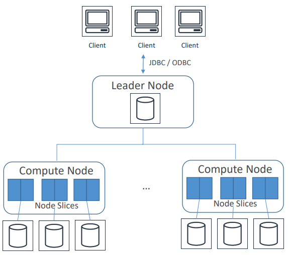

Bir cluster, Amazon Redshift'in temel altyapı bileşenidir.

Cluster, bir leader node'dan ve cluster tipine bağlı olarak, 1-128 arasında compute node'a sahip olabilir.

Sınırsız ölçeklenebilir değildir. 128 üst limittir ve bu sayıda node'da çok yüksek miktarda veri turulabilir ayrıca her bir cluster bir veya daha fazla veri tabanı içerebilmektedir.

Leader node'un vazifesi, client programları ile compute node'lar arasındaki iletişimi yönetmektir.

Client tarafından gönderilen sorguları alarak, bunların execution planını belirler, bu execution planına göre gelen sorgunun compute node'larda parallel olarak çalışmasını sağlar ve sonucu client uygulamasına gönderirir.

Compute node'lar, taleplerin çalıştırılmasından sorumludurlar. Çalıştırdıktan sonra bu sonuçları Leader node'a gönderirler.

Bu aşamada gelen veriler aggregation aşamasına girer yani bir araya getirilmesi gerçekleşir.
Her compute node kendi CPU, memory ve storage'ına sahiptir.

Redshift cluster'ında seçilebilecek iki tip node vardır. 

Bunlardan birincisi, çok büyük DWH ortamı oluşturulmasını sağlayacak, Dense yani daha yoğun storage tanımı yapabileceğimiz D.S tipidir.

Bir diğeri ise arka planda HDD diskleri kullanan daha düşük maaliyetli disklerdir.

Bu iki tip de, Extra large XL ve 8XL  olmak üzere iki ayrı boyut olarak seçilebilmektedir.

Extra large XL,  toplam 2Tb magnetic storage'a sahip 3HDD bulundurur.
8XL, toplam 16Tb magnetic storage'a sahip 23 sabit sürücüsü bulunmaktadır.

### Redshift Spectrum

Spectrum, exabyte seviyesinde query çalıştırılmasına olanak sağlar.

**Redshift spektrum, Athena'nın AWS Glue'yu kullanarak yaptığı gibi S3 datası üzerinden tablo oluşturabilir.**

**S3'de bulunan verileri Redshift cluster’ına yüklemeye veya bu verilerin transform edilmesine gerek olmadan, çalıştırılmasını sağlar.**

S3'de aynı anda birden fazla sorgunun aynı verilere erişmesine izin vererek, eş zamanlılık sağlar ve gerekise binlerce instance'a ölçeklenebilir ve böylece sorguların veri boyutuna bakılmaksınız hızlı bir şekilde sonuç alınması sağlanacaktır.

Her birini bağımsız olarak ölçeklenmesine izin veren storage ve compute kapasitesini de ayırmamıza olanak sağlar.

Spectrum ile bütün storage işi S3'de yapılmaktadır.

Spectrum, çok sayıda open-source veri formatını desteklemektedir.

Bunların arasında; Avro, CSV, Grok, Ion, JSON, ORC, Parquet, RC, Regx, Cirta, sequence dosyaları, text dosyaları ve TSVs bulunmaktadır.

Gzip and snappy compression desteklenmektedir.
Default block size 1 mb kullanarak IO request sayısının düşük olması sağlanır.

Index ve materialized view, Redshift'de gerekli değildir ve bu nedenle geleneksel relational veri tabanlarından daha az yer kullanır.

Redshift otomatik olarak verileri replike etmektedir. 
Asynchronously olarak başka bir region'da bulunan S3'e backup alınır. Orjinal veri, replike ve backup olmak üzere, veriler 3 farklı yerde saklanmış olur.

Otomatik snapshot'lar da, by default 1 gün retention ile enable edilebilir. Bu retention 35 güne kadar çıkabilir.

Cluster'da bellir bir node'da arıza yaşanırsa, Redshift bunu otomatik olarak algılar ve node'u değiştirir.
Ancak bu node eklenene kadar cluster, sorgulama ve update için kullanılamayacaktır.

S3'de en çok erişilen veriler ilk önce yüklenir böylecek en kısa sürede arızanın giderilmesi sağlanır.

Redshift tek bir AZ kullanımı ile sınırlıdır. Bu nedenle herhangi bir AZ arızasında, cluster kullanımı mümkün olmayacaktır.

Snapshot ile, aynı region'da bulunan başka bir AZ cluster restore edilebilir.

### Redshift Distribution Tipleri

Redshift'de tabloların verilerinin dağılımı için birden fazla seçenek mevcuttur. Redshift'de tablo oluştururken, data bu seçime bağlı olarak dağıtılmaktadır.

Dağıtımının iki ana amacı varıdr. Birincisi, iş yükünü kümedeki node'lar arasında eşit olarak dağıtmak ve sorgu sırasında data hareketini en aza indirmektir.

**Auto:** Bir şey seçilmemişse default olarak auto seçilmektedir. Auto kullanıldığında, Redshift tabloda bulunan datanın size'ına bağlı olarak en uygun dağıtım seçilir.

**Even:** Satırlar round-robin biçiminde sıralı olarak dağıtılır. Her bir slice'a dairesel olarak veriler dağıtılır. Key distribution veya all distribution tanımlarına uygun ve net bir tablo yapısı yoksa kullanılabilir.

**Key:** Satırlar bir sütundaki değerlere göre dağıtılır.  Aynı kolon değerleri, aynı slice yerleştirir ve ortak kolon eşleşme değerleri birlikte depolanır.

Belli bir kolona dair sorgulama yapılacak ise Key distribution seçilmelidir.

**All:** Tabloların tamamı, bütün node'lara kopyalanır.

Update ve birden fazla tabloya insert işleri uzun sürer. ALL distribution hız gereksinimi olmayan, çok fazla update görmeyen, küçük dimension tablolar için uygun olabilir.

### Redshift Sort Keys

Satırlar, sort key olarak belirlenen kolon veya kolonlara bağlı olarak sıralı olarak tutulur.

Redshift, metadatanın bir parçası olarak her blok için minimum ve maksimum değerleri otomatik olarak kaydeder.
Gönderilen sorgu aralık sınırlaması olan syntax kullanıyorsa; query, processor scan sırasında, full scan yapmamak için min ve max değerlerini kullanabilir.

Min ve max değerlerinin hesaplanması ihtiyaca göre belirlenmelidir.

Bir kolon üzerinde frequent range filtering veya equality filtering uygulanırsa, Redshift o kolondaki bütün verileri okumayacaktır. Çünkü her blok için min ve max değerlerini ciddiye alır ve kritere uymayanlar üzerinde bir okuma gerçekleştirmez.

Index gibi çalışır ve aynı zamanda range tipinde sorguların daha hızlı olmasını sağlar.

**Redshift interleaved sort key,***** key'de bulunan her kolonu eşit şekilde ölçerek, filtre olarak key'de bulunan kolonlardan hangisi kullanılırsa kullanılsın gelişmiş performans sağlamak için tasarlanmıştır.

Aynı RedShift cluster'ında bulunan bir tabloyu birden fazla ekip farklı şekilde sorgu çalıştırarak kullanıyorsa, performansı arttırmak için her takım için interleaved sort key eklenebilir.

### Redshift Data Flows

##### Importing/Exporting data

**Copy:**
Copy komutu ile aynı anda birden fazla data dosyası veya birden fazla data stream okunabilir.
S3'den, EMR'dan, DynamoDB'den veya ssh kullanarak remote bir host'dan data import edilebilir.
Bu gibi işlemlerde güvenlik gerekçesi ile S3, manifest file ve IAM role talep edecektir.

**Copy komutu Noload parametresi ile de gönderilebilir.** Bu durumda veri bütünlüğünü yüklemeden önce kontrol edilebilir ve olası dosya kopyalama sorunlarının önüne geçilmesini sağlar.

**Unload:**
Bir tabloyu, S3'e dosya halinde export etmek istenirse, unload komutu kullanılmalıdır.
Redshift'de bulunan bir tabloyu, S3'e dump olarak almanın en iyi yolu unload komutudur.

**Redshift'de çalıştırılacak UNLOAD ENCRYPTED komutu, client side encryption kullanılarak verileri, arka planlar https kullanarak, S3'e şifreli olarak aktarılmasını saglar.**

**VPC routing:**
Cluster ile VPC arasındaki repository arasında tüm copy ve unload trafiğinin gerçekleşmesini sağlar ve bu sayede bu trafiğin internet üzerinden yapılmasını engellemiş olur.

Bunun için VPC endpoint, Net Gateway veya Internet Gateway gerekmektedir.

*****Redshift'den snapshot alarak otomatik olarak başka region'a göndermek isteyelim.**

* KMS-encrypted Redshift cluster var ve buna ait snapshot olsun.
* Backup amacı ile bu snapshot bir başka region'a gönderilmek istensin.

**Hedef AWS region'da,**

* KMS key yok ise bir tane oluşturulmalı,
* Copy yetkisi için unique bir ad belirlenmelidir.
* Belirlenen Copy yetkisi için, KMS key ID belirlenmelidir.

**Source region'da,**

* Oluşturulan copy yetkisi ile snaphsot kopyalama işi enable edilmelidir.

**DBLink:** Redshift ve PostgreSQL arasında bağlantı sağlar ve bu iki sistem arasında copy ve sync işleri için uygundur.

### Diğer Servislerle Entegrasyonu

**S3:** Redshift'den parallel processing ile data export edilerek, S3'de bulunan birden fazla dosyaya gönderilebilir. 
S3'de bulunan data, Redshift'e import'da edilebilir.

**DynamoDB:** Copy komutu kullanılarak, DynamoDB'de bulunan veriden Redshift tablosu oluşturulabilir ve ayrıca aynı komut ile DynamoDB'den alınan data, Redshift'e tablo oluşturulmadan da aktarılabilir.

**EMR/EC2:** ssh ile data import edilebilir. Yine copy komutu ile bir veya daha fazla remote sunucudan data load edilebilir.

**Data Pipeline:** Redshift'e veya Redshift'den, data movement ve transformasyon otomatize edilebilir.

**Database Migration Service:** Redshift'e data migration yapabilir.

**Redshift Worload Management (WLM):** Sistemde bulunan workload'ları önceliklendirmeye yardımcı olur. Console veya API call ile yönetilebilir.

**Vacuum komutu:** Silinmiş satırlardaki alanı kurtarlamak ve sort order'ı düzenini restore eder. Bir nevi fragmantasyon gibi düşünebiliriz. Dört ayrı komutu bulunmaktadır.

**Vacuum Full:** Silinen bütün satırlar üzerinde işlem yapar.
Vacuum Delete Only: Full ile aynıdır ama ondan farklı olarak sort kısmını yapmaz.
**Vacuum Sort Only:** Disk alanı ile ilgilenmez sadece sort kısmı ile ilgilenir.
**Vacuum Reindex:** Sadece indexler üzerinde rebuild işlemi yapar.

**Önerilmeyen Kullanım Alanları:**
Küçük veri setleri ile çalışmak, Redshift için uygun olmayacaktır. Bunun için RDS tercih edilmelidir.
OLAP için dizayn edilmiştir ve OLTP için uygun değildir.

ETL için EMR veya Glue ETL daha uygundur.
Blob verileri depolamak için uygun değildir.

*****Redshift database'i KMS kullanılarak şifrelenmiştir ve başka bir AWS region'a KMS encrypted snapshot oluşturmak için AWS CLI kullanılacaktır. Bunun için aşağıdaki adımlar izlenmelidir.**

* Hedef region'da, yeni bir KMS key oluşturulmaldır.
* Redshift'in, hedef region'da KMS key kullanmasını sağlamak için CreateSnapshotCopyGrant kullanılmalıdır.
* Source region'da, cross-region replication enable olmalı ve oluşturulmuş olan copy grant adı tanımlanmalıdır.

https://docs.aws.amazon.com/redshift/latest/mgmt/managing-snapshots-console.html#xregioncopy-kms-encrypted-snapshot

**Redshift Enhanced VPC Routing:** Redshift Enhanced VPC Routing kullanıldığı zaman; Redshift, data repository ve cluster arasındaki bütün copy ve unload trafiğini VPC üzerinden yapacaktır. Enhanced VPC Routing enable değil ise AWS network içerisindeki trafik de dahil olmak üzere, akış trafiğini internet üzerinden yönlendirir.

## Amazon RDS (Relational Database Service)

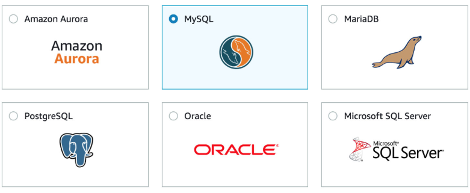

* Client information, address, kredi karti bilgileri, client bilgileri gibi bilgileri barindir.
* DB instance’a yani OS’a erişim yoktur ama engine’e erişim vardır.
    * Operation system yetkileri de isteniyorsa, RDS seçilmemelidir. RDS, AWS tarafından manage edilir ve sadece DB engine'e erişim sağlar. Operation system yetkileri için, EC2 kullanılmalıdır.
* Point-time-in recovery yapılabilir.
* Administration tarafını AWS yönetir, manage’dır. **Fully Managed değildir.**
    * Automated patch, backup gibi admin işleri kullanıcı yapmalıdır.
    * Software updates,
        * RDS kullanıcıları, major versiyon upgrade'leri ve bir çok minor upgrade'leri ne zaman olacağını kontrol edebilirler.
    * Gerektigi taktirde storage ve compute yükseltmesini,
    * Multi AZ secilmisse; active ve standby arasindaki senkronasyon işlerini AWS yönetir.
* DB instance'lari, weekly maintenance çalışır ve eğer belirtilmezse, AWS default olarak 30dk olarak seçer.
* DB settings, build DB schema, performance tunning işlerini AWS yüklenmez. AWS’in DB engine ulaşım sağlamasının temel nedeni de budur.
* MS SQL, Oracle, PostgreSQL, MariaDB, AWS Aurora ve MySQL desteklenen relational database'lerdir.
    * Database'ler için iki tür lisanslama vardir.
        * Bring your own liccense (BYOL) - Mevcut lisans var ise, aktarilabilir.
        * License included, saatlik olarak ücretlendirilir.
        * **Oracle RMAN ve RAC RDS'de support edilmez.**
* Bir account icin en fazla 40 DB instance olabilir.
        * License included modelinde, 40 tanesinden 10 tanesi Oracle ve MS SQL olabilir.
        * BYOL kullanilirsa, 40 tanesi istenilen DB tipi olabilir.
* Amazon RDS, DB ve Log storage icin EBS volume kullanir. (Instance-Store kullanilmaz)
* Üç tip kullanım vardır;
    * **General Purpose:** Genel orta düzeyli I/O gereksinimi icin kullanilir.
    * **Provisioned IOPS RDS Storage:** Yoğun OLTP isleri icin kullanilir.
    * **Magnetic RDS Storage:** Düşük DB workload icin kullanilir.
* Max storage kapasitesi desteklenen DB’ler için 16TB’dır.

Spesifik ayarları bir grup database'e aktarılmak isteniyorsa, **Parameter Groups** kullanılabilir.
**Alter Database** komutunu tek tek çalıştırmaktan ziyade, bu grup yardımı ile, hepsine uygulanabilir.

Spark, Hive ve Presto için merkezi bir metastore ve birden fazla cluster'dan erişilmesi isteniyorsa, RDS kullanılabilir.

### Multi-AZ RDS

* Aynı region'da farklı AZ'da olmalıdır.
* Standby'da read ve write yapılamaz.
* Standby'ın hangi AZ'da olacağını AWS seçer.
* AWS multi-AZ için provisioned IOPS instance tavsiye ediyor.
* Manual olarak failover ancak reboot sırasında olabilir. "Reboot with failover" seçeneği Primary RDS DB tarafında seçilebilir.
* API call ve CLI ile son 14 gunluk RDS event'leri görülebilirken, console üzerinden sadece son gün görülebilir.
* OS patching, system upgrade ve DB scaling önce standby'da yapilmaktadir.
    * Multi-AZ'da yer alan RDS database'lere storage arttırımı gibi bir maintenance yapılacak ise, Standby Maintenance, Failover to Standby, Eski Primary Maintenance yapılır ve artık eski DR sistemini yeni Prod olarak kullanılması devam eder. Tekrar eski prod'a failover yapmaya gerek yoktur.
* Manual olarak, support edilen DB instance'larindan birine DB console üzerinden upgrade yapilabilir.
    * RDS/DB Instances/Modify DB Instances/ Set DB Engine version
        * By default, degisiklikler bir sonraki maintenance zamaninda olur ama istenirse, force an immediate yapilabilir.
* Multi-AZ’da, synchronous replikasyon yapılmaktadır.

### DB Automated Backups

* AWS Auto backup alinirken, verinin de sağlıklı olup olmamasini kontrol eder.
* Backup'lar S3'de tutulur.
* Multi-AZ icin backup'lar standby tarafindan alinir. (MariaDB, MySQL, Oracle ve PostgreSQL icin gecerlidir.)
* Backup alınabilmesi icin DB "Active" state'de olmalidir.
* Manual backup'lar point-in-time recovery için kullanılamaz.
* Backup'lar daily alinir ve DB transaction log'lari da buna dahildir.
* By default enable'dir.
* RDS silinirse, automated backup'lar da silinir.
* Retention 0 ayarlanirsa, automated backup alınmıyor demektir.
* Automated backup'lar, MySQL icin sadece InnoDB storage engine destekler. ISAM'da dahil olmak üzere, diğerlerinde beklenmeyen sonuçlar doğurabilir.
* Backup'lar direk share edilemez ama kopyasi alinarak paylasilabilir.

### Manual Backups

* Point-in-time recovery için kullanılamaz.
* RDS silinirse, manual backup'lar silinmez.
* Backup'lar S3'de tutulur.
* Diger AWS account'ları ile paylaşılabilir.
* DB restore sonrası, sadece default DB parametreleri, security group'ları gelir.
    * Restore sonrası, custom DB parametreleri ve security gruplari apply edilmelidir.
* DB snapshot'ı, mevcut olana restore edemeyiz, yeni bir tane oluşturulmasi gerekmektedir.
* Restore sonrasi, RDS endpoint'de degisir. Uygulama bunun üzerinden çalışıyorsa, güncellenmelidir.
* Restore sürecinde, storage tipi de değişebilir. (General purpose, Provisioned IOPS, Magnetic)

### RDS DB Security and Encryption

* Mevcut un-ecrypted DB instance'ı, encrypt edilemez.
    * Yeni bir ecrypted DB oluşturulup, un-ecrypted data'yi migrate edebiliriz.
    * Yeni bir ecrypted DB oluşturulup, backup/restore yapabiliriz.
* RDS, DB instance ve App instance arasinda SSL haberleşmeyi support eder.
* Encrypted DB'de, snapshot'lar, backup'lar, data ve bu database'den olusturulan replica da encrypt'dir.
* AWS IAM account, RDS API olan yetkileri kontrol eder.

AWS Storage Gateway ve AWS glacier’da data by default encrypt edilir. Amazon RDS, ECS ve Lamda’da encryption destekler ama enable edilmesi gerekmektedir.

SQL Server DB instance gibi bir database instance oluşturulduğu zaman, Amazon RDS database için SSL sertifikası oluşturacaktır. 

SSL sertifikası, sahtecilik saldırısına karşı koruma için, Common Name (CN) olarak DB instance endpoint içerecektir.
SSL kullanarak SQL Server instance'a bağlanmanın iki yolu vardır.

* Bütün bağlantıları SSL'e zorlamak veya
* Belirli bir connection'ı encrypt etmektir.

**Force SSL** kullanılarak bütün bağlantılar SSL'e zorlanacak ise, statik parametre olan rds.force_ssl parametresini true yaparak, parametrenin aktif olması için DB instance'ı reboot etmek gerekmektedir.

Belirli bir connection bağlantısını encrypt etmek için de, Client için RDS Root CA sertifikası alarak, sertifikanın server'a import edilmesi gerekiyor ve uygulamanın da konfigüre edilerek, RDS'e bağlantının SSL olmasını sağlayabiliriz.

### RDS Faturalama

* Saat başına DB instance kullanımı (hem Primary hem de Standby için)
* Storage GB/mo.
* Sadece Magnetic RDS storage için, I/O request/mo. (hem Primary hem de Standby için)
* RDS Provisioned IOPS SSD Instance için, Provisioned IOPS/mo.
* Internet data transfer
* Backup Storage (DB backups, active manual snapshots)
    * 10GB'a kadar olan EBS volume size için automated RDS backup'ları ücretlendirilmez.
* Multi AZ
    * Multi-AZ DB hours
    * Multi AZ Provisioned Storage
    * Double write I/Os (Primary I/O ve Primary -> Standby replikasyonu)
        * Data transferi için ayrıca ödenmez.
* Single AZ (Free tier)
    * Her account için 1 yıllık 750 micro instance hours/months
    * Oracle için BYOL (BringYourOwnLicenses) veya License included gereklidir.

### Read Replicas

* I/O kapasitesin dolması ve daha fazla I/O ihtiyacı gereksinimi olduğundan kullanışlı olabilir.
* Read replica, Primary RDS instance'ın sadece okuma için kullanılan replicasıdır.
    * Data önce Primary DB instance'a yazılır. Sonra da asynchronous olarak read replica'ya yazılır.
    * Birden fazla read replica olabilir.
    * Multi-AZ read replica oluşturulamaz.
    * Console ve API ile oluşturulabilir.
    * Automatic backup'ın enable olması gerekmektedir.
    * InnoDB engine support edilir. MyISAM support edilmez. (MyMAPo)
        * MySQL
        * MariaDB
        * PostgreSQL support edilenlerdir.
* Replication Chain en fazla 4 olabilir. (Primary  ReadReplica1  ReadReplica2  ReadReplica3)
* Failover veya Switchover durumunda, Read Replica'lar, yeni Primary'den okumaya devam edeceklerdir.
* Primary silinirse, Replica'lar silinmez ve Single AZ stand-alone DB instance olurlar.
* ReadReplica1 promote olarak, read-write instance haline gelirse; ReadReplica2, halen eski ReadReplica1 ve yeni DB instance'dan okumaya devam edecektir
* Primary ve repllica arasındaki replication 30 gün boyunca devam etmez ise, replicasyon düzeltilemeyecek şekilde terminate olur.
* MySQL, MariaDB ve PostgreSQL için farklı bir region'da read replica oluşturulabilir.
* Standalone DB instance'a dönüşmüş olan promoted replica,
    * Backup retention period
    * Backup window
    * DB parameter group bilgilerini halen tutar ve bu bilgiler bir önceki kaynak Prod sistemi ile aynıdır.

**RDS’de, read replica synchronous replikasyon sağlamaz. Asynchronous replication sağlar.**

**Synchronous replikasyon isteniyorsa, Multi-AZ kullanılmalıdır. Ancak bu AZ’lar kesinlikle aynı region’da olmalıdır.**


### RDS Scaling

* Compute ve Storage size arttırılabilir ancak azaltılamaz.
    * Storage scaling online yaplılabilir ancak bazı performans sorunlarına neden olabilir.
    * Compute scaling downtime'a neden olabilir.
* Storage type MS SQLServer dışında değiştirilebilir.

#### Sınav Sorularından Notlar

* Elasticache sık sık okunan verileri cache'e alarak, okuma yükünün azalmasını sağlayabilir.
* Synchronous replication sadece aynı region'da olabilir. Farklı region'larda support edilmez. Farklı region'lar için, DR çözümleri Asyncronous replica olabilir.
* DB instance'da event takibi isteniyorsa, subscribe yapılması gerekiyor. Bu şekilde, DB instance, DB cluster, DB snapshot, DB cluster, DB parameter group değişim bilgilerini alabiliriz.
* RDS kullanıcıları, major versiyon upgrade'leri ve bir çok minor upgrade'leri ne zaman olacağını kontrol edebilirler.
* Backup window değiştirilirse, etkisini hemen gerçekleşir.
* Backup, Prod RDS'den alınırsa, bir kaç dk için I/O operasyonları suspend olabilir.

### Amazon RDS CloudWatch Enhanced Monitoring

CloudWatch, DB instance için metricleri hypervisor’dan alır. Enhanced monitoring ise instance’daki agent’dan alır. Bu iki sonuç aynı olmayacaktır çünkü hypervisor katmanı daha az miktarda veri barındırır bu nedenle enhanced monitoring daha avantajlıdır.

Spesifik bir process için ne kadar cpu ve memory kullandığını öğrenmek istiyorsak enhanced monitoring kullanılmalıdır.

MariaDB, Microsoft SQL Server, MySQL version 5.5 veya sonrası, Oracle, PostgreSQL database’leri için geçerlidir. RDS child process ve OS process bilgilerini toplayabilir.

# Visualization

## Amazon Quicksight

### QuickSight Visual Types


İkinci dünya savaşında kaybedilen insanların grafik ile oranları görünmektedir.
Kırmızı bar milyon olarak ve mavi bar nüfusa oranı temsil etmektedir.

Bar Charts, histogramları karşılaştırma ve distribution için kullanılır.

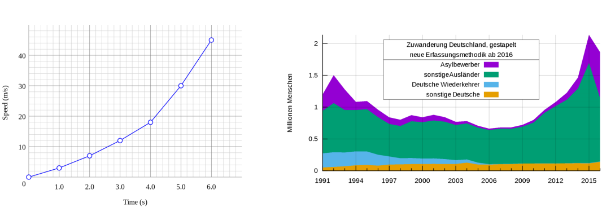

Line graphs, zaman içinde olan değişimler için kullanılır

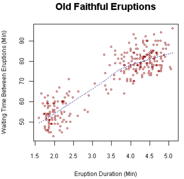

Scatter Plots;  korelasyon ve dağılım grafikleri için kullanılmaktadır.


Heat maps; 3 boyutlu veriye örnektir. Yanda bulunan heat map, hangi genin hangi şartlar altında olduğunu gösterir ve belirli bir gen ifadesini genel üzerinde yorumlamayı sağlar.

Örnek olarak, sol üst köşeye dahil olan gen için bazı şeylerin farklı olduğu görünüyor.

Scatter plots ve heat maps korelasyon için kullanılır.

Pie graphs ve tree maps, aggregation için kullanılır.

Pivot tables, tablo verileri için kullanılır.

Stories, farklı dashboard'lar veya grafikler kullanarak slide show hazırlamak için kullanılır.

**Bar Charts:** Karşılaştırma ve dağıtım için (histogramlar için) kullanılır.
**Line graphs:** Zaman içinde olan değişklikler için kullanılır.
**Scatter plots:** heat maps: Korelasyon için kullanılır.
**Pie graphs:** tree maps: aggregation yani toplama için kullanılır.
**Pivot tables:** Tablo veriler için kullanılır.

#### Alternatif Görselleştirme Araçları

* Web tabanlı olanlara örnek olarak; D3.js, Chart.js, Highchart.js örnek verilebilir.
    * **D3.js:** Datayı referans alarak, dökümanları düzenlemek için kullanılan bir JavaScript kütüphanesidir. **HTML, SVG ve CSS kullanmaktadır.** Görselleştirme bileşenlerini ve DOM manipülasyonuna veri odaklı bir yaklaşım ile, modern tarayıcıların tüm özelliklerini sunar.
* Business Intelligence örnek olarak da; tableau ve MicroStrategy örnek verilebilir.

# Security

## Encryption 101

**Encryption in flight:** Veri gönderilmeden önce encrypt edilir ve alınmadan önce de decrypted edilir.

Kredi kartı gibi hassas olan bir veri, ödeme yapmak için web üzerinden gönderilecek ise, bu verininin gideceği web yolu üzerinden şifreli yani encrypt olması gerekmektedir.

SSL sertifikaları bu gibi bir durumda ihtiyacı karşılayabilmektedir. Bunun bir diğer yolu da https kullanmaktır.
Encryption in flight, MITM (man in the middle attack) diye tabir edilen, verinin ulaşma sürecinceki saldırıyı engellemek için kullanılmaktadır.


Yukarıdaki örnek, bir AWS servisine https ile bağlandığımızda olan encyption sürecini anlatmaktadır.

**Server side encyption at rest:**

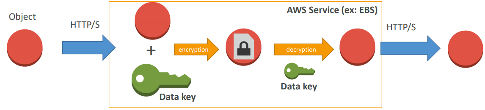

Data, server'a geldikten sonra encrypt edilir ve client'a gönderilmeden önce tekrar decrypted edilir.

Encryption ve decryption, genelde data key diye adlandırılan bir anahtar ile yapılır. Encyption ve decryption için kullanılan key güveli bir yerde saklanmalıdır.

AWS platformunda KMS Key Management adında servis tarafından kontrol edilir ve server'ın bu servis ile haberleşmek için gerekli yetkilerinin olması gerekmektedir.

**Client side encyption:**

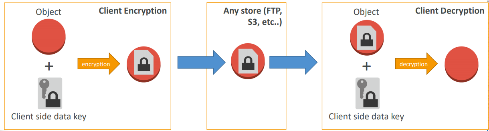

Data client tarafından encrypt edilir ve hiç bir zaman server tarafından decrypted edilemez, sadece client tarafında decrypted edilir.

Best practice olarak da, server asla verileri decrypted edememesi lazım. Bunun için Envelope Encryption'dan faydalanılabilir.

## AWS KMS (Key Management Service)

AWS servislerinin, encyption key'lerini yöneten servistir ve veriye erişimin kontrol altında tutulmasının en kolay yoludur.

Authorization kısmı IAM ile entegre olarak çalışmaktadır.
KMS'de yapılan API call'ları takip edilmesi isteniyorsa, bu da CloudTrail ile yapılabilmektedir.

KSM'den faydalanmak için CLI veya SDK kullanılabilir.

Database şifreleri, external servis giriş bilgileri, SSL sertifikası için private key gibi hassas veriler için KMS kullanılması tavsiye edilir.

KMS call başına en fazla 4kb veri encrypt edebilir. Eğer data 4kb üzerinde ise, Envelope encyption kullanılmalıdır. 

Envelope encyption, yeni bir data key oluşturur ve bu key big data setlerini encrypt etmek için kullanılır.

KMS erişimi için, key policy'nin kullanıcıya izin vereceğinden ve IAM policy'nin API call'lara izin verdiğinden emin olunması gerekiyor.

KMS ile key ve policies yönetilebilmektedir. Bu yönetimin içeriğide; yeni key oluşturma, policy rotation, keylerin ihtiyaca göre disable ve enable edilmesi vardır.

CloudTrail ile key usage denetlenebilir ve bu her 10000 call için 0.03$ olarak ücretlendirilmektedir.

Üç tip CMK (Customer Master Keys) bulunmaktadır.

* AWS Managed Service Default CMK, ücretsiz olarak kullanılabilmektedir.
* Kullanıcı tarafından AWS ortamında oluşturulmuş KMS, aylık 1$ olarak ücretlendirilir.
* Kullanıcı tarafından import edilen key: yıllık 1$ olarak ücretlendirilir ancak burada tek bir koşul vardır. O da import edilecek key'in, 256 bit symmetric key olması gerektiğidir.

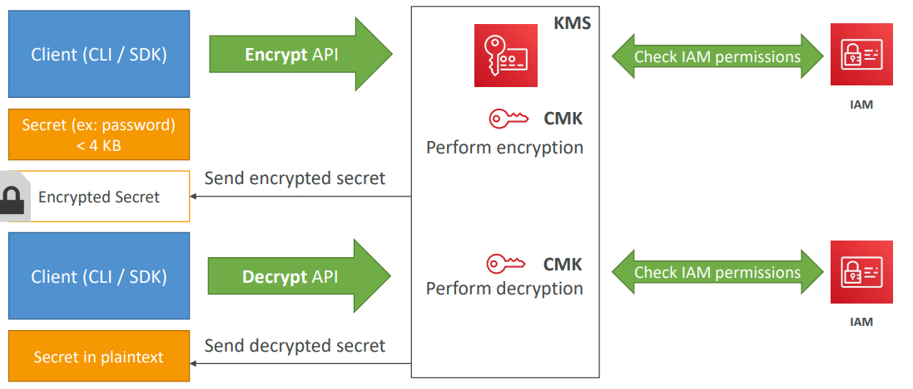

Client veya SDK olduğunu düşünelim, 4kb'dan daha düşük bir şifremiz olsun ve encrypt API kullanacağız.

KMS servisi, kullanılmak istenen CMK bakacak, kullanıcının buna yetkisi olup olmadığını kontrol edecek ve IAM tarafından da onay gelirse, her iki kontrolden de geçmiş olacak.

Bundan sonra encyption yapılmasına izin verilecek ve KMS encrypted secretları geri gönderecek.
Bir şey göndermiş olan CMK hiç görünmedi ve encrypted secret geri alındı.

Bu encrypted secret saklanacak ve kullanacağımız uygulama bu secret'ı decrypt edecek.

Tekrardan CLI veya SDK ve decrypt API call kullanacağız. Aynı CMK’i kullanarak, tekrar KMS decrypt etmek için yetkimiz olup olmadığı kontrol edilecek ve decrypt sonrasında, encrypt olmuş secret'ı açık şekilde tekrar göreceğiz.

Decrypt işlemi KMS olmadan asla yapılamaz. Bunun için KMS erişimi olan CMK olmak zorundadır.

AWS servislerinden S3 hariç, hepsinde encrypt olmayan bir storage'da encyption yapılacak ise, encrypt backup veya snapshot alınmalı ve bununla migration yapılmalıdır. S3 için ise encryption'ı enable etmek yeterlidir ve bu işlemden sonra on the fly encryption gerçekleşecektir.

## Cloud HSM (Hardware Security Module)

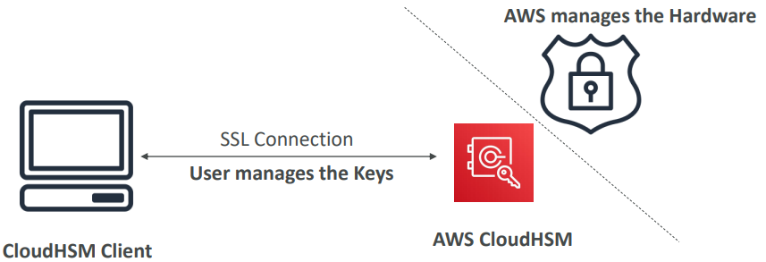

KMS kullanmanın bir alternatifi olarak, HSM kullanmaktır.

KMS kullanırken, software manage kısmını AWS yönetir ancak bazı şirketler daha fazla kontrol talep etmektedirler.

AWS burada da encryption hardware kısmını sağlamaktadır. Software kısmı kullanıcının kontrolündedir ve encrypt/manage key kısımlarını kendisi kontrol eder.

AWS hangi encryption key kullanıldığını bilmez ancak hardware kurcalanmamasına karşı garanti verir ve AWS Cloud Data Center'a çok yetkili kullanıcılar dışından kimse giremez ve FIPS 140-2 level 3 uyumluluğu vardır.

Availability için cluster'lar multi AZ olarak çalışmaktadır.
KMS’in aksine hem symmetric hem de asymmetric encryption desteklemektedir. Yani hem SSL hem de TLS key desteklemektedir.
Bu servisin ücretsiz sürümü yoktur ve HSM isteniyorsa, CloudHSM Client Software kullanılmalıdır.

Kurumsal HSM var ise ve AWS Redshift kullanılıyorsa, Redshift Cluster’ı, VPN bağlantısı ile kurumsal HSM ile de uygun maaliyet ile entegre olabilir.  


## Security AWS Services

### Security - Kinesis

#### Kinesis Data Streams

* In flight encrytion yapmak için https protoklü kullanan SSL endpoint kullanmaktadır.
* AWS KMS, server-side encryption sağlamaktadır.
* Client-side encryption için kullanıcı kendi encryption library kullanmalıdır.
* VPC encpoints desteklemektedir ve bunun anlamı private EC2 instance'larından, Kinesis servislerine private olarak bağlanılmasını sağlar. Kinesis'den okuma yapmak için, KCL kullanılabilir ancak bu durumda DynamoDB tablosuna okuma ve yazma yetkisi de verilmesi gerekmektedir. Çünkü KCL, farklı KCL instance'ları arasında check pointing ve paylaşımı kontrol etmek için DynamoDB tablosunu kullanmaktadır.
* Amazon Kinesis Streams kayıtlarının encryption/decryption akışı aşağıdaki gibidir. **Kayıtların encrypt edilmesi isteniyorsa, client side encryption kullanılması gerekmektedir çünkü encryption işleminin, Kinesis Stream’e gönderilmeden önce producer üzerinde yapılması gerekmektedir.**


#### Kinesis Data Firehose

* IAM rolllerinin eklenmesi ile; S3, Elasticsearch, Redshift ve Splunk'a data gönderilebilir.
* Deliver yani veri gönderme sürecini KMS ile encrypt edebilir.
* VPC endpoint ve private link support etmektedir.

#### Kinesis Data Analytics

* IAM rolü eklenmesi ile, Kinesis Data Stream ve referans kaynaklardan okuma yapabilir ve Kinesis Data Firehose gibi hedef noktaralara datayı yazabilir.

### Security - SQS

* In flight encryption için HTTPS endpoint kullanmaktadır.
* Server side encryption için KMS
* SQS kullanılması için IAM policy zorunludur.
* SQS queue access policies kullanarak, kullanıcıların SQS servisine erişebilmeleri için 2nd level security de sağlanabilir.
* Client-side encyption manual olarak uygulanmalıdır.

### Security – AWS IoT

**AWS IoT policies**

* Cihazlara X.509 sertifikası veya Cognito identities oluşturulmalıdır ve IoT policies kullanarak, istenildiği zaman istenilen cihaz iptal edilebilir.
* IoT policyleri, IAM policy gibi JSON belgeleridir ve gruplar eklenebilir. Böylece bir şeyler gruplandırılabilir ve tekli policy yerine grup policyleri kullanılabilir.

### Security – DynamoDB

* TLS (https) ile daata in transit encrypted'dır.
DynamoDB, at rest encrypted da olabilir.
* Yeni base tablo ve secondary index için KMS encryption kullanılabilir.
* Eğer encrypt olmayan bir tablo var ise, yeni encrypt bir tablo oluşturulmalı ve data bu tabloya taşınmalıdır ve encryption bir kere enable edildikten sonra, tekrar disable edilemez.
* EC2 instance'larının, DynamoDB'ye erişmesini sağlayan VPC endpoint bulunmaktadır.
* RDS gibi kullanıcıların database içerisinde oluşturulmasına gerek yoktur. DynamoDB bütün güvenliği IAM üzerinde yapılmaktadır.

### Security - RDS

* VPC security katmanı, network izolasyonunu sağlamaktadır.
* Security grupları DB instance'ına olan erişimleri kontrol etmektedir.
* KMS ile at rest, SSL ile in-flight encryption yapılabilmektedir.
* RDS API güvenliği için IAM policies kullanılabilmektedir.
* IAM authentication, PosgreSQL ve MySQL için desteklenmektedir.
* Database içerisindeki user yetkilendirme, veri tabanının kendi içerisinde yapılmalıdır.
* MsSQL Server ve Oracle TDE (Transparent Data Encryption) desteklemektedirler ve encrption tipi ile veriler üzerinde en bir encrption daha oluşturulabilmektedir.
* CloudHSM ile at rest encrption, RDS'de bulunmamaktadır.

### Security - Aurora

* Güvenlik katmanı RDS ile çok benzerdir.
* VPC security katmanı, network izolasyonunu sağlamaktadır.
* Security grupları DB instance'ına olan erişimleri kontrol etmektedir.
* KMS ile at rest, SSL ile in-flight encryption yapılabilmektedir.
* RDS API güvenliği için IAM policies kullanılabilmektedir.
* IAM authentication, PosgreSQL ve MySQL için desteklenmektedir.
* Database içerisindeki user yetkilendirme, veri tabanının kendi içerisinde yapılmalıdır.
* Aurora şu anlık sadece PosgreSQL ve MySQL desteği sunmaktadır.

### Security - Lambda

* IAM rolleri, her Lambda fonksiyonu için ayrı ayrı attach olmaktadır.
    * Fonksiyon içerisinde source ve targer tanımı yapılmaktadır ve IAM rollleri ile source-target arasında nelerin yapılabileceği bu rolller ile kontrol edilebilmektedir.
* Secretların şifrelenmesi için KMS encryption kullanılmaktadır.
* Konfigürasyonlar için, SSM parameter store kullanılmaktadır.
* Private resource'lara erişim için VPC deploy edilebilmektedir.
* CloudWatch entegrasyonu bulunmaktadır.

### Security - Glue

* Glue servisleri için IAM policies kullanılabilmektedir.
* Glue JDBC yapılandırılması sadece SSL ile yapılmaktadır.
* Glue data catalog'u ve bağlantı şifresi KMS ile encrypted edilebilir.
* AWS Glue ile yazılan veriler,
    * S3 encrption mode: SSE-S3 veya SSE-KMS
    * CloudWatch encrption mode
    * Jon bookmark encrption mode ile yazılabilmektedir.

### Security - EMR***

* SSH için, EC2 key pair kullanılmaktadır.
* EC2 instance'a attach edilen IAM rollleri ile uygun S3 erişimleri, EMRFS requestleri ve Hive ile DynamoDB scan işlemleri sağlanmaktadır.
* EC2 security grupları kullanılmaktadır ve bu tanım yapılırken, 1 tanım master node için ve bir başka tanımda core veya task node olan cluster node'u içindir.
* Encryption at rest için, EBS encrption, HDFS encrption veya S3 için de LUKS + EMRFS kullanılanilmektedir.
* **LUKS sadece EMR içidir. Redshift'de kullanılmaz.**

EMR un-encrypted verilere izin vermemektedir. Map Reduce, Spark, EMRFS veya herhangi bir SSL endpoint işleri için, SSL kullanarak, In-transit encrption sağlanabilir.

In-transit encryption; node to node iletişim, EMRFS ve TLS için kullanılmaktadır.

* Veri, S3'e upload edilmeden önce encrypt edilmektedir.
* Kerberos authentication ile Active Directory'den authentication sağlanabilmektedir.
* Apache Ranger ile, role bazlı yetkilendirme kullanılabilir ve bu sayede merkezi bir yetkilendirme mekanizması sağlanabilir.
* EMR içerisinde paketli olarak gelmez ve eğer Ranger kullanılacak ise, EMR clusterına external olarak kurulmalıdır.

https://aws.amazon.com/tr/blogs/big-data/best-practices-for-securing-amazon-emr/

### Security – ElasticSearch Service

* VPC security katmanı, network izolasyonunu sağlamaktadır.
* ElasticSearch policy ile ileri düzeyde security yönetimi sağlanabilir.
* KMS ile at rest, SSL ile in-flight encryption yapılabilmektedir.
* IAM veya Cognito based authentication kullanılabilir.
* Cognito, end-user'ın SAML kullanan Active Directory gibi identity provider yani kimlik sağlayacı aracaılığı ile Kibana'da oturum açmasına izin vermektedir.

### Security - Redshift ***

* VPC security katmanı, network izolasyonunu sağlamaktadır.
* Cluster security grupları bulunmaktadır.
* SSL ile JDBC driver kullanarak in-flight şifreleme sağlanmaktadır.
* KMS veya HSM device ile ile at rest encrption sağlanabilmektedir.
* Default managed key ile S3 SSE desteklemektedir.
* Redshift için, IAM rolleri ile S3 veya KSM servislerine erişim sağlanabilmektedir.
    * Copy veya Unload komutu kullanılabilir veya alternatif olarak; SQL ifadelerine, access key veya secret key bilgileri yapıştırılabilir.
* Redshift, S3'ten okuma yaparken veya yazarken de bunlardan yararlanacaktır.

### Security - Athena

Servis erişimi için IAM policies kullanılmaktadır.

* S3 içerisinde bulunan data için, IAM policies, bucket policies & ACL tanımlanabilir.
* SSE-S3, SSE-KMS, CSE-KMS ile S3 standartlarına göre veriler encrypt edilebilir.
* In-transit encrption için Athena, S3 ve JDBC bağlantı arasında TLS kullanılmaktadır.
* AWS Glue Catalog ile FGA kullanarak, Athena'da kimin ne yapabileceği kontrol altında tutulabilir.

### Security - Quicksight

* Standart edition için, IAM userları ve email bazlı kullanıcılar kullanılır.
* Enterprise edition için; Active Directory, Federated login, Multi Factor Authentication, encrption at rest 
* Spice için şifreleme yapılabimektedir.
* Ayrıca hangi kullanıcının hangi satırı görebileceğini belirlenebileceği, Row Level Security'de kullanılabilmektedir.

### AWS STS – Security Token Service

* Geçici olarak sınırlı yetki alarak AWS kaynaklarına erişimi sağlar.
* Alınan token en fazla 1 saat olacak şekilde geçerli olur ve sonrasında refresh edilmelidir.
* Bu servis gelende Cross Account Access için kullanılmaktadır.
    * Bir AWS account'undan, başka bir AWS account'una ait kaynağa/servise erişilmesini sağlar.

#### Federation (Active Directory)

* AD kullanıcı bilgileri ile, AWS içerisinde olmayan bir kullanıcıya, geçici olarak AWS erişimi sağlar.
* Arka planda SAML kullanır (Security Assertion Markup Language)
* Kullanıcılara IAM kimlik bilgileri vermeden, AWS console'a giriş yapmalarını sağlayan, SSO (Single Sign On) yani tek oturum açma hakkı verir.

Cognito gibi third party provider'lar ile federation'da sağlanabilir. Genelde Web ve mobil uygulamalarda kullanılır.

## STS ve Cross Account Access

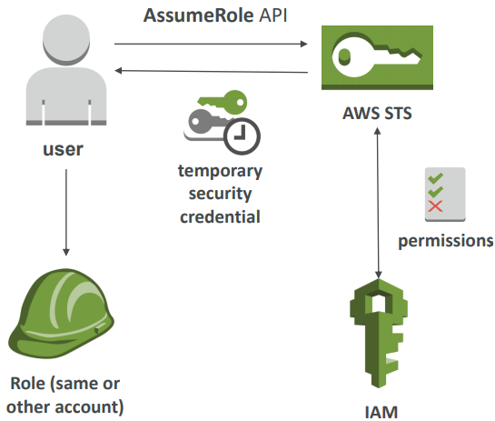

* Cross account access işin aşağıdaki adımların takip edilmesi gerekmektedir.
* Başka bir hesabın erişmesi için bir IAM role tanımlanmalı.
* Bu IAM rolünü hangi hesapların kullancağı tanımlanmalı.
* Credential yani kimlik bilgilerini alınır ve alınan credential ile, IAM rolünü kişileştirmek için (AssumeRoleAPI) AWS STS (Security Token Service) kullanılır.
* Geçici credential 15 dakika ve 1 saat aralığında geçerli olacaktır.

## Identity ve SAML Federation

### Identity Federation

Bir account başına 5000 IAM user sınırı vardır. Yani Netflix gibi AWS ortamında çalışan şirketler, bütün müşterilerinin bağlanması için onlara IAM user vermezler.

Müşteriler ile Netflix arasında trust ilişki olması gerekmektedir. Bu var ise, Bu kullanıcıları AWS içerisinde federate edebiliriz.

Identity Federation, AWS dışında bulunan kullanıcıların, AWS kaynaklarına erişimi için geçici bir role almalarını sağlar. 


Yukarıda görüldüğü gibi kullanıcı Cognito gibi AWS ile arasında trust ilişki olan 3rd party yazılım vardır. Kullanıcı bu 3rd party uygulamaya login olur ve karşışığında bir credential alır.

Aldığı bu credential ile Console veya API ile AWS servislerine erişebilir.
Bu 3rd party authentication; LDAP, Microsoft AD (~= SAML), Single Sign On, Open ID veya Cognito olabilir.

### SAML Federation

Büyük kuruluşlar genelde Microsoft AD veya SAML 2.0 uyumluluğu olan bir kullanıcı Identity Provider kullanırlar. 

Bu providerlar AWS ile trust bir ilişki içerisindedirler ve bu sayede kayıtlı olan kullanıcıların hepsi, onlara uygun rolller atanarak, AWS servislerine CLI veya console'a erişmeleri sağlanır ve her kullanıcı için bir tane IAM user oluşturulmasına da gerek kalmaz.

#### CLI based access


Organizasyon içerisinde bulunan bir client uygulaması olduğunu varsayalım.

1. Bu uygulama SAML 2.0 uyumlu IdP gidecek ve kullanıcı database'i, kullanıcıyı doğrulayacak.
2. Idp authenticate olacak
3. Bir SAML assertion yani bir nevi token alacak.
4. Token alındıktan sonra, STS'e özel bir API olan AssumeRoleWithSAML çağrılacak.
5. STS bu talebi kabul edecek ve SAML assertion karşışığında bir token verecek.
6. Bu token ile oturum açılmış ve CLI based access sağlamış olacak.

#### Console based access


Mantık CLI based ile hemen hemen aynıdır. 
Kimlik doğrulaması yapılacak, Idp SAML assertion getirecek, SAML assertion ile arka planda STS ile konuşan, AWS SSO endpoint'a oturum açılabilir.

Kısacası alınan kimlik bilgisi, AWS credential ile değiştirilmiş oldu.

SAML 2.0 yok ise, Custom Identity Broker kullanılmalıdır. Ve süreç biraz daha karmaşıktır.

Identity broker uygun IAM politikalarını belirlemek için kullanılır ve yukarıda yer alan diagramda bu kısmın kullanıcı tarafından programlanması gerekmektedir.

SAML ile aynı prensipte çalışır ancak SAML göre çok daha fazla manual iş yapılması gerekmektedir.

#### AWS Cognito - Public Application için Federated Identity Pools

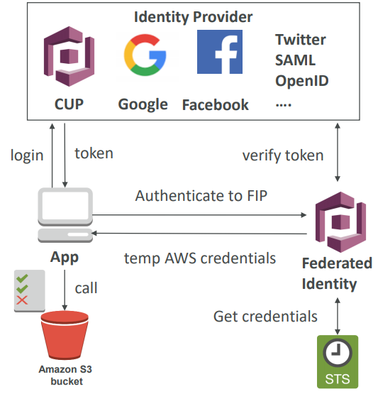

Client tarafından, AWS kaynaklarına direk olarak erişim yapması için kullanılmaktadır.

Bunun yapılması için öncelikle IdP giriş yapılmalıdır.
Federated Identity pool'dan, geçici AWS credential alınır.

Bu credentiallar içerisinde yetkiler önceden tanımlanmış IAM politikaları içermektedir.

Örnek verecek olursak, Facebook login ile, S3 bucket içerisinde geçici yazma hakkı sağlanabilir.

Her ne kadar Web Identity Federation, Cognito alternatifi olsa da, AWS Cognito kullanılmasını tavsiye etmektedir. Web Identity Federation artık sınavda yer almamaktadır.

Doğrudan IdP ile bağlantılı bir uygulamamız olsun. IdP; Cognito User Pool, Google, Facebook, Twitter, SAML, OpenID gibi bir provider olabilir.

Uygulama bu IdP birine giriş yapmış ve ordan token almış olsun.

Sonra uygulama, Cognito'da ki Federated Identity Provider ile konuşacak ve bu token'ı takas edecek.

Bu IdP tarafından doğrulanacak ve data sonra IdP STS'den kimlik bilgilerini alacak ve daha sonra Identitiy'den önceki aynı şekilde, Cognito'da ki Federated Identity geçici bir AWS credential gönderir.

Bu credential ile doğrudan S3 bucket'a erişebilir ve istenilen call'lar yapılabilir.

## Policies

https://docs.aws.amazon.com/en_us/IAM/latest/UserGuide/reference_policies_variables.html

https://docs.aws.amazon.com/en_us/IAM/latest/UserGuide/reference_policies_iam-condition-keys.html

**Örnek:** aşağıdaki policy kullanıcıların amazon.com üzerinde federated yapmasına, kullanıcı adlarından sonra adlandırılmış bir bucket'dan download/upload izni verir.

```javascript
{
  "Version": "2012-10-17",
  "Statement": [
    {
      "Action": [
        "s3:GetObject",
        "s3:PutObject"
      ],
      "Effect": "Allow",
      "Resource": ["arn:aws:s3:::mybucket/${www.amazon.com:user_id}/*"]
    }
  ]
}
```

**S3 Advanced Policies**
https://docs.aws.amazon.com/en_us/AmazonS3/latest/dev/example-bucket-policies.html

**DynamoDB Advanced Policies**
https://docs.aws.amazon.com/en_us/amazondynamodb/latest/developerguide/specifying-conditions.html

## AWS CloudTrail

AWS hesapları için audit mekanizmasıdır ve default olarak enable'dır. AWS hesabında yapılan, API call geçmişine ulaşmamızı sağlar ve bu bilgilere; Console, SDK, CLI ve AWS servisleri aracılığı ile ulaşabiliriz.

CloudTrail logları, CloudWatch loglarının içerisine koyulabilir.

AWS servislerinden birisi silinmiş veya üzerinde bir işlem yapılmış ise, ilk bakılması gereken yer CloudTrail loglarıdır ve bu loglarla kim yaptı ve ne yaptı gibi sorulara çok rahatlıkla cevap bulunabilir.

Console, CLI veya SDK olsun fark etmez. Yapılan her işlem aslında arka planda çalışan bir API call barındırır ve bu işlemlerin geçmişi 90 gün geçmişe dönük olarak CloudTrail tarafından muhafaza edilir.

Default UI sadece; Create, Modify veya Delete işlerini gösteririr.

CloudTrail Trail ile, seçilen bütün eventlerin detaylarına ulaşılabilir ve derinlemesine analiz için bu eventler S3 içerisinde muhafaza edilebilir ve istenirse Athena ile rahatlıkla analiz edilebilir.

CloudTrail isteğe bağlı olarak, region spesifik veya global olabilir.

Bu loglar S3 içerisinde tutulduklarında, SSE-S3 encrption ile muhafaza edilirler.


## VPC Endpoints

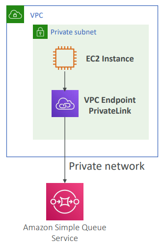

VPC endpoint, AWS servislerine public networkden ziyade private network ile bağlanılmasına olanak sağlar.

Örneğin bir SQS servisi var. SQS local bilgisayardan erişilebilecek bir pubic servistir ve bu nedenle dünya üzerinden herhangi bir yerden de erişilebilir durumdadır.

Ancak bizim ihtiyacımız private subnet ile, EC2 instance'ı üzerinden erişmek olsun.

Bunun bir yolu EC2 instance'ına public subnet sağlamak ve bir de yeni bir Gateway tanımlanması gerekiyordu. Veya Gateway oluşturmaya gerek kalmadan, VPC endpoint oluşturulabilir.

VPC endpoint, yatay olarak scale olabilir ve AWS tarafından yönetildiği için, ayrıca yönetilmesine gerek yoktur.

IGW veya NAT Gateway gibi gereksinimleri ortadan kaldırır.

İki türlü endpoint bulunmaktadır.


Gateway endpoint, sadece S3 ve DynamoDB için kullanılır ve bir hedef belirlenerek konfigüre edilir.

Interface endpoint, entry point olarak bir ENI yani private IP adresi sağlar. Bu ip adresinin security group'a eklenmesi ile, AWS servislerinin bir çoğu VPC endpoint'e sahip olacaktır. 

Bu yapı aynı zamanda private link olarak da bilinmektedir.

# AWS Instance Types

**Genel Kullanım:** T2, T3, M4, M5

**Compute Optimized:** C4, C5
Batch processing, analitik işler, ML/Deep Learnning için uygundur.

**Memory optimized:** R4, R5, X1, Z1d
In-memory database ve real-time big data analitik için kullanılır.

**Accelerated Computing:** P2, P3, G3, F1
GPU instances, ML/Deep Learnning ve yüksek performanslı computing için kullanılır.

**Storage Optimized:**  H1, I3, D2
HDFS, NFS, MapReduce, Kafka ve Redshift için uygundur.

https://aws.amazon.com/tr/ec2/instance-types/#instance-details