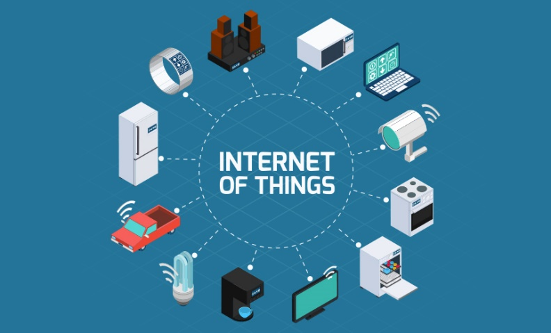
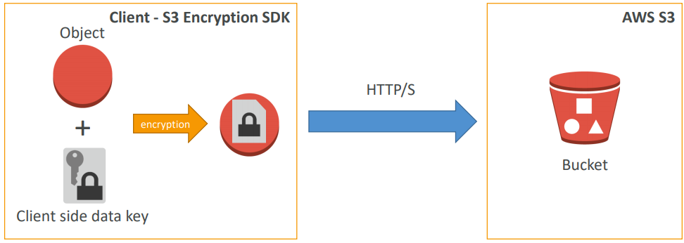
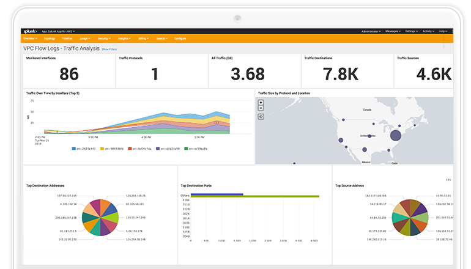

AWS Big Data / Data Analytics – Specialty
=========================================

Purpose
-------------
Preparation guide for AWS Certified Big Data / Data Analytic Speciality

- [AWS Big Data / Data Analytics – Specialty](#aws-big-data--data-analytics-%e2%80%93-specialty)
  - [Purpose](#purpose)
- [Collection](#collection)
  - [Kinesis](#kinesis)
    - [Kinesis Streams](#kinesis-streams)
      - [Kinesis Streams Shards](#kinesis-streams-shards)
    - [Kinesis Producers](#kinesis-producers)
      - [Kinesis Producer SDK](#kinesis-producer-sdk)
      - [Kinesis Producer Library](#kinesis-producer-library)
        - [Kinesis Producer Library (KPL) Batching](#kinesis-producer-library-kpl-batching)
        - [Kinesis Agent](#kinesis-agent)
    - [Kinesis Consumers](#kinesis-consumers)
      - [Kinesis Client Library](#kinesis-client-library)
      - [Kinesis Connector Library](#kinesis-connector-library)
    - [Enhanced Fan Out](#enhanced-fan-out)
    - [Kinesis Scaling](#kinesis-scaling)
    - [Kinesis Security](#kinesis-security)
    - [Kinesis Data Firehose](#kinesis-data-firehose)
      - [Kinesis Data-Streams vs Firehose](#kinesis-data-streams-vs-firehose)
  - [AWS SQS](#aws-sqs)
    - [SQS Fifo Queue](#sqs-fifo-queue)
      - [SQS Limitleri](#sqs-limitleri)
    - [SQS Security](#sqs-security)
    - [Kinesis vs SQS](#kinesis-vs-sqs)
        - [Kinesis Streams Data Stream](#kinesis-streams-data-stream)
        - [SQS](#sqs)
  - [IoT (Internet of Things)](#iot-internet-of-things)
    - [IoT Device Gateway](#iot-device-gateway)
  - [DMS – Database Migration Service](#dms-%e2%80%93-database-migration-service)
    - [DMS Sources ve Target](#dms-sources-ve-target)
  - [Direct Connect](#direct-connect)
  - [Snowball](#snowball)
    - [Snowball Process](#snowball-process)
    - [Snowball Edge](#snowball-edge)
    - [AWS Snowmobile](#aws-snowmobile)
  - [Storage](#storage)
    - [AWS S3](#aws-s3)
    - [AWS S3 - Consistency Model](#aws-s3---consistency-model)
    - [S3 Storage Tiers](#s3-storage-tiers)
      - [S3 Standard – General Purpose](#s3-standard-%e2%80%93-general-purpose)
      - [S3 Reduced Redundancy Storage (RRS) - Deprecated (Kullanımdan kaldırıldı)](#s3-reduced-redundancy-storage-rrs---deprecated-kullan%c4%b1mdan-kald%c4%b1r%c4%b1ld%c4%b1)
      - [S3 Standard – Infrequent Access (IA)](#s3-standard-%e2%80%93-infrequent-access-ia)
      - [S3 One Zone - Infrequent Access (IA)](#s3-one-zone---infrequent-access-ia)
      - [S3 Intelligent Tiering (new!)](#s3-intelligent-tiering-new)
      - [S3 Glacier](#s3-glacier)
    - [S3 Lifecycle Rules](#s3-lifecycle-rules)
    - [S3 Versioning](#s3-versioning)
    - [S3 Cross Region Replication](#s3-cross-region-replication)
    - [S3 – ETag (Entity Tag)](#s3-%e2%80%93-etag-entity-tag)
    - [S3 Performance](#s3-performance)
    - [S3 Encryption](#s3-encryption)
      - [Client Side Encryption](#client-side-encryption)
    - [S3 – Security](#s3-%e2%80%93-security)
    - [S3 Access Logs](#s3-access-logs)
      - [S3 Default Encryption vs Bucket Policies](#s3-default-encryption-vs-bucket-policies)
      - [Glacier Vault Policies & Vault Lock](#glacier-vault-policies--vault-lock)
    - [S3 CORS (Cross-Origin Resource Sharing)](#s3-cors-cross-origin-resource-sharing)
  - [DynamoDB](#dynamodb)
        - [DynamoDB Basics](#dynamodb-basics)
    - [DynamoDB – Primary Keys](#dynamodb-%e2%80%93-primary-keys)
      - [DynamoDB in Big Data](#dynamodb-in-big-data)
    - [DynamoDB RCU & WCU](#dynamodb-rcu--wcu)
      - [DynamoDB – Provisioned Throughput](#dynamodb-%e2%80%93-provisioned-throughput)
      - [DynamoDB – Write Capacity Units***](#dynamodb-%e2%80%93-write-capacity-units)
      - [Strongly Consistent Read vs Eventually Consistent Read](#strongly-consistent-read-vs-eventually-consistent-read)
      - [DynamoDB – Read Capacity Units***](#dynamodb-%e2%80%93-read-capacity-units)
      - [DynamoDB – Throttling](#dynamodb-%e2%80%93-throttling)
    - [DynamoDB Partitions](#dynamodb-partitions)
      - [DynamoDB – Writing Data](#dynamodb-%e2%80%93-writing-data)
      - [DynamoDB – Deleting Data](#dynamodb-%e2%80%93-deleting-data)
      - [DynamoDB – Batching Writes](#dynamodb-%e2%80%93-batching-writes)
      - [DynamoDB – Reading Data](#dynamodb-%e2%80%93-reading-data)
        - [DynamoDB – Query](#dynamodb-%e2%80%93-query)
    - [DynamoDB Indexes](#dynamodb-indexes)
      - [LSI (Local Secondary Index)](#lsi-local-secondary-index)
      - [GSI (Global Secondary Index)](#gsi-global-secondary-index)
    - [DynamoDB DAX](#dynamodb-dax)
    - [DynamoDB Streams](#dynamodb-streams)
      - [DynamoDB Streams Kinesis Adapter](#dynamodb-streams-kinesis-adapter)
      - [DynamoDB TTL (Time to Live)](#dynamodb-ttl-time-to-live)
    - [DynamoDB Security](#dynamodb-security)
        - [Global Tables](#global-tables)
  - [AWS ElastiCache](#aws-elasticache)
    - [Redis](#redis)
    - [Memcached](#memcached)
- [Processing](#processing)
  - [AWS Lambda](#aws-lambda)
    - [Lambda + Kinesis](#lambda--kinesis)
  - [AWS Glue](#aws-glue)
    - [Glue ve S3 Partition](#glue-ve-s3-partition)
    - [Glue ETL](#glue-etl)
  - [AWS EMR (Elastic MapReduce)](#aws-emr-elastic-mapreduce)
    - [EMR Cluster](#emr-cluster)
      - [EMR Kullanımı](#emr-kullan%c4%b1m%c4%b1)
    - [EMR / AWS Entegrasyonu](#emr--aws-entegrasyonu)
      - [EMR Storage](#emr-storage)
    - [Hive Metastore, Pig, HBase](#hive-metastore-pig-hbase)
      - [External Hive Metastore](#external-hive-metastore)
      - [EMR ve Pig](#emr-ve-pig)
      - [Hbase](#hbase)
    - [Presto](#presto)
    - [Zeppelin ve EMR Notebooks](#zeppelin-ve-emr-notebooks)
      - [Zeppelin](#zeppelin)
        - [Zeppelin + Spark](#zeppelin--spark)
        - [EMR Notebooks](#emr-notebooks)
    - [Hue, Splunk ve Flume](#hue-splunk-ve-flume)
      - [Hue](#hue)
      - [Splunk](#splunk)
      - [Flume](#flume)
    - [Diğer Servisler](#di%c4%9fer-servisler)
      - [MXNet](#mxnet)
      - [S3DistCP](#s3distcp)
    - [EMR Security](#emr-security)
      - [EMR: Instance Seçimi](#emr-instance-se%c3%a7imi)
        - [Master node](#master-node)
        - [Core & Task node](#core--task-node)
        - [Spot Instance](#spot-instance)
  - [Machine Learning](#machine-learning)
    - [Machine Learning 101](#machine-learning-101)
      - [Supervised Learning (Denetimli Öğrenme)](#supervised-learning-denetimli-%c3%96%c4%9frenme)
      - [Amazon ML'de Veri Tipleri](#amazon-mlde-veri-tipleri)
        - [Confusion Matrix](#confusion-matrix)
        - [Hyperparameters](#hyperparameters)
    - [Amazon Machine Learning](#amazon-machine-learning)
    - [Amazon SageMaker](#amazon-sagemaker)
    - [Deep Learning](#deep-learning)
      - [Deep Learning 101 ve AWS Best Practices](#deep-learning-101-ve-aws-best-practices)
  - [AWS Data Pipeline](#aws-data-pipeline)
- [Analysis](#analysis)
  - [Kinesis Analytics (Querying streams of data)](#kinesis-analytics-querying-streams-of-data)
  - [Elasticsearch](#elasticsearch)
    - [Kibana](#kibana)
    - [Amazon Elasticsearch Service](#amazon-elasticsearch-service)
      - [Notlar](#notlar)
    - [Amazon Athena](#amazon-athena)
      - [Athena + Glue](#athena--glue)
  - [Redshift](#redshift)
    - [Redshift Spectrum](#redshift-spectrum)
    - [Redshift Distribution Tipleri](#redshift-distribution-tipleri)
    - [Redshift Sort Keys](#redshift-sort-keys)
    - [Redshift Data Flows](#redshift-data-flows)
        - [Importing/Exporting data](#importingexporting-data)
    - [Diğer Servislerle Entegrasyonu](#di%c4%9fer-servislerle-entegrasyonu)
  - [Amazon RDS (Relational Database Service)](#amazon-rds-relational-database-service)
    - [Multi-AZ RDS](#multi-az-rds)
    - [DB Automated Backups](#db-automated-backups)
    - [Manual Backups](#manual-backups)
    - [RDS DB Security and Encryption](#rds-db-security-and-encryption)
    - [RDS Faturalama](#rds-faturalama)
    - [Read Replicas](#read-replicas)
    - [RDS Scaling](#rds-scaling)
      - [Sınav Sorularından Notlar](#s%c4%b1nav-sorular%c4%b1ndan-notlar)
    - [Amazon RDS CloudWatch Enhanced Monitoring](#amazon-rds-cloudwatch-enhanced-monitoring)
- [Visualization](#visualization)
  - [Amazon Quicksight](#amazon-quicksight)
    - [QuickSight Visual Types](#quicksight-visual-types)
      - [Alternatif Görselleştirme Araçları](#alternatif-g%c3%b6rselle%c5%9ftirme-ara%c3%a7lar%c4%b1)
- [Security](#security)
  - [Encryption 101](#encryption-101)
  - [AWS KMS (Key Management Service)](#aws-kms-key-management-service)
  - [Cloud HSM (Hardware Security Module)](#cloud-hsm-hardware-security-module)
  - [Security AWS Services](#security-aws-services)
    - [Security - Kinesis](#security---kinesis)
      - [Kinesis Data Streams](#kinesis-data-streams)
      - [Kinesis Data Firehose](#kinesis-data-firehose-1)
      - [Kinesis Data Analytics](#kinesis-data-analytics)
    - [Security - SQS](#security---sqs)
    - [Security – AWS IoT](#security-%e2%80%93-aws-iot)
    - [Security – DynamoDB](#security-%e2%80%93-dynamodb)
    - [Security - RDS](#security---rds)
    - [Security - Aurora](#security---aurora)
    - [Security - Lambda](#security---lambda)
    - [Security - Glue](#security---glue)
    - [Security - EMR***](#security---emr)
    - [Security – ElasticSearch Service](#security-%e2%80%93-elasticsearch-service)
    - [Security - Redshift ***](#security---redshift)
    - [Security - Athena](#security---athena)
    - [Security - Quicksight](#security---quicksight)
    - [AWS STS – Security Token Service](#aws-sts-%e2%80%93-security-token-service)
      - [Federation (Active Directory)](#federation-active-directory)
  - [STS ve Cross Account Access](#sts-ve-cross-account-access)
  - [Identity ve SAML Federation](#identity-ve-saml-federation)
    - [Identity Federation](#identity-federation)
    - [SAML Federation](#saml-federation)
      - [CLI based access](#cli-based-access)
      - [Console based access](#console-based-access)
      - [AWS Cognito - Public Application için Federated Identity Pools](#aws-cognito---public-application-i%c3%a7in-federated-identity-pools)
  - [Policies](#policies)
  - [AWS CloudTrail](#aws-cloudtrail)
  - [VPC Endpoints](#vpc-endpoints)
- [AWS Instance Types](#aws-instance-types)

# Collection

## Kinesis

* Kinesis is used as an alternate for Kafka.
* Ideal for capturing high volume of data in real-time.
* Can generate data and can send small amount of data in the order of kb and mb continuously from many data sources (1000 or hundreds of thousands of sources).
* If considering about receiving data from multiple data sources simultaneously, Kinesis is the most suitable solution.
* Suitable for BigData architectures such as application logs, IoT or clickstream data.
* Can also be used for streaming processes, such as Spark and Nifi.
* Data is synchronized in 3 AZ by default.

Kinesis Data Stream hosts 3 separate management services.

**Kinesis Streams:** Allows large scale of data acquisition and processing in real-time with low latency.

**Kinesis Analytics:** Processes and analyzes data in real-time using SQL.

**Kinesis Firehose:** Functions like the delivery service and the name is inspired from the fire hose. We can contemplate as spraying data to any desired location. Amazon Firehose allows the data to be captured and transformed with ease, and streaming data can be sent to S3, Redshift, ElasticSearch or Splunk.

It is a service that functions in near real-time.


### Kinesis Streams

The consumer reads the data from the shards.


Keeps the data 24 hours by default, and the period can be extended up to 7 days. The cost will increase in line with the increase in time. It has the ability to re-process data. Once processed, the data cannot be deleted. The same data can be read over and over again. The data will be deleted depending on the retention period and, therefore, multiple applications can consume the data simultaneously. Once the data is inserted into Kinesis, it cannot be deleted. **Immutability**, append only stream.

#### Kinesis Streams Shards

A stream consists of many different shards. The charges apply per shard, and any number of shards can be requested. The number of shards can be improved over time. (Re-shard or merge operations are possible) In general, the records shall be sorted per shard, not globally, and this sorting shall depend on their delivery time.

**Data Blob:** Data size can be up to 1 mb and can represent any type of data.

**Record Key:** Allows the logs to be grouped as shards. Same key = Same shard.
The distributed key should be used in order to avoid probable hot partition problem. With this key, Kinesis is able to access the shards, thus send the data.

**Sequence Number:** The data is put into shards with a unique identifier.

**Limits:** The producer can write only 1 mb or 1000 messages per second per shard. If this limit is exceeded, you will receive **ProvisionedThroughputException** error.

There are two types of consumers.

**Consumer Classic:**
2mb/s read per shard in all consumers
5 API calls per shard in all consumers

**Consumer Enhanced Fan-Out:**
2mb/s Read per enhanced consumer, per shard, in all consumers

Since it is a push model, no API call is required.

Data retention is 24 hours by default, and can be extended up to 7 days at max.

### Kinesis Producers

**Kinesis SDK:** The SDK (Software Development Kit) allows coding or sending data directly to Amazon Kinesis Stream using the CLI. In general, a SDK consists of everything needed to create a specific module within an application, and can include the libraries, tools, sample code, related documentation, and often the APIs.

**Kinesis Producer Library (KPL):** Better codes can be generated when compared to the SDK, and allows achievement of enhanced throughput thanks to its additional capabilities.

**Kinesis Agent:** Runs on the server and enables log file extraction and sending the extracted log file to Amazon Kinesis Stream.

To send data to Kinesis Stream; 3rd party applications such as Apache Spark, Nifi, Kafka connect, etc. can also be used.

#### Kinesis Producer SDK

The APIs can be used for one PutRecord or for multiple PutRecords. The PutRecords are used for batch operations, allow making fewer http requests and increase the throughput. The Producer SDK can be used for various services such as Android or IOS mobile devices.

It can be used in use cases such as low throughput, high latency, simple API and AWS Lambda, etc.

If ProvisionedThroughputExceeded error is generated, such error means that the TPS or mb/s limit has been exceeded for any shard. It should be ensured that there is no Hot Shard present in order to prevent the error. For example, if device_id is the key and if 90% of the data belongs to the same device_id, then 90% of the data will be in the same partition and the density in that partition may cause this error to be generated.

If the error is still generated despite no Hot Shard is present, the process can be retried or the number of shards can be increased.

#### Kinesis Producer Library

* Easy to use, configurable with C++ and Java libraries.
* Suitable for long-term use with high performance requirements.
* Features retry mechanism, that is to say, the capability to rerun the job.
* Available in two types: synchronous and asynchronous API. Asynchronous can be preferred if higher performance is desired.
* If it is intended to send data to Kinesis Data Stream asynchronously, usually the way to do so shall be the KPL.
* Also has the ability to send metric to CloudWatch for monitoring.
* When the application is written with the KPL, the application can be monitored directly from the CloudWatch.
* Supports the batch operations that are useful for increasing the throughput and reducing the cost.

The batch operations are subdivided into two categories.

**Collect:** Same PutRecords are written to multiple shards with the API call.

**Aggregate:** Improves efficiency and latency. Capable of storing multiple PutRecords in a single PutRecord (can exceed 1000 PutRecords per second). Improves throughput up to 1mb/s at max.

> The KPL supports compression, but this operation should be performed by the user.

The KPL records must be de-coded with the KCL and special utility libraries.

##### Kinesis Producer Library (KPL) Batching


We can perform aggregation and collection with the KPL.
7 records shown in the figure can only be sent as 2 records.

After the record comes with the KPL, the record waits for a while and then a single record with a max 1mb is created. The waiting time is determined according to the parameter **RecordMaxBufferedTime**, and is 100ms by default.
This time creates some latency, but increases the productivity significantly.

##### Kinesis Agent

Monitors the log files and sends them to Kinesis Data Stream.
It is a Java-based agent and can be installed only on Linux-based servers.

### Kinesis Consumers


We can use the SDK or the CLI to read data from the Kinesis Data Stream. We can generate data with the KPL and read with the KCL. As Apache Spark consumer, it can read from the Kinesis Data Stream. The records are collected from one shard by the consumers. Each shard has a total throughput of 2mb.


GetRecord can return 10mb or 10000 record data at most. Since each shard has 2mb throughput and as 3 consumers read from the same shard in the scenario given above, such a scenario would take 5 seconds.

A maximum of 5 GetRecords API calls can be made per shard per second. In this case, a latency of 200ms shall be in question. If 5 Consumer applications use the same shard, it means that all consumers can make 1 poll per second and get a yield that is 400Kb/s lower. The more consumers, the less throughput per consumer. If we have 3 consumers instead of one, they will all use the same 2mb/s limit and 5 GetRecords API call limit per second.

**Example 1:** Let there be 10 consumer applications running in the classic mode and performing a consumer job from 1 shard simultaneously with GetRecords() command. What will be the average latency for each consumer application?

Since maximum of 5 GetRecords API calls can be made per second, the average latency for each consumer application will be 2 seconds.

**Example 2:** Let there be 10 consumer applications running in enhanced fan out mode and performing a consume job from 1 shard simultaneously. What will be the average latency of each application as it consumes the records?

In the enhanced fan out mode, every consumer has 2mb throughput per second despite the number of consumers. In other words, each consumer receives 2mb/s data and the average latency is 70ms.

#### Kinesis Client Library

It is a Java-based library but can also be used with Golang, Python, Ruby, Node, and .NET. Performs KPL aggregation and enables reading of the data generated by the KCL and the KPL.

Performs KPL aggregation. Perform KCL de-aggregation.


Can share multiple shards with multiple consumers in a single group.

Allows continuation of the process thanks to its Checkpoint feature. In this way, the process can continue again even if there is any problem with one of the applications. The KCL uses **a separate DynamoDB table for all** Amazon Kinesis Data Streams applications in order to monitor the status of the application. Has checkpointing feature that can be used with the Kinesis Consumer Library (KCL), which is interactive with the DynamoDB. In this way, consumption progression can be monitored.


When both processed and raw state of the streamed data is to be stored, Kinesis Stream can be used to capture the data and Spark Streaming can be used to process the data for analysis. Backed Firehose messages on the raw data S3 side can be pushed with the help of the Lambda function.

Due to this function of the DynamoDB, one should make sure that sufficient WCU (Write Capacity Unit) or RCU (Read Capacity Unit) is available, or On-Demand DynamoDB can be used. **Otherwise, it will cause slowdown in the KCL.**

**Example:** There is a configuration that collects data from the Kinesis Stream containing 10 shards at 8mb/s on average from various producers using the KPL, and the records within the configuration are consumed using the KCL. Using CloudWatch metrics, it is understood that the data has 2mb/s throughput and there is latency in the application. What could be the most likely cause of this problem?

- [] The shards should to be divided some more.
- [] Hot partition condition is present.
- [] CloudWatch shows average throughput, not aggregate
- [x] DynamoDB table cannot meet the demand.

#### Kinesis Connector Library

This is the former (2016) Java library and should be in connector EC2. The data is written to S3, DynamoDB, Redshift and ElasticSearch.

Has overtaken majority of the fields of usage of the Kinesis Firehose and Lambda Kinesis Connector Library.

**AWS Lambda,** Can read records from the **Kinesis. Lambda consumer features a small library and is very suitable for de-aggregation to be performed from the KPL.

Can also be used for lightweight ETL. Data can be sent to Amazon S3, DynamoDB, Redshift, ElasticSearch or anywhere so desired as long as it is programmed. It can also be used to generate notifications and send real time mails.

### Enhanced Fan Out

Runs with KCL 2.0 and Lambda.
All consumers provide 2mb/s throughput per shard. If we have 20 consumers, we get 40mb throughput per second per shard. The data is sent to consumers over http/2 and provides an average latency of 70 ms.

**Difference between the Standard Consumer and Enhanced Fan-Out Consumer:**

**Standard Consumer;**
* Less number of consumer applications
* 200 ms latency and low cost

**Enhanced Fan-Out Consumer;**
* Multiple consumer applications for the same stream
* 70 ms latency and higher cost

https://aws.amazon.com/kinesis/data-streams/pricing/?nc1=h_ls

By default, a limit of 5 consumers that will use enhanced fan-out is in place for each Data Stream.

### Kinesis Scaling

Is referred to as Shard Splitting.

It is used to increase the stream capacity. (1 mb/s data per Shard) It can also be used to split the Hot Shard.

**Mode of operation:** The old shard closes and the old shard remains until the data expires, and is removed when the data expires.


Let the Shard 2 shown in figure be the Hot Shard and let’s split this shard into 2 as Shard 4 and Shard 5. In this case, the data in Shard 2 remains until it expires, and when the data is expired, the shard continues as Shard 4 and Shard 5. In this way, we also achieve an increase in the throughput.

This process is also reversible; that is to say, we can merge 2 shards with a single shard, thus saving from costs.
As is the case in the split operation, the data in the old shards shall be closed when expired.

Kinesis Auto Scaling operation is performed through manual intervention. The operation is done through the UpdateShardCount API process. We can perform the auto scaling job with AWS Lambda.


Re-sharding job cannot be performed in parallel. Capacity planning should to be performed beforehand.
Only 1 resharding job can be performed simultaneously, and the duration of this job depends on the number of shards.
For example, 30.000 seconds, approximately 8.3 hours, are required for 1000 shards.
For 2000 shards, this duration will be doubled.

**Limits:**

* The scale job can run once within 24 hours for one stream.
* More than twice the number of shards available for a stream cannot be scaled up.
* No more than half of the available shards can be scale down for one stream.
* More than 500 shards cannot be scaled up for one stream.
* Scale-up job cannot exceed the account limit.

### Kinesis Security

* The authorization part is managed by the IAM policy.
* In flight encryption is performed with the https endpoints.
* At rest encryption is performed with the KMS.
* The client side encryption should be implemented manually.
* The VPC Endpoint can be used for allowing Kinesis to access the VPC.

#### Kinesis Video Streams

It can be used to stream and store video. Videos can be watched again later with APIs. If using Kinesis Video Streams, there is no need to convert the data to HLS (HTTP Live Streaming).

### Kinesis Data Firehose

It is a service fully managed by the AWS without any administration cost.
It is not real-time like the Kinesis Data Stream.

**Data can be sent from Kinesis Data Firehose only to the Redshift, Amazon S3, ElasticSearch and Splunk in Near Real Time.**
It can be scaled automatically and supports a large number of data formats.

Data conversion can be made from JSON to Parquet or ORC for S3. With AWS Lambda, data can be transformed from CSV to JSON format.
If the target is Amazon S3; gzip, zip and snappy compression are supported. With Redshift, only gzip data can be loaded.

Only the data going via Firehose is charged.

Spark Streaming or Kinesis Client Library cannot read data from Kinesis Firehose, but can only read data from Kinesis Data Stream.


The location of the Kinesis Data Firehose can be seen more clearly in the Diagram. While data sources such as KPL, Kinesis Agent, Kinesis Data Stream (the most frequently used), CloudWatch, IoT data can be used as data sources, Lambda can be used for data transformation. Lambda's task here is to take up and transform the data, and then send the data back to the Firehose. Transformed data is sent only to S3, Redshift, ElasticSearch or Splunk as mentioned above.


S3 can also be used in any situation of transformation or delivery failure.

In case of source data, transformation error or failure to deliver the data to the target in the architecture given above, the data will be sent to another bucket that differ from the output bucket.

**Firehose Buffer Sizing**
Firehose stores the records in a buffer.

This buffer is flushed according to time or size definition. For example, if the buffer size is defined as 32 mb, it will be flushed when the buffer reaches to this value, or if the buffer time is defined as 2 minutes, it will be flushed when it reaches this time value. Firehose can automatically increase the buffer size in order to increase the throughput.

Minimum buffer time for Firehose is 1 minute.

#### Kinesis Data-Streams vs. Firehose

**Kinesis Data Streams:**

* Custom code must be generated.
* Runs in real-time. (Approximately 200ms latency for Classic and approximately 70ms latency for enhanced fan-out.)
* Scaling (shard splitting/merging) job should be managed.
* Data is stored between 1 to 7 days.
* Features replay capability and multi consumer option.
* Data can be inserted in Real-Time using AWS Lambda.
     * Example: ElasticSearch 

**Kinesis Firehose:**

* Fully managed.
* Data is sent to S3, Splunk, Redshift and ElasticSearch.
* Runs in near Real-Time.
* It can be scaled automatically.
* Features no data storage.

## AWS SQS

It is one of the oldest AWS services and is fully managed by the AWS.

* Can go from 1 message to 10,000 message per second.
* Retention period is 4 days by default, and this period can be extended up to 14 days.
* There is a limit for the number of messages that can be in the Queue.
* Allows a latency below 10ms for publish and receive.
* It can be scaled horizontally depending on the number of consumers.
* Messages are delivered at least once and can be duplicated messages.
* Best-effort ordering can also contain corrupt messages.
* There is a limit of 256kb per message in the sent messages.


The consumers can receive up to 10 messages simultaneously.
These messages are processed within the visibility timeout parameter. After processing the messages, these messages are deleted from queue using message_id.


In case of SQS, the consumers shall perform the poll messages job, consumers shall process these messages and then delete them from the SQS queue in order to prevent further processing.

In this way, messages shall not be processed by different consumer applications. This feature is one of the most significant differences between the SQS and the Kinesis.

### SQS Fifo Queue

The SQS was first launched with a standard queue, and currently provides services as a Fifo Queue. The abbreviation Fifo stands for First In First Out, and is not available in all regions.
The end of the queue step must end with “.fifo”.

It offers lower throughput and provides 3000 throughputs per second with batching and 300 throughputs per second for non-batch operations.
The messages are processed sequentially and sent only once. Data deduplication can be achieved at intervals of 5 minutes using Duplication ID.


If the messages are sent in the order of 1,2,3,4,5, then the messages will be read by the consumers in the same order.

It is not recommended to send messages with size exceeding 256 kb using the SQS, but if there is any need insistently in this respect, sending of such messages is ensured with a java library, SQS extended Client.


For this operation, Amazon S3 is used, and let's say we want to send a message with 5 mb or 10 mb in size. Messages with large size like stated above are sent directly to S3 by the producer and these messages are received directly from S3 again.

It is suitable for use cases such as decouple applications such as payment services processed asynchronously, buffer manuscripts written to the database such as voting applications, and large message loading operations such as sending e-mails.

It can be integrated as Auto Scale via SQS CloudWatch.

#### SQS Limits 

* Maximum 120,000 in-flight messages can be processed by the consumers.
* Batch requests can be up to 10 messages and 256kb.
* The message format can be XML, JSON or text with unclear format.
* Standard queue has unlimited TPS.
* FIFO queue supports up to 3000 messages per second at maximum.
* Max message size is 256 kb unless extended client is used.
* Data retention is between 1 minute to 14 days.
* Charged based on API request and network usage.

### SQS Security

* In-flight encryption is provided with the https.
* Server side encryption can be performed using the KMS.
     * CMK (Customer Master Key) can be used.
     * Only the body of the message is encrypted with the SSE. The metadata section such as message_ID, timestamp, attributes parts are not encrypted.
* The IAM policy must allow use of the SQS.
* The SQS queue access policy allow control over IP, and control can be performed as long as the requests are received.

### Kinesis vs. SQS

When to use the SQS and when to use the Kinesis Data Stream.

##### Kinesis Streams Data Stream

* The data can be consumed more than once.
* The data is deleted after the retention period.
* The recording order is preserved even during replay.
* Designed for allowing multiple applications to read the same stream. (Pub/Sub)
* Spark or MapReduce can be used to process and query data.
* Has checkpointing feature that interacts with DynamoDB and can be used with the Kinesis Consumer Library (KCL). In this way, consumption progress can be monitored.
* Shard capacity must be provided before reaching the limit.
* Features message size of 1 mb at maximum.

##### SQS

* Suitable for decoupled, i.e. individual, applications.
* There can be only one application per queue.
* The records are deleted after Consumption.
* The messages are processed irrespective of the queue for standard, and processed sequentially in FIFO.
* Has "Delay" message feature.
* It can be scaled dynamically.
* 256 kb message size at maximum.

Kinesis Data Stream | SQS
------------ | -------------
The data can be consumed multiple times. | The data can be consumed only once.
The data is deleted after the retention period. | The data is deleted after consumption.
The recording order is preserved even during replay. | The messages are processed irrespective of the queue for standard, and processed sequentially in FIFO.
**Designed for allowing multiple applications to read the same stream. (Pub/Sub)** | Suitable for decoupled, i.e. individual, applications and there can be only one application per queue.
**Spark or MapReduce can be used to process and query data.** |
Has checkpointing feature that interacts with DynamoDB and can be used with the Kinesis Consumer Library (KCL). In this way, consumption progress can be monitored. | It has **Delay** message feature.
Shard capacity must be provided before reaching the limit. | It can be scaled dynamically.
**Features message size of 1 mb at maximum.** | 256 kb message size at maximum.

The difference between the Kinesis Data Stream, Data Firehose, SQS standard and Fifo is illustrated more explicitly in the table provided hereunder.


**Use cases:**

Kinesis Data Stream:

* Suitable for more BigData.
* Event data collection and processing
* Real-Time metric collection and reporting
* Mobile data capture
* Real-Time data analysis
* Game data stream
* Complex stream processing
* "Internet of Things" data

SQS:

* Order processing
* Image processing
* Configurations that require auto scaling depending on the message load.
* Buffer and batch mesas configurations for database insert or visual processing
* Offloading requests

## IoT (Internet of Things)



The abbreviation IoT stands for the internet of things, i.e. the internet of the objects. The object specified here can be anything. Bicycle, car, lamp, i.e., anything desired.


The object here is configurable and the data is extracted from these objects.

The object will register to the IoT Cloud located in AWS with the thing registry and the thing registry shall assign a device ID.

It uses device gateway for the IoT object to communicate with the Cloud environment. The device gateway is a service managed by the AWS.

Let’s consider an IoT configuration that reports when the air temperature is 30 degrees.
In such configuration, the IoT will send a message to the Message Broker such as an SNS topic, and this message will be sent to multiple distinct locations.
With the help of the IoT Rules Engine, these messages will be sent to targets such as Kinesis, SQS, Lambda. **IoT Rules Engine can be used to collect data from sensors, and data from the device can be transferred to DynamoDB.**

We can also integrate such configuration with a service called IoT Device Shadow. This service will literally function like the shadow of the connected object/device.

Even if the thermostat is not connected to the internet, the state of the device can be modified with the Device Shadow.

For example, let's assume that the room temperature is 25 degrees, and we want it to be lowered to 20 degrees.

Let’s also assume that we are experiencing problem in the connection of the thermostat to the internet at time T, and we want to lower the temperature of the room with the Rest-API we sent from the mobile application.

In this case, the API we sent will go to Device shadow and the device shadow will now know that the temperature of the room should be 20 degrees.
As soon as the connection problem experienced with the main device is remedied, the shadow device will transmit the request to the main device, and the process for lowering the temperature shall be initiated.


The illustration of the simple architecture for a light bulb shall be as above.

One can understand how the entire process works more easily by watching 5-minute long tutorial provided in the link below.

https://us-west-1.console.aws.amazon.com/iot/home?region=us-west-1#/learnHub

### IoT Device Gateway

Acts as an entry point for the IoT devices connecting to the AWS. Responsible for allowing the devices to communicate with the AWS securely and efficiently.

Supports MQTT, WebSocket and http 1.1 protocols. Fully managed by the AWS, this service is scaled automatically to support more than 1 billion devices.

For example, the object is connected bicycles. The bicycle sends MQTT messages to the Device Gateway in the AWS environment, ensuring secure data flow.

**Rules Engine**


The rules are defined in the MQTT topics.
**Rules:** The job to be triggered
**Action:** The intended job to be performed.

**Use cases:**

* Writing data received from any device to DynamoDB
* Saving files to S3
* Sending notification messages to user groups
* Calling Lambda function to extract data
* Processing messages from multiple devices using Amazon Kinesis
* Sending data to Amazon ElasticSearch
* Capturing CloudWatch metrics and generating CloudWatch alarm
* Making predictions based on ML model by sending data in the MQTT message to the Amazon Machine Learning machine

In order for the Rules part to be action, IAM roles are required.

## DMS – Database Migration Service

The source database can continue to be used in the same way during migration.

Migration from the same type of databases (Oracle to Oracle) to each other and from different types of databases (Microsoft SQL Server to Aurora) to each other is supported.

Data replication is performed using CDC (Captures Database Changes). In order to execute the replication tasks, EC2 instance must be created.

### DMS Sources and Target

**Sources**
There can be On-Premise and EC2 instance databases.
The list is as follows;
*Oracle, MS SQL Server, MySQL, MariaDB, PostgreSQL, MongoDB, SAP, DB2*

Apart from these, the following Cloud databases can also be used.
*Azure SQL Database, Amazon RDS (all including Aurora), Amazon S3*

**Targets**
There can be On-Premise and EC2 instance databases.
The list is as follows;
*Oracle, MS SQL Server, MySQL, MariaDB, PostgreSQL, SAP*

Apart from these, the following Cloud databases can also be used.
*Amazon RDS, Amazon Redshift, Amazon DynamoDB, Amazon S3, ElasticSearch Service, Kinesis Data Streams, DocumentDB.*

The working principle is realized with the AWS Schema Conversion Tool (SCT) running in the background. AWS SCT executes the process by creating AWS DMS endpoint and task.

The database schema engine is to convert from one to another.

For example, OLTP databases such as SQL Server or Oracle are converted to databases such as MySQL, PostgreSQL, Aurora. The databases with OLAP structure such as Teradata or Oracle can be migrated to DWH environment such as Amazon Redshift.

## Direct Connect


It is private connection dedicated between the On-Premise network and the VPC. Multiple connections at 1 gb/s or 10 gb/s can be established. For such connection, a virtual private network must be established in the VPC. 

**Use Cases:**

* Increasing bandwidth throughput for working with large data sets
* Need for consistent network for applications using Real-Time data
* For hybrid architectures where On-Premise and Cloud environments are used together
* For more advanced security needs with private connection.

It supports IPv4 and IPv6.

**High-availability:** Two separate Data Centers or Site-to-Site VPN can be used for Failover.

As seen in the diagram above, AWS Direct Connect endpoint can provide secure and fast connections to both public resources such as Amazon Glacier or S3 and to EC2 instances in private networks.


If direct connect connection is required for the VPCs located at different regions in the same account, Direct Connect Gateway should be used.

## Snowball

It is a physical data migration solution that assists in migrating the data at Tb or Pb level within or outside the AWS.

* It is an alternate for transferring data over the network and is a more affordable method.
* Offers secure migration with 256-bit KMS encryption.
* Migration tracking is performed via SNS or text message.
* Charged per data transfer job.
* It can be preferred for large Cloud migration, DC migration and disaster recovery situations.
* **If any data migration job will take 1 week or more over the network, using snowball shall be both faster and safer.**
* It may take years to send 900 tb of data over a 100Mbps Network. For such a need, snowball would be a cost effective solution.

### Snowball Process


* Request for snowball device is entered from the AWS console.
* Snowball is installed on the client servers.
* Snowball and the server are interconnected and the data is transferred from the server to the snowball using the snowball client.
* The device is sent back and the data is uploaded to S3 bucket.
* Snowball is completely removed.
* The process tracking is performed from the SNS, via text messages and AWS console.

### Snowball Edge

Adds compute capability to the device and is also optimized for storage (24 vcpu) and compute (52v cpu & optional gpu).

* Has custom EC2 AMI support to enable transactions at transit.
* Lambda function support is available.
* When data is being migrated, it allows the data to be pre-processed.
* Suitable for data migration, image comparison, IoT jobs and machine learning.

### AWS Snowmobile


Allows data transfer in Exabytes, i.e. 100 pb.

Each Snowmobile features a capacity of 100 pb and allows parallel use. **If the data to be migrated is more than 10 pb, Snowmobile should be preferred instead of Snowball.**

## Storage

### AWS S3

It allows the files, i.e. the objects, to be positioned in the buckets, i.e. the directories.


The buckets must have a globally unique name.
The buckets are defined at the region level, and the name standards should be as follows.

* No uppercase characters or underscores.
* Can contain 3 to 63 characters.
* Should contain no IP in its name.
* The name should not start with lowercase characters or numbers.

The objects, i.e. the files, have a key. Here, the key is the full path.
*<my_bucket>/my_file.txt*
*<my_bucket>/my_folder/another_folder/my_file.txt*

There is no directory logic in the buckets. Although it seems that way in the UI, it is designed only for offering visual convenience.

The max size is 5 tb and **if more than 5 gb will be uploaded, "multi-part-upload" must be performed.** It can also be used if data over 100 mb will be uploaded and its advantage shall also be visible.

Metadata data can be system or user metadata data. The tags are useful for security. With Versioning enabled, Version ID is available.

### AWS S3 - Consistency Model

There are two types of consistencies.

**Strong (Immediate) Consistency**
* It is the case wherein the same information circulates where different clients read different copies of the data.
* In case any update is available at any storage node, it is ensured that such change is available in all storage nodes before the data is made available for the client.
* Suitable for Transactional database and real time systems.
* Not good for Scalability and Availability.

**Eventually Consistency**
* Reading different copy of the data at the same time might lead to different outcomes.
* No blocking mechanism is available; if the data is updated as an object and read from another node at that particular moment, the same data shall not be provided. The update shall be performed on other nodes over time, and the data read shall be eventually consistent.
* Eventually consistency allows scalability, availability, and data durability; therefore, it reduces cost storage, and these are required for object storage.

**New incoming objects (http put) are written in S3 with immediate or, so-called strong consistency** (Read (get) -after-write (put)).
Can be **http put,** update or add
**http get** is a reading operation.

**If an update (http put) or delete operation is performed on an existing object, this process will become eventually consistency.**

### S3 Storage Tiers

S3 contains multiple storage layers.

* Amazon S3 Standard - General Purpose
* Amazon S3 Standard-Infrequent Access (IA)
* Amazon S3 One Zone-Infrequent Access
* Amazon S3 Reduced Redundancy Storage (deprecated)
* Amazon S3 Intelligent Tiering (new!)
* Amazon Glacier

#### S3 Standard – General Purpose

* High durability, i.e. very high durability 11-9s for objects in Multiple AZ (99.999999999%)
     * If 10 million objects are stored in S3, object loss occurs once every 10,000 years.
* 99.99% availability per year
* Provides data protection against 2 simultaneous AZ failures. The data is not made available unless written on three AZs

**Use Cases,** Big Data analytics, such as mobile and game apps.

#### S3 Reduced Redundancy Storage (RRS) - Deprecated 

* Designed to provide durability for 99.99% of the objects.
* 99.99% availability per year
* Provides data protection against 1 AZ failure. Data is not made available unless written on both AZs 

**Use Cases,** Suitable for non-critical data and non-critical data that can be reproduced.

#### S3 Standard – Infrequent Access (IA)
* Suitable for the data accessible less frequently but can be accessed quickly if needed.
* High durability, i.e. very high durability 11-9s for objects in Multiple AZ (99.999999999%)
* 99.9% availability per year
* More affordable than Amazon S3 standard.
* Provides data protection against 2 simultaneous AZ failures. The data is not made available unless written on three AZs

**Use Cases,** Suitable for disaster recovery and backup data.

#### S3 One Zone - Infrequent Access (IA)

* Same as S3 Standard Infrequent Access, but, here, the data is stored in a single AZ.
* High durability, i.e. very high durability 11-9s (99.999999999%) for objects in one AZ. If the AZ is damaged, the data will also be damaged.
* 99.5% availability per year
* Provides low latency and high throughput.
* Provides at transit and at rest encryption.
* 20% cheaper than standard IA.

**Use Cases,** Can be used for storing the second backup copy or for unimportant data that can be reproduced.

#### S3 Intelligent Tiering

* Provides low latency and high throughput just like S3 standard.
* There is a low fee for monitoring and auto-tiering.
* Moves the objects automatically between two access layers, i.e. tiers, depending on changing access models.
* High durability, i.e. very high durability 11-9s for objects in Multiple AZ (99.999999999%)
* Provides extra protection against possible effects that affect the entire AZ.
* 99.9% availability per year 

#### S3 Glacier

* Suitable for archiving and backup.
* The data is stored for prolonged periods.
* Alternate for On-Premise tape storage.
* Annual average durability of 99.999999999% 
* There is a storage cost of $0.004 per GB on average. Data retrieval is excluded from this cost.
* Each item in the Glacier is called the "Archive", and an archive can be 40 tb at max.
* Archives are kept in structures called the Vaults.
* There are 3 types of data recalling options;
     * Expedited: data can be accessed between 1-5 minutes and is charged at $0.03 per Gb and $0.01 per request.
     * Standard: data can be accessed between 3-5 hours and is charged at $ 0.01 per Gb and $0.05 per 1000 requests.
     * Bulk: data can be accessed between 5-12 hours and is charged at $ 0.0025 per Gb and $ 0.025 per request.


### S3 Lifecycle Rules

Stores the information on how long the object will be retained in a specific bucket, whether the object will be moved to another buck or deleted.
The data can be transferred to different types of storage layers in certain periods by means of the rule to be defined in this way, and the cost can be reduced.

**For example:** General Purpose => Infrequent Access => Glacier

**Transition actions:** Defines when an object is to be moved to another storage class. For example, moving the data to Glacier after retaining in General Purpose S3 storage class for 7 months.

**Expiration actions:** Assists in deleting the object after a certain time. For example, Access logs can be deleted after a defined period of time.

Data migration to the Glacier is useful for needs such as backup, long-term retention.

We have a lot of flexibility when defining the rule. We can make a lot of definitions such as whether the current version or the previous version will be moved in the transition rule, and whether the current version or the previous version will be expired, i.e., deleted, and when it will be deleted completely in the expiration rule.

### S3 Versioning

Versioning can be performed on the objects stored in S3 and multiple versions of an object can be stored simultaneously.

This action is configured at the bucket level. There is a key used for the object, and this key version increases incrementally as 1, 2, 3.

It is designed for unintentional deletions and jobs that require roll back.
Once the bucket versioning is enabled, it can be suspended but cannot be disabled.

The feature is for the entire bucket and cannot be done at object level.
After the bucket versioning is enabled, new objects and updated objects shall be preserved.

Update means the http (put, post, copy and delete) operations to be implemented on the objects.

By default, the http get command will bring up the latest version.

The version ID of the objects transferred to the bucket before enabling the versioning feature appears as null.

If versioning is suspended after enabled, the current objects’ version remains "as is".

* These objects can no longer be updated and the version ID of new incoming objects shall also be null.
* Since the ID of new incoming objects is null, new versions of these objects will overwhelm the previous version, but incoming objects will not be affected while enabled.

### S3 Cross Region Replication

Versioning must be enabled both at the source and at the destination.

* The buckets must be in different AWS regions.
* Buckets can belong to different accounts.
* Copying process is performed asynchronously.
* Necessary IAM privileges must be granted to the S3.

**Use cases:** If there is any application located in another region, this application can be access the data with low latency, can be used if replication between accounts is desired.

### S3 – ETag (Entity Tag)

How do we confirm that a file has already been uploaded to S3?

Checking by name might work, but we might not be sure whether the file is the same file. AWS ETag can be used for such a situation.

Each object in S3 has its unique ETag.

While this check is done with MD5 hash for files with size equal to or less than 5GB, the algorithm for multi-part upload is more complex and this does not need to be known for now.

We can make sure the file is the correct one by using ETag.

### S3 Performance

When 100 TPS (transaction per second) value is reached in S3, the performance of S3 might decline.

Every time an object is uploaded to S3, these objects will go to the S3 partition, and in order to achieve the best performance, the objects should be dispersed in as many partitions as possible.

To do this, it is recommended to define random characters in front of the key names to be defined in the bucket in order to optimize performance.

**Example:**
*<my_bucket>/5r4d_my_folder/my_file1.txt*
*<my_bucket>/a91e_my_folder/my_file1.txt*

In the examples above, the random characters, 5r4d and a91e, shall allow the objects to be distributed in different partitions.

Using dates as prefix keys is not recommended at all. The date can be used multiple times, which will create similarity, thus causing performance loss.

<my_bucket>/11_08_2019_my_folder/my_file1.txt
<my_bucket>/11_08_2019_my_folder/my_file2.txt

Multi-part-upload should be performed for objects with size equal to or higher than 5gb.

* Allows to make put operations in parallel.
* Increases the network bandwidth to maximum.
* Shortens the repeat time for uploads that might fail and that should be retried.

S3 objects can be cached and read requests from different regions can be accelerated by using CloudFront.

CloudFront is a Gigabit-Scale (https) global request delivery service and can operate with higher pig values ​​at 10Gbps or 15000 rps. Recommended on data that cannot be predicted, scaled, and geographically dispersed.

S3 transfer acceleration can be achieved using edge location.
This improvement can be made only by changing the endpoint, without any need to make modifications in the code.

If SSE-KMS encryption is used, this might be limited for this use.
For example, there may be a limit of 1000 downloads or uploads per second for calling KMS service for a specific account.

Amazon S3 Transfer Acceleration: provides fast, easy and secure file transfer between the client and S3 bucket over a long distance. The transfer acceleration feature uses global distribute edge locations of Amazon CloudFront.

### S3 Encryption

There are 4 different encryptions for the objects in S3.

**SSE-S3:** This is the server side encryption method managed by the AWS with S3 managed encryption key.
**SSE-KMS:** This is the server side encryption method applied using AWS KMS key.
**SSE-C:** This is the server side encryption method with the key provided by the client.

**SSE-S3:** 


AES-256 bit encryption. It must be used with the header.
"X-amz-server-side-encryption": "AES256"

**SSE-KMS:**


Advantages: It is obligatory to use with user control and audit trail header.
x-amz-server-side-encryption ":" aws: kms "
Performs encryption using the customer master key.

The default CMK key can be used or the CMK key created separately can be used.

This service is a paid service. 

**SSE-C:**


Server side encryption with the key provided by the client.
Amazon S3 does not retain the encryption key. The key is managed by the customer; if the key is lost, access to the data shall be impossible.
* It is mandatory to use https
* For each http request made, the encryption key must be given in the http header.

#### Client Side Encryption



The data must be encrypted by the customer before being sent to S3, and when retrieved from S3, the data must be decrypt by the customer.
The encryption key and this cycle is completely managed by the customer.

**Encryption in transit (SSL):**

The desired endpoint can be used, but it is recommended to use https.
Https is mandatory for SSE-C. Encryption in flight can also be defined as SSL/TLS.

### S3 – Security

### S3 Access Logs

Used for audit.
Provides logging of all accesses to S3 buckets. All successful and unsuccessful requests made from another account are logged.

The data extracted from here can be analyzed with Kinesis Analytics tools or Amazon Athena.

**User based**
**IAM policies:** Allows specifying of the API calls to be allowed for a specific user.

**Resource Based**
**Bucket Policies:** These are the rules to be defined at the bucket level from the S3 console. Cross account access is provided with these policies.

**S3 Bucket Policies**
JSON based policies

**Resources:** Bucket or object name
**Actions:** The API set to be allowed or denied
**Effect:** Allow/Deny
**Principal:** The account or username to which the rule shall apply 

**S3 bucket policy:** This policy is used for operations such as granting public access to the bucket, forcing encryption of the objects during upload, authorizing the user belonging to another account, etc. 

#### S3 Default Encryption vs Bucket Policies


The former method implemented to enable default encryption was the bucket policy and was based on rejecting all http commands that did not have a specific header.

The new method is to use default encryption for S3.

The bucket policies are evaluated prior to the default encryption, i.e. the policies has priority in the ranking.

**Networking:** Has VPC endpoint support.

**Logging and Audit:** S3 access logs are stored in another S3 bucket.

**User Security:**

* **MFA:** (Multi Factor Authentication) can be used as additional security for deleting objects.
* **Signed URLs:** The URLs remain active only for a certain period of time.

#### Glacier Vault Policies & Vault Lock

Vault is a collection of archives. Each vault has one vault access policy and one vault lock policy.

* The vault policies are written to the JSON file.
* The vault access policy is similar to the bucket policy. (restrict user/account permission)
* The vault lock policy is a policy implemented for regulatory and compliance requirements.
     * Policy cannot be changed, it is immutable. For this reason, it is called lock policy.
     * **Example 1:** Prohibit archive deletion if stored for less than 1 year 
     * **Example 2:** Implement worm policy. (Write once, but allow reading for many times)

**Note:** *** Gzip is not a suitable compression method for files larger than 1 GB. The files larger than 1 GB should be compressed with any compression method with splitting support, such as bzip2, or using techniques that feature higher compression ratio, such as Snappy.

### S3 CORS (Cross-Origin Resource Sharing)

This is the client web application requesting a resource from another domain.

If the data is to be requested from another website, CORS must be enabled.
Cross Origin Resource Sharing allows restriction of the file sharing, thus helps to reduce the costs.

## DynamoDB

This is a NoSQL database that is fully managed by AWS and serves as highly available in 3 separate AZs.

* Distribute database that can scale large workloads.
* Can meet millions of requests per second, and can store trillions of lines and hundreds of tb of data.
* Presents fast and consistent performance.
* Provides a secure environment by working integrated with the IAM.
* Provides event oriented programming with DynamoDB Streams.
* Low cost and auto scaling capabilities.

##### DynamoDB Basics

DynamoDB consists of tables. All tables have their unique primary keys and it is mandatory to define such key during table creation.

* Each table can have an unlimited number of items, i.e. rows.
* Each item has its attributes. The attributes can also be added over time and can be left blank.
* The max item size is 400 kb.

**Supported data types:**
* **Scalar Types:** String, Number, Binary, Boolean, Null
* **Document Types:** List, Map
* **Set Types:** String Set, Number Set, Binary Set

### DynamoDB – Primary Keys

**Option 1:** Partition key only (Hash)


* The partition key must be unique for each item.
* The partition key must be distinct in order allow distribution of the data.

**For example,** user_id for the users table

**Option 2:** Partition key + Sort key


Option must be unique.
The data partition is grouped according to the key.
**Sort key == range key**
**For example** users - games table
* user_id for the partition key and game_id for the sort key

If we have a database containing movies, the partition keys can be keys such as movie_id, producer_name, leader_actor_name, movie_language, etc. to ensure maximum data distribution.

Among these keys, the cardinality of movie_id is quite high, so it might be the right choice.

Movie_language would not be a very correct choice, because the language of most films will be in English.

**Example:***** A DynamoDB that can AutoScale scales up at certain times every day, and yet one of the customers reports that the application runs very slowly from the database for a certain period of time.

The PK column of the table is on company ID. In such a situation:
 
**Problem and solution;**
Since a certain customer experiences this problem and as the PK column is the company ID, we can say that the problem is related to the hot key problem.

In such a case, data can be migrated to another DynamoDB table with another PK using the Data Pipeline, thus ensuring that the data is distributed equally.

#### DynamoDB in Big Data

The most frequently used areas are as follows;

* Mobile applications
* Games
* Digital ad serving
* Live voting
* Mass interaction for live events
* Sensor traffic
* Log ingestion
* Access control for web-based content
* Metadata storage area for Amazon S3 objects
* E-commerce shopping
* Web session management

The database is not suitable for the following areas.
* Applications that require recoding.
     * These applications are more suitable for the RDS.
* Join and complex transactions
* BLOB, i.e. binary large objects.
     * S3 is more suitable for storing such objects, but metadata management can be assigned to DynamoDB.
* Big data with low I/O ratio. Suitable for S3.

### DynamoDB RCU & WCU

#### DynamoDB – Provisioned Throughput

The table must have read and write capacity unit.
* **Read Capacity Units (RCU):** throughput for reading
* **Write Capacity Units (WCU):** throughput for writing
* Auto-scaling option can be used to meet throughput demand.
* Throughput can be overcome temporarily with the **burst credit** feature.
     * If the burst credit is blank, you will get **ProvisionedThroughputException** error and exponential backoff may be tried in this case.

**Burst Capacity:** DynamoDB provides flexibility in throughput per partition by providing burst capacity.

When a partition throughput is not fully utilized, DynamoDB reserves some of the unused capacity to deal with subsequent bursts. DynamoDB can use this allocated burst capacity automatically for background maintenance and other jobs.

#### DynamoDB – Write Capacity Units***

A write capacity represents writing for an item of size 1 kb per second. If the item is larger than 1kb in size, more capacity is required.

**Example 1:** Let's write 10 objects per second, each 2 kb in size. 2x10 = 20 WCU shall be required.
**Example 2:** Let's write 6 objects per second, each 4.5 kb in size. 6x5 = 30 WCU shall be required. Each object shall need 5 WCU alone.
**Example 3:** Let's write 120 objects per minute, each 2 kb in size. 120/60 x 2 = 4 WCUs shall be required.

#### Strongly Consistent Read vs Eventually Consistent Read


The application illustrated in the diagram above can read from DynamoDB Server 1 or can read from Server 3. Let’s assume that the data is written in Server 1 and the replication is not yet complete.

In this case, if an Eventually Consistent Read is made, the results of the data read from 1 and read from 3 will be different.

**Eventually Consistent Read:** If the read process is to be performed immediately after the write process, we might get an unexpected response due to replication.

**Strong Consistent Read:** If we read immediately after write, we will see the correct result.

By default, DynamoDB uses Eventually Consistent Reads, but Consistent Read is ensured if GetItem, Query & Scan is set as True.

#### DynamoDB – Read Capacity Units***

A Read Capacity represents a strongly consistency at the size of 4 kb per second and an eventually consistency at the size of 8 kb per second.

If the item is larger than 4kb in size, more RCUs shall be required.

**Example 1:** For 10 strongly consistent reads per second, each 4 kb in size, 10x4 kb/4 kb = 10 RCUs shall be required.
**Example 2:** For 16 eventually consistent reads per second, each 12 kb in size, (16/2) x (12/4) = 24 RCUs shall be required.
**Example 3:** For 10 strongly consistent reads per second, each 6 kb in size, 10x8 kb / 4 = 20 RCUs shall be required.

#### DynamoDB – Throttling

If we exceed the RCU or the WCU, we get “ProvisionedThroughputExceededExceptions” error.

**Reason:**
Hot keys, i.e. the partitions. A particular partition key is receiving too much read process. It can be a very large item. The RCU and the WCU depend on the size of the items.

**Solution:**
The partition key should be distributed as much as possible. If the problem is the RCU, DynamoDB Accelerator can be used. (DAX)

### DynamoDB Partitions

When the table is created in DynamoDB, each table starts with 1 partition, and the partitions have certain limits. The partitions can accommodate up to 3000 RCUs and 1000 WCUs at max. and can reach 10 GB in size at maximum.


The model table shown above contains 3 partitions, and let’s have one item named user_id.
Let this user_id = 1 go to partition 1 and the subsequent ones are distributed as follows.

So how do we know how many partitions we need?
We use an equation like the one given below in order to calculate the number of partitions.

**By capacity:** (Total RCU/3000) + (Total WCU/1000)
**By size:** Total Size/10 gb
**Total partitions:** Ceiling (Max (Capacity, Size))

**For example:** Let's say there are 6000 RCUs and 2400 WCUs in the table above. Assuming that the RCU and the WCU are distributed evenly, each partition shall receive 2000 RCUs and 800 WCUs.

#### DynamoDB - Writing Data

**PutItem:** Writing data to DynamoDB. Creating new data or fully replacing existing data falls into this group and both processes consume WCU.

** UpdateItem:** Updating the existing data. It means partial updating of the attributes.

**Conditional Writes:**

* Accept the write request only when the current conditions are satisfied, otherwise deny
* Allowing simultaneous access to items
* No performance effect.

**Note*****: Although S3 is a cheap means of storage, putting small files in S3 using put operation is more expensive when compared to DynamoDB insert.

If we calculate for an application that produces 1 million files per hour, each 2kb in size,

**Total Storage:** 2KB x 1M / hour = 2GB / hour x 24 x 30 = 1440 GB = 1.4TB
**DynamoDB:** 1M / hour = 277 Writes per Second x 2KB = 554 WCU = ~ 623 dollars (with Storage)
**S3:** 1M / hour x 24 x 30 = 720 Million PUT request = ~ 3633.12 dollars (with Storage)

#### DynamoDB - Deleting Data

**DeleteItem:** The process of deleting a certain line. Can perform the deletion job using Condition.
**DeleteTable:** Deletes the entire table and all items belonging to the table. Works much faster than DeleteItem.

#### DynamoDB – Batching Writes

**BatchWriteItem:**

* 25 PutItem or 25 DeleteItem can be performed in one transaction.
* Data up to 16 mb can be written.
* Data up to 400 kb can be written for each item.

Batch operations reduce the number of API calls, resulting in less latency.

The operations to be carried out are performed in parallel, providing more efficiency.

It is possible that some part of any batch operation fails, and in such a case, the operation can be retried for items that fail using the exponential back-off algorithm.

#### DynamoDB – Reading Data

**GetItem:**

* Reading is performed on the basis of the primary key.
* Primary key = hash or hash-range; i.e. the primary key can be the partition key or can be the partition key + sort key (hash + range).
* Eventually consistent read is performed by default.
* If desired, strongly consistent read can be used, but, in this case, more RCUs are needed and the process might take longer.
* ProjectionExpression can be specified to contain only certain attributes.

**BatchGetItem:**

* Supports up to 100 items.
* Can be used up to 16 Mb data.
* Items are called in parallel in order to get more efficiency.

##### DynamoDB – Query

The query returns items according to the following.

* PartitionKey value
* SortKey value (=, <, <=,>,> =, Between, Begin) - Optional.
* FilterExpression is some form of client side filtering.

**Returns:**

* Data can be queried up to the number of items defined as the limit, or up to 1 mb of data.

Capable of pagination on the received results.

**DynamoDB - Scan**

* Scanning the entire table and filtering out undesired data.
* Can return up to 1 MB of data and uses the pagination feature to continue the read job.
* Consumes significant amount of RCUs.
* By using the set limit, smaller result set is achieved.
* Parallel scan can be used for higher performance.
     * Multiple instances can read on multiple partitions simultaneously.
    * The throughput and the RCU consumption increases.
     * Can limit the effect of parallel scans as is the case for the Scan.
     * ProjectionExpression + FilterExpression can be used. (No change in the RCU)

### DynamoDB Indexes

#### LSI (Local Secondary Index)


* The alternate range key for the tables. Local to hash key
* Maximum of 5 indexes can be created for each table.
* Sort key consists of exactly 1 scalar attribute.
* Selected attribute must be the scalar string, number or binary.
* **The LSI and the creation time of the table must be defined and cannot be added later.**
* May cause WCU consumption in defined LSI (Local Secondary Index).
     * If an item is added to the table, updated or deleted, the LSI is updated and WCU is consumed during this process.

#### GSI (Global Secondary Index)


* Used for accelerating the queries that contain non-key attributes.
* GSI = partition key + optional sort key
* We can reflect the attributes in the table to a new index.
    * The partition key and the sort key of the actual table are always reflected. (KEYS_ONLY)
    * Extra attributes can be reflected to the project. (INCLUDE)
    * All attributes in the main table can be reflected. (ALL)
* RCU/WCU must be further specified for the index.
* GSI can be added and modified later.

**If any bottleneck is experienced in DynamoDB write jobs despite presence of sufficient WCUs;**

CloudWatch statistics can help us understand the problem by showing the consumed and provided throughput statistics.

In addition to CloudWatch, it can cause consumption of the WCU in the LSI (Local Secondary Index) defined in the table.

If an item is added to the table, updated or deleted, the LSI is updated and WCU is consumed during this process.

**The total cost due to writing new data to the table is the summation of the cost of writing to the table + the WCU required for the LSI update.**

Unlike the LSI, the GSI (Global Secondary Index) has no effect on the primary table capacity.

### DynamoDB DAX


DAX is the abbreviation for DynamoDB Accelerator.

Can be considered as a cache mechanism used for DynamoDB.

The write operation is performed from DAX to DynamoDB. Queries made from DAX are concluded at times in micro seconds level.

As it prevents the large number of reads from the tables, it also prevents the Hot Key problem.

* By default, there is a TTL (Time-to-Live) time of 5 minutes for the cache.
* Up to 10 nodes can be used in a cluster.
* Works as Multi AZ and at least three nodes are recommended for production.
* Security can be ensured with KMS as well as with software such as encryption at rest, VPC security layers, IAM, CloudTrail, etc.

### DynamoDB Streams


Actions such as create, update, and delete executed in DynamoDB can end in DynamoDB Stream.

This stream can be read by AWS Lambda and then we can perform operations such as:

* Triggering jobs for real-time changes, such as sending welcome mail to new users,
* Operations such as create table/view,
* ElasticSearch insert operation.
* Cross Region Replication can be performed using the Stream.
* The stream features 24-hour data retention period.
* The batch size is configurable up to 6 mb and 1000 lines.

#### DynamoDB Streams Kinesis Adapter


The KCL library should be used for utilizing DynamoDB Stream directly, and only the "Kinesis Adapter" should be added to the library in order to do so.

The interface and programming is exactly identical to Kinesis Stream. This method can be considered as an alternate to AWS Lambda.

#### DynamoDB TTL (Time to Live)

** TTL:** automatic deletion of an item after expiry of the set expire time.

* Since deletion does not consume WCU or RCU, there is no extra cost for the TTL.
* It is a process that runs in the background by DynamoDB.
* Helps you to prevent the size of storage and tables to grow significantly.
* TTL runs at line level. A TTL column is defined and the date is added to this column.
* Items deleted with the TTL are also deleted from indexes, namely the GSI/LSI.
* DynamoDB Streams can help for recovery of the expired items(s) 

### DynamoDB Security

* The VPC endpoints can access DynamoDB without internet.
* Access is controlled by the IAM.
* Encryption is at rest is performed with the KMS.
* Encryption in transit can be performed using SSL/TLS.

**Backup and Restore**
* Point in time restoration can be performed with the RDS.
* Has no negative impact on the performance.

##### Global Tables
* Multi region, fully replicated, high performance

Migration to DynamoDB can be performed from sources such as MongoDB, Oracle, MySQL, S3 using Amazon Database Migration Service (DMS).

It is possible to access the local DynamoDB from local computers with the purpose of using the development medium.

## AWS ElastiCache

ElastiCache offers two separate inherent solutions, Redis and Memcached.
Caches are in-memory databases that provide high performance and low latency.

* Reduces the read demand load received by the databases where read operations are abundant in number.
* Ensures that is application stateless.
* Scales write tasks using sharding feature.
* Scales write tasks with read replica.
* Ability to run in Multi AZ protects against failover situations.
* Operating system maintenance, patch, optimization, installation, configuration, monitoring, recovery and backup jobs are performed by the AWS.

### Redis

Redis is a key-value store database that functions as in-memory.
* It is in the super low latency class by providing latency below ms level.
* Protects the cache content even when the server is rebooted, thanks to its persistence feature
* It is very suitable for needs such as user session, leaderboard for games, distributed status, PUB/SUB capability for messaging to reduce the load of databases such as RDS.
* In case of failover, Multi AZ should be used for disaster recovery medium in order to prevent loss of cache data.
* Read Replica support.

### Memcached

Memcached is an in-memory object store. Disappears during cache reboot.
Memcached is recommended for faster query objects from the memory and for frequently inquired objects.

As Redis is has more capabilities than Memcached in general, it is also preferred more in the market.

The systems that require low latency use cache reading structures in their models, and in such structures, Redis is preferred much more than Memcached.

# Processing

## AWS Lambda

It is a processing technology that can scale code snippets in the Cloud environment without a server.

When using Lambda, server management tasks such as applying patch to the server, monitoring, hardware failure, etc. are no longer required.

Lambda is generally used for real-time data processing, real-time stream processing, ETL, cron replacement, and processing of AWS events.

Node.js, Python, Java, C#, Go, Powershell, Ruby are supported languages.


The services listed above are Lambda triggers.

### Lambda + Kinesis

Lambda code receives an event with the batch stream records.

* A batch size of up to 10000 records can be specified when setting up the trigger.
* Extremely large batch size jobs can cause timeout.
Batch operations can also be divided into 6 mb, which is Lambda's payload limit.

Lambda batch keeps trying the task at hand until completed successfully or until the data expires.

* If errors are not handled correctly, this shard might stop its process.
* More shards can be used in order to ensure that no errors are met in the processing.
    * Lambda processes the shard data synchronously.

**Pricing:**
Lambda is a paid service where you pay what you use.
1M request per month and 400K gb compute time per second is free.

* $0.20 for 1 million requests
* Charged at $ .00001667 for every 1gb/s.

It offers high availability, unlimited scalability and high performance.
Timeout is 900 seconds at max.

Apart from having necessary IAM policy for Lambda to process the data, it must also be in the same account with the service that triggered it.

Let’s assume that the Lambda-Kinesis stream structure is installed. Lambda will check the records and start processing job with its own function.
In a structure established in this way, Lambda can inquire whether there is any new activity by polling the Kinesis Stream.

## AWS Glue

Its primary use is as a central metadata repository for the Data Lake located in S3.

It can understand the table and schema definition and can publish these definitions for allowing their use by the analysis tools such as Athena, Redshift or EMR, and can run custom ETL jobs on the data.

AWS Glue Crawler is one component of the Glue. It basically scans the data in S3 and the glue crawler automatically extracts a schema structure depending on the data structure.

The crawler can also be scheduled and be triggered when any new data arrives and starts the stream.

As the glue crawler performs scanning job on the data in S3, the glue data catalog populates. The data catalog so created serves as a central metadata repository for all other tools.

Scheduling and periodical running of the crawler is the simplest and most accurate way to ensure that the metadata under the Glue Data Catalog is always up-to-date and synched.

The data itself is stored in S3 and the glue data catalog only gives information to other services about how to interpret this data and the structure thereof.

Once the data is cataloged, it will be ready for analysis for tools such as Athena or EMR.

### Glue and S3 Partition

The glue crawler performs the extraction job based on the organization of the data in S3.

It enables querying of the data in S3. A device sending sensor data on hourly basis might constitute an example for such structure.

If any query based on the time range shall be made as a priority, the data should be stored in the buckets in yyyy/mm/dd/device format.
If any device-based query shall be made as a priority, the data should be stored in the buckets in device/yyyy/mm/ dd format.


Glue can also work as integrated with the Hive. The glue data catalog can be imported as the metadata store for hive, or the hive metastore can be imported to the glue.

The glue data catalog can provide metadata information to hive in EMR.

### Glue ETL

* Runs serverless and can generate code automatically.
* Scala or Python language support is available.
* Provides server-side (at rest) or SSL (in-transit) encryption.
* Can run as event-oriented.
* Additional "DPUs" (data processing units) can be used to improve the performance of basic Spark jobs.
* The errors are reported to the CloudWatch, and if information is desired on these errors, SNS (Simple Notification Service) can be integrated.

**Glue Pricing:**

Charged per minute for Crawler and ETL jobs.
The first 1 million objects stored and accessed for the Glue Data Catalog are free.
Development endpoint for the developed ETL code is charged per minute.

**Usage Areas Not Recommended:**
As glue is batch oriented and has a minimum 5-minute interval, it is not suitable for streaming data.

Not recommended for Multiple ETL engine. Using kinesis is a better idea in a situation like this. Glue can be used to keep the data in S3 or Redshift, then to continue the transformation.

Glue doesn’t have NoSQL database support such as DynamoDB.

It is intended to load data from a MySQL database running on EC2 that will be processed with AWS Glue. In such configuration, it must be included in the instance VPC.

## AWS EMR (Elastic MapReduce)

It is the hadoop framework managed on EC2 instances. Includes Spark, HBase, Presto, Flink, Hive and many more within its structure.
It supports a feature called EMR Notebooks. EMR Notebooks is a feature that allows querying data in the EMR cluster using python from a small web browser.

There are various integration points with EMR AWS services and the EMR provides the full power of the hadoop cluster.

### EMR Cluster


**The master node** is responsible for managing the cluster and is a single running EC2 instance.

**The core node** keeps the HDFS data and runs the tasks. Can be scaled up and down, but there are some risks in these operations as HDFS keeps the data in duplicate.

**The task node:** The tasks run on these nodes but do not store data like the core nodes. They run as a compute node and do not pose any risk when removed from the cluster. Sport instances can be used.

#### EMR Use

Temporary and long-term clusters can be used.

* Spot instance can be a logical choice for temporary capacity.
* For long term clusters, reserved instance can be used.
* Term reserved instances are more reliable and cost-effective than spot instances.

In order to run the jobs, it must be connected to the master node.
Sequential steps can be sent from the console.

### EMR/AWS Integration

EC2 instance is used for the instances that create the nodes in the cluster.

* Ability to select different type of EC2 offers flexibility.
* VPC is used for configuring the virtual network where instances are launched, and provides a secure network.
* S3 stores the input and output data.
* CloudWatch is used for monitoring the cluster and for configuring the alarm.
* IAM is used for controlling and configuring the privileges.
* CloudTrail is used for auditing the requests made by the services.
* AWS Data Pipeline is used for scheduling and launching the cluster.

#### EMR Storage

HDFS is a distributed scalable file system for hadoop.

**EMRFS (EMR File System):** Looks like HDFS but stores the data on S3.

* EMRFS Consistent View: Can be used as an option for S3 consistency.
* DynamoDB can be used for monitoring Consistency.

*****Problems regarding consistency might be experienced when using S3!**

If there are many instances in the cluster and if such instances try to write and read data to/from S3 simultaneously, and if a node tries to perform a write task to the location where another node is trying to access the data;

This is not a critical case in HDFS, because the data is processed at the node where it is stored. But an inconsistency occurs in S3.

EMRFS Consistent View comes into play here. If EMR version 3.2.1 or higher is used and if consistent view enabled cluster is created, the EMR shall use the DynamoDB database to store the object metadata and follow S3 consistency.

Local file system is suitable for temporary data.
EBS for HDFS (Elastic Block Storage)

EBS volume cannot be attached to a running cluster. Only EMS volume can be added to the cluster that is running.

EMR is charged on hourly basis and used EC2 instances are further charged in addition to this fee. 

* If the core node fails, a new node is provisioned.
* On the fly Task nodes can be added/removed.
* The core nodes of a running cluster can be resized.

### Hive Metastore, Pig, HBase

#### External Hive Metastore


It is located in the MySQL database on the master node by default.

**External metastore provides flexibility and integration. Alternate store solutions can be created by storing the Metastore in the AWS Glue Data Catalog or Amazon RDS.**

Let’s assume that the metastore is stored in the AWS Glue Data Catalog; in this case the metastore shall act as a central metastore for the unstructured data and shall act as a metastore that can be accessed directly by the EMR, thus the Metadata data for AWS media shall be available at a single point.

Using hive with the EMR allows table partitions to be loaded automatically from S3.
The data can be stored in different sub directories in S3. Such sub-directories shall be translated from the table partitions, and this process can be performed automatically with the EMR.

Only “alter table recovery partitions” command should be written. This command can simultaneously transfer the tables to many clusters without any shared metadata store.

When the data is written to the tables and S3, the hive version installed in the EMR writes to S3 without using a temporary file, so that it can use the scripts in S3 directly by utilizing the hive extensions in the EMR.

EMR hive is also integrated with DynamoDB. Processing can be performed over DynamoDB data using Hive. To do this, an external hive table must be defined according to the DynamoDB table, and then the hive can be used to analyze the data contained in DynamoDB and to restore the results to DynamoDB or the data can be archived to S3.

This operation allows the data to be copied from DynamoDB to EMRFS or HDFS and vice versa. It also allows performing join operations between DynamoDB tables using Hive in the EMR.

#### EMR and Pig

Pig is available as preinstalled in Amazon EMR.
It is not required to perform mapper and reducer with the Pig. Pig enables use of Pig Latin, a SQL-like scripting language, to define map and reduce steps.

Pig offers an extremely extensive usage with the UDF, i.e. the user-defined function.

Pig allows use of high level scripting. Although high level scripting is not used as much as before, it would be useful to know.

There are multiple ways for AWS integration, such as Pig, Hive, etc.
Pig is not limited only to the HDFS. Queries can be performed in S3 with the EMRFS and has the ability to directly load the jar files and scripts in Amazon S3 externally just like the hive.

Pig makes it possible to access multiple file system when used with Amazon EMR.
Pig does not support access via JDBC.

#### Hbase

Comes preinstalled.

NoSQL is a non-relational database and can work with data at petabyte level.

It was designed as inspired by Google BigTable and has hive integration.

It is similar to DynamoDB, but there are some aspects where both databases are superior to each other.

DynamoDB can be preferred if it is intended to design an architecture integrated with AWS services; if a fully managed NoSQL database is required; if Glue integration is required and if automatic scaling is desired.

HBase can be preferred if there is a need for consistent reading and writing at all times, if a system with high write and update throughput is required, or if a NoSQL database more integrated with hadoop is required.
It is possible to store the data in S3 with EMRFS for HBase, and the backup can be stored in S3.

### Presto

Preinstalled.

**Presto can connect to many different big data databases and data stores simultaneously, including HDFS and S3, and perform query between such databases, and also provides connector to interact directly with MySQL, Redshift and Hive**

It can run interactive queries at the petabyte level; the language it supports is a SQL-like language.

It is designed mainly for OLAP systems and is suitable for analytical queries and DWH type queries.
It was developed by Facebook and is still partially maintained by Facebook.

Presto is the structure used by Amazon Athena in the background. Athena is simply the serverless Presto. JDBC offers the command-line and Tableau interface.

Systems such as HDFS, S3, Cassandra, MongoDB, HBase, SQL databases, Redshift, and Teradata can run together with Presto and such systems can have both relational and unrelational databases, as well as a SQL interface.

With EMR, processing is performed in the memory, and also pipelines are made over the network between stages, and in this way, unnecessary I/O is prevented and also this accelerates the system.

This speed is not sufficient for OLTP or batch processing. Presto is just an interactive query tool that only help to interpret over datasets that will be stored in different databases in the ecosystem and that allows us to run OLAP-style queries.

### Zeppelin and EMR Notebooks

#### Zeppelin

iPython notebook is a web browser application that allows you to develop small Python codes and to observe how such codes run.

Zeppelin is an application similar to ipython notebook. While iPython works on a single computer logic, Zeppelin rather works in cluster logic.

Zeppelin allows the Python codes and scripts to run interactively according to the data and enables sharing of the notes with others present in the cluster.

Can run as integrated with Spark, Python, JDBC, HBase, Elasticsearch and many more.

##### Zeppelin + Spark


As in the spark shell, it enables interactive development of the spark codes, which speeds up the development process.

with SparkSQL, you can run SQL-type queries and these query results can present a visual result in tables and graphs. In this way, Spark is used rather as a tool for data scientists.

##### EMR Notebooks


It is an application similar to Zeppelin, but offers more AWS integration.

* It is like a notebook with backup in S3.
* It is stored in VPC and can only be accessed from the AWS console.
* No additional payment is charged for EMR customers.
* EMR Notebook stops if the specified idle timeout time is exceeded.
* Works integrated with the repository for version check.
* Personal notebook cannot be attached to any Kerberos enabled EMR cluster.

### Hue, Splunk and Flume

#### Hue

Hadoop user experiences.

It is the graphical frontend for applications in the EMR and hadoop cluster.
It offers IAM integration so we can limit, with the IAM roles, what Hue users can access.

Allows scanning and migration of data between HDFS or EMRFS and S3.

#### Splunk



It can access and use the server data with a general definition, and ensures that this data is used by everyone.

It is used as an operational software and interprets a visual meaning on EMR and S3 data using the EMR hadoop cluster.

Splunk further helps with the log analysis and interpretation of such logs.

By way of example, it is extremely difficult to examine all logs and analyze a problem in a cluster with 100 nodes. With the help of Splunk, these logs can be combined in a single center, and it is possible to perform an analysis over such logs with a search method so-called Splunk query.

#### Flume

like Sqoop, Flume is used for data transfer, but Flume is very successful at the log data and can execute stream and perform aggregation on this type of data in the cluster.

### Other Services

#### MXNet

It is a framework used for designing deep learning applications and can easily be distributed in the EMR cluster.

#### S3DistCP

It enables duplication of data in very large sizes between HDFS and S3. When performing this task, it runs MapReduce task in the background and allows parallel duplication of large number of objects.

It can also perform this process between different buckets, clusters and accounts.

* **Ganglia,** Monitoring
* **Mahout**, capable of Machine Learning (recommendation engine/collaborative filtering).
* **Accumulo,** NoSQL database
* **Hcatalog,** table and storage management for Hive metastore 
* **Kinesis Connector,** Allows direct access between the Scripts and Kinesis stream.
* **Tachyon,** Accelerator for Spark.
* **Derby,** Java based open-source relational database.
* **Ranger,** data security manager capable of role based authorization and logging.

In brief, it is possible to use almost all Cloudera, Hortonworks and AWS software.

### EMR Security

IAM policy, Kerberos, SSH and IAM roles are used in the security section.

#### ORDER: Instance Selection

##### Master node

* If we are to have a cluster on 50 nodes, m4.large; m4.xlarge for the cluster with less nodes.

##### Core & Task node

* m4.large can be used for general purposes.
* If the cluster has external dependencies such as web crawler, t2.medium
* m4.xlarge for high performance
* high CPU instances for high computing requirements,
* high memory instances for databases, memory caching applications,
* Cluster computer instances for Network/CPU requirements such as ML and NLP

##### Spot Instance

* Can be preferred for Task nodes. It might be suitable if it will run for non-critical jobs for testing purposes. Strongly not recommended for production medium.

If the EMR cluster is terminated, the volumes belonging to EMR will also be deleted.

**Reserved or on-demand instance is recommended as Master and Core nodes** in Amazon and EMR clusters. We recommend **Spot instance as the Task node** in order to increase performance and reduce cost.

## Machine Learning

### Machine Learning 101

Machine Learning systems generally predict an unknown property of an item.

**Example:**

* How much can a house be sold for?
* What is a picture a picture of?
* Whether the biopsy result is good or malignant?
* Whether the performed financial transaction is real or fake?
* If the credit cards or debit cards are used abnormally, such usage is compared and interpreted retrospectively.

In short, it interprets the past data by reviewing such data and makes an estimate depending on such interpretation.

#### Supervised Learning 

Supervised Learning is some sort of taught ML.

The feature we want to predict is called the label.
Our dataset contains some absolutely accurate labels, along with other attributes of the data.

If we adapt one of the examples given above; let’s assume that we know the properties of the house such as the sales price, number of rooms, square meter, etc.

In the light of this information, it makes a prediction on unknown labels, for example, how much the house will be sold or should be sold, based on the information available.

Essentially, Supervised Learning is to develop a model based on historical information, and to use such model to make predictions on new data that remains unknown.

So, how can we test how successful such Supervised Learning model is?

One method is to use something called Train/Set.


The train data is extracted from the historical data and subdivided into two random sets. One of these sets is called a training set and this is usually the bulk data.

The other set is called the test data.

The test data is discarded, so that test data is not used when developing the model.

After the model is generated, it is evaluated how successful the model predicts the known labels, i.e. the precise information, available in the test data.

In short, the model is trained on available data and tested on actual data not previously interpreted.

If the model can accurately predict the test data, how well the model is in predicting unknown data can be measured.

We have the information such as the prices of the houses sold in the past, the number of rooms, prices per square meter, year of construction, location, etc.

Let’s assume that such houses are at 1000 different locations in total and we use 800 locations of such houses for developing the model and reserve remaining 200 locations as test data.

After generating the model, we run the model to make predictions for remaining 200 locations and reviewing such predictions in terms of accuracy with the actual data, we can deduct how successful the model has predicted.

Mahout features recommendation engine/collaborative filtering properties.
If it is intended to run the recommendation engine on 300 items, the solution is Mahout or Spark MLib.

In such a solution, Amazon Machine Learning is not a good solution as Amazon ML is limited to 100 categorical recommendations.

#### Data Types in Amazon ML

Only a few certain models are supported, which are as follows.

**Regression:** With regression, we try to predict some numerical values by reviewing the historical data.
For example, how much can a house be sold for?

**Multiclass Classification:** An image classification model falls into this category.
For example, what is a picture a picture of?

**Binary Classification:** is an example for the ML model that tries to predict one out of two classes.
Foer example, whether the biopsy result malignant or whether this financial transaction fake?

**Clustering:** Categorizes similar samples. E.g. most suitable document. (Unsupervised)

**Association rule learning:** If you buy crumpets, you can buy hamburgers. (Unsupervised)

**Ranking:** Search result ranking

##### Confusion Matrix


A method for visualizing the multiclass classification accuracy.

Let’s assume that we have a model that can predict what is inside the image let it provide a solution that visualizes how accurate such model is in different situations.

For example, in the confusion matrix specified above, the test dataset contains many images and we know the actual label, the real label of each image in that dataset, and the prediction label that the ML model says it does not know what it is.

In this example, the model guessed correctly that a dog contains a dog.

For an image which we know that it contains a cat, the model recognized the cat at 62% and thought it was a fish in 38%.

The model knew it is a fish in all fish pictures.

The confusion matrix is a quick method of understanding how good the multiclass classification ML model is.
The perfect model is the matrix that produces a diagonal dark blue line.

##### Hyper-parameters

Another aspect of the ML world is the hyper-parameters.

The success of any model depends on how clean the data is and how well such data is prepared.
Furthermore, success of any model also depends on how well the ML models are tuned, and this is called hyper-parameters tuning.

The following parameters are available in Amazon ML.

* Learning rate, i.e. how fast the model moves from one iteration to the next.
* Model size,
* Number of passes, i.e. the number of passes when attempting to converge a probable or good response.
* Data shuffling, i.e. whether data is shuffled.
* Regularization, i.e. scaling data to common value set as the data is inputted.

### Amazon Machine Learning

Amazon ML offers visualization tools to facilitate model building with no need to develop codes.

* Shows the training data available in S3, Redshift or RDS.
* Creates a model that can make predictions with batch or low-latency API.
* The model so created can be tested and evaluated.
* It is a service fully managed by Amazon.
* Despite its popularity in the market, it is now a bit outdated.

It is suitable for situations such as predicting suspicious financial activity, product demand, predicting the items that might interest the user and the user movements, and for categorizing social media such as whether a tweet is engaging.

It is a paid service as much as it is used.

Billed according to computation time used, number of predictions, the memory consumed by the model, and the computation time for training.

There is no downtime.

Up to 100 gb of training data can be stored and the storage can be increased by contacting the support services.

5 jobs can run simultaneously, which can be increased by contacting the support services.

Scaling data in order of terabytes is not recommended; running Spark would represent better alternative for such a need.

Logistic regression or linear regression is not suitable for Amazon ML. Therefore, sequence prediction, unsupervised clustering or deep learning are examples for the models that cannot be generated in Amazon's ML service.

EMR / Spark might represent an alternative in this respect.

As of April 2019, Amazon no longer allows new accounts to use the ML service, and redirects users to SageMaker and other ML services.

### Amazon SageMaker

A scalable ML service fully-managed by Amazon.

SageMaker is a component of Amazon Web services. SageMaker can run on large-scale models in the Cloud and then allows creation of notebook from this model.

It is an easy way to get serious computing performance power of the ML system.

It offers more flexibility, and although it is not easy to use, more advanced modern algorithm that can be scaled better than the Amazon ML service.

To use the SageMaker, the Python code must be coded to the Jupiter notebook.

While the coding side of the task is performed by the user, the sourcing and expansion running in the background is provided by Amazon.

It involves 3 modules named build, train and deploy. Build module provides medium for working with the data.

These media are the media to work with instances running the Jupiter notebooks. These notebooks on which the Python code shall be coded are the drivers that will enable GPU usage of the computers in the cluster, such as the CUDA and CUDNN drivers for deep learning.

It also includes the Anaconda packages that contain packages such as tensorflow, Apache MX net, pi torch for python.

Thanks to these packages, it becomes a powerful tool that can be used not only for ML but also for deep learning, thus providing high performance scalable ML algorithm optimized for precision.

It also includes some of the most recent and best performing reinforcement learning algorithms in today’s academic literature.

Offering an extensive support, SageMaker can be locally tested and prototyped.

A docker container can be downloaded to the local computer and this container can run to develop modules for SageMaker and tested with SageMaker Python sdk without going online.

Once the model is created, the training phase is initiated, thus the train module allows training of the model with one click.

The SageMaker search feature allows you to find and use the most suitable model from thousands of Amazon SageMaker model trainings.

The model can be trained in several different ways using several different hyper-parameters and several different data sets.
Therefore, training operation can be performed multiple times.

Finally, after the train model to be worked on is deployed, it will be distributed in the cloud medium and predictions will be made using the model.

For this reason, the deploy module will accommodate the model that makes predictions in some way and with low latency and will provide a managed medium for testing the model.

A batch transform module that allows predicting large or small batch data is available.

The entire structure is managed by Amazon and monitored on CloudWatch.

SageMaker allows us to deploy resulting pipelines. Thus, pre-processing prediction jobs and real-time and batch requests can be performed with the raw data.

The distinct features and the flexibility it offers are the reasons why Amazon ML service has become outdated.

It requires more effort than the ML service for the job to be done, but if the desired model is known, there is a significant difference.

It has all tensorflow and MX net features and the deep learning is even faster with the GPU support. Thanks to this feature, it can make predictions on very large data sets and this feature further allows it to be used on very advanced AI systems.

SageMaker requires expertise in python, and one should be skilled in the art to use the SageMaker.

The codes are stored in the ML storage volumes, optional at rest encryption can be done and controlled by security groups.

* API and console is accessed via SSL.
* Encrypted S3 bucket is used for the data.
* IAM roles are used for authorization checks.
* KMS integration for SageMaker notebook, training jobs, endpoints.
* Can be integrated with Amazon SageMaker, CloudWatch and CloudTrail.

It is essentially a very powerful ML framework and a fully-managed service suitable for deep learning and very large data sets, and the 100 GB limit is not applicable for this service.

** SageMaker Neo:** Trains the ML model once, allowing it to be run anywhere in the Cloud.

### Deep Learning

#### Deep Learning 101 and AWS Best Practices

Deep learning can be applied in different fields depending on the requirements.
The connection between the basic neural network, i.e., neural network types, and the deep learning can be mentioned as an example.

The Artificial Intelligence, that is to say the entire domain of artificial intelligence, is based on understanding how our own brains work over millions of years of evolution.

The origin underlying development of the AI is to gain some insight into how thinking machines can be made by reverse engineering the way the brain works.

There are lots of neurons inside your brain, especially in your cerebral cortex where all your thoughts take place.

These neurons are nerve cells independent from each other and are interconnected via axons and dendrites.

When an individual neuron is activated at sufficient level by another neuron, it sends a signal to all neurons connected thereto.

Let's imagine that there is a neuron that contain a lot of input signals therein; if such input signals reach the sufficient threshold, the neuron sends a series of sequential signals to all neurons connected thereto.

While these neurons can be linked to each other in many different ways, the entire network becomes extremely complex, as each link has its own set of connections. And this complex connection presents an image very similar to the linkage throughout the universe itself.


Who knows, maybe we can interpret such similarity observed between the brain and the space network using algebraic topology, a mathematical branch that plots complex connections, and the AI in the forthcoming years, and talk about much more different topics.

You can have a very simple model, but when we combine the link map of this model, very complex behaviors can be created.

There are billions of neurons in the human brain. This figure is still a measure that can only be imagined with deep learning and AI, but it is the same basic concept as we have a group of neurons with a lot of connections that act very simply on individual basis.

**For example,** the areas our eye can see might be processed in parallel by the cortical columns of different neurons.

Each of these columns is made up of mini columns each comprising about 100 neurons. The mini columns are arranged in larger hyper-columns and there are approx. 100 million of such 100 columns in your cortex. So they add again very quickly.

The neurons layers that are interconnected in different ways and the connection between each neuron is what forms the basis of your neural network. The neural networks tend to function in parallel simultaneously, and individual neurons are simple enough to be modeled on a certain unit.

If we adapt the working principle of the brain to the AI, the GPU technology allows functioning of many neurons in parallel and further allows for many different clusters within a cluster.
So, this is infinitely scalable.

Some deep learning media are available to facilitate development of neural networks in this way in terms of coding.

One of such media is the tensorflow developed by Google and another is the Apache MX Net.
Both can be used for developing deep learning networks that can be paralleled across the cluster.

ML modeling is also used in self-driving car technology.

**For example,** the camera of the car can capture images along the road, interpret such images and develop driving behavior based on such interpretation.

EMR supports Apache MXNet and GPU instance types. It can be used in tensorflow as long as MXNet is used.
The instance types recommended for deep learning are as follows

* P3: 8 Tesla V100 GPU’s
* P2: 16 K80 GPU’s
* G3: 4 M60 GPU’s

## AWS Data Pipeline


It is essentially used for scheduling tasks and processing the bigdata architecture.

Let's assume that we have log files in EC2 and we want to send them to S3 and analyze them with the EMR.

The Data Pipeline can schedule tasks on daily basis or at any desired frequency, and we may want to copy these files from EC2 to S3 at this frequency.

This is somewhat similar to the Oozie used in the hadoop. It is essentially the planning medium where we can execute different operations based on different programs.

The example given is an extremely simple example and we can use this planning medium for much more complex and difficult to plan architectures.

* The target can be S3, RDS, DynamoDB, Redshift and EMR.
* Task dependencies can be managed.
* Re-attempts, and reports, the faults.
* Cross-region pipeline support is available.
* Prerequisite check can be performed, and thus we can make sure of the accuracy of the stream before the process starts.
* The data available in the on-premise can also be used as a data source.
* Highly available.
* Writing EMR, Hive, Copy, SQL queries and command line scripts are amongst the operations that can be performed.
# Analysis

## Kinesis Analytics (Querying streams of data)

It is another system similar to Spark streaming and is used to querying the stream data and is specific only to the AWS Kinesis.

As is the case with the Spark Streaming, we can set time ranges wherein we can collect and analyze the data.

**Kinesis is the most suitable solution for performing analyses on the streaming data using complex SQL.**


Kinesis Analytics has 3 main sections.

One of such sections is called questionnaire or input data, and represents the information where the data to be transferred, that is, the data to be streamed, originates from.

The source can be the Kinesis Data Streams or the Kinesis Data Firehose.

Optionally, a reference data source can be configured to enrich the input data stream within the application.

If this is desired, the reference object should be stored in a bucket in S3. In such configuration, Kinesis Data Analytics will read the S3 object and create an application table.

After processing the requested data, the output can be forwarded to the Kinesis Data Stream or another Kinesis Data Firehose, and can be further forwarded sent to S3 or Redshift thereafter.

Lambda might also be included in this architecture.

If any errors occur during the process, such errors shall also be sent to the Error Stream for all applications.

If the application receives an error such as data type mismatch when processing a certain data, this error will be written to the Error Stream.

**Kinesis Analytics Query Tipleri**

**Continuous Query:** It can be used for monitor purpose and alarm generation.
**Stagger Query:** When data arrives, it collects data based on time.
**Tumbling Query:** It is a query format that collects data as schedule.

**Usage Areas:** Streaming extract or ETL processes; let’s assume that, for example, there is an application that constantly reads IoT sensors from Kinesis Data Stream and this application organizes the data according to the sensor type, then clears the duplicate logs, arranges these logs according to a certain schema structure and sends the data to be stored in S3.

A configuration that requires constant metric production can also be provided as an example. E.g., online game leaderboard

Although it is not cheap for use, the payment is made only for the used resources.
It is serverless and can be scaled automatically.

For security purposes, IAM permissions must be used to access source and destination.
It has schema discovery feature.

Kinesis Data Analytics seeks for capacity in the form of Kinesis Processing Units (KPU). A single KPU corresponds to 4 GB. The default KPU limit for the application is 8, i.e. 32 GB.

## Elasticsearch

Elasticsearch assists us in scaling, analyzing and reporting tasks at the order of petabytes.

Although first launched as a search engine, it is no longer used solely as a search engine.

It is primarily used for analysis and reporting purposes.
Elasticsearch is essentially a search engine and is a component of Elastic Stack.

We can index any document by sending a JSON-type index.
Then, by sending another JSON request, we can access the contents containing a certain keyword in the document.

Elasticsearch is a scalable search engine that runs very fast. It is actually built on an open-source solution called Lucine and is essentially a scale-only version of Lucine that distributes horizontally across many nodes in a cluster.

However, Elasticsearch has been expanded to include more software to transform it into an analysis and visualization tool.

Another aspect of the elastic stack is Kibana. Kibana is a tool used for querying, analyzing and visualizing the data stored in Elasticsearch.
**A small-scale Google Analytics dashboard can be created using Kibana.**

It is also a data pipeline and the data must be sent to Elasticsearch for this. Kinesis and Kafka can be used for such purpose.

Elastic Stack features an intrinsic software called LogStash, which is an integral part of a larger package called Beats and is basically a framework that allows us to import data from different sources of the Elasticsearch cluster.

### Kibana


An example of Kibana dashboard is illustrated above.

With LogStash, we can easily import log data, visualize the data with Kibana, display certain requests on the data set without using curl or similar commands on the data, and analyze such requests on the UI screen.

To import Amazon Elasticsearch data, Kinesis + Logstash binary or Elasticsearch API can be used.

If you are working on very large data for Google analytics and want to visualize them, Kibana + Elasticsearch represents a good alternative.

Elasticsearch is really powerful for full-text search. If you intend to design a search engine like Wikipedia, Elasticsearch is extremely suitable for this.

Elasticsearch is also very suitable for log analytics, application monitoring, security analytics and clickstream analytics.

During a study, Elasticsearch completed indexing of 4 billion documents with web index located at a certain point 14 times faster than the previous technology by indexing 146 million documents per hour.
The cost of this job was 37 dollars.

Adobe uses Amazon's Elasticsearch service and they are visualizing large amounts of log data for the develop platform and receive over 200,000 API calls per second at peak time.

Expedia is another customers using this service. Expedia uses this service for application monitoring, root cause analysis and price optimization.
Using this service, Expedia monitors Docker log files and perform security analysis thereon.

**Working Principle:**


An index, which is a collection of documents, is divided into shards.

Each document is hashed, i.e., shuffled, into a specific shard and each shard can be located on a different node in a cluster. Shards represent a Lucine index in Elasticsearch. In short, shards are small search engines of their own.

Let’s say we have two primary shards and two replica shards. The write requests will come to the primary shards, and then directed to the defined replicas.

Read requests can be directed to both primary and replica shards, thus increasing read throughputs.

### Amazon Elasticsearch Service

This is not a serverless service, so one should decide on how many servers will be used for the service, as is the case regarding the EMR. However, this service is fully-managed by the AWS.

It is not an automatic service, but can be scaled up or down without any interruption.

It is a paid service and the more it is used, the more the payment. This payment includes the instance hours, storage and data transfers.

Billing continues to process even if the instance waits idle, therefore any unused instance must be closed.

It offers high level network isolation with Amazon VPC so as to allow in-transit or at-rest data encryption. Access control can be provided also with authentication with Amazon Cognito and IAM policies.

Lambda can be used as an intermediary between Kinesis and Elasticsearch to extract data from the S3 bucket.
Kinesis Data Streams, DynamoDB Streams, CloudWatch, CloudTrail are other services that can be integrated into Zone awareness.

There are some choices to be made when using Amazon Elasticsearch.

How many master nodes shall be present and the types thereof, the domain, automatic snapshot to be backed up to S3 and zone awareness in order to increase availability.

Amazon ES supports resource-based, identity-based and IP-based policies.

Security layer; Request signing (mandatory) can also be strengthened by putting it in VPC rather than making public, thus rendering it more secure, and by integrating Cognito.

Whether the cluster will be in the VPC or not should be decided at the beginning. It is not a configuration that can be changed later.

Cognito is primarily useful in the context of communicating with the Kibana.


Kibana can be accessed through the web interface so that http connection can be opened by accessing the cluster.

The easiest way to deal with this issue is by using Cognito. Using saml 2.0 with Cognito allows you to login to Kibana through an identity provider such as Microsoft Active Directory or social identity providers such as Google, Facebook or Amazon.

This way, it is possible to login using Cognito accounts and access Kibana even when behind the VPC.

It is not easy to access the VPC from outside.
One of the solution suggestions is to use a reverse proxy server.

Nginx is an example of a reverse proxy server that can run on the EC2 server and that can direct and forward the request to Elasticsearch on the VPC.

Another solution is to open the port 5601 listened by Kibana to the SSH.

#### Notes

* It should be preferred particularly for search and analysis.
* It is not suitable for OLTP systems. RDS or DynamoDB should be preferred for such requirements.
* It is not suitable for ad-hoc data queries. Athena should be preferred for such requirements.

### Amazon Athena

It allows us to run SQL query directly in a serverless manner without the need to send the data in S3 to any other media.

It is essentially a pre-configured Presto instance with pleasant user interface.

It supports the csv, json, orc, parquet, and euro data types available in the S3 buckets.

The data available in S3 can be unstructured, structured or semi-structured data. Glue should also be used for the unstructured data.

**The function of the Glue Data Catalog here is to add structure to the data and render the data capable of running SQL query.**

We can mention running of ad hoc queries on the web logs as an example, and we can say that it is used more than Elasticsearch in such an architecture.

Another example is that it uses the staging data before sending the data to Redshift.

Let’s say we have a lot of data transferred to S3. We want to analyze the data before transforming such data and uploading it to Redshift, and we need to make some decisions on architecture depending on the outcomes of such analysis; Athena is very suitable for use in such a case.

**In short, Athena is a good way to understand the characteristics of the data before the data enters into the Warehouse system.**

Apart from the web logs in S3, we can also use Athena for querying other log files including CloudTrail, CloudFront, VPC, Elastic Load Balancer logs.

Integration to software such as Jupiter, Zeppelin and RStudio notebook is also possible.

ODBC and JDBC interfaces are also available. Thanks to such interfaces, Athena can be integrated with other visualization tools, including QuickSight.

**Athena is not recommended for complex SQL queries. Redshift would be better for such requirements. Redshift is capable of running complex SQL queries.**

#### Athena + Glue

Let’s suppose that there is a Glue crawler that populates the Glue data catalog for the data contained in S3.

Let’s say that this crawler is responsible for extracting the table column and definition; the Glue console can be used for such structure.

Once we have the Glue data catalog for Athena, Athena will recognize such catalog automatically and create a table from such catalog automatically, and then can easily run SQL query from such table.

This data catalog shall not be used only by Athena, but any analytical tool can also use said catalog to visualize and analyze this data.

**For example;** Since the RDS, Redshift, Redshift Spectrum, EMR and also Glue data catalog can be used as Hive metastore, any application compatible with Apache Hive metastore can be used.

Athena service is a paid service charged on the basis of consumption and costs as low as $5 per TB.

You are charged for successful or canceled queries, but not charged for failed queries.
DDL transactions are also free.

When Athena runs any query, the data is read only by selecting the required columns, therefore, the ORC and Parquet format is 30-90% more economical for applications that query on a small number of columns.

In short, Athena runs best in columnar format.

If S3 or Glue is used with conjunction with Athena, you will also be charged for such services.

As the data shall allow use of different partitions such as time and date in S3 is important for both query performance and savings in design, as it will enable scanning on less data.

IAM access control list and S3 bucket policies can be used for access restriction.

Server side encryption for data to be stored in S3 can be performed with the S3-managed-key, i.e. SSE-S3 or SSE-KMS, that is, with the KMS key.

The client-side encryption can be performed with the CSE-KMS, i.e. with the KMS key.

Athena account and the S3 account do not have to be linked to the same account. S3 bucket policy plays an important role in a structure with separate accounts.

In-transit encryption can also be performed between Athena and S3 using the TLS.

**Usage Areas Not Recommended:**
Athena is not suitable for formatted reports and for visualization. QuickSight should be preferred for such requirements.
Athena is not recommended also for ETL extract jobs. It would be better to use Glue or use Apache Spark for these jobs.

## Redshift

Redshift is the DWH solution offered by AWS at the order of distributed petabytes. Since server maintenance tasks is carried out by AWS, the user does not need to handle the cluster management.

Redshift performs up to 10 times better than other DWH systems.
Redshift provides fast ML modeling through use of high performance disks, columnar storage and massive parallel query execution (MPP), and makes it super-fast by performing such tasks in the cache.

Redshift is designed for Online Analytic Processing, i.e. OLAP, systems and is not suitable for OLTP systems.
Redshift is cost effective. Fees are paid only for consumed resources. If calculated, costs approximately 1/10 of the On-Premise resources.

* Supports SQL query on data, and querying with BI tools through OBDC and JDBC connections.
* Scale up or down is possible with API call or Amazon Console.
* Supports replication and backup.
* The system is monitored with CloudWatch and CloudTrail.
* **RedShift can run ad-hoc queries on structured data using SQL compatible protocol.**
    * **RDS is not suitable for ad-hoc analytics.**
* **Capable of running complex SQL queries.**

**If you want to import the unstructured data in S3 as another table in DWH, you can perform this operation with Redshift spectrum.**

Redshift can be used for accelerating the analytical workloads, for DWH modernization, for performing data analysis, for storing historical data, for storing and analyzing data such as clickstream, and for analyzing the social media data.


A cluster is the core infrastructure component of Amazon Redshift.

The cluster can have one leader node and compute nodes in the range of 1 to 128 depending on the cluster type.

It is not infinitely scalable. 128 is the upper limit and a very large amount of data can be retained in this number of nodes, and each cluster can contain one or more databases.

The function of the leader node is to manage the communication between the client programs and the compute nodes.

Redshift receives the queries sent by the client, determines their execution plan, and ensures that the incoming query runs parallel in the compute nodes depending on said execution plan and sends the outcome to the client application.

Compute nodes are responsible for executing requests. After running such requests, the compute nodes send the results to the Leader node.

At this stage, the incoming data enters the aggregation stage.
Each compute node has its respective CPU, memory and storage.

There are two types of nodes that can be selected in the redshift cluster.

The first node type is the D.S type that enables creation of a very large DWH medium, which we can define as dense storage.

The other type of node is the lower cost disks that use HDD discs in the background.

Both types can be selected in two separate sizes, Extra-large XL and 8XL.

Extra-large XL contains 3HDDs with a total of 2Tb magnetic storage.
The 8XL has 23 hard drives with a total of 16Tb magnetic storage.

### Redshift Spectrum

Spectrum allows query execution at exabyte level.

**Redshift spectrum can create tables on S3 data just like Athena creates using AWS Glue.**

**Redshift spectrum allows loading the data in S3 to the Redshift cluster or to run such data without transforming the data.**

Redshift spectrum allows concurrency by allowing multiple queries to access the same data simultaneously in S3, and can be scaled to thousands of instances, thus ensuring rapid generation of results regardless of the data size of the queries.

Redshift spectrum further allows us to allocate storage and compute capacity, allowing to scale each capacity independently.

All storage processes are performed in S3 with Spectrum.

Spectrum supports several open-source data formats.

Avro, CSV, Grok, Ion, JSON, ORC, Parquet, RC, Regx, Cirta, sequence files, text files and TSVs can be mentioned among supported data formats.

Gzip and snappy compression are supported.
The number of IO requests is low by using 1 mb as the default block size.

Index and materialized view are not required in Redshift and therefore Redshift uses less space than traditional relational databases.

Redshift replicates the data automatically. 
Backup is taken asynchronously to the S3 in another region. The data is stored in 3 different locations, as the original data, replicated data and backup data.

Automatic snapshots can also be enabled with 1-day retention by default. This retention period can be increased up to 35 days.

If a certain node fails in the cluster, Redshift detects the failing node automatically and replaces the node.
However, the cluster shall not be available for queries and updates until replacement node is added.

The most frequently accessed data in S3 are loaded first, thus allowing elimination of the fault as soon as possible.

Redshift is limited to a single AZ usage. Therefore, it will not be possible to use the clusters in case of any AZ failure.

Another AZ cluster in the same region can be restored using the Snapshot.

### Redshift Distribution Types

There are multiple options for distribution of the table data in Redshift. When creating table in Redshift, the data is distributed based on this selection.

Distribution has two main objectives. The first objective is to distribute the workload evenly between the nodes in the cluster and to minimize data movement during querying.

**Auto:** If nothing is selected, auto option is selected by default. When Auto is used, the most appropriate distribution is selected depending on the size of the data in the Redshift table.

**Even:** The lines are distributed sequentially in a round-robin format. Data is distributed circularly to each slice. This option can be used if there is no clear table structure suitable for Key distribution or all distribution definitions.

**Key:** Rows are distributed based on the values in a column. Identical column values are assigned to the same slice, and common column match values are stored together.

Key distribution should be selected if an inquiry is to be made regarding a specific column.

**All:** All tables are copied to all nodes.

Update and insert jobs into multiple tables take longer. ALL distribution can be suitable for small dimensioned tables that does not require speed and that does is not subjected to many updates.

### Redshift Sort Keys

The lines are kept sequentially depending on the column or columns specified as the sort key.

Redshift automatically saves the minimum and maximum values for each block as part of the metadata.
If the query sent uses syntax with range limitation, the query can use min and max values during the processor scan in order to avoid full scan.

Calculation of min and max values should be determined according to requirements.

If frequent range filtering or equality filtering is applied on any column, Redshift shall not read all the data in that column. The reason for this is that Redshift takes the min and max values for each block seriously and does not perform read operation on the data that do not meet the criteria.

This works like an index and also allows range type queries to be faster.

**Redshift interleaved sort key***** is designed to offer improved performance by measuring each column in the key equally, regardless of which column in the key is used as filter.

If multiple teams are using any table in the same RedShift cluster by running queries differently, an interleaved sort key can be added for each team in order to increase performance.

### Redshift Data Flows

##### Importing/Exporting data

**Copy:**
Multiple data files or multiple data streams can be read simultaneously using the copy command.
Data can be imported from S3, EMR, DynamoDB or from a remote host using ssh.
S3 shall request the manifest file and IAM role for such operations due to security reasons.

**Copy command can be used to send data on S3 to Redshift cluster. The copy command uses the Redshift MPP architecture to parallel read and load from the S3 bucket.**

**Provides maximum performance by separating the data into multiple files and adjusting the distribution switch in the table.**

**The copy command can also be sent using the Noload parameter.** In this case, data integrity can be checked before uploading in order to avoid possible file copying problems.

**Unload:**
The unload command should be used if you want to export any table to S3 as a file.
The best way to dump a table in Redshift to S3 is to use the unload command.

**UNLOAD ENCRYPTED command run in Redshift allows the data to be transferred to S3 as encrypted using the client-side encryption by employing https at the background.**

**VPC routing:**
This command allows that all copy and unload traffic takes place between the repository between the cluster and the VPC, thus preventing this traffic from being made over the internet.

The VPC endpoint, Net Gateway or Internet Gateway is required for this action.

*****Let us take snapshots from Redshift and send them to another region automatically.**

* There is a KMS-encrypted Redshift cluster and let’s take its snapshot.
* You want to send this snapshot to another region for backup purposes.

**In the Target AWS region,**

* If there is no KMS key available, one must be created,
* A unique name must be specified for the copy authorization.
* The KMS key ID must be identified for the specified copy authorization.

**In the Source region,**

* Snapshot copy job must be enabled with the copy authorization created.

**DBLink:** Provides connection between Redshift and PostgreSQL and is suitable for copy and sync operations between these two systems.

### Integration with Other Services

**S3:** Data can be exported from Redshift with parallel processing and sent to multiple files in S3.
The data in S3 can also be imported into the Redshift.

**DynamoDB:** A Redshift table can be created from the data in DynamoDB using the Copy command, and the data received from DynamoDB with the same command can also be transferred to Redshift without creating a table.

**EMR/EC2:** Data can be imported using ssh. Again, data can be loaded from one or more remote servers using the copy command.

**Data Pipeline:** Data movement to or from Redshift and transformation can be automated.

**Database Migration Service:** Can perform data migration to Redshift.

**Redshift Workload Management (WLM):** It helps to prioritize the workloads in the system. Can be managed with the Console or API call.

**Vacuum command:** Recovers space on deleted lines and restores sort order. We can think of it as some kind of fragmentation. Four distinct commands are available.

**Vacuum Full:** Operates on all deleted lines.
Vacuum Delete Only: Same as Full, but unlike it, it doesn't perform sorting.
**Vacuum Sort Only:** Does not deal with disk space, only deals with sorting.
**Vacuum Reindex:** Performs rebuild only on indexes.

**Usage Areas Not Recommended:**
Working with small datasets shall not be suitable for Redshift. RDS should be preferred for this.
It is designed for OLAP and is not suitable for OLTP.

EMR or Glue ETL are more suitable for ETL.
Blob is not suitable for storing data.

*****The Redshift database is encrypted using KMS and the AWS CLI shall be used to create a KMS encrypted snapshot in another AWS region. To do this, the following steps should be followed.**

* A new KMS key must be created in the target region.
* CreateSnapshotCopyGrant command should be used to enable Redshift to use the KMS key in the target region.
* In source region, cross-region replication must be enabled and created copy grant name must be defined.

https://docs.aws.amazon.com/redshift/latest/mgmt/managing-snapshots-console.html#xregioncopy-kms-encrypted-snapshot

**Redshift Enhanced VPC Routing:** When using Redshift Enhanced VPC Routing, Redshift will perform all copy and unload traffic between the data repository and cluster over VPC. If Enhanced VPC Routing is not enabled, Redshift routes the traffic over the internet, including traffic within the AWS network.

## Amazon RDS (Relational Database Service)


* Contains information such as the client information, address, credit card information, client information.
* There is no access to the DB instance, i.e. the OS, but engine is accessible.
     * If Operation system privileges are also required, RDS should not be selected. RDS is managed by the AWS and allows access only to the DB engine. EC2 must be used for operation system privileges.
* Point-time-in recovery is possible.
* The administration side is managed by AWS. **Not Fully Managed.**
     * Admin jobs such as automated patch, backup, etc. should be performed by the user.
     * Software updates,
         * RDS users can control the timing for the major version upgrades and many minor upgrades.
     * Storage and compute upgrade if necessary,
     * If Multi AZ is selected; the AWS manages the synchronization work between active and standby.
* The DB instances and weekly maintenance functions, and if not specified, the AWS sets as 30 minutes by default.
* The DB settings, build DB schema, performance tuning jobs are not loaded by the AWS. This is the main reason why the AWS provides access to the DB engine.
* Supported relational databases are MS SQL, Oracle, PostgreSQL, MariaDB, AWS Aurora and MySQL.
    * There are two types of licensing for databases.
        * Bring your own license (BYOL) - If any license exists, it can be transferred.
        * License included, charged hourly.
        * **Not supported on Oracle RMAN and RAC RDS.**
* An account can have 40 DB instances at maximum.
        * In the license included model, 10 out of 40 instances can be Oracle and MS SQL.
        * If BYOL is used, all 40 instances can be any desired type of DB.
* Uses EBS volume for Amazon RDS, DB and Log storage. (Instance-Store is not used)
* There are three types of usage;
    * **General Purpose:** Used for general intermediate level I/O requirement.
    * **Provisioned IOPS RDS Storage:** Used for intensive OLTP jobs.
    * **Magnetic RDS Storage:** Used for low DB workload.
* Max storage capacity is 16TB for supported DBs.

**Parameter Groups** can be used if one intends to transfer specific settings to a group database.
Rather than running the **Alter Database** command one by one, the command can be applied to all with the help of this group.

RDS can be used if a central metastore and access from multiple clusters is desired for Spark, Hive and Presto.

### Multi-AZ RDS

* Must be in different AZ in the same region.
* It is not possible to read and write in Standby.
* The AWS chooses which AZ will be in standby.
* The AWS recommends provisioned IOPS instance for multi-AZ.
* Manual failover can occur only during reboot. The "Reboot with failover" option can be selected on the Primary RDS DB side.
* While it is possible to display the RDS events in the last 14 days with API call and CLI, the console displays only the last day.
* OS patching, system upgrade and DB scaling are performed in standby first.
    * If any maintenance is to be performed on the RDS databases in Multi-AZ such as storage increase, Standby Maintenance, Failover to Standby, Old Primary Maintenance are made and continues to use the old DR system will as the new Prod. No need to failover the old prod again.
* You can manually upgrade one of the supported DB instances via the DB console.
    * RDS/DB Instances/Modify DB Instances/Set DB Engine version
        * By default, changes will take effect in the next maintenance time, but if desired, force an immediate can be used.
*Synchronous replication is performed in Multi-AZ.

### DB Automated Backups

* AWS Auto checks whether the data is intact or not during the backup process.
* Backups are stored in S3.
* Backups for Multi-AZ are taken by standby. (Valid for MariaDB, MySQL, Oracle and PostgreSQL.)
* DB must be in "Active" state to be able to backup.
* Manual backups cannot be used for point-in-time recovery.
* Backups are taken daily and DB transaction logs are also included.
* Enabled by default.
* If RDS is deleted, automated backups are also deleted.
* Retention is set to 0 means that automated backup is not enabled.
* Automated backups only support InnoDB storage engine for MySQL. This might produce unexpected results in others, including ISAM.
* Backups cannot be shared directly, but can be shared by copying.

### Manual Backups

* Cannot be used for point-in-time recovery.
* If RDS is deleted, manual backups are not deleted.
* Backups are stored in S3.
* Can be shared with other AWS accounts.
* After DB restore, only the default DB parameters are restored to the security groups.
     * After restore, custom DB parameters and security groups must be applied.
* We cannot restore the DB snapshot to an existing one, a new one must be created.
* After restore, RDS endpoint is also replaced. If the app runs through this endpoint, it should be updated.
* During the restore process, the storage type may also change. (General purpose, Provisioned IOPS, Magnetic)

### RDS DB Security and Encryption

* Existing un-encrypted DB instance cannot be encrypted.
    * We can create a new encrypted DB and migrate un-encrypted data.
    * We can create a new encrypted DB and perform backup/restore.
* Supports SSL communication between RDS, DB instance and App instance.
* In an Encrypted DB, the snapshots, backups, the data and the replica created from this database are also encrypted.
* AWS IAM account controls RDS API privileges.

Data is encrypted by default on AWS Storage Gateway and AWS glacier. Amazon RDS, ECS and Lambda also supports encryption, but must be enabled.

When any database instance such as SQL Server DB instance is created, Amazon RDS will create an SSL certificate for the database.

The SSL certificate shall contain DB instance endpoint as Common Name (CN) to protect against phishing attack.
There are two ways to connect to SQL Server instance using SSL.

* Forcing all connections to SSL or
* Encrypting a specific connection.

** If all connections will be forced to SSL by using Force SSL**, it is necessary to reboot the DB instance for the parameter to become active by setting the static parameter rds.force_ssl to true.

In order to encrypt a certain connection, we need to obtain the RDS Root CA certificate for the client and import the certificate to the server, and by configuring the application, we can configure the connection to RDS as SSL.

### RDS Billing

* DB instance usage per hour (for both Primary and Standby)
* Storage GB/mo.
* Only for Magnetic RDS storage, I/O request/mo. (for both Primary and Standby)
* For RDS Provisioned IOPS SSD Instance, Provisioned IOPS/mo.
* Internet data transfer
* Backup Storage (DB backups, active manual snapshots)
     * Automated RDS backups are not charged for EBS volume size up to 10GB.
* Multi AZ
     * Multi-AZ DB hours
     * Multi AZ Provisioned Storage
     * Double write I / Os (Primary I / O and Primary -> Standby replication)
         * Not paid further for data transfer.
* Single AZ (Free tier)
     * 750 micro instance hours/months for 1 year for each account
     * BYOL (BringYourOwnLicenses) or License included is required for Oracle.

### Read Replicas

* Can be useful when the I/O capacity is full and more I/O is required.
* Read replica is the replica of the Primary RDS instance used only for read.
    * Data is written to Primary DB instance first and then asynchronously written to the read replica.
    * There can be multiple read replicas.
    * Multi-AZ read replica cannot be created.
    * Can be created with Console and API.
    * Automatic backup must be enabled.
    * InnoDB engine is supported. MyISAM is not supported. (MyMAPo)
        * MySQL
        * MariaDB
        * PostgreSQL are the supported DBs.
* Replication Chain can be 4 at max. (Primary  ReadReplica1  ReadReplica2  ReadReplica3)
* In the case of Failover or Switchover, the Read Replicas shall continue to read from the new Primary.
* If Primary is deleted, Replicas are not deleted and become Single AZ stand-alone DB instances.
* If ReadReplica1 is promoted and becomes read-write instance; ReadReplica2 shall continue to read from the old ReadReplica1 and new DB instance.
* If replication process between primary and the replica discontinues for 30 days, the replication shall terminate irreversibly.
* Read replica can be created in a different region for MySQL, MariaDB and PostgreSQL.
* Promoted replica transformed into Standalone DB instance keeps the 
    * Backup retention period
    * Backup window
    * DB parameter group information up-to-date and this information is identical as the previous source Prod system.

**In the RDS, read replica does not provide synchronous replication, but provides asynchronous replication.**

**Multi-AZ should be used if synchronous replication is desired. However, these AZs must be in the same region.**


### RDS Scaling

* Compute and Storage size can be increased but cannot be decreased.
     * Storage scaling can be performed online, but it may cause some performance problems.
     * Compute scaling may cause downtime.
* Storage type can be changed except for MS SQLServer.

#### Notes from Exam Questions

* Elasticache can reduce the read load by taking frequently read data into cache.
* Synchronous replication can only be in the same region. It is not supported in different regions. For different regions, DR solutions can be Asynchronous replica.
* If event tracking is requested in DB instance, subscription is required. In this way, we can get information on changes in DB instance, DB cluster, DB snapshot, DB cluster, DB parameter group.
* RDS users can control the timing for the major version upgrades and many minor upgrades.
* If the backup window is changed, the effect occurs immediately.
* If backup is taken from Prod RDS, I/O operations may be suspended for a few minutes.

### Amazon RDS CloudWatch Enhanced Monitoring

CloudWatch gets metrics for DB instance from hypervisor. Enhanced monitoring on the other hand gets the metrics from the agent in the instance. These two results will not be the same because the hypervisor layer contains less data, therefore, enhanced monitoring is more advantageous.

Enhanced monitoring should be used if we want to find out how much CPU and memory is consumed for any specific process.

It is valid for MariaDB, Microsoft SQL Server, MySQL version 5.5 or later, Oracle, PostgreSQL databases. RDS can collect child process and OS process information.

# Visualization

## Amazon Quicksight

### QuickSight Visual Types

It can provide visualization with Redshift and S3 JSON documents, and can also be used Excel files. It doesn't need any function like Lambda for Excel files.

As a cost-effective solution, the transient (temporary EMR cluster) can be used with QuickSight for data aggregation and visualization.


The proportion of people lost in the second world war can be seen on the chart.
The red bar is in millions and the blue bar represents the proportion to the population.

Bar Charts are used for comparing histograms and distribution.


Line graphs are used for changes over time.


Scatter Plots are used for correlation and distribution charts.


Heat maps represent an example for 3 dimensional data. The heat map on the right shows which gene is under which conditions and allows a general interpretation of a particular gene expression.

As an example, things seem to be different for the gene included in the upper left corner.

Scatter plots and heat maps are used for correlation.

Pie graphs and tree maps are used for aggregation.

Pivot tables are used for the table data.

Stories are used for creating slide shows using different dashboards or graphs.

**Bar Charts:** Used for comparison and distribution (for histograms).
**Line graphs:** Used for changes over time.
**Scatter plots:** heat maps: Used for correlation.
**Pie graphs:** tree maps: used for aggregation.
**Pivot tables:** used for table data.

#### Alternate Visualization Tools

* Examples for web based visualization tools include D3.js, Chart.js, Highchart.js.
    * **D3.js:** A JavaScript library used for organizing documents with reference to the data. **Uses HTML, SVG and CSS.** Offers all the features of modern browsers, with visualization components and a data-driven approach to DOM manipulation.
* Examples for Business Intelligence include tableau and MicroStrategy.

# Security

## Encryption 101

**Encryption in flight:** Data is encrypted before sending and is decrypted before receiving.

If any sensitive data such as a credit card is to be sent over the web for payment, it must be encrypted over the web path to which this data shall follow.

SSL certificates can satisfy the need in such cases. Another way to do this is to use https.
Encryption in flight is used for preventing the attack so-called MITM (man in the middle attack) during the retrieval of data.


The above example describes the encryption process when connecting to any AWS service via https.

**Server side encryption at rest:**


The data is encrypted after arriving the server, and is decrypted again before being sent to the client.

Encryption and decryption are usually performed with a key called the data key. The key used for encryption and decryption should be stored in a safe place.

It is controlled by a service called the KMS Key Management on the AWS platform and the server must have the necessary authorizations to communicate with this service.

**Client side encryption:**


The data is encrypted by the client and can never be decrypted by the server, but can be decrypted only at the client side.

As best practice, the server should never be able to decrypt the data. Envelope Encryption can be used for this.

## AWS KMS (Key Management Service)

This is the service that manages the encryption keys of the AWS services and is the easiest way to keep data access under control.

Authorization part works in integration with the IAM.
If it is desired to monitor the API calls made in KMS, this can be done with CloudTrail.

CLI or SDK can be used to take advantage of KSM.

It is recommended to use the KMS for sensitive data such as database passwords, external service login information, private key for SSL certificate, etc.

The KMS can encrypt up to 4kb of data per call. If the data is above 4kb, Envelope encryption should be used.

Envelope encryption creates a new data key and this key is used to encrypt big data sets.

For KMS access, one should make sure that the key policy will allow the user and the IAM policy allows API calls.

The keys and the policies can be managed with the KMS. The content of this management involves creation of new keys, policy rotation, disabling and enabling keys based on needs.

Key usage can be controlled with CloudTrail, and this is charged as $0.03 for every 10000 calls.

There are three types of CMK (Customer Master Keys).

* AWS Managed Service Default CMK is available for free.
* KMS created by the user in an AWS environment is charged $1 per month.
* User imported key: charged $1 per year but there is only one condition here. That is, the key to be imported must be a 256-bit symmetric key.


Let's assume it is a client or SDK, we have a password less than 4kb and we will use the encrypt API.

The KMS service will check the CMK to be used, check whether the user is authorized to do so, and if confirmation is received from the IAM, it will pass both checks.

Encryption will then be allowed and the KMS shall send back the encrypted secrets.
The CMK that had sent something did not appear at all, and the encrypted secret was revoked.

This encrypted secret shall remain hidden and the application we will use will decrypt this secret.

Again, we will use CLI or SDK and decrypt API call. Using the same CMK, we will check again whether we have the authority to decrypt KMS, and after decryption, we will clearly see the encrypted secret again.

Decryption operation can never be performed without KMS. For this operation, CMK with KMS access must be available.

If an encryption is to be made in a storage not encrypted in all AWS services, except for the S3, then encrypt backup or snapshot should be performed and migration should be performed with such encrypt backup or snapshot. For S3, on the other hand, it is sufficient to enable encryption and after enabling, on the fly encryption will occur.

## Cloud HSM (Hardware Security Module)


An alternate to using KMS is using HSM.

The AWS manages the software management side when using KMS, but some companies demand more control.

Here AWS again provides the encryption hardware part. The software part is under user’s control and the user controls the encrypt/manage key parts himself.

AWS does not know which encryption key is being used, but guarantees that the hardware will not be tampered with, and no one but highly privileged users can enter the AWS Cloud Data Center and is FIPS 140-2 level 3 compliant.

For availability, the clusters run as multi AZ.
Unlike KMS, both symmetric and asymmetric encryption is supported. Therefore, both SSL and TLS keys are supported.
There is no free version of this service and CloudHSM Client Software must be used if HSM is desired.

If enterprise HSM is available and if AWS Redshift is used, the Redshift Cluster can be integrated with the enterprise HSM via VPN connection at a reasonable cost.


## Security AWS Services

### Security - Kinesis

#### Kinesis Data Streams

* It uses SSL endpoint, which uses https protocol for in flight encryption.
* AWS KMS provides server-side encryption.
* For client-side encryption, the user must use his own encryption library.
* VPC endpoints are supported, which means it allows private connection to Kinesis services from private EC2 instances. KCL can be used for reading from Kinesis, but in this case, read and write privileges must also be given to the DynamoDB table, as KCL uses the DynamoDB table to control the check pointing and sharing between different KCL instances.
* The encryption/decryption flow of Amazon Kinesis Streams records is as follows. **If the records are to be encrypted, client side encryption must be used because the encryption process must be performed on the producer before they are sent to Kinesis Stream.**


#### Kinesis Data Firehose

* With addition of the IAM roles, data can be sent to S3, Elasticsearch, Redshift and Splunk.
* Deliver, i.e. data sending process, can be encrypted with the KMS.
* VPC supports endpoint and private link.

#### Kinesis Data Analytics

* Upon addition of the IAM role, it can read from Kinesis Data Stream and reference sources and write data to target points such as Kinesis Data Firehose.

### Security - SQS

* Uses HTTPS endpoint for in flight encryption.
* KMS for server side encryption
* IAM policy is compulsory for using SQS.
* By using SQS queue access policies, 2nd level security can also be provided for allowing users to access the SQS service.
* Client-side encryption must be applied manually.

### Security – AWS IoT

**AWS IoT policies**

* X.509 certificate or Cognito identities must be created for the devices, and any desired device can be revoked any time using IoT policies.
* IoT policies are JSON documents such as IAM policy and groups can be added. In this manner, things can be grouped and group policies can be used instead of single policies.

### Security - DynamoDB

* Data is in transit encrypted with TLS (https).
DynamoDB can also be at rest encrypted.
* KMS encryption can be used for the new base table and secondary index.
* If there is any non-encrypted table, a new encrypted table must be created and the data must be migrated to this table, and once encryption is enabled, it cannot be disabled again.
* There is a VPC endpoint that enables EC2 instances to access DynamoDB.
* There is no need to create users like RDS in the database. The security of DynamoDB is ensured on IAM.

### Security - RDS

* VPC security layer provides network isolation.
* Security groups control access to the DB instance.
* At rest encryption can be performed with the KMS, and in-flight encryption can be performed with the SSL.
* IAM policies can be used for RDS API security.
* IAM authentication is supported for PosgreSQL and MySQL.
* User authorization in the database must be performed within the database itself.
* MsSQL Server and Oracle TDE (Transparent Data Encryption) are supported and at least one more encryption can be created on the data with the encryption type.
* At rest encryption with CloudHSM is not available in RDS 

### Security - Aurora

* The security layer is very similar to RDS.
* VPC security layer provides network isolation.
* Security groups control access to the DB instance.
* At rest encryption can be performed with the KMS, and in-flight encryption can be performed with the SSL.
* IAM policies can be used for RDS API security.
* IAM authentication is supported for PosgreSQL and MySQL.
* User authorization in the database must be performed within the database itself.
* Aurora currently offers only PosgreSQL and MySQL support.

### Security - Lambda

* IAM roles are attached separately for each Lambda function.
     * The definition of source and target is made within the function, and what can be done between IAM roles and source-target can be controlled with these roles.
* KMS encryption is used for encryption of secrets.
* SSM parameter store is used for configurations.
* VPC can be deployed for accessing the private resources.
* CloudWatch integration is available.

### Security - Glue

* IAM policies can be used for Glue services.
* Glue JDBC configuration is performed only with SSL.
* Glue data catalog and connection password can be encrypted with KMS.
* The data written with AWS Glue can be written with
     * S3 encryption mode: SSE-S3 or SSE-KMS
     * CloudWatch encryption mode
     * Jon bookmark encryption mode.

### Security - EMR***

* EC2 key pair is used for SSH.
* Compatible S3 accesses, EMRFS requests and DynamoDB scan operations with Hive are provided with the IAM roles attached to the EC2 instance.
* EC2 security groups are used and when making this definition, 1 definition is for the master node and another definition is for the cluster node, which is the core or task node.
* EBS encryption, HDFS encryption can be used for encryption at rest, or LUKS + EMRFS can be used for S3.
* **LUKS is for EMR only. Not used in Redshift.**
It only encrypt the attached storage volume, the root volume is not encrypt. In addition to HDFS encryption in the EMR cluster, it also encrypt EC2 instance volumes and the attached EBS volumes are encrypted using LUKS.

EMR does not allow un-encrypted data.  In-transit encryption can be provided for Map Reduce, Spark, EMRFS or any SSL endpoint jobs using SSL.

In-transit encryption is used for node to node communication, EMRFS and TLS.

* Data is encrypted before being uploaded to S3.
* Authentication can be provided from Active Directory with Kerberos authentication.
* Role-based authorization can be used with Apache Ranger, thus a central authorization mechanism can be provided.
* It is not available as packed in EMR and if Ranger is to be used, it must be installed externally in EMR cluster.

https://aws.amazon.com/tr/blogs/big-data/best-practices-for-securing-amazon-emr/

### Security – ElasticSearch Service

* VPC security layer provides network isolation.
* Advanced security management can be provided with ElasticSearch policy.
* At rest encryption can be performed with the KMS, and in-flight encryption can be performed with the SSL.
* IAM or Cognito based authentication can be used.
* Cognito allows the end-user to log into Kibana through the identity provider tool, such as Active Directory using SAML.

### Security - Redshift ***

* VPC security layer provides network isolation.
* Cluster security groups are available.
* In-flight encryption is provided using SSL and JDBC driver.
* At rest encryption can be provided with KMS or HSM device.
* Supports S3 SSE with default managed key.
* For Redshift, S3 or KSM services can be accessed via IAM roles.
     * Copy or Unload command can be used or alternately; Access key or secret key information can be attached to the SQL scripts.
* Redshift will also benefit from such information when reading from or writing to the S3.

### Security - Athena

IAM policies are used for service access.

* IAM policies, bucket policies & ACL can be defined for the data in S3.
* The data can be encrypt according to S3 standards using SSE-S3, SSE-KMS, CSE-KMS.
* TLS is used between Athena, S3 and JDBC connection for in-transit encryption.
* Can control the privileges in Athena using AWS Glue Catalog and FGA.

### Security - Quicksight

* IAM users and email based users are used for standard edition.
* Active Directory, Federated login, Multi Factor Authentication, encryption at rest are used for enterprise edition;
* Encryption can be performed for Spice.
* Row Level Security can also be used in order to determine which user can see which line.

### AWS STS – Security Token Service

* Provides access to AWS resources by obtaining temporary limited authorization.
* The received token is valid for 1 hour at maximum and should be refreshed afterwards.
* This service is used for Cross Account Access at inbound.
     * Allows access to the resource/service of another AWS account from one AWS account.

#### Federation (Active Directory)

* Provides temporary AWS access to non-AWS user with AD user information.
* Uses SAML (Security Assertion Markup Language) in the background
* Grants the users SSO (Single Sign On), which enables the users to log into the AWS console without providing IAM credentials.

Can be provided in federation with third party providers such as Cognito. It is generally used in web and mobile applications.

## STS and Cross Account Access


* The following steps should be followed for cross account access.
* An IAM role must be defined for allowing access to another account.
* The accounts to use such IAM role must be defined.
* Credentials are received and (AssumeRoleAPI) AWS STS (Security Token Service) is used to personify the IAM role with the received credential.
* Temporary credential will be valid for a period of 15 minutes to 1 hour.

## Identity and SAML Federation

### Identity Federation

There is a limit of 5000 IAM users per account. In other words, the companies working in an AWS medium such as Netflix do not grant IAM users to all their customers for connection.

There must be a relationship of trust between the customers and Netflix. If such trust exists, we can federate these users within AWS.

The Identity Federation allows the users outside AWS to assume temporary role in order to access the AWS resources. 


As shown above, there is 3rd party software with trust relationship with AWS such as the user Cognito. The user logs in to this 3rd party application and receives a credential in return.

Using this credential, the user can access the AWS services with the Console or API.
This is 3rd party authentication can be LDAP, Microsoft AD (~= SAML), Single Sign On, Open ID, or Cognito.

### SAML Federation

Major corporations often use a user Identity Provider compatible with Microsoft AD or SAML 2.0.

Such providers are in trust relationship with the AWS, so all registered users can access the AWS services, CLI or console by assigning appropriate roles for such users, and there is no need to create one IAM user for each user.

#### CLI based access


Let’s assume that there is a client application within the organization.

1. This application shall go to the SAML 2.0 compliant IdP and the user database shall authenticate the user.
2.Idp shall be authenticated
3. Idp shall receive a SAML assertion, i.e. some sort of token.
4. After the token is received, AssumeRoleWithSAML, an API specific to STS, shall be recalled.
5. STS shall accept this request and issue a token in response to SAML assertion.
6. This token shall allow login and provide CLI based access.

#### Console based access


The logic is almost identical as the CLI based access.
Authentication shall be performed, Idp shall provide SAML assertion, and then login to AWS SSO endpoint which will be in communication with the STS in the background with SAML assertion is possible.

In short, the credential so received has been replaced with AWS credential.

If SAML 2.0 is not available, Custom Identity Broker should be used. And the process is a little more complicated.

Identity broker is used to determine the appropriate IAM policies and in the diagram above, this part must be programmed by the user.

Identity broker functions with the same principle as SAML, but requires much more manual work than SAML.

#### AWS Cognito - Federated Identity Pools for Public Application


It is used by the client to directly access the AWS resources.

In order to do this, IdP must be logged in first.
Temporary AWS credential is obtained from the Federated Identity pool.

Such credentials contain IAM policies with predefined authorizations

For example, with Facebook login, temporary writing right in S3 bucket can be provided.

Although the Web Identity Federation is an alternate to Cognito, AWS recommends using Cognito. The Web Identity Federation is no longer included to the exam.

Let’s have an application directly linked to IdP. IdP  can be any provider such as Cognito User Pool, Google, Facebook, Twitter, SAML, OpenID, etc.

Let’s say the application is logged into any of these IdPs and received token from that IdP.

The application then will communicate to the Federated Identity Provider in Cognito and exchange this token.

Such exchange shall be verified by the IdP and then the IdP shall receive the credentials from STS and then the Federated Identity in Cognito send a temporary AWS credential in the same way as before.

It is possible to directly access to S3 bucket with this credential, and make desired calls.

## Policies

https://docs.aws.amazon.com/en_us/IAM/latest/UserGuide/reference_policies_variables.html

https://docs.aws.amazon.com/en_us/IAM/latest/UserGuide/reference_policies_iam-condition-keys.html

**Example:** the following policy allows users to be federated on amazon.com, and download/upload from any bucket named after their username.

```javascript
{
  "Version": "2012-10-17",
  "Statement": [
    {
      "Action": [
        "s3:GetObject",
        "s3:PutObject"
      ],
      "Effect": "Allow",
      "Resource": ["arn:aws:s3:::mybucket/${www.amazon.com:user_id}/*"]
    }
  ]
}
```

**S3 Advanced Policies**
https://docs.aws.amazon.com/en_us/AmazonS3/latest/dev/example-bucket-policies.html

**DynamoDB Advanced Policies**
https://docs.aws.amazon.com/en_us/amazondynamodb/latest/developerguide/specifying-conditions.html

## AWS CloudTrail

It is the audit mechanism for AWS accounts and is enabled by default. It allows us to access the history of the API calls made in the AWS account and such information is accessible through Console, SDK, CLI and AWS services.

CloudTrail logs can be put into CloudWatch logs.

If one of the AWS services has been deleted or any transaction has been made thereon, the first location to look is the CloudTrail logs, and these logs offer quick answers to questions such as who and what.

It doesn't matter whether it's Console, CLI or SDK. Each transaction actually contains an API call running in the background and the history of such transactions is stored by CloudTrail for 90 days retroactively.

Default UI only displays Create, Modify, or Delete jobs.

Details of all selected events can be accessed with CloudTrail Trail, and such events can be stored in S3 for in-depth analysis and can be analyzed easily using Athena if desired.

CloudTrail can optionally be region-specific or global.

When these logs are stored in S3, such logs are retained with SSE-S3 encryption.


## VPC Endpoints


VPC endpoint allows you to connect to AWS services with a private network rather than a public network.

For example, there is an SQS service. SQS is a public service accessible from the local computer and therefore can be accessed from anywhere in the world.

However, we need to access it via private subnet, via EC2 instance.

One way was to provide a public subnet to the EC2 instance and to define a new Gateway. Or VPC endpoint can be created without the need to create a gateway.

The VPC endpoint can be scaled horizontally and does not need to be managed separately since it is managed by the AWS.

VPC endpoint eliminates requirements such as IGW or NAT Gateway.

There are two types of endpoints.


Gateway endpoint is used only for S3 and DynamoDB and is configured by specifying a target.

Interface endpoint provides an ENI, i.e. private IP address, as an entry point. By adding this IP address to the security group, most AWS services shall have VPC endpoints.

This configuration is also known as the private link.

# AWS Instance Types

**General Use:** T2, T3, M4, M5

** Compute Optimized:** C4, C5
Suitable for batch processing, analytical tasks, ML/Deep Learning.

**Memory optimized:** R4, R5, X1, Z1d
Used for in-memory database and real-time big data analytics.

**Accelerated Computing:** P2, P3, G3, F1
Used for GPU instances, ML/Deep Learning and high performance computing.

**Storage Optimized:** H1, I3, D2
Suitable for HDFS, NFS, MapReduce, Kafka and Redshift.

https://aws.amazon.com/tr/ec2/instance-types/#instance-details